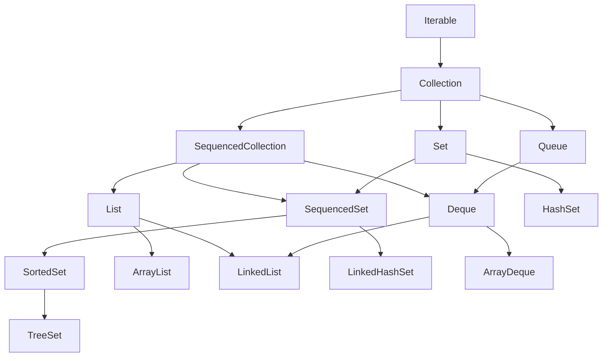
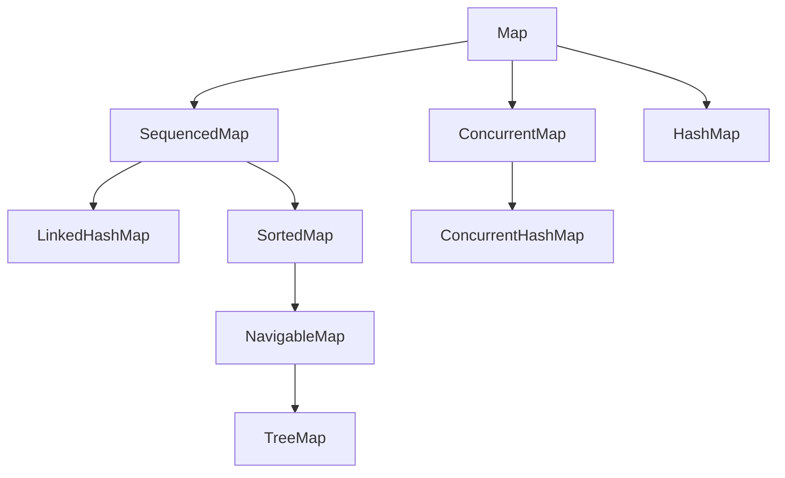
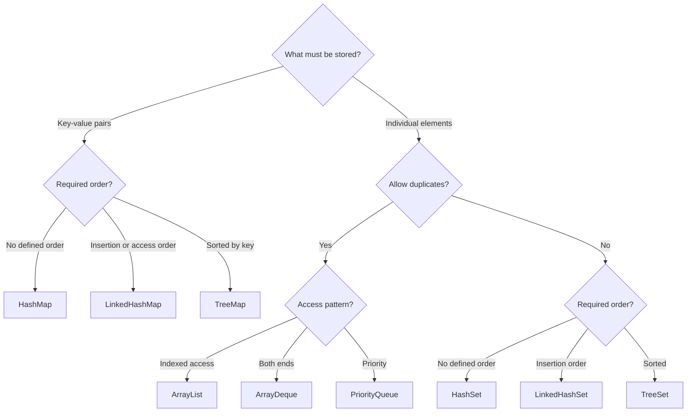
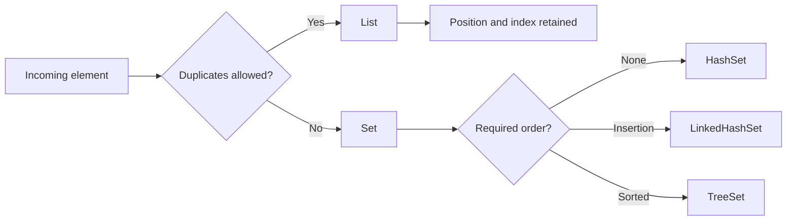
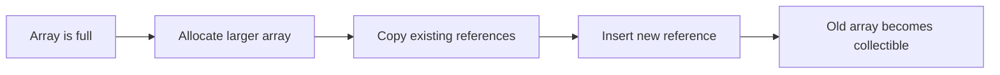
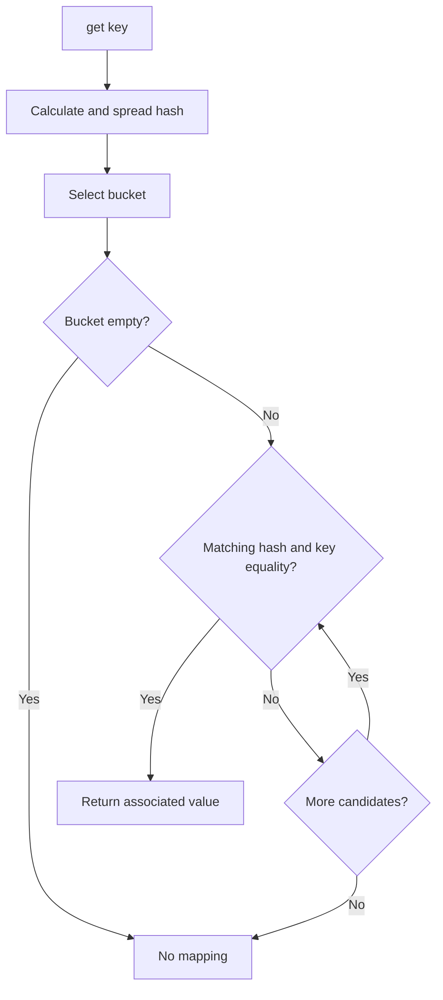
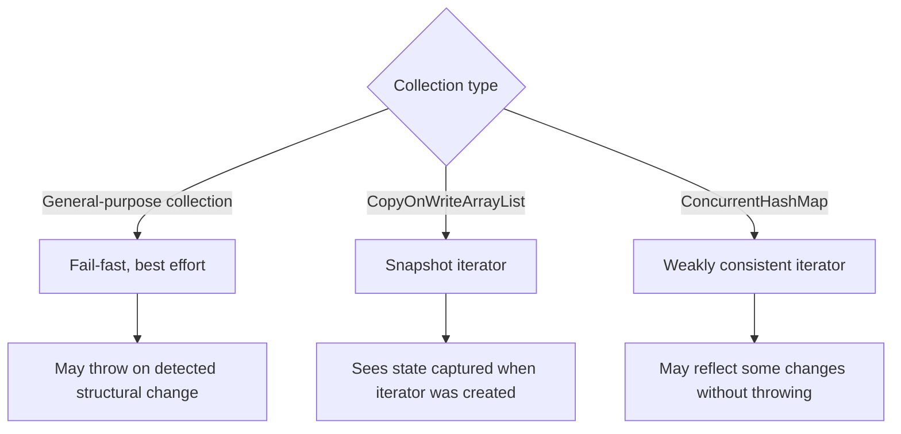

<script type="module">
  import mermaid from 'https://jsdelivr.net';
  mermaid.initialize({ startOnLoad: true });
</script>

# Core Java Reference Material

> # Collections

🏚️ [Home](index.md) 🔸 ⬅️ Previous: [Previous](previous.md) 🔸 ➡️ Next: [JDBC](jdbc.md)

## Table of Contents

1. [Java Collections Framework at a Glance](#1-java-collections-framework-at-a-glance)
2. [Frequently Asked Interview Questions](#2-frequently-asked-interview-questions)

## 1. Java Collections Framework at a Glance

The **Java Collections Framework**, commonly called JCF, is a unified set of interfaces, implementations, and algorithms for storing and processing groups of objects.

It is mainly provided through the `java.util` package. Thread-safe collection types are also available in `java.util.concurrent`.

The framework contains:

- **interfaces** that define collection behavior;
- **implementation classes** that store elements;
- **algorithms** for operations such as sorting, searching, reversing, and shuffling; and
- **utility and factory methods** for creating or working with collections.

### Core Collections Hierarchy



`Map` is part of the Collections Framework but does **not** extend `Collection` because it stores key-value mappings rather than individual elements.



### Choosing a Collection



[↑ Go to Table of Contents](#table-of-contents)

## 2. Frequently Asked Interview Questions

> ### Fundamental Questions

### What is the Java Collections Framework?

The Java Collections Framework is a standard architecture for representing and manipulating groups of objects. It provides common interfaces such as `List`, `Set`, `Queue`, and `Map`, along with implementations such as `ArrayList`, `HashSet`, `ArrayDeque`, and `HashMap`.

Its major benefits are:

- a consistent programming model;
- reusable data structures and algorithms;
- reduced development effort;
- interoperability between APIs; and
- support for generics and type safety.

### What are the main parts of the Collections Framework?

| Part | Purpose | Examples |
| --- | --- | --- |
| Interfaces | Define behavior and contracts | `List`, `Set`, `Queue`, `Deque`, `Map` |
| Implementations | Store data using a particular structure | `ArrayList`, `HashSet`, `TreeSet`, `HashMap` |
| Algorithms | Perform reusable operations | `sort`, `binarySearch`, `reverse`, `shuffle` |
| Factories and wrappers | Create special-purpose views or collections | `List.of`, `List.copyOf`, `Collections.unmodifiableList` |

### What is the difference between `Collection` and `Collections`?

| `Collection` | `Collections` |
| --- | --- |
| An interface | A utility class |
| Represents a group of elements | Provides static algorithms and wrappers |
| Extended by collection interfaces | Cannot be instantiated |
| Declares methods such as `add`, `remove`, and `size` | Provides methods such as `sort`, `reverse`, and `unmodifiableList` |

The names are similar, but their responsibilities are completely different.

### What is the difference between `Collection` and `Map`?

`Collection<E>` represents individual elements. `Map<K, V>` represents mappings from unique keys to values.

A `Map` does not extend `Collection`, but it exposes collection views:

```java
Set<K> keys = map.keySet();
Collection<V> values = map.values();
Set<Map.Entry<K, V>> entries = map.entrySet();
```

### What is the difference among `List`, `Set`, `Queue`, and `Map`?

| Type | Main characteristic | Common implementation |
| --- | --- | --- |
| `List` | Ordered sequence; duplicates are allowed | `ArrayList` |
| `Set` | No duplicate elements | `HashSet` |
| `Queue` | Holds elements for processing, often FIFO or priority-based | `ArrayDeque`, `PriorityQueue` |
| `Map` | Associates unique keys with values | `HashMap` |

The word *ordered* needs care. A `List` has a defined encounter order and indexes. A `TreeSet` is ordered by sorting. A `HashSet` offers no defined iteration order.

### Why are generics important in collections?

Generics provide compile-time type safety and reduce explicit casts.

```java
List<String> names = new ArrayList<>();
names.add("Anita");

String firstName = names.getFirst();
```

Without generics, an unrelated object might be inserted and cause a `ClassCastException` later. Generics make the intended element type part of the API contract.

### Can Java collections store primitive values?

No. Collections store objects, not primitive values. Wrapper types and autoboxing are used:

```java
List<Integer> marks = new ArrayList<>();
marks.add(85);       // int is autoboxed to Integer
int first = marks.get(0); // Integer is unboxed to int
```

Frequent boxing can add memory and performance overhead in numeric workloads, but it is normally acceptable in ordinary application code.

### What is the difference between mutable, unmodifiable, and immutable collections?

- A **mutable collection** allows structural changes such as adding or removing elements.
- An **unmodifiable view** rejects changes through that view, but its backing collection may still change.
- An **immutable collection** has no supported mutation path after construction.

Java factory methods such as `List.of()` create unmodifiable collections. They also reject `null` elements. Unmodifiable refers to the collection structure; a mutable object stored inside it can still change.

### What are collection factory methods?

Java provides convenient factory methods for small unmodifiable collections:

```java
List<String> languages = List.of("Java", "Python", "Go");
Set<Integer> codes = Set.of(10, 20, 30);
Map<String, Integer> scores = Map.of("Anita", 90, "Bala", 85);
```

`List.of`, `Set.of`, and `Map.of` reject `null`. `Set.of` rejects duplicate elements, and `Map.of` rejects duplicate keys. Their iteration order should not be assumed unless the API contract explicitly defines it.

### What are sequenced collections in Java 21?

Java 21 introduced interfaces for collections with a defined encounter order:

- `SequencedCollection<E>`;
- `SequencedSet<E>`; and
- `SequencedMap<K, V>`.

They provide uniform operations for the first element, last element, and reversed view.

```java
List<String> topics = new ArrayList<>(List.of("Basics", "OOP", "Collections"));

String first = topics.getFirst();
String last = topics.getLast();
List<String> reversedView = topics.reversed();
```

The result of `reversed()` is generally a reverse-ordered view, not an independent copy.

---

> ### List and Set Interview Questions

### List and Set Behavior



### What is a `List`?

`List<E>` is an ordered collection that allows duplicate elements. Each element has a zero-based index. A list normally permits positional access, insertion, replacement, and removal.

```java
List<String> names = new ArrayList<>();
names.add("Asha");
names.add("Ravi");
names.add("Asha");

String second = names.get(1);
```

### What is an `ArrayList`?

`ArrayList` is a resizable-array implementation of `List`. It provides fast indexed access and is usually the default list choice.

Its important characteristics are:

- duplicates are allowed;
- `null` elements are allowed;
- encounter order is preserved;
- indexed access is constant time; and
- inserting or removing near the beginning usually shifts later elements.

### What is a `LinkedList`?

`LinkedList` is a doubly linked implementation of both `List` and `Deque`. Each node is linked to its previous and next node.

It supports efficient insertion and removal at either end, but indexed access requires traversal. It also has more per-element memory overhead than `ArrayList`.

### What is the difference between `ArrayList` and `LinkedList`?

| Operation or property | `ArrayList` | `LinkedList` |
| --- | --- | --- |
| Internal structure | Resizable array | Doubly linked nodes |
| `get(index)` | O(1) | O(n) |
| Append | Amortized O(1) | O(1) |
| Add/remove at first position | O(n) due to shifting | O(1) |
| Memory per element | Lower | Higher |
| CPU cache locality | Usually better | Usually poorer |
| Interfaces | `List` | `List` and `Deque` |

Even when insertions are common, `ArrayList` may perform better in practice unless the operation occurs through an iterator at a known linked-list position. Choose using the actual access pattern and measurements.

### What is the difference between the size and capacity of an `ArrayList`?

- **Size** is the number of elements currently stored.
- **Capacity** is the length of the internal array available before another growth is required.

```java
List<String> names = new ArrayList<>(100); // initial capacity is 100
System.out.println(names.size());          // 0
```

Capacity is an implementation detail and does not create elements. Pre-sizing can reduce reallocations when the approximate final size is known.

### How does an `ArrayList` grow?

When its internal array has insufficient space, `ArrayList` allocates a larger array and copies existing references into it. The exact growth formula is an implementation detail and should not be relied upon.



This occasional copying is why appending is described as **amortized O(1)** rather than guaranteed O(1) for every individual append.

### What is the difference between `ArrayList` and `Vector`?

Both are resizable-array list implementations. `Vector` is a legacy class whose methods are synchronized. `ArrayList` is not synchronized and is normally preferred.

Method-level synchronization on `Vector` does not automatically make a multi-step operation atomic. For concurrent requirements, choose an appropriate design or a type from `java.util.concurrent` rather than selecting `Vector` by default.

### Why is `ArrayDeque` preferred over `Stack`?

`Stack` is a legacy class that extends `Vector`. The `Deque` interface provides clearer stack operations, and `ArrayDeque` is normally a better implementation.

```java
Deque<String> stack = new ArrayDeque<>();
stack.push("first");
stack.push("second");

String value = stack.pop(); // second
```

Use `push`, `pop`, and `peek` when treating a deque as a stack.

### Why can `List<Integer>.remove()` be confusing?

`List` has overloaded removal methods:

```java
List<Integer> numbers = new ArrayList<>(List.of(10, 20, 30));

numbers.remove(1);                  // removes element at index 1: 20
numbers.remove(Integer.valueOf(30)); // removes the value 30
```

An `int` argument selects `remove(int index)`. Passing an `Integer` selects `remove(Object value)`.

### What is a `Set`, and how does it identify duplicates?

`Set<E>` is a collection that contains no duplicate elements. The meaning of duplicate depends on the implementation:

- hash-based sets use `hashCode()` and `equals()`;
- sorted sets use natural ordering or a `Comparator`; and
- a sorted set treats two elements as duplicates when comparison returns zero.

A set is especially useful for uniqueness checks and membership testing.

---

> ### Queue, Deque, and Map Interview Questions

### What is the difference among `HashSet`, `LinkedHashSet`, and `TreeSet`?

| Implementation | Iteration order | Typical operation cost | Main use |
| --- | --- | --- | --- |
| `HashSet` | No defined order | Average O(1) for add, remove, contains | Fast uniqueness and lookup |
| `LinkedHashSet` | Insertion order | Average O(1), with linkage overhead | Uniqueness plus predictable order |
| `TreeSet` | Sorted order | O(log n) | Sorted unique elements and range queries |

`TreeSet` implements `NavigableSet` and supports operations such as `lower`, `floor`, `ceiling`, and `higher`.

### How does `HashSet` work internally?

In the standard JDK implementation, `HashSet` is backed by a `HashMap`. Each set element is stored as a map key with an internal placeholder value.

When an element is added, hashing locates a bucket and equality testing decides whether an equal element already exists. The exact bucket representation and resizing rules are implementation details.

### Can collections contain `null`?

It depends on the implementation:

- `ArrayList`, `LinkedList`, `HashSet`, and `HashMap` allow `null` in certain positions;
- `HashMap` allows one `null` key and multiple `null` values;
- `ArrayDeque`, `PriorityQueue`, and `ConcurrentHashMap` reject `null`;
- factory collections such as `List.of()` reject `null`; and
- sorted collections may reject `null` because elements or keys must be compared.

Code should not rely only on the interface name; check the selected implementation's contract.

### What is a `Queue`?

`Queue<E>` represents elements waiting to be processed. Many queues use FIFO order, but this is not guaranteed by the interface. For example, `PriorityQueue` orders by priority.

Queue methods are provided in two forms:

| Operation | Throws exception on failure | Returns special value on failure |
| --- | --- | --- |
| Insert | `add(e)` | `offer(e)` |
| Remove head | `remove()` | `poll()` |
| Examine head | `element()` | `peek()` |

The special-value methods are useful when an empty queue is a normal condition.

### What is a `Deque`?

`Deque<E>` means double-ended queue. It allows insertion, removal, and examination at both the front and rear.

```java
Deque<String> tasks = new ArrayDeque<>();
tasks.addLast("compile");
tasks.addLast("test");
tasks.addFirst("validate");

String next = tasks.removeFirst();
```

It can model a queue, stack, undo history, sliding window, or breadth-first search frontier.

### What is a `PriorityQueue`?

`PriorityQueue` is a heap-based queue. Its head is the least element according to natural order or the supplied comparator.

```java
Queue<Integer> queue = new PriorityQueue<>();
queue.offer(40);
queue.offer(10);
queue.offer(30);

System.out.println(queue.poll()); // 10
```

Its iterator does not promise sorted traversal. Repeatedly call `poll()` on a copy when removal in priority order is required.

### What is a `Map`?

`Map<K, V>` associates unique keys with values. Each key maps to at most one value, but different keys may map to equal values.

```java
Map<Integer, String> employees = new HashMap<>();
employees.put(101, "Anita");
employees.put(102, "Bala");
employees.put(101, "Charan"); // replaces the value for key 101
```

`put` returns the previous value, or `null` when no mapping existed or the previous value was `null`.

### What is the difference among `HashMap`, `LinkedHashMap`, and `TreeMap`?

| Implementation | Key order | Typical operation cost | Important feature |
| --- | --- | --- | --- |
| `HashMap` | No defined order | Average O(1) | General-purpose lookup |
| `LinkedHashMap` | Insertion order or configured access order | Average O(1) | Predictable iteration or LRU-style logic |
| `TreeMap` | Sorted by keys | O(log n) | Range and navigation operations |

Choose based on the required semantics, not only the expected speed.

### How does `HashMap` find a value?

At a high level, `HashMap` uses the key's hash code to select a bucket. If the bucket contains candidates, it uses equality checks to find the matching key.



The detailed bucket structure is specific to the JDK implementation and may change.

### What are useful `Map` convenience methods?

Common methods include:

```java
counts.putIfAbsent("Java", 0);
counts.merge("Java", 1, Integer::sum);

List<String> names = groups.computeIfAbsent(
        "Developers", key -> new ArrayList<>()
);
names.add("Anita");
```

- `getOrDefault` supplies a value when a key is absent.
- `putIfAbsent` adds only when no non-null value is associated.
- `computeIfAbsent` calculates a value when needed.
- `merge` combines a new value with an existing value.

Mapping functions should be short and should not structurally modify the same map in unexpected ways.

> ### Equality, Traversal, and Ordering Questions

### What is the contract between `equals()` and `hashCode()`?

The essential rule is:

> If two objects are equal according to `equals()`, they must return the same hash code.

Unequal objects may have the same hash code; this is called a collision. Hash-based collections use both methods, so overriding `equals()` normally requires overriding `hashCode()` consistently.

Java records automatically provide value-based `equals()` and `hashCode()` implementations based on their components.

### Why are mutable keys dangerous in a `HashMap`?

If fields used by a key's `equals()` or `hashCode()` change after insertion, a later lookup may search a different bucket or fail the equality test.

```java
Map<EmployeeKey, String> departments = new HashMap<>();
EmployeeKey key = new EmployeeKey(101);
departments.put(key, "Training");

key.setId(999); // dangerous if id participates in equals/hashCode
```

Prefer immutable key types, such as records, and never modify equality-relevant key state while the key is stored in a map or set.

### What is a hash collision?

A collision occurs when different keys produce the same bucket position or hash value. A correct hash-based collection resolves collisions by storing and comparing multiple candidates.

Collisions do not make a `HashMap` incorrect, but excessive collisions can reduce performance. A good `hashCode()` distributes common key values reasonably while remaining consistent with `equals()`.

### What are load factor, capacity, and resizing in `HashMap`?

- **Capacity** relates to the number of internal buckets.
- **Load factor** controls how full the table may become before resizing.
- **Resizing** allocates a larger table and redistributes mappings.

The common default load factor is `0.75`. These are implementation and tuning details. Initial sizing may help for a large, known number of mappings, but correctness must never depend on internal capacity.

### What is an `Iterator`?

`Iterator<E>` provides sequential traversal over a collection.

```java
Iterator<String> iterator = names.iterator();

while (iterator.hasNext()) {
    String name = iterator.next();
    System.out.println(name);
}
```

Its main methods are `hasNext()`, `next()`, and optional `remove()`. Calling `next()` when no element remains throws `NoSuchElementException`.

### What is the difference between `Iterator` and `ListIterator`?

| `Iterator` | `ListIterator` |
| --- | --- |
| Works with many collection types | Works only with lists |
| Moves forward | Moves forward and backward |
| Can remove through the iterator | Can add, remove, and replace |
| Does not expose indexes | Provides next and previous indexes |

`ListIterator` is useful for controlled modification while traversing a list.

### What is a fail-fast iterator?

Many general-purpose collection iterators detect certain structural modifications made outside the iterator and may throw `ConcurrentModificationException`.

Fail-fast behavior is a best-effort bug-detection mechanism, not a synchronization guarantee. Programs must not depend on the exception for correctness.

### How can elements be removed safely during iteration?

Use `Iterator.remove()` after `next()`, or use a collection operation designed for the task:

```java
Iterator<String> iterator = names.iterator();
while (iterator.hasNext()) {
    if (iterator.next().isBlank()) {
        iterator.remove();
    }
}

names.removeIf(String::isBlank);
```

Calling `names.remove(...)` directly inside an enhanced `for` loop may invalidate the iterator.

### What is the difference between `Comparable` and `Comparator`?

| `Comparable<T>` | `Comparator<T>` |
| --- | --- |
| Defines a type's natural ordering | Defines an external ordering strategy |
| Implemented by the element class | Usually created separately |
| Declares `compareTo(T)` | Declares `compare(T, T)` |
| Normally one natural order | Any number of alternative orders |

```java
Comparator<Employee> bySalaryThenName = Comparator
        .comparing(Employee::salary)
        .thenComparing(Employee::name);
```

Return values mean negative, zero, or positive; code should not assume the result is exactly `-1`, `0`, or `1`.

### Why should sorted-set ordering be consistent with equality?

`TreeSet` and `TreeMap` use comparison to decide uniqueness of elements or keys. When comparison returns zero, the sorted collection treats the two objects as equivalent even if `equals()` returns `false`.

```java
Comparator<Employee> byDepartment = Comparator.comparing(Employee::department);
Set<Employee> employees = new TreeSet<>(byDepartment);
```

With this comparator, only one employee per department could be retained. Add a stable tie-breaker, such as employee ID, when every distinct employee must remain in the set.

> ### Performance, Mutability, and Concurrency

### Typical Complexity Summary

| Collection | Access or peek | Add or offer | Remove or poll | Search |
| --- | ---: | ---: | ---: | ---: |
| `ArrayList` | O(1) by index | Amortized O(1) at end | O(n) by index | O(n) |
| `LinkedList` | O(n) by index; O(1) at ends | O(1) at ends | O(1) at ends | O(n) |
| `HashSet` | Not indexed | Average O(1) | Average O(1) | Average O(1) |
| `TreeSet` | O(log n) navigation | O(log n) | O(log n) | O(log n) |
| `ArrayDeque` | O(1) at ends | Amortized O(1) at ends | O(1) at ends | O(n) |
| `PriorityQueue` | O(1) head | O(log n) | O(log n) head | O(n) |
| `HashMap` | Average O(1) by key | Average O(1) | Average O(1) | Average O(1) by key |
| `TreeMap` | O(log n) by key | O(log n) | O(log n) | O(log n) by key |

Complexity describes growth, not exact speed. Hash performance assumes a suitable hash distribution, and interface contracts should be distinguished from JDK implementation details.

### How do you sort a list?

Use `List.sort()` or `Collections.sort()`:

```java
List<String> names = new ArrayList<>(List.of("Ravi", "Anita", "Bala"));
names.sort(Comparator.naturalOrder());
names.sort(Comparator.reverseOrder());
```

For objects, build a comparator from relevant properties. The list must support replacement of elements; factory lists such as `List.of()` cannot be sorted in place.

### What condition is required for binary search?

The list must already be sorted according to the same ordering used for the search.

```java
names.sort(Comparator.naturalOrder());
int index = Collections.binarySearch(names, "Bala");
```

If the result is non-negative, it is the matching index. A negative result encodes the insertion point. Searching an unsorted list produces an undefined result rather than automatically sorting the list.

### What is the difference between `Arrays.asList()` and `List.of()`?

| `Arrays.asList(array)` | `List.of(elements)` |
| --- | --- |
| Fixed-size list backed by the supplied array | Unmodifiable factory list |
| `set` is supported | `set` is unsupported |
| Changes can be visible through the array and list | No caller-owned backing array is exposed |
| May contain `null` | Rejects `null` |
| `add` and `remove` are unsupported | All structural changes are unsupported |

To obtain a normal mutable list, use `new ArrayList<>(...)`.

### What is the difference between an unmodifiable view and a defensive copy?

```java
List<String> view = Collections.unmodifiableList(original);
List<String> snapshot = List.copyOf(original);
```

The view reflects later structural changes made directly to `original`. `List.copyOf` creates an unmodifiable snapshot of the references at that time. Neither operation deep-copies mutable element objects.

### What does `subList()` return?

`subList(fromIndex, toIndex)` returns a range view backed by the original list. The start index is inclusive and the end index is exclusive.

```java
List<String> all = new ArrayList<>(List.of("A", "B", "C", "D"));
List<String> middle = all.subList(1, 3); // B, C
middle.clear();                          // all becomes A, D
```

Structural changes to the backing list outside the view can invalidate the sublist. Use `new ArrayList<>(all.subList(...))` when an independent copy is needed.

### Are collection classes thread-safe?

Most common implementations, including `ArrayList`, `HashSet`, and `HashMap`, are not thread-safe. Safe strategies include:

- confining a collection to one thread;
- protecting all access with the same lock;
- using a synchronized wrapper; or
- selecting a concurrent collection with suitable behavior.

Thread-safe does not mean that an arbitrary sequence of several operations is automatically atomic.

### What is the difference between `HashMap` and `ConcurrentHashMap`?

| `HashMap` | `ConcurrentHashMap` |
| --- | --- |
| Not thread-safe | Designed for concurrent access |
| Allows one `null` key and `null` values | Rejects `null` keys and values |
| Iterators are generally fail-fast | Iterators are weakly consistent |
| External coordination is required for concurrent mutation | Provides atomic methods such as `putIfAbsent`, `compute`, and `merge` |

Compound actions should use the map's atomic methods rather than a separate `get` followed by `put`.

### When should `CopyOnWriteArrayList` be used?

`CopyOnWriteArrayList` is useful when reads and iteration greatly outnumber writes, such as a small listener list. Each structural write copies the underlying array, making writes expensive.

Its iterators traverse a snapshot and do not reflect later changes. It is a poor choice for large collections with frequent updates.

### How does `Collections.synchronizedList()` differ from `CopyOnWriteArrayList`?

`Collections.synchronizedList()` wraps a list with synchronized method access. Iteration still requires explicit synchronization on the returned list:

```java
List<String> names = Collections.synchronizedList(new ArrayList<>());

synchronized (names) {
    for (String name : names) {
        System.out.println(name);
    }
}
```

`CopyOnWriteArrayList` provides snapshot iteration without locking the entire iteration, but it pays a high copying cost for writes.

### What iterator behaviors appear in concurrent code?



These behaviors are different. The vague term *fail-safe* is not an official general interface contract, so interview answers should name the actual behavior.

> ### Scenario-Based Interview Questions

### You need fast indexed access and mostly append elements. Which collection would you choose?

Choose `ArrayList`. It offers O(1) indexed access and amortized O(1) append. If the approximate number of elements is known, supplying an initial capacity may reduce internal resizing.

### You need unique values while preserving the order in which they arrived. Which collection would you choose?

Choose `LinkedHashSet`. It provides set uniqueness and preserves insertion order. This is also a convenient way to remove duplicates from a list while retaining the first encounter order:

```java
List<String> uniqueInOrder = new ArrayList<>(new LinkedHashSet<>(input));
```

### You need to display employees from highest to lowest salary. What would you use?

For a one-time display, copy employees into a list and sort with a comparator:

```java
employees.sort(Comparator.comparing(Employee::salary).reversed());
```

If the collection must remain sorted as elements are added, a `TreeSet` may work, but its comparator needs a tie-breaker such as employee ID so equal salaries do not discard distinct employees.

### You need to count the frequency of each word. Which collection and method would you use?

Use a `Map<String, Integer>` and `merge`:

```java
Map<String, Integer> frequencies = new HashMap<>();

for (String word : words) {
    frequencies.merge(word, 1, Integer::sum);
}
```

Use `LinkedHashMap` instead if first-encounter order must be retained, or `TreeMap` if the result must remain sorted by word.

### You need FIFO processing. Which collection would you choose?

Use `ArrayDeque` through the `Queue` interface for an in-memory, single-process FIFO queue:

```java
Queue<Task> tasks = new ArrayDeque<>();
tasks.offer(new Task("compile"));
Task next = tasks.poll();
```

For cross-thread producer-consumer coordination, choose an appropriate `BlockingQueue`, such as `ArrayBlockingQueue` or `LinkedBlockingQueue`.

### You need the next highest-priority support ticket. Which collection would you choose?

Use `PriorityQueue` with a comparator that places the desired ticket at the head. Include a stable tie-breaker, such as creation sequence, when priorities are equal.

Remember that iterating over the priority queue does not return every ticket in priority order. Use `peek` for the next ticket or `poll` repeatedly to process tickets.

### A `HashMap` lookup fails after a key object is edited. What is the likely cause?

A field involved in `equals()` or `hashCode()` was probably modified after insertion. The stored entry remains associated with its earlier hash placement, while lookup uses the new key state.

Use immutable key objects and remove/reinsert a mapping if a key must logically change.

### Multiple threads update a word-count map. Is `ConcurrentHashMap` plus `get` and `put` sufficient?

No. Although the individual calls are thread-safe, the read-modify-write sequence is not one atomic operation.

Use an atomic map method:

```java
counts.merge(word, 1, Integer::sum);
```

For very high update contention, a `ConcurrentHashMap<String, LongAdder>` can also be considered.

### A program throws `ConcurrentModificationException` inside an enhanced `for` loop. How would you fix it?

First, identify whether the same collection is structurally modified during iteration. Depending on the requirement:

- use `Iterator.remove()`;
- use `removeIf()`;
- collect changes and apply them after traversal;
- iterate over a deliberate snapshot; or
- use a suitable concurrent collection when the access is genuinely concurrent.

Do not merely catch and ignore `ConcurrentModificationException`.

[↑ Go to Table of Contents](#table-of-contents)

---

🏚️ [Home](index.md) 🔸 ⬅️ Previous: [Previous](previous.md) 🔸 ➡️ Next: [JDBC](jdbc.md)
