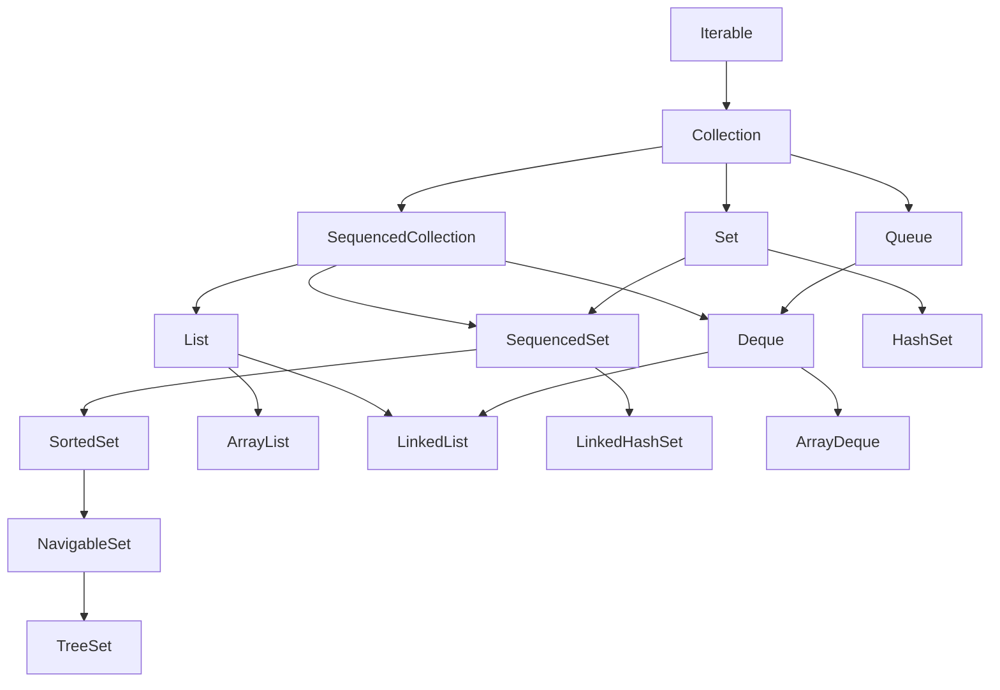
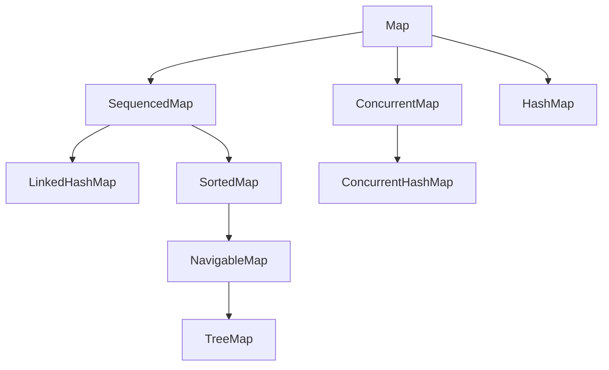
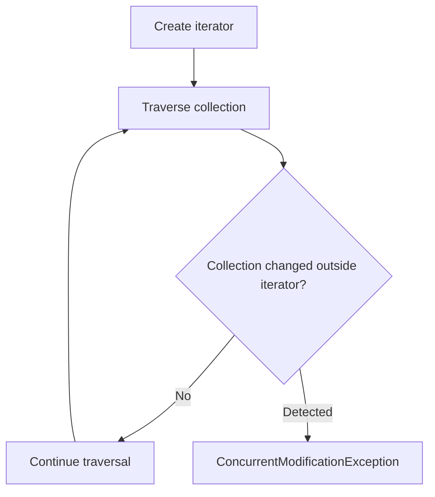
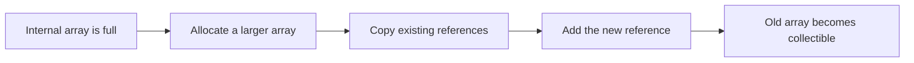
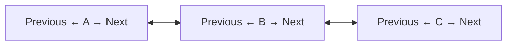
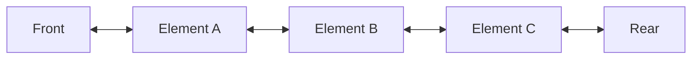
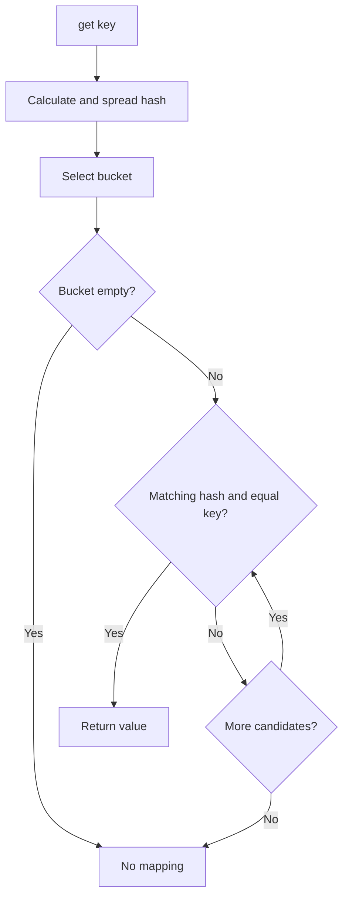
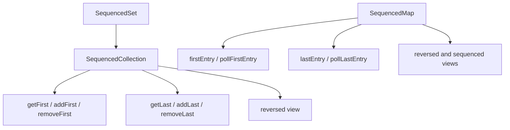
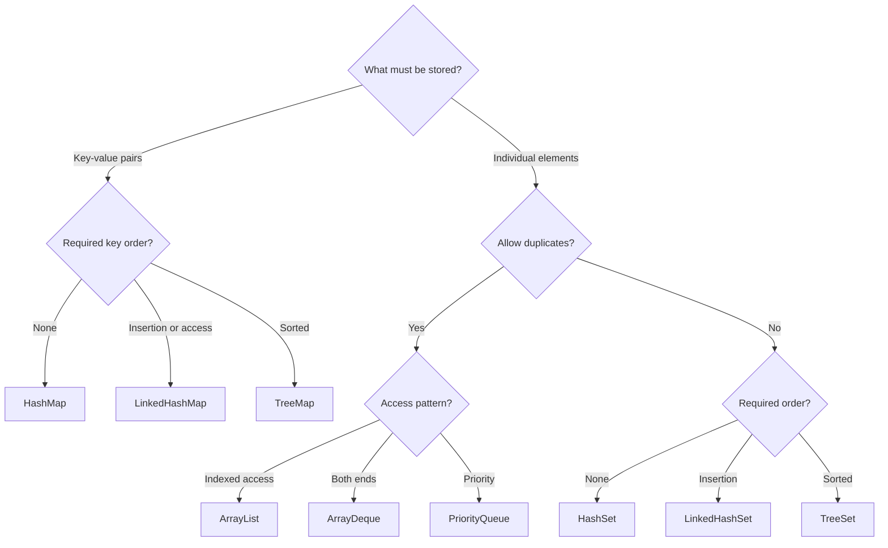

# Core Java Reference Material

> # Java Collections Framework

🏚️ [Home](index.md) 🔸 ⬅️ Previous: [Threads](threads.md) 🔸 ➡️ Next: [JDBC](jdbc.md)

## Table of Contents

1. [What Is the Collections Framework?](#1-what-is-the-collections-framework)
2. [Why Is the Collections Framework Used?](#2-why-is-the-collections-framework-used)
3. [Collections Framework Architecture](#3-collections-framework-architecture)
4. [Generics and Type Safety](#4-generics-and-type-safety)
5. [Collection vs Collections vs Map](#5-collection-vs-collections-vs-map)
6. [Common Collection Operations](#6-common-collection-operations)
7. [Iterable, Iterator, and ListIterator](#7-iterable-iterator-and-listiterator)
8. [List Interface](#8-list-interface)
9. [ArrayList](#9-arraylist)
10. [LinkedList](#10-linkedlist)
11. [Vector and Stack](#11-vector-and-stack)
12. [Set Interface](#12-set-interface)
13. [HashSet](#13-hashset)
14. [LinkedHashSet](#14-linkedhashset)
15. [TreeSet, SortedSet, and NavigableSet](#15-treeset-sortedset-and-navigableset)
16. [Queue Interface](#16-queue-interface)
17. [Deque and ArrayDeque](#17-deque-and-arraydeque)
18. [PriorityQueue](#18-priorityqueue)
19. [Map Interface](#19-map-interface)
20. [HashMap](#20-hashmap)
21. [equals() and hashCode()](#21-equals-and-hashcode)
22. [LinkedHashMap](#22-linkedhashmap)
23. [TreeMap, SortedMap, and NavigableMap](#23-treemap-sortedmap-and-navigablemap)
24. [Useful Map Methods](#24-useful-map-methods)
25. [Collection Factory Methods](#25-collection-factory-methods)
26. [Mutable, Unmodifiable, and Immutable Collections](#26-mutable-unmodifiable-and-immutable-collections)
27. [Arrays and Collections](#27-arrays-and-collections)
28. [Comparable and Comparator](#28-comparable-and-comparator)
29. [Sorting, Searching, and Utility Algorithms](#29-sorting-searching-and-utility-algorithms)
30. [Sequenced Collections in Java 21](#30-sequenced-collections-in-java-21)
31. [Concurrent Collections](#31-concurrent-collections)
32. [Streams and Collections](#32-streams-and-collections)
33. [Performance and Collection Selection](#33-performance-and-collection-selection)
34. [Collections Best Practices](#34-collections-best-practices)
35. [Common Collections Errors](#35-common-collections-errors)
36. [Frequently Asked Interview Questions](#36-frequently-asked-interview-questions)

## 1. What Is the Collections Framework?

The **Java Collections Framework**, commonly called **JCF**, is a unified set of interfaces, implementation classes, and algorithms for storing and processing groups of objects.

It is mainly available in the `java.util` package. Thread-safe and coordination-oriented collections are also provided by `java.util.concurrent`.

The framework contains:

- **interfaces** that define behavior;
- **implementation classes** that store elements;
- **algorithms** for sorting, searching, reversing, and other operations;
- **factory methods** for convenient collection creation; and
- **wrappers and views** for specialized access.

Examples:

```java
List<String> names = new ArrayList<>();
Set<Integer> uniqueNumbers = new HashSet<>();
Queue<String> tasks = new ArrayDeque<>();
Map<Integer, String> employees = new HashMap<>();
```

[↑ Go to Table of Contents](#table-of-contents)

## 2. Why Is the Collections Framework Used?

The Collections Framework helps developers:

- store a dynamic number of objects;
- avoid implementing common data structures manually;
- choose structures based on ordering, uniqueness, and access needs;
- reuse standard algorithms;
- write APIs using common interfaces;
- improve type safety with generics; and
- switch implementations with fewer code changes.

### Arrays vs collections

| Array | Collection |
| --- | --- |
| Fixed length after creation | Usually supports dynamic size |
| Stores primitives or objects | Stores objects |
| Uses `length` field | Uses `size()` method |
| Limited built-in operations | Rich APIs for adding, removing, searching, and traversal |
| Can be multidimensional | Models lists, sets, queues, maps, and more |

Arrays remain useful for fixed-size, low-level, and performance-sensitive structures. Collections are normally more convenient for application-level object management.

[↑ Go to Table of Contents](#table-of-contents)

## 3. Collections Framework Architecture

### Collection hierarchy



`Map` belongs to the Collections Framework but does not extend `Collection`. It stores key-value mappings rather than individual elements.

### Map hierarchy



### Main interface characteristics

| Interface | Main characteristic |
| --- | --- |
| `List` | Ordered sequence with indexes and duplicates |
| `Set` | No duplicate elements |
| `Queue` | Holds elements for processing |
| `Deque` | Adds and removes at both ends |
| `Map` | Associates unique keys with values |

[↑ Go to Table of Contents](#table-of-contents)

## 4. Generics and Type Safety

Generics specify the type of elements or mappings a collection accepts.

```java
List<String> languages = new ArrayList<>();

languages.add("Java");
languages.add("Python");

String first = languages.get(0);
```

Benefits include:

- compile-time type checking;
- fewer explicit casts;
- clearer APIs; and
- reduced risk of `ClassCastException`.

### Collections cannot store primitives directly

Collections store objects. Autoboxing converts primitives to wrapper objects:

```java
List<Integer> marks = new ArrayList<>();

marks.add(90);       // int becomes Integer
int first = marks.get(0); // Integer becomes int
```

### Program to an interface

Prefer:

```java
List<String> names = new ArrayList<>();
```

over:

```java
ArrayList<String> names = new ArrayList<>();
```

The interface declaration keeps the code flexible unless implementation-specific operations are intentionally required.

[↑ Go to Table of Contents](#table-of-contents)

## 5. Collection vs Collections vs Map

| Type | Kind | Purpose |
| --- | --- | --- |
| `Collection<E>` | Interface | Root interface for groups of individual elements |
| `Collections` | Utility class | Static algorithms, wrappers, and helper methods |
| `Map<K, V>` | Interface | Stores unique-key-to-value mappings |

Examples:

```java
Collection<String> values = new ArrayList<>();

Collections.sort(names);

Map<Integer, String> employees = new HashMap<>();
```

A `Map` exposes collection views:

```java
Set<Integer> keys = employees.keySet();
Collection<String> values = employees.values();
Set<Map.Entry<Integer, String>> entries = employees.entrySet();
```

[↑ Go to Table of Contents](#table-of-contents)

## 6. Common Collection Operations

Important `Collection<E>` methods include:

| Method | Purpose |
| --- | --- |
| `add(element)` | Adds an element when supported |
| `addAll(collection)` | Adds all supplied elements |
| `remove(element)` | Removes one matching element |
| `removeIf(predicate)` | Removes matching elements |
| `contains(element)` | Tests membership |
| `size()` | Returns the number of elements |
| `isEmpty()` | Tests whether no elements exist |
| `clear()` | Removes all elements |
| `retainAll(collection)` | Retains only common elements |
| `removeAll(collection)` | Removes elements found in another collection |
| `toArray()` | Creates an array containing the elements |
| `iterator()` | Returns an iterator |
| `stream()` | Creates a sequential stream |

```java
List<String> topics = new ArrayList<>();

topics.add("Generics");
topics.add("Collections");
topics.add("Streams");

topics.removeIf(topic -> topic.startsWith("G"));

System.out.println(topics.contains("Collections"));
System.out.println(topics.size());
```

Some operations are optional. An implementation may throw `UnsupportedOperationException` when mutation is not supported.

[↑ Go to Table of Contents](#table-of-contents)

## 7. Iterable, Iterator, and ListIterator

`Collection` extends `Iterable`, so collections can be used in enhanced `for` loops.

```java
for (String name : names) {
    System.out.println(name);
}
```

### Iterator

```java
Iterator<String> iterator = names.iterator();

while (iterator.hasNext()) {
    String name = iterator.next();

    if (name.isBlank()) {
        iterator.remove();
    }
}
```

| Method | Purpose |
| --- | --- |
| `hasNext()` | Tests whether another element exists |
| `next()` | Returns the next element |
| `remove()` | Removes the last returned element when supported |
| `forEachRemaining(action)` | Applies an action to remaining elements |

### ListIterator

`ListIterator` works only with lists and supports:

- forward and backward movement;
- next and previous indexes;
- insertion during traversal;
- replacement using `set()`; and
- removal through the iterator.

### Fail-fast behavior

Many general-purpose collection iterators may throw `ConcurrentModificationException` when they detect structural modification outside the iterator.



Fail-fast detection is best effort and must not be used as a concurrency guarantee.

[↑ Go to Table of Contents](#table-of-contents)

## 8. List Interface

`List<E>` represents an ordered sequence.

Characteristics:

- preserves encounter order;
- permits duplicate elements;
- provides zero-based indexes;
- normally permits positional insertion and replacement; and
- extends `SequencedCollection` in Java 21.

```java
List<String> names = new ArrayList<>();

names.add("Asha");
names.add("Ravi");
names.add("Asha");
names.add(1, "Bala");

String name = names.get(2);
names.set(2, "Charan");
```

Important list methods:

| Method | Purpose |
| --- | --- |
| `get(index)` | Returns an indexed element |
| `set(index, value)` | Replaces an indexed element |
| `add(index, value)` | Inserts at an index |
| `remove(index)` | Removes by index |
| `indexOf(value)` | Returns the first matching index |
| `lastIndexOf(value)` | Returns the last matching index |
| `subList(from, to)` | Returns a backed range view |
| `getFirst()` / `getLast()` | Reads the first or last element in Java 21 |

[↑ Go to Table of Contents](#table-of-contents)

## 9. ArrayList

`ArrayList` is a resizable-array implementation of `List`.

Characteristics:

- fast indexed access;
- encounter order is preserved;
- duplicates and `null` are allowed;
- appending is normally efficient; and
- insertion or removal away from the end may shift later elements.

```java
List<String> cities = new ArrayList<>();

cities.add("Pune");
cities.add("Chennai");
cities.add("Hyderabad");

System.out.println(cities.get(1));
```

### Size vs capacity

- **Size** is the number of stored elements.
- **Capacity** is the available internal-array space before growth is required.

```java
List<String> values = new ArrayList<>(100);
System.out.println(values.size()); // 0
```

### Growth process



The exact growth formula is an implementation detail. Appending is described as **amortized O(1)** because occasional growth requires copying.

[↑ Go to Table of Contents](#table-of-contents)

## 10. LinkedList

`LinkedList` is a doubly linked implementation of both `List` and `Deque`.

Conceptually, each node contains an element plus links to neighboring nodes:



Characteristics:

- preserves encounter order;
- permits duplicates and `null`;
- supports efficient operations at both ends;
- indexed access requires traversal; and
- has more per-element memory overhead than `ArrayList`.

### ArrayList vs LinkedList

| Operation or property | `ArrayList` | `LinkedList` |
| --- | --- | --- |
| Internal structure | Resizable array | Doubly linked nodes |
| `get(index)` | O(1) | O(n) |
| Append | Amortized O(1) | O(1) |
| Add or remove at first end | O(n) | O(1) |
| Memory per element | Lower | Higher |
| Cache locality | Usually better | Usually poorer |
| Implements `Deque` | No | Yes |

`ArrayList` is the normal default list. Choose `LinkedList` only when its actual access pattern provides a benefit.

[↑ Go to Table of Contents](#table-of-contents)

## 11. Vector and Stack

### Vector

`Vector` is a legacy resizable-array list whose methods are synchronized.

```java
Vector<String> values = new Vector<>();
values.add("Java");
```

`ArrayList` is normally preferred for non-concurrent code. For concurrent needs, choose a design or type from `java.util.concurrent` rather than selecting `Vector` automatically.

### Stack

`Stack` is a legacy LIFO class that extends `Vector`. Prefer `Deque` with `ArrayDeque`:

```java
Deque<String> stack = new ArrayDeque<>();

stack.push("first");
stack.push("second");

System.out.println(stack.pop()); // second
```

| Stack operation | `Deque` method |
| --- | --- |
| Push | `push(element)` |
| Pop | `pop()` |
| Examine top | `peek()` |

[↑ Go to Table of Contents](#table-of-contents)

## 12. Set Interface

`Set<E>` represents a collection with no duplicate elements.

```java
Set<String> skills = new HashSet<>();

skills.add("Java");
skills.add("SQL");
skills.add("Java");

System.out.println(skills.size()); // 2
```

The implementation determines ordering and duplicate detection:

| Set type | Duplicate decision | Order |
| --- | --- | --- |
| `HashSet` | `hashCode()` and `equals()` | No defined order |
| `LinkedHashSet` | `hashCode()` and `equals()` | Insertion order |
| `TreeSet` | Natural order or comparator | Sorted order |

Sets are useful for membership testing, uniqueness enforcement, and mathematical set-style operations.

[↑ Go to Table of Contents](#table-of-contents)

## 13. HashSet

`HashSet` is a hash-based general-purpose `Set` implementation.

Characteristics:

- no defined iteration order;
- average O(1) add, remove, and contains operations under normal hashing;
- permits one `null` element; and
- uses `hashCode()` and `equals()` to identify duplicates.

```java
Set<Integer> employeeIds = new HashSet<>();

employeeIds.add(101);
employeeIds.add(102);
employeeIds.add(101);

System.out.println(employeeIds.contains(102));
```

In the standard JDK implementation, a `HashSet` is backed by a `HashMap`: each set element is stored as a map key with an internal placeholder value.

Never rely on the printed or iteration order of a `HashSet`.

[↑ Go to Table of Contents](#table-of-contents)

## 14. LinkedHashSet

`LinkedHashSet` combines hash-based membership with a linked encounter order.

Characteristics:

- prevents duplicates;
- preserves insertion order;
- average O(1) membership operations under normal hashing; and
- uses slightly more memory than `HashSet` for order links.

```java
List<String> input = List.of("Java", "SQL", "Java", "Git");

Set<String> uniqueInOrder = new LinkedHashSet<>(input);

System.out.println(uniqueInOrder); // Java, SQL, Git
```

Use `LinkedHashSet` when uniqueness and predictable first-encounter order are both required.

[↑ Go to Table of Contents](#table-of-contents)

## 15. TreeSet, SortedSet, and NavigableSet

`TreeSet` is a sorted set implementation based on a balanced search tree.

```java
NavigableSet<Integer> marks = new TreeSet<>();

marks.add(75);
marks.add(90);
marks.add(60);

System.out.println(marks);          // 60, 75, 90
System.out.println(marks.floor(80));   // 75
System.out.println(marks.ceiling(80)); // 90
```

### Navigation methods

| Method | Result relative to a value |
| --- | --- |
| `lower(value)` | Greatest element strictly less than value |
| `floor(value)` | Greatest element less than or equal to value |
| `ceiling(value)` | Least element greater than or equal to value |
| `higher(value)` | Least element strictly greater than value |
| `first()` / `last()` | Lowest or highest element |
| `pollFirst()` / `pollLast()` | Removes and returns an endpoint |

Operations are generally O(log n). `TreeSet` treats two elements as duplicates when comparison returns zero, even if `equals()` returns `false`.

Elements must be mutually comparable. A comparator can supply alternative ordering.

### EnumSet

`EnumSet` is a compact, efficient set designed specifically for constants of one enum type.

```java
enum Day {
    MONDAY, TUESDAY, WEDNESDAY, THURSDAY,
    FRIDAY, SATURDAY, SUNDAY
}

Set<Day> workingDays = EnumSet.range(
        Day.MONDAY, Day.FRIDAY);
```

It provides factories such as `noneOf`, `allOf`, `of`, `range`, and `complementOf`. It does not permit `null`.

[↑ Go to Table of Contents](#table-of-contents)

## 16. Queue Interface

`Queue<E>` represents elements waiting to be processed. Many queues use FIFO order, but the interface does not require it. `PriorityQueue`, for example, uses priority order.

Queue operations have exception-throwing and special-value forms:

| Operation | Throws on failure | Returns special value |
| --- | --- | --- |
| Insert | `add(element)` | `offer(element)` |
| Remove head | `remove()` | `poll()` |
| Examine head | `element()` | `peek()` |

```java
Queue<String> tasks = new ArrayDeque<>();

tasks.offer("compile");
tasks.offer("test");
tasks.offer("package");

while (!tasks.isEmpty()) {
    System.out.println(tasks.poll());
}
```

Use the special-value methods when an empty or capacity-limited queue is a normal condition.

[↑ Go to Table of Contents](#table-of-contents)

## 17. Deque and ArrayDeque

`Deque<E>` means **double-ended queue**. It supports insertion, removal, and examination at both ends.



```java
Deque<String> deque = new ArrayDeque<>();

deque.addFirst("B");
deque.addFirst("A");
deque.addLast("C");

System.out.println(deque.removeFirst()); // A
System.out.println(deque.removeLast());  // C
```

`ArrayDeque` is a resizable-array deque. It is usually preferred for:

- FIFO queues;
- LIFO stacks;
- breadth-first search;
- undo histories; and
- sliding-window algorithms.

`ArrayDeque` does not permit `null`, which allows `null` to signal an empty result from methods such as `poll()` and `peek()`.

[↑ Go to Table of Contents](#table-of-contents)

## 18. PriorityQueue

`PriorityQueue` is a heap-based queue. The head is the least element according to natural order or the supplied comparator.

```java
Queue<Integer> numbers = new PriorityQueue<>();

numbers.offer(40);
numbers.offer(10);
numbers.offer(30);

System.out.println(numbers.poll()); // 10
```

For highest-first processing:

```java
Queue<Integer> highestFirst =
        new PriorityQueue<>(Comparator.reverseOrder());
```

Important characteristics:

- `offer()` and `poll()` are O(log n);
- `peek()` is O(1);
- `null` is not permitted;
- duplicates are permitted; and
- iteration does not promise sorted order.

Repeatedly call `poll()` on a copy when every element must be read in priority order without destroying the original queue.

[↑ Go to Table of Contents](#table-of-contents)

## 19. Map Interface

`Map<K, V>` stores mappings from unique keys to values.

```java
Map<Integer, String> employees = new HashMap<>();

employees.put(101, "Anita");
employees.put(102, "Bala");
employees.put(101, "Charan");

System.out.println(employees.get(101)); // Charan
```

Adding an existing key replaces its associated value.

### Important methods

| Method | Purpose |
| --- | --- |
| `put(key, value)` | Adds or replaces a mapping |
| `get(key)` | Returns the mapped value or `null` |
| `remove(key)` | Removes a mapping |
| `containsKey(key)` | Tests key presence |
| `containsValue(value)` | Tests value presence |
| `size()` | Returns mapping count |
| `keySet()` | Returns a set view of keys |
| `values()` | Returns a collection view of values |
| `entrySet()` | Returns a set view of entries |

Efficient traversal normally uses entries:

```java
for (Map.Entry<Integer, String> entry : employees.entrySet()) {
    System.out.println(entry.getKey() + " - " + entry.getValue());
}
```

[↑ Go to Table of Contents](#table-of-contents)

## 20. HashMap

`HashMap` is a general-purpose hash-based map.

Characteristics:

- no defined iteration order;
- average O(1) put, get, and remove under normal hashing;
- allows one `null` key and multiple `null` values;
- uses key `hashCode()` and `equals()`; and
- is not thread-safe.

### Conceptual lookup process



A **collision** occurs when different keys reach the same bucket. The map resolves collisions by comparing candidate keys. The exact bucket representation and treeification rules are JDK implementation details.

### Capacity and load factor

- **Capacity** relates to the internal bucket count.
- **Load factor** controls how full the table may become before resizing.
- The common default load factor is `0.75`.

Initial sizing can reduce resizing when a large mapping count is known, but correctness must never depend on internal capacity.

[↑ Go to Table of Contents](#table-of-contents)

## 21. equals() and hashCode()

Hash-based collections depend on the contract between `equals()` and `hashCode()`.

The essential rule is:

> If two objects are equal according to `equals()`, they must return the same hash code.

Unequal objects may have the same hash code. That situation is a valid collision.

### Record as a key

Java records automatically provide value-based `equals()` and `hashCode()` from their components:

```java
record EmployeeKey(int employeeId) {
}

Map<EmployeeKey, String> departments = new HashMap<>();
departments.put(new EmployeeKey(101), "Training");

System.out.println(
        departments.get(new EmployeeKey(101)));
```

### Mutable-key problem

Never modify fields involved in a key's equality or hash code while the key is stored in a hash-based collection.

```java
Map<MutableKey, String> values = new HashMap<>();
MutableKey key = new MutableKey(10);

values.put(key, "Stored value");
key.setId(20); // lookup may now fail
```

Prefer immutable key types. When writing a normal class, override `equals()` and `hashCode()` together.

[↑ Go to Table of Contents](#table-of-contents)

## 22. LinkedHashMap

`LinkedHashMap` combines hash-based lookup with a defined encounter order.

By default, it preserves insertion order:

```java
Map<Integer, String> employees = new LinkedHashMap<>();

employees.put(103, "Charan");
employees.put(101, "Anita");
employees.put(102, "Bala");

employees.forEach((id, name) ->
        System.out.println(id + " - " + name));
```

It can also maintain **access order**:

```java
Map<Integer, String> recentlyUsed =
        new LinkedHashMap<>(16, 0.75f, true);
```

Reading an entry moves it toward the end of an access-ordered map. This behavior can support least-recently-used cache logic, although production caches normally need additional eviction, concurrency, and memory policies.

`LinkedHashMap` implements `SequencedMap` in Java 21 and provides first, last, and reversed-view operations.

[↑ Go to Table of Contents](#table-of-contents)

## 23. TreeMap, SortedMap, and NavigableMap

`TreeMap` is a sorted map based on a balanced search tree.

```java
NavigableMap<Integer, String> employees = new TreeMap<>();

employees.put(103, "Charan");
employees.put(101, "Anita");
employees.put(102, "Bala");

System.out.println(employees);
System.out.println(employees.floorEntry(102));
System.out.println(employees.higherKey(102));
```

Characteristics:

- keys are sorted by natural order or a comparator;
- put, get, and remove are O(log n);
- range and navigation operations are supported;
- comparison returning zero defines key uniqueness; and
- natural ordering normally rejects `null` keys.

### Navigation methods

| Method | Purpose |
| --- | --- |
| `lowerEntry(key)` | Entry with greatest key strictly below key |
| `floorEntry(key)` | Entry with greatest key at or below key |
| `ceilingEntry(key)` | Entry with least key at or above key |
| `higherEntry(key)` | Entry with least key strictly above key |
| `firstEntry()` / `lastEntry()` | Endpoint entries |
| `subMap(...)` | Range view |
| `descendingMap()` | Reverse-sorted view |

### EnumMap

`EnumMap` is a compact map whose keys must belong to one enum type. Its iteration order follows the enum constants' declaration order.

```java
Map<Day, String> schedule = new EnumMap<>(Day.class);

schedule.put(Day.MONDAY, "Core Java");
schedule.put(Day.TUESDAY, "Collections");
```

`EnumMap` does not permit `null` keys, although it can store `null` values.

[↑ Go to Table of Contents](#table-of-contents)

## 24. Useful Map Methods

Modern `Map` methods simplify common update patterns.

### Default value

```java
int score = scores.getOrDefault("Anita", 0);
```

### Add only when absent

```java
employees.putIfAbsent(101, "Anita");
```

### Create a grouped value when needed

```java
Map<String, List<String>> studentsByCourse = new HashMap<>();

studentsByCourse
        .computeIfAbsent("Java", key -> new ArrayList<>())
        .add("Anita");
```

### Count frequencies

```java
Map<String, Integer> frequencies = new HashMap<>();

for (String word : words) {
    frequencies.merge(word, 1, Integer::sum);
}
```

### Transform every value

```java
scores.replaceAll((name, score) -> score + 5);
```

| Method | Typical use |
| --- | --- |
| `getOrDefault` | Supply a fallback value |
| `putIfAbsent` | Initialize only when not already associated |
| `computeIfAbsent` | Lazily create a value |
| `computeIfPresent` | Recalculate an existing mapping |
| `compute` | Recalculate based on key and old value |
| `merge` | Combine a supplied and existing value |
| `replaceAll` | Transform all mapped values |

Mapping functions should be short and should not unexpectedly modify the same map structurally.

[↑ Go to Table of Contents](#table-of-contents)

## 25. Collection Factory Methods

Java provides convenient factory methods for small unmodifiable collections.

```java
List<String> languages = List.of("Java", "Python", "Go");

Set<Integer> codes = Set.of(10, 20, 30);

Map<String, Integer> scores = Map.of(
        "Anita", 90,
        "Bala", 85
);
```

For larger map literals:

```java
Map<String, Integer> scores = Map.ofEntries(
        Map.entry("Anita", 90),
        Map.entry("Bala", 85),
        Map.entry("Charan", 88)
);
```

Important behavior:

- mutation methods throw `UnsupportedOperationException`;
- `null` elements, keys, and values are rejected;
- `Set.of()` rejects duplicate elements;
- `Map.of()` and `Map.ofEntries()` reject duplicate keys; and
- iteration order must not be assumed unless the API contract defines it.

Copy factories create unmodifiable snapshots of element references:

```java
List<String> snapshot = List.copyOf(source);
Set<String> uniqueSnapshot = Set.copyOf(source);
Map<Integer, String> mapSnapshot = Map.copyOf(sourceMap);
```

[↑ Go to Table of Contents](#table-of-contents)

## 26. Mutable, Unmodifiable, and Immutable Collections

| Concept | Meaning |
| --- | --- |
| Mutable collection | Supports structural changes |
| Unmodifiable collection | Mutation through its API is unsupported |
| Unmodifiable view | Read-only view backed by another collection |
| Immutable collection | Neither structure nor contained state can change |

### Unmodifiable view

```java
List<String> original = new ArrayList<>(List.of("A", "B"));
List<String> view = Collections.unmodifiableList(original);

original.add("C");
System.out.println(view); // includes C
```

### Unmodifiable snapshot

```java
List<String> snapshot = List.copyOf(original);
original.add("D");

System.out.println(snapshot); // does not include D
```

Neither operation deep-copies mutable elements. An unmodifiable list containing mutable `Employee` objects can observe employee changes.

### subList is a view

```java
List<String> letters =
        new ArrayList<>(List.of("A", "B", "C", "D"));

List<String> middle = letters.subList(1, 3);
middle.clear();

System.out.println(letters); // A, D
```

Use `new ArrayList<>(letters.subList(...))` when an independent mutable copy is needed.

[↑ Go to Table of Contents](#table-of-contents)

## 27. Arrays and Collections

### Array to list

```java
String[] array = {"Java", "SQL", "Git"};

List<String> fixedSizeView = Arrays.asList(array);
List<String> mutableCopy = new ArrayList<>(Arrays.asList(array));
List<String> unmodifiableList = List.of(array);
```

### `Arrays.asList()` vs `List.of()`

| `Arrays.asList(array)` | `List.of(elements)` |
| --- | --- |
| Fixed-size list backed by the array | Unmodifiable factory list |
| Supports `set()` | Does not support `set()` |
| Changes can be visible through both array and list | Does not expose a caller-owned backing array |
| Permits `null` | Rejects `null` |
| Does not support `add()` or `remove()` | Does not support structural mutation |

### Collection to array

```java
String[] namesArray = names.toArray(String[]::new);
```

For primitive stream results:

```java
int[] values = numbers.stream()
        .mapToInt(Integer::intValue)
        .toArray();
```

[↑ Go to Table of Contents](#table-of-contents)

## 28. Comparable and Comparator

Both interfaces define ordering.

| `Comparable<T>` | `Comparator<T>` |
| --- | --- |
| Defines a type's natural order | Defines an external ordering strategy |
| Implemented by the element class | Usually created separately |
| Declares `compareTo(T)` | Declares `compare(T, T)` |
| Normally one natural order | Supports many alternative orders |

### Comparable example

```java
record Product(int id, String name, double price)
        implements Comparable<Product> {

    @Override
    public int compareTo(Product other) {
        return Integer.compare(id, other.id);
    }
}
```

### Comparator example

```java
Comparator<Product> byPriceThenId = Comparator
        .comparingDouble(Product::price)
        .thenComparingInt(Product::id);
```

Useful comparator methods include:

- `comparing(...)`;
- `comparingInt(...)`;
- `comparingLong(...)`;
- `comparingDouble(...)`;
- `thenComparing(...)`;
- `reversed()`;
- `nullsFirst(...)`; and
- `nullsLast(...)`.

Comparison methods return a negative number, zero, or a positive number. Do not assume they return only `-1`, `0`, or `1`.

For `TreeSet` and `TreeMap`, add a stable tie-breaker when distinct elements or keys must not compare as zero.

[↑ Go to Table of Contents](#table-of-contents)

## 29. Sorting, Searching, and Utility Algorithms

The `Collections` utility class provides reusable algorithms.

```java
List<Integer> numbers = new ArrayList<>(
        List.of(40, 10, 30, 20));

Collections.sort(numbers);
Collections.reverse(numbers);
Collections.shuffle(numbers);
```

Modern code may sort directly through `List`:

```java
employees.sort(
        Comparator.comparing(Employee::name)
                .thenComparingInt(Employee::id));
```

### Common utility methods

| Method | Purpose |
| --- | --- |
| `sort(list)` | Sorts in natural order |
| `binarySearch(list, key)` | Searches a sorted list |
| `reverse(list)` | Reverses element order |
| `shuffle(list)` | Randomizes element positions |
| `rotate(list, distance)` | Rotates positions |
| `swap(list, i, j)` | Exchanges two positions |
| `min(collection)` | Finds the minimum |
| `max(collection)` | Finds the maximum |
| `frequency(collection, value)` | Counts equal values |
| `disjoint(a, b)` | Tests whether no common element exists |

### Binary-search requirement

The list must already be sorted using the same ordering used by the search.

```java
names.sort(Comparator.naturalOrder());
int index = Collections.binarySearch(names, "Bala");
```

A non-negative result is a matching index. A negative result encodes the insertion point.

[↑ Go to Table of Contents](#table-of-contents)

## 30. Sequenced Collections in Java 21

Java 21 introduced uniform interfaces for collections with a defined encounter order:

- `SequencedCollection<E>`;
- `SequencedSet<E>`; and
- `SequencedMap<K, V>`.



### List example

```java
List<String> topics =
        new ArrayList<>(List.of("Basics", "OOP", "Collections"));

topics.addFirst("Introduction");
topics.addLast("Streams");

System.out.println(topics.getFirst());
System.out.println(topics.getLast());
System.out.println(topics.reversed());
```

### Sequenced map example

```java
SequencedMap<Integer, String> employees = new LinkedHashMap<>();

employees.putLast(102, "Bala");
employees.putFirst(101, "Anita");

System.out.println(employees.firstEntry());
System.out.println(employees.lastEntry());
```

`reversed()` normally returns a reverse-ordered view. Changes may write through to the original collection when supported.

[↑ Go to Table of Contents](#table-of-contents)

## 31. Concurrent Collections

Most general-purpose collections, including `ArrayList`, `HashSet`, and `HashMap`, are not thread-safe for unsynchronized concurrent mutation.

Useful concurrent types include:

| Type | Suitable use |
| --- | --- |
| `ConcurrentHashMap` | Concurrent key-value access and updates |
| `CopyOnWriteArrayList` | Many reads and very few writes |
| `ConcurrentLinkedQueue` | Non-blocking concurrent FIFO queue |
| `ArrayBlockingQueue` | Bounded producer–consumer coordination |
| `LinkedBlockingQueue` | Optionally bounded blocking queue |
| `ConcurrentSkipListMap` | Concurrent sorted mappings |

### HashMap vs ConcurrentHashMap

| `HashMap` | `ConcurrentHashMap` |
| --- | --- |
| Not thread-safe | Designed for concurrent access |
| Allows `null` key and values | Rejects `null` keys and values |
| Iterators are normally fail-fast | Iterators are weakly consistent |
| Compound operations require coordination | Provides atomic methods such as `compute` and `merge` |

```java
ConcurrentHashMap<String, Integer> counts =
        new ConcurrentHashMap<>();

counts.merge("Java", 1, Integer::sum);
```

Thread safety of individual methods does not automatically make an arbitrary sequence of operations atomic.

`Collections.synchronizedList(...)` provides a synchronized wrapper, but traversal normally requires explicit synchronization on the returned wrapper.

[↑ Go to Table of Contents](#table-of-contents)

## 32. Streams and Collections

A collection stores data. A stream describes a pipeline for processing data.

```java
List<String> names = List.of(
        "Anita", "Bala", "Arun", "Charan");

List<String> result = names.stream()
        .filter(name -> name.startsWith("A"))
        .map(String::toUpperCase)
        .sorted()
        .toList();
```

`Stream.toList()` returns an unmodifiable list. Use a collector when a particular mutable implementation is required:

```java
ArrayList<String> mutable = names.stream()
        .filter(name -> name.length() > 4)
        .collect(Collectors.toCollection(ArrayList::new));
```

### Frequency map using streams

```java
Map<String, Long> frequencies = words.stream()
        .collect(Collectors.groupingBy(
                Function.identity(),
                Collectors.counting()
        ));
```

Streams are normally single-use. After a terminal operation, create a new stream for another pipeline.

Do not modify a non-concurrent collection structurally while it is supplying a stream. Use parallel streams only after confirming that the operations, data size, and execution environment make them suitable.

[↑ Go to Table of Contents](#table-of-contents)

## 33. Performance and Collection Selection

### Typical complexity

| Collection | Access or peek | Add or offer | Remove or poll | Search |
| --- | ---: | ---: | ---: | ---: |
| `ArrayList` | O(1) by index | Amortized O(1) at end | O(n) by index | O(n) |
| `LinkedList` | O(n) by index; O(1) at ends | O(1) at ends | O(1) at ends | O(n) |
| `HashSet` | Not indexed | Average O(1) | Average O(1) | Average O(1) |
| `TreeSet` | O(log n) navigation | O(log n) | O(log n) | O(log n) |
| `ArrayDeque` | O(1) at ends | Amortized O(1) at ends | O(1) at ends | O(n) |
| `PriorityQueue` | O(1) head | O(log n) | O(log n) head | O(n) |
| `HashMap` | Average O(1) by key | Average O(1) | Average O(1) | Average O(1) by key |
| `TreeMap` | O(log n) by key | O(log n) | O(log n) | O(log n) by key |

Complexity describes growth, not exact execution time. Hash-based performance assumes reasonable key distribution.

### Selection guide



Start with `ArrayList`, `HashSet`, or `HashMap` unless requirements demand different behavior.

[↑ Go to Table of Contents](#table-of-contents)

## 34. Collections Best Practices

- Program to interfaces where practical.
- Choose based on semantics before micro-performance.
- Use generics; avoid raw collection types.
- Start with `ArrayList` for general list requirements.
- Use `ArrayDeque` for queues and stacks.
- Use immutable keys in hash-based and sorted maps.
- Override `equals()` and `hashCode()` together.
- Give sorted collections a comparator consistent with the required uniqueness.
- Do not rely on unspecified iteration order.
- Use `entrySet()` when both map keys and values are needed.
- Use `List.copyOf`, `Set.copyOf`, or `Map.copyOf` at API boundaries when structural mutation must be prevented.
- Distinguish backed views from independent copies.
- Remove during iteration through the iterator or `removeIf()`.
- Prefer concurrent collections for genuine concurrent access.
- Use atomic concurrent-map methods for compound updates.
- Pre-size large hash-based collections when the expected size is known and measurements justify it.
- Avoid storing large objects longer than needed.
- Measure realistic workloads before changing implementations for performance.

[↑ Go to Table of Contents](#table-of-contents)

## 35. Common Collections Errors

| Problem | Likely cause or correction |
| --- | --- |
| `ClassCastException` | Raw types or incompatible elements; use generics |
| `ConcurrentModificationException` | Structural modification outside an active iterator |
| `UnsupportedOperationException` | Attempted mutation on a fixed-size or unmodifiable collection |
| `NoSuchElementException` | Called `next`, `remove`, `element`, or similar on an empty source |
| `IndexOutOfBoundsException` | Invalid list index |
| Duplicate object missing from `TreeSet` | Comparator returned zero for distinct objects |
| HashMap lookup fails after key edit | Equality-relevant key state was mutated |
| Unexpected `HashSet` or `HashMap` order | No encounter-order guarantee exists |
| `NullPointerException` in factory collection | `List.of`, `Set.of`, and `Map.of` reject `null` |
| `remove(1)` removed the wrong integer | `List<Integer>.remove(int)` removes by index |
| Binary search returns incorrect result | List was not sorted using the search ordering |
| `PriorityQueue` iteration appears unsorted | Only its head follows the priority guarantee |
| Concurrent update loses values | Compound operation was not atomic |

### Integer-removal trap

```java
List<Integer> numbers =
        new ArrayList<>(List.of(10, 20, 30));

numbers.remove(1);                   // removes index 1
numbers.remove(Integer.valueOf(30)); // removes value 30
```

[↑ Go to Table of Contents](#table-of-contents)

## 36. Frequently Asked Interview Questions

> ### Fundamental Questions

### 1. What is the Java Collections Framework?

It is a standard architecture of interfaces, implementations, and algorithms for storing and processing groups of objects.

### 2. What are the main components of the framework?

They are collection interfaces, implementation classes, utility algorithms, factory methods, wrappers, and views.

### 3. What is the difference between `Collection` and `Collections`?

`Collection` is an interface representing a group of elements. `Collections` is a utility class containing static algorithms and wrapper methods.

### 4. Why does `Map` not extend `Collection`?

`Collection` represents individual elements, while `Map` represents key-value mappings with unique keys. Their basic contracts are different.

### 5. What is the difference among `List`, `Set`, `Queue`, and `Map`?

`List` is an indexed sequence with duplicates, `Set` prevents duplicates, `Queue` holds elements for processing, and `Map` associates keys with values.

### 6. Why are generics important in collections?

They provide compile-time type safety, reduce casts, document element types, and prevent many invalid insertions.

### 7. Can collections store primitive values?

No. Collections store objects. Autoboxing converts primitive values to wrapper objects such as `Integer` and `Double`.

### 8. What does programming to an interface mean?

It means declaring a variable using an abstraction such as `List` while constructing a chosen implementation such as `ArrayList`. This reduces coupling to the implementation.

### 9. What is encounter order?

It is the order in which a collection's elements are encountered during traversal. Some types define it and others, such as `HashSet`, do not.

### 10. What are optional collection operations?

Some interface methods, usually mutation methods, may be unsupported by an implementation and throw `UnsupportedOperationException`.

> ### List, Set, and Queue Questions

### 11. What is an `ArrayList`?

It is a resizable-array list providing fast indexed access and amortized constant-time append.

### 12. What is a `LinkedList`?

It is a doubly linked implementation of `List` and `Deque`, supporting efficient operations at both ends but linear indexed access.

### 13. What is the difference between `ArrayList` and `LinkedList`?

`ArrayList` uses an array and provides O(1) indexed access. `LinkedList` uses linked nodes, requires O(n) indexed traversal, and supports O(1) operations at its ends.

### 14. What is the difference between size and capacity in `ArrayList`?

Size is the number of stored elements. Capacity is internal space available before another growth is required.

### 15. Why is `ArrayDeque` preferred to `Stack`?

`Stack` is a legacy `Vector` subclass. `ArrayDeque` implements the modern `Deque` API and is normally a clearer, more efficient stack choice.

### 16. What is a `Set`?

It is a collection that does not contain duplicate elements.

### 17. What is the difference among `HashSet`, `LinkedHashSet`, and `TreeSet`?

`HashSet` has no defined order, `LinkedHashSet` preserves insertion order, and `TreeSet` maintains sorted order.

### 18. How does `HashSet` detect duplicates?

It uses hash codes to locate candidates and equality to determine whether an equal element already exists.

### 19. How does `TreeSet` detect duplicates?

It uses natural ordering or its comparator. A comparison result of zero means the set considers the elements duplicates.

### 20. What is a queue?

It is a collection for elements awaiting processing. Many queues are FIFO, while priority queues use priority order.

### 21. What is the difference between `poll()` and `remove()`?

Both remove the queue head. `poll()` returns `null` when empty, while `remove()` throws `NoSuchElementException`.

### 22. What is a `Deque`?

It is a double-ended queue supporting insertion, removal, and examination at both ends. It can model both queues and stacks.

### 23. Does a `PriorityQueue` iterator return sorted elements?

No. Only the head is guaranteed to be the least element according to its ordering. Repeated `poll()` operations produce priority order.

> ### Map and Equality Questions

### 24. What is a `Map`?

It is an object that associates unique keys with values. Adding an existing key replaces its mapped value.

### 25. What is the difference among `HashMap`, `LinkedHashMap`, and `TreeMap`?

`HashMap` has no defined order, `LinkedHashMap` maintains insertion or access order, and `TreeMap` sorts by key.

### 26. How does `HashMap` work at a high level?

It transforms a key's hash into a bucket selection and then compares candidate keys for equality to locate the mapping.

### 27. What is a hash collision?

It occurs when different keys produce the same hash or bucket selection. Correct hash-based collections resolve collisions by comparing candidates.

### 28. What is the `equals()` and `hashCode()` contract?

Equal objects must return equal hash codes. Unequal objects may return the same hash code.

### 29. Why are mutable map keys dangerous?

Changing equality-relevant key state after insertion can make later lookup search the wrong bucket or fail equality comparison.

### 30. Can `HashMap` contain `null`?

Yes. It permits one `null` key and multiple `null` values. Other implementations, such as `ConcurrentHashMap`, reject `null`.

### 31. What is the difference between `containsKey()` and `containsValue()`?

`containsKey()` tests for a key and is normally efficient in a hash map. `containsValue()` searches values and is generally linear.

### 32. What does `Map.Entry` represent?

It represents one key-value mapping. Iterating `entrySet()` is appropriate when both key and value are required.

### 33. What does `computeIfAbsent()` do?

It calculates and associates a value when no non-null value is currently associated with the key, then returns the current value.

### 34. What does `merge()` do?

It adds a value when no non-null value exists or combines the existing and supplied values through a remapping function.

> ### Traversal, Ordering, and Mutability Questions

### 35. What is an `Iterator`?

It is an object for sequential traversal using `hasNext()` and `next()`, with optional removal through the iterator.

### 36. What is the difference between `Iterator` and `ListIterator`?

`Iterator` normally moves forward and works with many collections. `ListIterator` works with lists, moves both ways, exposes indexes, and can add or replace elements.

### 37. What is a fail-fast iterator?

It may throw `ConcurrentModificationException` after detecting structural change outside the iterator. This is best-effort bug detection, not a concurrency guarantee.

### 38. How can elements be removed safely during iteration?

Use `Iterator.remove()`, `removeIf()`, or collect changes and apply them after traversal.

### 39. What is the difference between `Comparable` and `Comparator`?

`Comparable` defines a type's natural order through `compareTo`. `Comparator` defines an external, reusable ordering through `compare`.

### 40. Why should a sorted-set comparator include a tie-breaker?

Comparison returning zero defines uniqueness in a sorted set. A tie-breaker such as ID prevents distinct objects with equal primary fields from being discarded.

### 41. What is the difference between an unmodifiable view and a copy?

An unmodifiable view reflects permitted changes made to its backing collection. A copy has independent collection structure captured at creation time.

### 42. Is an unmodifiable collection always immutable?

No. Its contained objects may be mutable, and an unmodifiable view may reflect backing-collection changes.

### 43. What is the difference between `Arrays.asList()` and `List.of()`?

`Arrays.asList()` returns a fixed-size array-backed list that permits `set`. `List.of()` returns an unmodifiable list and rejects `null`.

### 44. What does `subList()` return?

It returns a range view backed by the original list. Changes can write through, and unrelated structural changes to the backing list can invalidate the view.

### 45. What condition is required for `Collections.binarySearch()`?

The list must already be sorted according to the same ordering used by the search.

> ### Java 21 and Concurrency Questions

### 46. What are sequenced collections in Java 21?

They are interfaces providing uniform first, last, and reversed-view operations for collections and maps with a defined encounter order.

### 47. What does `reversed()` return?

It generally returns a reverse-ordered view rather than an independent copy.

### 48. Which familiar types support Java 21 sequenced operations?

Examples include `List`, `Deque`, `LinkedHashSet`, `SortedSet`, `LinkedHashMap`, and `SortedMap` through their sequenced interfaces.

### 49. Are `ArrayList` and `HashMap` thread-safe?

No. Concurrent mutation requires external coordination or a suitable concurrent collection.

### 50. What is the difference between `HashMap` and `ConcurrentHashMap`?

`HashMap` is not thread-safe and permits `null`. `ConcurrentHashMap` supports concurrent access, rejects `null`, and provides atomic compound methods.

### 51. When is `CopyOnWriteArrayList` suitable?

It is suitable when reads and iteration greatly outnumber writes, such as a small listener list. Every structural write copies its internal array.

### 52. What does weakly consistent iteration mean?

An iterator can proceed during concurrent updates without throwing `ConcurrentModificationException`. It may reflect some updates but does not promise a single fixed snapshot.

> ### Scenario-Based Questions

### 53. Which collection suits frequent indexed reads and appends?

`ArrayList` is the normal choice because it provides O(1) indexed access and amortized O(1) append.

### 54. Which collection removes duplicates while retaining first appearance order?

Use `LinkedHashSet`, possibly followed by a new `ArrayList` when a list result is required.

### 55. Which collection keeps unique elements sorted?

Use `TreeSet` with natural ordering or an appropriate comparator.

### 56. Which collection is suitable for FIFO processing?

Use `ArrayDeque` through the `Queue` interface for ordinary in-memory FIFO work. Use a `BlockingQueue` for producer–consumer coordination between threads.

### 57. Which collection returns the next highest-priority item?

Use `PriorityQueue` with a comparator that places the desired item at the head.

### 58. How would you count word frequencies?

Use a `Map<String, Integer>` and call `merge(word, 1, Integer::sum)` for each word.

### 59. Why might a `HashMap` lookup fail after editing the key?

A field used by `equals()` or `hashCode()` changed after insertion. Use immutable keys.

### 60. What collection-selection rules should a fresher remember?

- Start with interface-based declarations.
- Use `ArrayList` for general lists.
- Use `HashSet` for fast uniqueness.
- Use `ArrayDeque` for queues and stacks.
- Use `HashMap` for general key-value lookup.
- Select linked variants for insertion order.
- Select tree variants for sorted order.
- Use concurrent variants for genuine concurrent access.
- Do not assume unspecified order.
- Keep equality, hashing, and comparison contracts correct.

[↑ Go to Table of Contents](#table-of-contents)

---

🏚️ [Home](index.md) 🔸 ⬅️ Previous: [Threads](threads.md) 🔸 ➡️ Next: [JDBC](jdbc.md)

<!-- Mermaid rendering support for GitHub Pages/Jekyll. -->
<script type="module">
  import mermaid from "https://cdn.jsdelivr.net/npm/mermaid@11/dist/mermaid.esm.min.mjs";

  document.querySelectorAll("pre > code.language-mermaid").forEach((code) => {
    const diagram = document.createElement("pre");
    diagram.className = "mermaid";
    diagram.textContent = code.textContent;
    code.parentElement.replaceWith(diagram);
  });

  mermaid.initialize({
    startOnLoad: false,
    securityLevel: "strict"
  });

  await mermaid.run({ querySelector: ".mermaid" });
</script>
