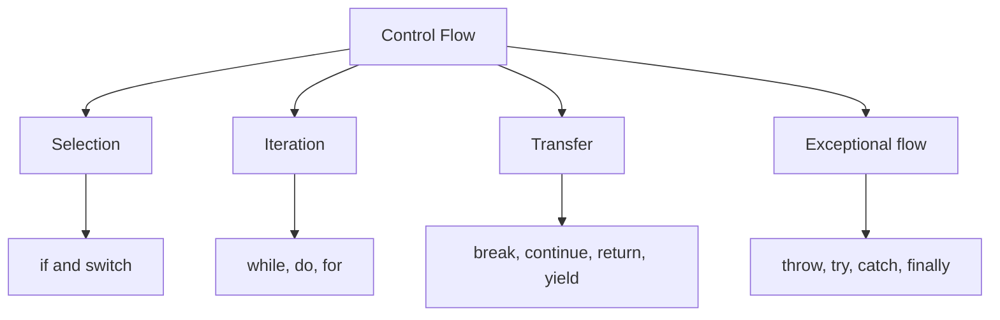
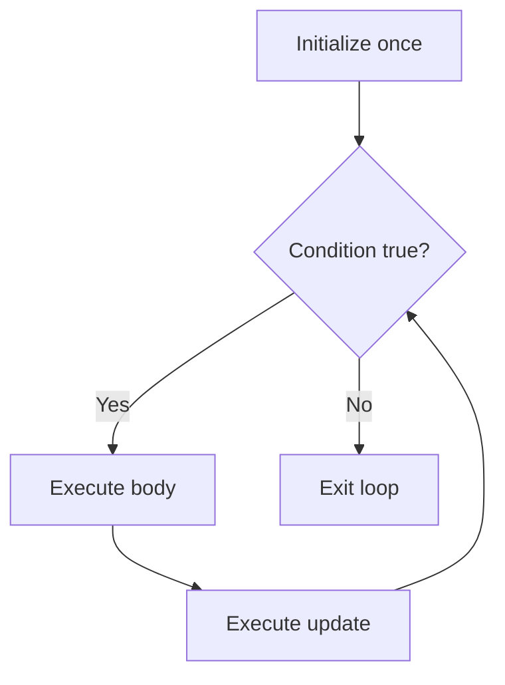

# Core Java Reference Material

> # Control Flow Statements in Java 21

🏚️ [Home](index.md) 🔸 ⬅️ Previous: [Operators and Expressions](operators.md) 🔸 ➡️ Next: [Arrays](arrays.md)

## Table of Contents

1. [What Is Control Flow?](#1-what-is-control-flow)
2. [Java 21 Scope and Control-Flow Categories](#2-java-21-scope-and-control-flow-categories)
3. [Statements, Blocks, and Completion](#3-statements-blocks-and-completion)
4. [Boolean Conditions and Short-Circuiting](#4-boolean-conditions-and-short-circuiting)
5. [`if` Statement](#5-if-statement)
6. [`if-else` Statement](#6-if-else-statement)
7. [`else-if` Ladders and Nested `if`](#7-else-if-ladders-and-nested-if)
8. [Dangling `else`, Braces, and Empty Statements](#8-dangling-else-braces-and-empty-statements)
9. [Conditional Operator vs `if`](#9-conditional-operator-vs-if)
10. [Traditional `switch` Statement](#10-traditional-switch-statement)
11. [Fall-Through and `break` in `switch`](#11-fall-through-and-break-in-switch)
12. [Arrow Switch Rules](#12-arrow-switch-rules)
13. [Switch Expressions](#13-switch-expressions)
14. [`yield` Statement](#14-yield-statement)
15. [Switch Selector Types and Case Labels](#15-switch-selector-types-and-case-labels)
16. [Java 21 Pattern Matching for `switch`](#16-java-21-pattern-matching-for-switch)
17. [Guards, Ordering, and Pattern Dominance](#17-guards-ordering-and-pattern-dominance)
18. [Null Handling, Exhaustiveness, and `MatchException`](#18-null-handling-exhaustiveness-and-matchexception)
19. [Record Patterns and Sealed Hierarchies](#19-record-patterns-and-sealed-hierarchies)
20. [`while` Loop](#20-while-loop)
21. [`do-while` Loop](#21-do-while-loop)
22. [Basic `for` Loop](#22-basic-for-loop)
23. [Multiple Expressions and Infinite Loops](#23-multiple-expressions-and-infinite-loops)
24. [Enhanced `for` Loop](#24-enhanced-for-loop)
25. [Choosing the Right Loop](#25-choosing-the-right-loop)
26. [Nested Loops](#26-nested-loops)
27. [`break` Statement](#27-break-statement)
28. [Labeled `break`](#28-labeled-break)
29. [`continue` Statement](#29-continue-statement)
30. [Labeled `continue`](#30-labeled-continue)
31. [`return` Statement](#31-return-statement)
32. [`throw` and Exception Control Flow](#32-throw-and-exception-control-flow)
33. [`try-catch-finally`](#33-try-catch-finally)
34. [`try`-with-resources](#34-try-with-resources)
35. [Assertions and `synchronized` Statements](#35-assertions-and-synchronized-statements)
36. [Reachability and Unreachable Statements](#36-reachability-and-unreachable-statements)
37. [Definite Assignment and Flow Analysis](#37-definite-assignment-and-flow-analysis)
38. [Pattern-Variable Flow Scoping](#38-pattern-variable-flow-scoping)
39. [Java 21 Preview Features Related to Control Flow](#39-java-21-preview-features-related-to-control-flow)
40. [Practical Control-Flow Programs](#40-practical-control-flow-programs)
41. [Java Version Timeline](#41-java-version-timeline)
42. [Control-Flow Best Practices](#42-control-flow-best-practices)
43. [Common Control-Flow Errors](#43-common-control-flow-errors)
44. [Quick Revision Tables](#44-quick-revision-tables)
45. [Frequently Asked Interview Questions](#45-frequently-asked-interview-questions)
46. [Official Java 21 References](#46-official-java-21-references)

## 1. What Is Control Flow?

**Control flow** is the order in which a program's statements and expressions are evaluated. Java normally executes statements from top to bottom, but control-flow constructs can:

- select one path from several alternatives;
- repeat a block of code;
- skip part of an iteration;
- leave a loop, switch, block, or method;
- transfer control because of an exception; or
- produce a value from a switch expression.

```java
int temperature = 32;

if (temperature > 30) {
    System.out.println("Hot");
} else {
    System.out.println("Comfortable");
}
```

The condition determines which branch runs. Exactly one of the two output statements is executed.

### Sequential flow

Without a control-flow construct, statements execute in source order.

```java
int first = 10;
int second = 20;
int total = first + second;
System.out.println(total);
```

### Why control flow matters

Control flow allows a program to:

- validate data;
- apply business rules;
- respond to different object types or states;
- process arrays and collections;
- retry or repeat operations;
- search for a matching value;
- stop work early when a result is known; and
- recover from exceptional conditions.

[↑ Go to Table of Contents](#table-of-contents)

## 2. Java 21 Scope and Control-Flow Categories

This chapter targets **Java SE 21**. It covers every mainstream statement that controls, transfers, or materially affects execution, plus related expression and pattern features.

### Version coverage

- Basic `if`, `switch`, loop, label, `break`, `continue`, `return`, `throw`, `try`, `assert`, and `synchronized` behavior.
- Enhanced `for`, introduced in Java 5.
- Try-with-resources and multi-catch, introduced in Java 7.
- Effectively final resources in try-with-resources, added in Java 9.
- `var` in local and loop declarations, added in Java 10.
- Switch expressions, arrow rules, and `yield`, permanent since Java 14.
- Pattern matching for `instanceof`, permanent since Java 16.
- Sealed classes, permanent since Java 17.
- Record patterns and pattern matching for switch, permanent in Java 21.
- Relevant Java 21 preview syntax in a separate section.

Java 21 preview features are clearly marked and require `--enable-preview`. They are not ordinary permanent Java 21 syntax.

### Main categories



| Category | Main constructs |
| --- | --- |
| Sequential execution | Blocks and expression statements |
| Selection | `if`, `if-else`, `switch` |
| Iteration | `while`, `do-while`, basic `for`, enhanced `for` |
| Transfer | `break`, `continue`, `return`, `yield` |
| Exceptional flow | `throw`, `try`, `catch`, `finally`, try-with-resources |
| Pattern-directed flow | Pattern `instanceof`, pattern switch, record patterns |
| Related statements | Labeled statements, `assert`, `synchronized` |

[↑ Go to Table of Contents](#table-of-contents)

## 3. Statements, Blocks, and Completion

A **statement** is executed for its effect and does not itself have a value. An **expression** normally produces a value. A switch can be either a statement or an expression in modern Java.

### Block

A block groups zero or more statements between braces.

```java
{
    int subtotal = 100;
    int tax = 18;
    System.out.println(subtotal + tax);
}
```

A local variable is in scope only where its declaration permits. A block is often used to create a clear scope.

### Expression statements

Only certain expression forms can stand alone as statements:

- assignments;
- prefix increment and decrement;
- postfix increment and decrement;
- method invocations; and
- class-instance creation expressions.

```java
count++;                    // postfix increment
total += amount;            // assignment
System.out.println(total);  // method invocation
new StringBuilder();        // object creation; legal but usually pointless alone
```

A general value expression cannot be used as a statement:

```java
// 10 + 20; // compile-time error
```

### Normal completion

A statement completes **normally** when execution reaches its end and can continue with the next statement.

```java
System.out.println("First");
System.out.println("Second");
```

### Abrupt completion

A statement or expression completes **abruptly** when normal sequencing is interrupted.

| Cause | Typical destination |
| --- | --- |
| `break` | After a loop, switch, or labeled statement |
| `continue` | Next iteration of a loop |
| `return` | Caller of the current method |
| `yield` | Result of the enclosing switch expression |
| `throw` | Matching exception handler or caller |
| Runtime exception | Matching handler or caller |

`break`, `continue`, `return`, `throw`, and `yield` never complete normally themselves.

[↑ Go to Table of Contents](#table-of-contents)

## 4. Boolean Conditions and Short-Circuiting

Conditions in `if`, `while`, `do-while`, and the middle part of a basic `for` must have type `boolean` or `Boolean`.

```java
boolean loggedIn = true;

if (loggedIn) {
    System.out.println("Welcome");
}
```

Java does not treat numbers as truth values.

```java
int count = 1;

// if (count) { } // compile-time error
if (count != 0) {
    System.out.println("Nonzero");
}
```

### `Boolean` unboxing danger

A `Boolean` condition is unboxed. If it is `null`, evaluation throws `NullPointerException`.

```java
Boolean enabled = null;

// if (enabled) { } // NullPointerException
if (Boolean.TRUE.equals(enabled)) {
    System.out.println("Enabled");
}
```

### Short-circuit operators

`&&` and `||` control whether their right operand is evaluated.

```java
String text = null;

if (text != null && !text.isBlank()) {
    System.out.println(text);
}
```

Because `text != null` is false, Java skips `text.isBlank()`.

| Expression | When the right operand is skipped |
| --- | --- |
| `left && right` | When `left` is `false` |
| `left || right` | When `left` is `true` |

Use `&&` and `||` rather than boolean `&` and `|` for ordinary control-flow conditions.

[↑ Go to Table of Contents](#table-of-contents)

## 5. `if` Statement

An `if` statement executes its body only when its condition evaluates to `true`.

### Syntax

```java
if (condition) {
    statements;
}
```

### Example

```java
int age = 21;

if (age >= 18) {
    System.out.println("Adult");
}
```

### Single statement without braces

Java permits one unbraced statement:

```java
if (age >= 18)
    System.out.println("Adult");
```

Braces are normally safer because they make the controlled region explicit and prevent maintenance errors.

### Early validation

An `if` statement often works well with an early return or exception.

```java
static void printLength(String text) {
    if (text == null) {
        throw new IllegalArgumentException("text must not be null");
    }

    System.out.println(text.length());
}
```

[↑ Go to Table of Contents](#table-of-contents)

## 6. `if-else` Statement

An `if-else` statement chooses exactly one of two branches.

### Syntax

```java
if (condition) {
    statementsWhenTrue;
} else {
    statementsWhenFalse;
}
```

### Example

```java
int number = 17;

if (number % 2 == 0) {
    System.out.println("Even");
} else {
    System.out.println("Odd");
}
```

### Assigning a result

```java
int score = 72;
String result;

if (score >= 50) {
    result = "Pass";
} else {
    result = "Fail";
}
```

Both branches assign `result`, so it is definitely assigned afterward.

[↑ Go to Table of Contents](#table-of-contents)

## 7. `else-if` Ladders and Nested `if`

An `else-if` ladder tests alternatives in order. Java executes the first branch whose condition is true and skips the remaining branches.

```java
int score = 84;
String grade;

if (score >= 90) {
    grade = "A";
} else if (score >= 75) {
    grade = "B";
} else if (score >= 60) {
    grade = "C";
} else {
    grade = "D";
}
```

Order matters. Put narrower or higher-priority conditions before broader ones.

```java
// Incorrect ordering: every score of 90 or more also satisfies score >= 60.
if (score >= 60) {
    grade = "Pass";
} else if (score >= 90) {
    grade = "Excellent"; // never selected
}
```

### Nested `if`

An `if` can appear inside another branch.

```java
boolean hasAccount = true;
boolean passwordCorrect = true;

if (hasAccount) {
    if (passwordCorrect) {
        System.out.println("Login successful");
    } else {
        System.out.println("Wrong password");
    }
} else {
    System.out.println("Account not found");
}
```

Deep nesting is often clearer when converted to guard clauses.

```java
static void login(boolean hasAccount, boolean passwordCorrect) {
    if (!hasAccount) {
        System.out.println("Account not found");
        return;
    }

    if (!passwordCorrect) {
        System.out.println("Wrong password");
        return;
    }

    System.out.println("Login successful");
}
```

[↑ Go to Table of Contents](#table-of-contents)

## 8. Dangling `else`, Braces, and Empty Statements

### Dangling `else`

Without braces, an `else` belongs to the nearest preceding unmatched `if`.

```java
if (firstCondition)
    if (secondCondition)
        System.out.println("Both true");
    else
        System.out.println("The else belongs to the inner if");
```

Use braces to show the intended structure:

```java
if (firstCondition) {
    if (secondCondition) {
        System.out.println("Both true");
    }
} else {
    System.out.println("The outer condition is false");
}
```

### Empty statement

A lone semicolon is an empty statement. It performs no action.

```java
if (ready); {
    System.out.println("This block always runs");
}
```

The semicolon ends the `if`. The following block is independent. This is a common bug.

An intentional empty loop should be obvious and documented:

```java
while (service.isStarting()) {
    Thread.onSpinWait();
}
```

Avoid a silent empty body such as `while (condition);`.

[↑ Go to Table of Contents](#table-of-contents)

## 9. Conditional Operator vs `if`

The conditional operator `?:` is an expression, while `if` is a statement.

### Conditional operator

Use it to select one of two values.

```java
int age = 20;
String category = age >= 18 ? "Adult" : "Minor";
```

### `if-else`

Use it when branches perform actions or contain several statements.

```java
if (age >= 18) {
    audit("adult access");
    grantAccess();
} else {
    audit("minor access denied");
    denyAccess();
}
```

### Selection guide

| Requirement | Prefer |
| --- | --- |
| Select one of two short values | `?:` |
| Execute statements | `if-else` |
| Handle several ordered boolean ranges | `else-if` |
| Match many constants or patterns | `switch` |

Avoid using a nested conditional expression when it is difficult to read.

[↑ Go to Table of Contents](#table-of-contents)

## 10. Traditional `switch` Statement

A traditional switch statement selects a labeled statement group using `case ... :` labels.

```java
int option = 2;

switch (option) {
    case 1:
        System.out.println("Create");
        break;
    case 2:
        System.out.println("Update");
        break;
    case 3:
        System.out.println("Delete");
        break;
    default:
        System.out.println("Unknown option");
}
```

### Execution process

1. Java evaluates the selector expression once.
2. It finds an applicable case or `default`.
3. Execution begins at that label.
4. With colon labels, execution continues until a transfer statement or the end of the switch.

### Case constants

Classic case labels normally use compile-time constants.

```java
static final int CREATE = 1;
static final int UPDATE = 2;

switch (option) {
    case CREATE:
        System.out.println("Create");
        break;
    case UPDATE:
        System.out.println("Update");
        break;
    default:
        System.out.println("Unknown");
}
```

A variable that is merely `final` is not necessarily a compile-time constant; it must also meet constant-variable rules.

[↑ Go to Table of Contents](#table-of-contents)

## 11. Fall-Through and `break` in `switch`

With traditional colon labels, execution can **fall through** into the next statement group.

```java
int month = 2;
int days;

switch (month) {
    case 4:
    case 6:
    case 9:
    case 11:
        days = 30;
        break;
    case 2:
        days = 28;
        break;
    default:
        days = 31;
}
```

Several empty case groups intentionally fall through to shared code.

### Accidental fall-through

```java
int level = 1;

switch (level) {
    case 1:
        System.out.println("Basic");
        // Missing break: execution continues into case 2.
    case 2:
        System.out.println("Advanced");
        break;
    default:
        System.out.println("Unknown");
}
```

Output:

```text
Basic
Advanced
```

Use arrow switch rules when fall-through is not required.

[↑ Go to Table of Contents](#table-of-contents)

## 12. Arrow Switch Rules

Arrow switch rules became permanent with switch expressions in Java 14. They can be used in both switch statements and switch expressions.

```java
int option = 2;

switch (option) {
    case 1 -> System.out.println("Create");
    case 2 -> System.out.println("Update");
    case 3 -> System.out.println("Delete");
    default -> System.out.println("Unknown option");
}
```

An arrow rule does not fall through.

### Multiple labels

```java
String type = switch (day) {
    case SATURDAY, SUNDAY -> "Weekend";
    default -> "Weekday";
};
```

### Multiple statements

Use a block for several statements.

```java
switch (status) {
    case "NEW" -> {
        audit("new order");
        startProcessing();
    }
    case "DONE" -> archive();
    default -> reportUnknown(status);
}
```

### Rule forms

In a switch statement, the right side of `->` can be:

- a statement expression;
- a block; or
- a `throw` statement.

In a switch expression, it can be:

- a result expression;
- a block that yields a result; or
- a `throw` statement.

A single switch block uses one label style consistently; do not mix arrow rules with colon statement groups.

[↑ Go to Table of Contents](#table-of-contents)

## 13. Switch Expressions

A switch expression evaluates to one value. It became a permanent feature in Java 14.

```java
enum Day {
    MONDAY, TUESDAY, WEDNESDAY, THURSDAY,
    FRIDAY, SATURDAY, SUNDAY
}

Day day = Day.SATURDAY;

String category = switch (day) {
    case SATURDAY, SUNDAY -> "Weekend";
    default -> "Weekday";
};
```

The semicolon after the closing brace ends the assignment statement.

### Returning a switch result

```java
static int quarter(int month) {
    return switch (month) {
        case 1, 2, 3 -> 1;
        case 4, 5, 6 -> 2;
        case 7, 8, 9 -> 3;
        case 10, 11, 12 -> 4;
        default -> throw new IllegalArgumentException("Invalid month");
    };
}
```

### Expression vs statement

| Switch statement | Switch expression |
| --- | --- |
| Performs actions | Produces a value |
| Semicolon after block is normally unnecessary | Surrounding statement normally ends with `;` |
| A legacy switch need not be exhaustive | Must be exhaustive |
| Unlabeled `break` can exit it | `yield` supplies a value from a block |

Switch expressions reduce temporary variables and prevent missing-result paths.

[↑ Go to Table of Contents](#table-of-contents)

## 14. `yield` Statement

`yield` transfers a value from a block to its enclosing switch expression.

```java
int score = 85;

String grade = switch (score / 10) {
    case 10, 9 -> "A";
    case 8 -> {
        System.out.println("Strong result");
        yield "B";
    }
    case 7 -> "C";
    case 6 -> "D";
    default -> "F";
};
```

### `yield` vs `return` vs `break`

| Statement | Target |
| --- | --- |
| `yield value;` | Innermost enclosing switch expression |
| `return value;` | Current method or lambda body |
| `break;` | Innermost loop or switch statement |

`yield` is legal only when it has an enclosing switch-expression target. It cannot yield a `void` expression.

```java
// yield 10; // error outside a switch expression
```

Do not use `yield` in an arrow rule that already consists of one result expression.

### Colon-style switch expression

A switch expression may also use traditional colon labels. Every reachable path must still produce a value with `yield` or complete abruptly, such as by throwing an exception.

```java
String category = switch (day) {
    case SATURDAY:
    case SUNDAY:
        yield "Weekend";
    default:
        yield "Weekday";
};
```

[↑ Go to Table of Contents](#table-of-contents)

## 15. Switch Selector Types and Case Labels

### Legacy selector types

Traditional switch supports:

- `char`, `byte`, `short`, and `int`;
- `Character`, `Byte`, `Short`, and `Integer`;
- `String`; and
- enum types.

Primitive `boolean`, `long`, `float`, and `double` are not legal switch selector types in Java 21.

### Java 21 reference selectors

Pattern matching for switch allows a selector expression of any reference type.

```java
Object value = 42L;

String result = switch (value) {
    case Long number -> "long wrapper: " + number;
    case String text -> "text: " + text;
    case null -> "null";
    default -> "other";
};
```

This does not make primitive `long`, `float`, `double`, or `boolean` legal selectors.

### Duplicate labels

Two case constants cannot have the same value.

```java
// Compile-time error: duplicate case label
// switch (number) {
//     case 1 -> System.out.println("one");
//     case 1 -> System.out.println("again");
// }
```

### Qualified enum constants in Java 21

Java 21 allows a qualified enum constant as a case constant when it is compatible with the selector type.

```java
enum Color { RED, GREEN, BLUE }

Object value = Color.RED;

String name = switch (value) {
    case Color.RED -> "red";
    case Color.GREEN -> "green";
    case Color.BLUE -> "blue";
    default -> "not a color";
};
```

[↑ Go to Table of Contents](#table-of-contents)

## 16. Java 21 Pattern Matching for `switch`

Pattern matching for switch became permanent in Java 21. It works in switch statements and switch expressions without preview flags.

```java
static String describe(Object value) {
    return switch (value) {
        case null -> "null";
        case Integer number -> "integer " + number;
        case Long number -> "long " + number;
        case String text -> "text of length " + text.length();
        default -> "other";
    };
}
```

Each type pattern:

1. tests whether the value has a compatible runtime type; and
2. introduces a pattern variable for the matching rule.

### Pattern switch statement

```java
static void printType(Object value) {
    switch (value) {
        case null -> System.out.println("null");
        case String text -> System.out.println(text.toUpperCase());
        case Number number -> System.out.println(number.doubleValue());
        default -> System.out.println("Other");
    }
}
```

An enhanced switch statement that uses patterns or `case null` must be exhaustive.

### Final Java 21 pattern syntax

Java 21 removed parenthesized patterns that appeared in earlier previews. Write the pattern directly.

```java
case String text -> System.out.println(text);   // Java 21
// case (String text) -> System.out.println(text); // invalid in Java 21
```

### Pattern-variable scope

The variable is available only in its rule expression or rule block.

```java
switch (value) {
    case String text -> System.out.println(text.length());
    default -> System.out.println("Not text");
}

// System.out.println(text); // error: text is out of scope
```

[↑ Go to Table of Contents](#table-of-contents)

## 17. Guards, Ordering, and Pattern Dominance

A Java 21 pattern label can include a `when` guard. The guard runs only after the pattern matches.

```java
static String classify(Object value) {
    return switch (value) {
        case Integer number when number < 0 -> "negative integer";
        case Integer number when number == 0 -> "zero";
        case Integer number -> "positive integer";
        case String text when text.isBlank() -> "blank text";
        case String text -> "nonblank text";
        case null -> "null";
        default -> "other";
    };
}
```

The guard must have type `boolean` or `Boolean`. A `Boolean` guard may throw `NullPointerException` during unboxing if it evaluates to `null`.

### Pattern dominance

A case label is **dominated** when an earlier label already matches every value the later label could match.

```java
// Compile-time error: String is dominated by Object.
// switch (value) {
//     case Object object -> System.out.println("object");
//     case String text -> System.out.println("text");
// }
```

Correct order:

```java
switch (value) {
    case String text -> System.out.println("text");
    case Object object -> System.out.println("object");
}
```

### Recommended ordering

For predictable pattern switches, generally place labels in this order:

1. specific constants;
2. guarded patterns;
3. unguarded, broader patterns; and
4. `default`, when required.

Guards are usually too general for the compiler to prove how their runtime conditions overlap. Good source ordering still matters even when dominance checking does not reject an overlap.

[↑ Go to Table of Contents](#table-of-contents)

## 18. Null Handling, Exhaustiveness, and `MatchException`

### `case null`

Java 21 allows a switch to handle a null selector explicitly.

```java
String output = switch (value) {
    case null -> "missing";
    case String text -> text;
    default -> value.toString();
};
```

Type and record patterns do not normally match `null`. Without an applicable `case null`, a null selector causes `NullPointerException`.

### Legal null-label combination

`null` can be combined only with `default`.

```java
switch (value) {
    case String text -> System.out.println(text);
    case null, default -> System.out.println("No string");
}
```

This is illegal:

```java
// case null, String text -> ... // compile-time error
```

### Exhaustiveness rules

- Every switch expression must be exhaustive.
- A switch statement using a pattern or null label must be exhaustive.
- A switch statement whose selector is not a legacy selector type must be exhaustive.
- A legacy switch statement can remain non-exhaustive for compatibility.

Exhaustiveness can come from:

- a `default` label;
- `case null, default`;
- all constants of an enum;
- an unconditional pattern; or
- complete coverage of an eligible sealed hierarchy.

### `MatchException`

An exhaustive switch can still fail at runtime after separate compilation. For example, a sealed hierarchy or enum can change after the class containing the switch was compiled. If no label then applies, Java 21 throws `MatchException`.

Recompile dependent switch code when an enum or sealed hierarchy changes.

[↑ Go to Table of Contents](#table-of-contents)

## 19. Record Patterns and Sealed Hierarchies

Record patterns became permanent in Java 21. They can deconstruct records in `instanceof` and switch patterns.

```java
record Point(int x, int y) {}

static String describePoint(Object value) {
    return switch (value) {
        case Point(int x, int y) when x == 0 && y == 0 -> "origin";
        case Point(int x, int y) -> "(" + x + ", " + y + ")";
        case null -> "null";
        default -> "not a point";
    };
}
```

### Nested record patterns

```java
record Line(Point start, Point end) {}

static boolean horizontal(Object value) {
    return switch (value) {
        case Line(Point(var x1, var y1), Point(var x2, var y2)) -> y1 == y2;
        default -> false;
    };
}
```

`var` asks the compiler to infer a record component pattern's type.

### Exhaustive sealed hierarchy

```java
sealed interface Shape permits Circle, Rectangle {}
record Circle(double radius) implements Shape {}
record Rectangle(double width, double height) implements Shape {}

static double area(Shape shape) {
    return switch (shape) {
        case Circle(double radius) -> Math.PI * radius * radius;
        case Rectangle(double width, double height) -> width * height;
    };
}
```

The compiler knows the permitted implementations, so the switch expression is exhaustive without a source-level `default`. A null selector still throws `NullPointerException` unless `case null` is added.

### Java 21 enhanced-for restriction

Record patterns are permanent in Java 21 for `instanceof` and switch. A record pattern cannot be used directly as the variable declaration in a permanent Java 21 enhanced `for` header.

```java
// Not valid permanent Java 21 syntax:
// for (Point(int x, int y) : points) { }

for (Point point : points) {
    int x = point.x();
    int y = point.y();
}
```

[↑ Go to Table of Contents](#table-of-contents)

## 20. `while` Loop

A `while` loop checks its condition before every iteration. Its body may execute zero or more times.

### Syntax

```java
while (condition) {
    statements;
}
```

### Counter-controlled loop

```java
int count = 1;

while (count <= 5) {
    System.out.println(count);
    count++;
}
```

Output:

```text
1
2
3
4
5
```

### Sentinel-controlled loop

```java
String command = nextCommand();

while (!"quit".equalsIgnoreCase(command)) {
    process(command);
    command = nextCommand();
}
```

The update must eventually make the condition false unless the loop is intentionally infinite.

### Zero iterations

```java
int value = 10;

while (value < 5) {
    System.out.println(value); // never runs
}
```

### Intentional infinite loop

```java
while (true) {
    Request request = queue.take();
    handle(request);
}
```

An intentional infinite loop normally needs a clear external termination strategy, interruption handling, or `break`.

[↑ Go to Table of Contents](#table-of-contents)

## 21. `do-while` Loop

A `do-while` loop executes its body before checking the condition. The body therefore runs at least once.

### Syntax

```java
do {
    statements;
} while (condition);
```

The trailing semicolon is required.

### Menu example

```java
int option;

do {
    showMenu();
    option = readOption();
    processOption(option);
} while (option != 0);
```

### `while` vs `do-while`

| `while` | `do-while` |
| --- | --- |
| Tests before the body | Tests after the body |
| May run zero times | Runs at least once |
| Good when precondition controls entry | Good when one initial action is required |

Do not choose `do-while` merely to avoid initializing a variable clearly; use it when the at-least-once behavior matches the problem.

[↑ Go to Table of Contents](#table-of-contents)

## 22. Basic `for` Loop

A basic `for` loop places initialization, condition, and update logic in one header.

### Syntax

```java
for (initialization; condition; update) {
    statements;
}
```

### Example

```java
for (int index = 0; index < 5; index++) {
    System.out.println(index);
}
```

### Execution order



1. Initialization runs once.
2. The condition is evaluated.
3. If true, the body runs.
4. The update expressions run.
5. Execution returns to the condition.

### Scope

A variable declared in the initializer is scoped to the loop.

```java
for (int index = 0; index < 3; index++) {
    System.out.println(index);
}

// System.out.println(index); // compile-time error
```

Declare it before the loop only when its value is genuinely needed afterward.

Java 10 and later also allow `var` when the initializer makes the type inferable:

```java
for (var index = 0; index < values.length; index++) {
    System.out.println(values[index]);
}
```

[↑ Go to Table of Contents](#table-of-contents)

## 23. Multiple Expressions and Infinite Loops

The initializer can be a local-variable declaration with comma-separated declarators, or a comma-separated list of statement expressions. The update part can contain a comma-separated list of statement expressions.

```java
for (int left = 0, right = 9; left < right; left++, right--) {
    System.out.println(left + " : " + right);
}
```

The comma is a separator here, not a general comma operator. Both variables in one declaration must have the same declared type.

### Omitted parts

Any of the three header parts can be omitted.

```java
int index = 0;

for (; index < 3; ) {
    System.out.println(index);
    index++;
}
```

### Infinite basic `for`

```java
for (;;) {
    if (shouldStop()) {
        break;
    }
    performWork();
}
```

When the condition is absent, it is treated as always true. A `break`, exception, return, shutdown, or another external event must end the work when termination is required.

### `continue` and the update step

In a basic `for`, `continue` still executes the update expressions before the next condition test.

```java
for (int index = 0; index < 5; index++) {
    if (index == 2) {
        continue;
    }
    System.out.println(index);
}
```

The loop does not get stuck at `2` because `index++` still runs.

[↑ Go to Table of Contents](#table-of-contents)

## 24. Enhanced `for` Loop

The enhanced `for`, commonly called the **for-each loop**, visits successive elements of an array or an `Iterable`.

### Array example

```java
int[] values = {10, 20, 30};

for (int value : values) {
    System.out.println(value);
}
```

### Collection example

```java
List<String> names = List.of("Asha", "Bala", "Charan");

for (String name : names) {
    System.out.println(name);
}
```

### Type inference with `var`

Java 10 and later allow `var` in the loop variable declaration.

```java
for (var name : names) {
    System.out.println(name.toUpperCase());
}
```

### What can be iterated?

The expression after `:` must produce:

- an array; or
- an object whose type is a subtype of raw `Iterable`.

The enhanced loop uses an index for arrays and an iterator for `Iterable` values conceptually.

### Reassigning the loop variable

The loop variable receives a value for each iteration. Reassigning it does not replace an array or collection element.

```java
int[] numbers = {1, 2, 3};

for (int number : numbers) {
    number *= 10;
}

System.out.println(java.util.Arrays.toString(numbers)); // [1, 2, 3]
```

Use an indexed loop when elements themselves must be replaced.

### Structural modification

Do not structurally modify most collections through the collection while an enhanced loop is iterating.

```java
List<String> names = new ArrayList<>(List.of("A", "B", "C"));

// May throw ConcurrentModificationException:
// for (String name : names) {
//     names.remove(name);
// }

names.removeIf(name -> name.equals("B"));
```

Use `removeIf()`, an explicit iterator's `remove()`, or collect changes for later.

[↑ Go to Table of Contents](#table-of-contents)

## 25. Choosing the Right Loop

| Situation | Recommended construct |
| --- | --- |
| Known counting range | Basic `for` |
| Need an index | Basic `for` |
| Visit every array or `Iterable` element | Enhanced `for` |
| Repeat while a condition remains true | `while` |
| Body must run at least once | `do-while` |
| Iterator removal is required | Explicit iterator loop |
| Endless service or event loop | Clear `while (true)` or `for (;;)` with termination policy |

### Examples

Known number of repetitions:

```java
for (int attempt = 1; attempt <= 3; attempt++) {
    connect();
}
```

Unknown number of repetitions:

```java
while (scanner.hasNextLine()) {
    process(scanner.nextLine());
}
```

Every value with no index requirement:

```java
for (String item : items) {
    process(item);
}
```

Streams can express transformations and aggregations, but they are not control-flow statements and should not replace a simple loop when imperative flow is clearer.

[↑ Go to Table of Contents](#table-of-contents)

## 26. Nested Loops

A loop may contain another loop.

```java
for (int row = 1; row <= 3; row++) {
    for (int column = 1; column <= 4; column++) {
        System.out.print(row * column + " ");
    }
    System.out.println();
}
```

The inner loop completes all of its iterations for each outer-loop iteration.

### Two-dimensional array

```java
int[][] matrix = {
        {1, 2, 3},
        {4, 5},
        {6, 7, 8, 9}
};

for (int[] row : matrix) {
    for (int value : row) {
        System.out.print(value + " ");
    }
    System.out.println();
}
```

Java supports jagged arrays, so each row can have a different length.

### Complexity

Nested loops do not automatically imply one specific complexity. If an outer loop runs `n` times and an inner loop runs `n` times per outer iteration, the work is typically O(n²). If the inner loop performs a fixed number of steps, the total may remain O(n).

[↑ Go to Table of Contents](#table-of-contents)

## 27. `break` Statement

An unlabeled `break` exits the innermost enclosing loop or switch statement.

### Leaving a loop

```java
for (int number = 1; number <= 100; number++) {
    if (number == 7) {
        break;
    }
    System.out.println(number);
}
```

Execution continues after the loop.

### Search example

```java
int[] values = {4, 8, 15, 16, 23, 42};
int target = 15;
boolean found = false;

for (int value : values) {
    if (value == target) {
        found = true;
        break;
    }
}
```

### Target rules

An unlabeled `break` can target the innermost:

- `switch` statement;
- `while`;
- `do-while`; or
- `for`.

It cannot cross a method, constructor, initializer, lambda, or switch-expression boundary. An unlabeled `break` does not yield a value from a switch expression.

[↑ Go to Table of Contents](#table-of-contents)

## 28. Labeled `break`

A labeled `break` exits an enclosing labeled statement.

### Searching a matrix

```java
int[][] matrix = {
        {3, 5, 7},
        {9, 11, 13},
        {15, 17, 19}
};

int target = 11;
int foundRow = -1;
int foundColumn = -1;

search:
for (int row = 0; row < matrix.length; row++) {
    for (int column = 0; column < matrix[row].length; column++) {
        if (matrix[row][column] == target) {
            foundRow = row;
            foundColumn = column;
            break search;
        }
    }
}
```

Without the label, `break` would leave only the inner loop.

### Labeled block

The target of a labeled `break` does not have to be a loop.

```java
validation: {
    if (name == null) {
        break validation;
    }
    if (name.isBlank()) {
        break validation;
    }
    save(name);
}
```

Labels are useful occasionally, but a helper method with an early `return` can often communicate the intent more clearly.

[↑ Go to Table of Contents](#table-of-contents)

## 29. `continue` Statement

An unlabeled `continue` skips the remaining body of the innermost loop and begins its next iteration.

```java
for (int number = 1; number <= 10; number++) {
    if (number % 2 != 0) {
        continue;
    }
    System.out.println(number);
}
```

Output:

```text
2
4
6
8
10
```

### Effect by loop type

| Loop | What happens after `continue` |
| --- | --- |
| `while` | Condition is tested again |
| `do-while` | Condition is tested |
| Basic `for` | Update expressions run, then condition is tested |
| Enhanced `for` | Next element is requested |

Use `continue` to reduce nesting when the skipped case is simple.

```java
for (Order order : orders) {
    if (order.cancelled()) {
        continue;
    }

    process(order);
}
```

[↑ Go to Table of Contents](#table-of-contents)

## 30. Labeled `continue`

A labeled `continue` begins the next iteration of a specified enclosing loop.

```java
outer:
for (int row = 0; row < matrix.length; row++) {
    for (int column = 0; column < matrix[row].length; column++) {
        if (matrix[row][column] < 0) {
            continue outer;
        }
        process(matrix[row][column]);
    }
    markRowComplete(row);
}
```

If any value in a row is negative, processing jumps to the next outer-loop iteration and `markRowComplete(row)` is skipped.

Unlike labeled `break`, a labeled `continue` must target an enclosing loop. It cannot target an ordinary labeled block.

Avoid labels when a small method, predicate, or clearer data transformation can remove the nested control transfer.

[↑ Go to Table of Contents](#table-of-contents)

## 31. `return` Statement

`return` completes the innermost enclosing method, constructor, or lambda body. A value-returning method or lambda supplies a compatible result; a constructor or `void` target uses `return;` without a value.

### Returning a value

```java
static int maximum(int first, int second) {
    if (first >= second) {
        return first;
    }
    return second;
}
```

The expression must be compatible with the declared return type.

### Returning from a `void` method

```java
static void printPositive(int number) {
    if (number <= 0) {
        return;
    }
    System.out.println(number);
}
```

A constructor may also use a bare `return;`. It ends the constructor without returning a value, although ordinary completion is often clearer.

### Lambda return

A `return` inside a block-bodied lambda returns from the lambda, not from the enclosing method.

```java
java.util.function.IntUnaryOperator absolute = value -> {
    if (value >= 0) {
        return value;
    }
    return -value;
};
```

An expression-bodied lambda does not write `return`:

```java
java.util.function.IntUnaryOperator square = value -> value * value;
```

A `return` cannot transfer control out of a switch expression. Return the switch expression itself, as shown in Section 13, and use `yield` inside a result block.

### Interaction with `finally`

If a return is initiated inside `try` or `catch`, an associated `finally` block executes before control reaches the caller. A `return` or `throw` inside `finally` can replace the earlier result and should be avoided.

[↑ Go to Table of Contents](#table-of-contents)

## 32. `throw` and Exception Control Flow

The `throw` statement completes abruptly by transferring an exception object to a compatible handler.

```java
static double divide(double value, double divisor) {
    if (divisor == 0.0) {
        throw new IllegalArgumentException("divisor must not be zero");
    }
    return value / divisor;
}
```

### `throw` vs `throws`

| `throw` | `throws` |
| --- | --- |
| Statement executed at runtime | Part of a method or constructor declaration |
| Throws one exception object | Declares possible checked exception types |
| Example: `throw new IOException();` | Example: `void load() throws IOException` |

### Checked exception

```java
static String readFirstLine(Path path) throws IOException {
    try (BufferedReader reader = Files.newBufferedReader(path)) {
        return reader.readLine();
    }
}
```

A checked exception must be caught or declared.

### Unchecked exception

Subclasses of `RuntimeException` do not have the catch-or-declare requirement.

```java
if (index < 0) {
    throw new IllegalArgumentException("index must be non-negative");
}
```

### Throwing from a switch rule

```java
String label = switch (status) {
    case 1 -> "Active";
    case 2 -> "Inactive";
    default -> throw new IllegalArgumentException("Unknown status");
};
```

`throw` is a statement, not a general expression, but switch rule syntax explicitly permits a `throw` statement.

[↑ Go to Table of Contents](#table-of-contents)

## 33. `try-catch-finally`

A `try` statement handles exceptional control flow.

```java
try {
    int value = Integer.parseInt(input);
    System.out.println(value);
} catch (NumberFormatException exception) {
    System.out.println("Invalid integer");
} finally {
    System.out.println("Parsing attempt finished");
}
```

### Handler selection

The first compatible `catch` clause is selected. Place specific exception types before broader ones.

```java
try {
    loadData();
} catch (java.io.FileNotFoundException exception) {
    recoverMissingFile();
} catch (java.io.IOException exception) {
    reportReadFailure(exception);
}
```

Reversing those catches is a compile-time error because the broader handler would make the specific one unreachable.

### Multi-catch

Java 7 and later allow alternatives with `|`.

```java
try {
    parseAndStore(input);
} catch (NumberFormatException | IllegalStateException exception) {
    report(exception);
}
```

The alternatives cannot be related by subclassing.

### `finally`

During normal language execution, `finally` runs after `try` and any selected `catch`, whether the earlier code completes normally or initiates `break`, `continue`, `return`, or `throw`.

```java
try {
    return calculate();
} finally {
    releaseLock();
}
```

Do not return from `finally`:

```java
static int dangerous() {
    try {
        return 1;
    } finally {
        return 2; // discards the earlier return
    }
}
```

An abrupt completion from `finally` replaces an earlier transfer or exception, which can hide failures.

[↑ Go to Table of Contents](#table-of-contents)

## 34. `try`-with-resources

Try-with-resources automatically closes resources that implement `AutoCloseable`.

```java
static String readFirstLine(Path path) throws IOException {
    try (BufferedReader reader = Files.newBufferedReader(path)) {
        return reader.readLine();
    }
}
```

The resource is closed after the try block completes, including when the block returns or throws.

### Multiple resources

Resources close in reverse order of initialization.

```java
try (
        InputStream input = Files.newInputStream(source);
        OutputStream output = Files.newOutputStream(target)
) {
    input.transferTo(output);
}
```

`output` closes before `input`.

### Effectively final resource — Java 9+

An existing final or effectively final variable can appear directly in the resource specification.

```java
BufferedReader reader = Files.newBufferedReader(path);

try (reader) {
    System.out.println(reader.readLine());
}
```

### Suppressed exceptions

If the body throws and closing also throws, the body's exception is normally primary and close failures are attached as suppressed exceptions.

```java
for (Throwable suppressed : exception.getSuppressed()) {
    System.out.println(suppressed.getMessage());
}
```

Prefer try-with-resources over manual close logic.

[↑ Go to Table of Contents](#table-of-contents)

## 35. Assertions and `synchronized` Statements

### `assert`

An assertion checks an internal assumption during development and testing.

```java
assert total >= 0;
assert index < values.length : "index=" + index;
```

If assertions are enabled and the condition is false, Java throws `AssertionError`.

Enable assertions:

```bash
java -ea Application
```

Assertions are usually disabled by default. Therefore:

- do not use them to validate public input;
- do not put required side effects in assertion expressions; and
- use normal checks and exceptions for production validation.

### `synchronized`

A synchronized statement acquires an object's monitor before executing its block and releases it when the block completes normally or abruptly.

```java
private final Object lock = new Object();
private int count;

void increment() {
    synchronized (lock) {
        count++;
    }
}
```

Evaluating a null lock expression throws `NullPointerException`.

```java
Object lock = null;
// synchronized (lock) { } // NullPointerException
```

`synchronized` controls mutual exclusion and memory visibility. It does not choose among branches, but it materially controls when a block can execute.

[↑ Go to Table of Contents](#table-of-contents)

## 36. Reachability and Unreachable Statements

Java performs compile-time reachability analysis. A statement that cannot be reached under the language's rules is normally rejected.

### After `return`

```java
static int value() {
    return 10;
    // System.out.println("unreachable"); // compile-time error
}
```

The same rule applies after an unconditional `throw`, `break`, or `continue` in the same block.

### Infinite loop

```java
while (true) {
    performWork();
}

// System.out.println("unreachable"); // no reachable break exits the loop
```

Adding a reachable `break` can allow following code to be reachable.

### Special `if` rule

Java permits a statement inside `if (false)` for conditional-compilation patterns:

```java
if (false) {
    System.out.println("permitted by reachability rules");
}
```

The superficially similar loop is rejected:

```java
// while (false) {
//     System.out.println("compile-time unreachable");
// }
```

Reachability analysis is defined by language rules and is intentionally conservative; it is not a general theorem prover.

[↑ Go to Table of Contents](#table-of-contents)

## 37. Definite Assignment and Flow Analysis

A local variable must be **definitely assigned** on every possible path before it is read.

### Both branches assign

```java
int result;

if (condition) {
    result = 10;
} else {
    result = 20;
}

System.out.println(result); // legal
```

### Missing assignment path

```java
int result;

if (condition) {
    result = 10;
}

// System.out.println(result); // compile-time error
```

When the condition is false, no assignment is guaranteed.

### Early return

```java
static int parsePositive(String text) {
    if (text == null) {
        return 0;
    }

    int value = Integer.parseInt(text);
    return Math.max(value, 0);
}
```

Flow analysis understands that execution after the `if` occurs only when the early return was not taken.

### Blank final variable

A blank `final` local variable must be assigned exactly once on every path that reaches its use.

```java
final int sign;

if (number >= 0) {
    sign = 1;
} else {
    sign = -1;
}
```

Definite assignment is a compile-time safety analysis, not runtime default initialization for local variables.

[↑ Go to Table of Contents](#table-of-contents)

## 38. Pattern-Variable Flow Scoping

Pattern variables are scoped according to the paths on which matching definitely succeeded.

### `instanceof` with `&&`

```java
if (value instanceof String text && !text.isBlank()) {
    System.out.println(text.toUpperCase());
}
```

The right operand and body can use `text` because they run only when the pattern matched.

### Unsafe `||` use

```java
// Compile-time error: the right side may run when the pattern did not match.
// if (value instanceof String text || text.isBlank()) { }
```

### Negated guard with early return

```java
static int length(Object value) {
    if (!(value instanceof String text)) {
        return 0;
    }

    return text.length();
}
```

After the unmatched path returns, the compiler knows `text` is matched on the remaining path.

### Loop condition

```java
Object current = next();

while (current instanceof String text && !text.isBlank()) {
    System.out.println(text);
    current = next();
}
```

The pattern variable is available in the loop body while the condition is true.

### Switch rule

```java
switch (value) {
    case String text when !text.isBlank() -> System.out.println(text);
    default -> System.out.println("No usable text");
}
```

Here `text` is in scope in its guard and associated rule, not after the switch.

[↑ Go to Table of Contents](#table-of-contents)

## 39. Java 21 Preview Features Related to Control Flow

Java 21 previewed unnamed patterns and variables. Preview features require matching compiler and runtime flags and may change in later releases.

### Enabling preview

```bash
javac --enable-preview --release 21 Example.java
java --enable-preview Example
```

### Unnamed enhanced-for variable

Use `_` when every iteration matters but the element value does not.

```java
int count = 0;

for (Order _ : orders) {
    count++;
}
```

### Unnamed catch variable

```java
try {
    Integer.parseInt(text);
} catch (NumberFormatException _) {
    System.out.println("Invalid integer");
}
```

### Unnamed record component pattern

```java
record Point(int x, int y) {}

if (value instanceof Point(int x, _)) {
    System.out.println("x = " + x);
}
```

### Other control-flow-related preview contexts

An unnamed variable could also discard an otherwise required local value or name an unused try-with-resources resource.

```java
var _ = queue.remove();

try (var _ = acquireResource()) {
    performWork();
}
```

Every `_` denotes a distinct unnamed variable or pattern, and its value cannot be read later.

These forms were preview-only in Java 21. Without preview mode, use ordinary names:

```java
for (Order ignored : orders) {
    count++;
}
```

A single underscore is not an ordinary identifier in permanent Java 21.

[↑ Go to Table of Contents](#table-of-contents)

## 40. Practical Control-Flow Programs

### Program 1: Grade classification

```java
public class GradeClassification {
    public static void main(String[] args) {
        int mark = 84;

        if (mark < 0 || mark > 100) {
            System.out.println("Invalid mark");
        } else if (mark >= 90) {
            System.out.println("Grade A");
        } else if (mark >= 75) {
            System.out.println("Grade B");
        } else if (mark >= 60) {
            System.out.println("Grade C");
        } else if (mark >= 50) {
            System.out.println("Grade D");
        } else {
            System.out.println("Fail");
        }
    }
}
```

Output:

```text
Grade B
```

### Program 2: Month and quarter using a switch expression

```java
public class QuarterFinder {
    public static void main(String[] args) {
        int month = 8;

        int quarter = switch (month) {
            case 1, 2, 3 -> 1;
            case 4, 5, 6 -> 2;
            case 7, 8, 9 -> 3;
            case 10, 11, 12 -> 4;
            default -> throw new IllegalArgumentException(
                    "Invalid month: " + month);
        };

        System.out.println("Quarter " + quarter);
    }
}
```

Output:

```text
Quarter 3
```

### Program 3: Sum, count, and average

```java
public class LoopStatistics {
    public static void main(String[] args) {
        int[] values = {12, 18, 25, 30, 15};
        int sum = 0;

        for (int value : values) {
            sum += value;
        }

        double average = values.length == 0
                ? 0.0
                : (double) sum / values.length;

        System.out.println("Count: " + values.length);
        System.out.println("Sum: " + sum);
        System.out.println("Average: " + average);
    }
}
```

Output:

```text
Count: 5
Sum: 100
Average: 20.0
```

### Program 4: FizzBuzz

```java
public class FizzBuzz {
    public static void main(String[] args) {
        for (int number = 1; number <= 20; number++) {
            if (number % 15 == 0) {
                System.out.println("FizzBuzz");
            } else if (number % 3 == 0) {
                System.out.println("Fizz");
            } else if (number % 5 == 0) {
                System.out.println("Buzz");
            } else {
                System.out.println(number);
            }
        }
    }
}
```

The `% 15` case appears first because a multiple of both `3` and `5` also satisfies the individual tests.

### Program 5: Matrix search with labeled `break`

```java
public class MatrixSearch {
    public static void main(String[] args) {
        int[][] matrix = {
                {2, 4, 6},
                {8, 10, 12},
                {14, 16, 18}
        };

        int target = 10;
        int foundRow = -1;
        int foundColumn = -1;

        search:
        for (int row = 0; row < matrix.length; row++) {
            for (int column = 0; column < matrix[row].length; column++) {
                if (matrix[row][column] == target) {
                    foundRow = row;
                    foundColumn = column;
                    break search;
                }
            }
        }

        if (foundRow >= 0) {
            System.out.println(
                    "Found at row " + foundRow + ", column " + foundColumn);
        } else {
            System.out.println("Not found");
        }
    }
}
```

Output:

```text
Found at row 1, column 1
```

### Program 6: Java 21 pattern switch

```java
sealed interface Message permits TextMessage, NumberMessage {}

record TextMessage(String text) implements Message {}
record NumberMessage(int number) implements Message {}

public class MessageRouter {
    static String route(Message message) {
        return switch (message) {
            case null -> "Missing message";
            case TextMessage(String text) when text.isBlank() ->
                    "Blank text";
            case TextMessage(String text) ->
                    "Text: " + text;
            case NumberMessage(int number) when number < 0 ->
                    "Negative number";
            case NumberMessage(int number) ->
                    "Number: " + number;
        };
    }

    public static void main(String[] args) {
        System.out.println(route(new TextMessage("Java 21")));
        System.out.println(route(new NumberMessage(-5)));
    }
}
```

Output:

```text
Text: Java 21
Negative number
```

### Program 7: Retry with exception handling

```java
public class RetryParser {
    static int parse(String[] candidates) {
        for (String candidate : candidates) {
            try {
                return Integer.parseInt(candidate);
            } catch (NumberFormatException exception) {
                System.out.println("Rejected: " + candidate);
            }
        }

        throw new IllegalArgumentException("No valid integer");
    }

    public static void main(String[] args) {
        String[] candidates = {"wrong", "still wrong", "42"};
        System.out.println("Accepted: " + parse(candidates));
    }
}
```

Output:

```text
Rejected: wrong
Rejected: still wrong
Accepted: 42
```

[↑ Go to Table of Contents](#table-of-contents)

## 41. Java Version Timeline

| Java release | Control-flow feature relevant to this chapter |
| ---: | --- |
| Original Java | Blocks, `if`, switch statements, loops, labels, transfer statements, exceptions, and synchronization |
| Java 1.4 | Assertions became part of the language |
| Java 5 | Enhanced `for` loop |
| Java 7 | Try-with-resources, multi-catch, and string switch |
| Java 9 | Existing final or effectively final resources became usable directly in try-with-resources |
| Java 10 | `var` became available for initialized local variables and enhanced-for variables |
| Java 14 | Switch expressions, arrow switch rules, multiple case constants, and `yield` became permanent |
| Java 16 | Pattern matching for `instanceof` became permanent |
| Java 17 | Sealed classes became permanent and support exhaustive type reasoning |
| Java 21 | Pattern matching for switch and record patterns became permanent; `case null`, guards, and reference-type switch selectors use final Java 21 rules |
| Java 21 preview | Unnamed patterns and variables could simplify unused loop, catch, and record-pattern bindings |

### Java 21 baseline summary

- All basic selection, iteration, transfer, and exception examples work in Java 21.
- Arrow switch rules and switch expressions require Java 14 or later.
- Pattern `instanceof` flow requires Java 16 or later.
- Record patterns, `when` guards, and permanent pattern-switch syntax require Java 21.
- Section 39 requires JDK 21 preview mode.
- Java 21 does not add a new general loop statement.
- Record patterns cannot be placed directly in a permanent Java 21 enhanced-for header.

[↑ Go to Table of Contents](#table-of-contents)

## 42. Control-Flow Best Practices

- Always use braces for `if`, loop, and switch-rule blocks when maintenance could add another statement.
- Name boolean values positively when possible, such as `isValid` rather than `isNotInvalid`.
- Put cheap safety checks before dependent work in `&&` conditions.
- Order `else-if` ranges from most specific or highest priority to broadest.
- Use guard clauses to reduce deep nesting.
- Use the conditional operator only for concise value selection.
- Prefer arrow switch rules when fall-through is not intentional.
- Document intentional fall-through in colon-style switches.
- Keep switch expressions exhaustive and handle invalid input deliberately.
- Add `case null` only when null is part of the modeled input domain.
- Order switch labels as constants, guarded patterns, then broad patterns.
- Use record patterns when deconstruction improves clarity, not when nesting obscures meaning.
- Choose `for` for clear counting, enhanced `for` for traversal, `while` for condition-driven repetition, and `do-while` for at-least-once behavior.
- Use `< length` for zero-based array and list indexes.
- Make every loop's progress and termination condition obvious.
- Keep loop bodies small; extract meaningful operations into methods.
- Use `break` and `continue` to clarify flow, not to create hidden jumps.
- Prefer an early `return` over several levels of nested conditions.
- Use labels sparingly and give them intention-revealing names.
- Catch only exceptions that can be handled meaningfully at that level.
- Order catch clauses from specific to general.
- Prefer try-with-resources for `AutoCloseable` resources.
- Never return or throw from `finally` unless replacing the earlier outcome is truly intentional.
- Do not use assertions for public-input validation.
- Keep pattern variables within their natural flow scope.
- Treat Java 21 preview syntax as experimental and use matching preview flags.

[↑ Go to Table of Contents](#table-of-contents)

## 43. Common Control-Flow Errors

### Error 1: Semicolon after `if`

```java
if (loggedIn); {
    showDashboard(); // always runs
}
```

Fix:

```java
if (loggedIn) {
    showDashboard();
}
```

### Error 2: Assignment instead of a boolean test

```java
boolean ready = false;

if (ready = true) {
    System.out.println("Always selected");
}
```

Fix:

```java
if (ready) {
    System.out.println("Ready");
}
```

### Error 3: Comparing strings with `==`

```java
if (command == "start") {
    start();
}
```

Fix:

```java
if ("start".equals(command)) {
    start();
}
```

### Error 4: Unsafe null-check order

```java
// May throw NullPointerException.
// if (!text.isBlank() && text != null) { }
```

Fix:

```java
if (text != null && !text.isBlank()) {
    process(text);
}
```

### Error 5: Broader `else-if` condition first

```java
if (score >= 50) {
    grade = "Pass";
} else if (score >= 90) {
    grade = "A"; // unreachable as a logical branch
}
```

Test the higher threshold first.

### Error 6: Missing `break` in a colon switch

```java
switch (option) {
    case 1:
        create();
        // Falls through.
    case 2:
        update();
        break;
}
```

Add `break` or use arrow rules.

### Error 7: Mixing switch label styles

```java
// Invalid: one switch block cannot mix colon groups and arrow rules.
// switch (option) {
//     case 1: create(); break;
//     case 2 -> update();
// }
```

Choose one style for the entire switch block.

### Error 8: Non-exhaustive switch expression

```java
// Compile-time error: no result for other integers.
// String label = switch (number) {
//     case 1 -> "one";
// };
```

Add a suitable `default` or provide complete enum or sealed-type coverage.

### Error 9: Forgetting `yield` in a block rule

```java
// String result = switch (number) {
//     case 1 -> {
//         System.out.println("one");
//         // Missing yield.
//     }
//     default -> "other";
// };
```

Every normally completing result block must yield a compatible value.

### Error 10: Assuming `default` makes a pattern match null

```java
String result = switch (value) {
    case String text -> text;
    default -> "other";
};
```

A null selector throws `NullPointerException`. Add `case null` when required.

### Error 11: Dominated pattern label

```java
// Compile-time error.
// switch (value) {
//     case Object object -> use(object);
//     case String text -> use(text);
// }
```

Put the more specific `String` pattern first.

### Error 12: Non-exhaustive enhanced switch statement

```java
// Pattern switch statements must be exhaustive.
// switch (value) {
//     case String text -> System.out.println(text);
// }
```

Add the missing cases or `default`.

### Error 13: Off-by-one array loop

```java
for (int index = 0; index <= values.length; index++) {
    System.out.println(values[index]); // fails when index == length
}
```

Fix:

```java
for (int index = 0; index < values.length; index++) {
    System.out.println(values[index]);
}
```

### Error 14: Missing loop update

```java
int count = 0;

while (count < 5) {
    System.out.println(count);
    // Missing count++ creates an infinite loop.
}
```

### Error 15: Missing semicolon after `do-while`

```java
// do {
//     work();
// } while (condition) // missing ;
```

### Error 16: Reassigning an enhanced-for variable

```java
for (int value : values) {
    value = 0; // does not change the array element
}
```

Use an indexed loop to replace elements.

### Error 17: Structurally modifying a collection during enhanced iteration

```java
for (String item : items) {
    items.remove(item); // may throw ConcurrentModificationException
}
```

Use `removeIf()`, `Iterator.remove()`, or deferred changes.

### Error 18: Skipping the update in a `while` loop

```java
while (index < values.length) {
    if (values[index] < 0) {
        continue; // index is never incremented on this path
    }
    index++;
}
```

Move the update before `continue` or choose a basic `for` loop.

### Error 19: Expecting `break` to exit every nested loop

An unlabeled `break` exits only the innermost loop or switch statement. Use a labeled break, a flag, an extracted method with `return`, or another clearer structure.

### Error 20: Continuing to a non-loop label

```java
block: {
    // continue block; // compile-time error
}
```

A labeled `continue` must target an enclosing loop.

### Error 21: Returning from `finally`

```java
try {
    return firstResult;
} finally {
    return secondResult; // replaces the first result
}
```

Let `finally` perform cleanup and complete normally.

### Error 22: Catching a broad exception first

```java
// Compile-time error: IOException handler is unreachable.
// try {
//     load();
// } catch (Exception exception) {
//     report(exception);
// } catch (IOException exception) {
//     recover(exception);
// }
```

Order specific handlers before broader handlers.

### Error 23: Using assertions for required validation

```java
assert user != null; // may be disabled
```

Use an explicit check and an appropriate exception for required validation.

### Error 24: Nullable `Boolean` condition

```java
Boolean enabled = null;
// if (enabled) { } // NullPointerException
```

Use a primitive `boolean` when three states are not needed, or handle null explicitly.

### Error 25: Reading a variable that is not definitely assigned

```java
int result;
if (condition) {
    result = 1;
}
// System.out.println(result); // compile-time error
```

Assign it on every path that reaches the read.

### Error 26: Statement after unconditional transfer

```java
return;
// work(); // unreachable
```

Remove or restructure unreachable code.

### Error 27: Pattern variable outside its flow scope

```java
if (value instanceof String text) {
    System.out.println(text);
}
// System.out.println(text); // out of scope
```

### Error 28: Unsupported primitive switch selector

```java
long value = 10L;
// switch (value) { } // primitive long is not supported
```

Use `if`, convert only when safe and appropriate, or redesign the selection.

### Error 29: Java 21 preview syntax without flags

```java
// Preview-only in Java 21:
// catch (Exception _) { }
```

Use `--enable-preview --release 21` with JDK 21, or give the variable an ordinary name.

### Error 30: Floating-point equality as a loop condition

```java
for (double value = 0.0; value != 1.0; value += 0.1) {
    // Rounding may prevent value from becoming exactly 1.0.
}
```

Use an integer counter or a tolerance-based bound that matches the domain.

[↑ Go to Table of Contents](#table-of-contents)

## 44. Quick Revision Tables

### Selection constructs

| Construct | Main use | Produces a value? |
| --- | --- | --- |
| `if` | Run a branch conditionally | No |
| `if-else` | Choose one of two statement paths | No |
| `else-if` | Test ordered boolean alternatives | No |
| Switch statement | Select actions by constants or patterns | No |
| Switch expression | Select one result | Yes |
| `?:` | Select one of two expression values | Yes |

### Loop constructs

| Loop | Condition point | Minimum iterations | Best-known use |
| --- | --- | ---: | --- |
| `while` | Before body | 0 | Unknown count, condition-driven |
| `do-while` | After body | 1 | Must perform initial action |
| Basic `for` | Before body | 0 | Counting or index control |
| Enhanced `for` | Iterator/array traversal | 0 | Visit every element |

### Transfer statements

| Statement | Effect |
| --- | --- |
| `break;` | Exit innermost loop or switch statement |
| `break label;` | Exit the matching enclosing labeled statement |
| `continue;` | Begin next iteration of innermost loop |
| `continue label;` | Begin next iteration of matching enclosing loop |
| `return;` | Leave a `void` method, constructor, or void-compatible lambda body |
| `return value;` | Leave and supply a method or lambda result |
| `yield value;` | Supply a result from a switch-expression block |
| `throw exception;` | Transfer an exception |

### Switch evolution

| Feature | Permanent version |
| --- | ---: |
| String switch | Java 7 |
| Arrow rules and switch expressions | Java 14 |
| `yield` | Java 14 |
| Pattern matching for switch | Java 21 |
| Record patterns | Java 21 |
| `when` guards in final syntax | Java 21 |
| `case null` in final pattern-switch model | Java 21 |

### Completion

| Term | Meaning |
| --- | --- |
| Normal completion | Execution reaches the statement's normal end |
| Abrupt completion | A transfer, exception, or runtime failure interrupts normal sequencing |
| Reachable | The statement can be reached under Java's compile-time rules |
| Definitely assigned | Every relevant path assigns the local variable before it is read |
| Exhaustive switch | Every possible selector value has an applicable result or action path |
| Dominated case | An earlier case already covers every value of the later case |

[↑ Go to Table of Contents](#table-of-contents)

## 45. Frequently Asked Interview Questions

> ### Fundamentals

### 1. What is control flow?

Control flow is the order in which statements and expressions execute. Selection, loops, transfers, and exceptions can change ordinary top-to-bottom execution.

### 2. What are the main categories of control flow in Java?

They are sequential execution, selection, iteration, control transfer, exceptional flow, and pattern-directed selection.

### 3. What is the difference between a statement and an expression?

A statement is executed for its effect and has no value. An expression evaluates to a value, although evaluation may also have side effects.

### 4. What is a block?

A block is a sequence of zero or more statements inside braces. It also creates a scope for local declarations.

### 5. What is normal completion?

A construct completes normally when execution reaches its defined end and can continue with the following construct.

### 6. What is abrupt completion?

It is completion caused by a transfer such as `break`, `continue`, `return`, `yield`, or `throw`, or by an exception during evaluation.

### 7. Which types are accepted as an `if` or loop condition?

The condition must have type `boolean` or `Boolean`. A `Boolean` is unboxed and throws `NullPointerException` if null.

### 8. Does Java treat zero as false?

No. Numeric values cannot be used directly as conditions.

### 9. Why are braces recommended for one-statement bodies?

They make the controlled region explicit and prevent bugs when another statement is added later.

### 10. What is an empty statement?

A lone semicolon is an empty statement. An accidental semicolon after `if` or a loop can detach the following block.

> ### `if` and Conditional Selection

### 11. How does an `if` statement work?

It evaluates a boolean condition and executes its contained statement only when the result is true.

### 12. How does `if-else` work?

It executes exactly one of two branches according to the condition.

### 13. How does an `else-if` ladder work?

Conditions are tested in order, and the first true branch runs. Remaining branches are skipped.

### 14. Why does condition order matter?

A broad condition placed first can consume values intended for a later, more specific branch.

### 15. What is the dangling-`else` rule?

An `else` is associated with the nearest preceding unmatched `if`.

### 16. What is a guard clause?

It is an early return or exception used to handle an invalid or special case before the main logic, reducing nesting.

### 17. What is the difference between `if` and `?:`?

`if` is a statement for controlling actions. `?:` is an expression that selects one of two values.

### 18. Why should `&&` be used for a null guard?

It skips the right operand when the left operand is false, preventing a dependent dereference from running on null.

### 19. What is wrong with `if (ready = true)`?

It assigns true to `ready`, and the assigned value becomes the condition. Prefer `if (ready)`.

### 20. How should strings be compared in a condition?

Use `equals()`, `equalsIgnoreCase()` when intentionally appropriate, or `Objects.equals()` for null-safe equality.

> ### Switch Statements and Expressions

### 21. How does a traditional switch statement execute?

It evaluates the selector once, finds an applicable colon label, and executes statements from that point until a transfer or the block's end.

### 22. What is fall-through?

With colon labels, execution continues into following statement groups when no transfer such as `break` occurs.

### 23. How does an arrow switch rule differ?

It does not fall through. It executes only its expression, block, or `throw` statement.

### 24. Can arrow rules be used in switch statements?

Yes. Arrow rules work in both switch statements and switch expressions.

### 25. Can arrow and colon labels be mixed in one switch block?

No. A switch block uses one structural style.

### 26. What is a switch expression?

It is a switch construct that selects and produces one value.

### 27. When did switch expressions become permanent?

They became permanent in Java 14.

### 28. Why is there a semicolon after many switch expressions?

The switch expression is often part of an assignment, return, or other statement whose grammar requires a terminating semicolon.

### 29. What does `yield` do?

It supplies a value from a block to the enclosing switch expression.

### 30. What is the difference among `yield`, `break`, and `return`?

`yield` produces a switch-expression result, `break` exits a loop or switch statement, and `return` exits a method or block-bodied lambda.

### 31. Must every switch expression be exhaustive?

Yes. Every possible selector value must lead to a value or abrupt completion.

### 32. Must every switch statement be exhaustive?

Legacy switch statements need not be. Enhanced switch statements using patterns, null labels, or non-legacy selector types must be exhaustive.

### 33. Which primitive types cannot be switch selectors in Java 21?

Primitive `boolean`, `long`, `float`, and `double` are not supported as switch selectors.

### 34. What selector expansion arrived with Java 21 pattern switch?

A switch selector may have any reference type, allowing type and record patterns.

### 35. Can a Java 21 switch handle null?

Yes, with an explicit `case null`. Without an applicable null label, a null selector normally throws `NullPointerException`.

### 36. Can `case null` be combined with another label?

It can be combined only with `default`, as `case null, default`. It cannot be combined with a type pattern or ordinary constant.

### 37. What is pattern matching for switch?

It lets case labels test runtime types or record structure and introduce safely typed variables.

### 38. What is a `when` guard?

It is an additional boolean condition evaluated after a case pattern matches.

### 39. What is pattern dominance?

A label is dominated when an earlier label already matches every value it could match. The compiler rejects it.

### 40. How should Java 21 pattern cases generally be ordered?

Use specific constants first, then guarded patterns, then broader unguarded patterns, followed by `default` when needed.

### 41. What is a record pattern?

It tests a record's type and deconstructs its component values into nested patterns.

### 42. How can sealed types help a switch?

Covering all permitted relevant subtypes can make the switch exhaustive without a source-level `default`.

### 43. What is `MatchException` in Java 21 switch flow?

It can occur when a switch was exhaustive at compile time but no label applies at runtime, often after an enum or sealed hierarchy changed without dependent code being recompiled.

### 44. Can a permanent Java 21 enhanced-for header contain a record pattern?

No. Use an ordinary loop variable and access or pattern-match the record inside the loop.

> ### Loops

### 45. What is the difference between `while` and `do-while`?

`while` checks before the body and may run zero times. `do-while` checks after the body and runs at least once.

### 46. What are the three parts of a basic `for` loop?

Initialization, condition, and update.

### 47. In what order does a basic `for` loop execute?

Initialization runs once; then condition, body, update, and condition repeat until the condition is false or flow transfers away.

### 48. What does an omitted `for` condition mean?

It is treated as true, creating an infinite loop unless another transfer ends it.

### 49. What happens to the update step after `continue` in a basic `for`?

The update expressions still execute before the next condition test.

### 50. What can an enhanced `for` iterate?

An array or a value whose type is a subtype of raw `Iterable`.

### 51. Can `var` be used in an enhanced-for variable?

Yes, since Java 10, when the initializer or iteration source permits type inference.

### 52. Does assigning to an enhanced-for variable replace the element?

No. The loop variable is assigned a value for that iteration; reassigning it does not write back to the array or collection.

### 53. Why can collection removal fail in an enhanced loop?

Many iterators are fail-fast and detect structural modification outside the iterator, potentially throwing `ConcurrentModificationException`.

### 54. How should elements be removed during iteration?

Use `removeIf()`, an explicit iterator's `remove()`, or collect modifications and apply them later.

### 55. What is an off-by-one error?

It is a boundary mistake that performs one iteration too many or too few, commonly caused by using `<= length` instead of `< length`.

### 56. Is a nested loop always O(n²)?

No. Complexity depends on how many times each loop actually runs. Two loops of `n` iterations nested directly are typically O(n²).

### 57. When should a `while` loop be preferred?

Use it when repetition depends on a condition and the number of iterations is not naturally known in advance.

### 58. When should an enhanced `for` be preferred?

Use it when every element should be visited and neither an index nor iterator-specific mutation is required.

> ### Transfer and Exception Flow

### 59. What does an unlabeled `break` exit?

The innermost enclosing switch statement or loop.

### 60. What can a labeled `break` target?

Any matching enclosing labeled statement, including a loop, switch, or ordinary block.

### 61. What does `continue` do?

It skips the rest of the current loop body and begins the loop's next iteration step.

### 62. What can a labeled `continue` target?

Only a matching enclosing loop.

### 63. Can a jump cross a method or lambda boundary?

No. Java has no non-local `break` or `continue` across method, constructor, initializer, lambda, or relevant switch-expression boundaries.

### 64. What does `return` do in a method or constructor?

It ends the current method or constructor. A value-returning method supplies a compatible value; a constructor or `void` method uses bare `return;`.

### 65. What does `return` inside a lambda do?

In a block-bodied lambda, it returns from that lambda invocation, not from the enclosing method.

### 66. What is the difference between `throw` and `throws`?

`throw` is an executable statement that throws one object. `throws` is part of a declaration describing possible checked exceptions.

### 67. What is the catch-or-declare rule?

A checked exception must be handled by a compatible catch or declared in the enclosing method or constructor's `throws` clause.

### 68. How is a catch handler selected?

The first catch whose parameter type can receive the thrown object's runtime type is selected.

### 69. Why must specific catches precede broad catches?

A broad earlier handler would already catch every exception of the subtype, making the later specific handler unreachable.

### 70. What is multi-catch?

It is one handler for alternative unrelated exception types, written with `|`.

### 71. Does `finally` run before a pending return or break completes?

Yes, during normal language-defined execution. If `finally` completes abruptly, it can replace the pending transfer.

### 72. Why is returning from `finally` dangerous?

It discards an earlier return value or exception, hiding the original outcome.

### 73. What does try-with-resources do?

It automatically closes initialized `AutoCloseable` resources when control leaves the try block.

### 74. In which order are multiple resources closed?

In reverse order of initialization.

### 75. What is a suppressed exception?

It is usually a resource-closing failure attached to the primary exception thrown by the try body.

> ### Flow Analysis and Java 21

### 76. What is unreachable code?

It is a statement that cannot be reached under Java's compile-time reachability rules and is normally rejected.

### 77. Why is `if (false)` allowed while `while (false)` is rejected?

Java gives `if` a special reachability rule to support conditional-compilation idioms. A constant-false loop body is technically unreachable.

### 78. What is definite assignment?

It is compile-time analysis requiring every relevant execution path to assign a local variable before it is read.

### 79. What is flow scoping?

It scopes a pattern variable only to paths where the compiler knows its pattern matched.

### 80. Why does `value instanceof String text && !text.isBlank()` compile?

The right operand runs only after the pattern matched, so `text` is definitely available there.

### 81. Why does the corresponding expression with `||` usually fail?

The right operand may run when the pattern did not match, so the pattern variable would not be initialized.

### 82. When did pattern matching for `instanceof` become permanent?

It became permanent in Java 16.

### 83. Which control-flow pattern features became permanent in Java 21?

Pattern matching for switch and record patterns became permanent.

### 84. Which related Java 21 feature was preview-only?

Unnamed patterns and variables were preview-only and required preview flags.

### 85. How are Java 21 preview examples compiled and run?

Compile with `javac --enable-preview --release 21` and run with `java --enable-preview` using JDK 21.

### 86. Should assertions validate public method input?

No. Assertions may be disabled. Use explicit checks and exceptions for required validation.

### 87. What happens when an enabled assertion fails?

Java throws `AssertionError`, causing abrupt completion unless it is caught.

### 88. What does a synchronized statement guarantee?

It acquires the selected object's monitor for the block and releases it on normal or abrupt block completion, providing mutual exclusion and defined memory effects.

### 89. What control-flow rules should a fresher remember?

- Conditions must be boolean.
- Use braces and order branches carefully.
- Prefer arrow switch rules unless fall-through is intentional.
- Switch expressions and pattern switches must be exhaustive.
- `while` may run zero times; `do-while` runs at least once.
- Use `< length` for zero-based traversal.
- `break` exits; `continue` skips to the next iteration.
- `return` exits the current method, constructor, or lambda body.
- `yield` belongs to a switch expression.
- Keep cleanup in try-with-resources or normally completing `finally` blocks.
- A local variable must be assigned on every path before use.
- Java 21 preview syntax requires explicit flags.

[↑ Go to Table of Contents](#table-of-contents)

## 46. Official Java 21 References

- [Java Language Specification, Java SE 21 — Chapter 14: Blocks, Statements, and Patterns](https://docs.oracle.com/javase/specs/jls/se21/html/jls-14.html)
- [Java Language Specification, Java SE 21 — Chapter 15: Expressions](https://docs.oracle.com/javase/specs/jls/se21/html/jls-15.html)
- [Java Language Specification, Java SE 21 — Chapter 16: Definite Assignment](https://docs.oracle.com/javase/specs/jls/se21/html/jls-16.html)
- [Oracle Java 21 Switch Expressions and Statements](https://docs.oracle.com/en/java/javase/21/language/switch-expressions-and-statements.html)
- [Oracle Java 21 Pattern Matching for switch](https://docs.oracle.com/en/java/javase/21/language/pattern-matching-switch.html)
- [Oracle Java 21 Record Patterns](https://docs.oracle.com/en/java/javase/21/language/record-patterns.html)
- [Oracle Java SE 21 Language Changes](https://docs.oracle.com/en/java/javase/21/language/java-language-changes-release.html)
- [JEP 361: Switch Expressions](https://openjdk.org/jeps/361)
- [JEP 394: Pattern Matching for `instanceof`](https://openjdk.org/jeps/394)
- [JEP 440: Record Patterns](https://openjdk.org/jeps/440)
- [JEP 441: Pattern Matching for `switch`](https://openjdk.org/jeps/441)
- [JEP 443: Unnamed Patterns and Variables (Preview)](https://openjdk.org/jeps/443)
- [Java 21 Unnamed Patterns and Variables Preview Specification](https://docs.oracle.com/javase/specs/jls/se21/preview/specs/unnamed-jls.html)

[↑ Go to Table of Contents](#table-of-contents)

---

🏚️ [Home](index.md) 🔸 ⬅️ Previous: [Operators and Expressions](operators.md) 🔸 ➡️ Next: [Arrays](arrays.md)

<!-- Mermaid rendering support for GitHub Pages/Jekyll. -->
<script type="module">
  import mermaid from "https://cdn.jsdelivr.net/npm/mermaid@11/dist/mermaid.esm.min.mjs";

  document.querySelectorAll("pre > code.language-mermaid").forEach((code) => {
    const diagram = document.createElement("pre");
    diagram.className = "mermaid";
    diagram.textContent = code.textContent;
    code.parentElement.replaceWith(diagram);
  });

  mermaid.initialize({
    startOnLoad: false,
    securityLevel: "strict"
  });

  await mermaid.run({ querySelector: ".mermaid" });
</script>
