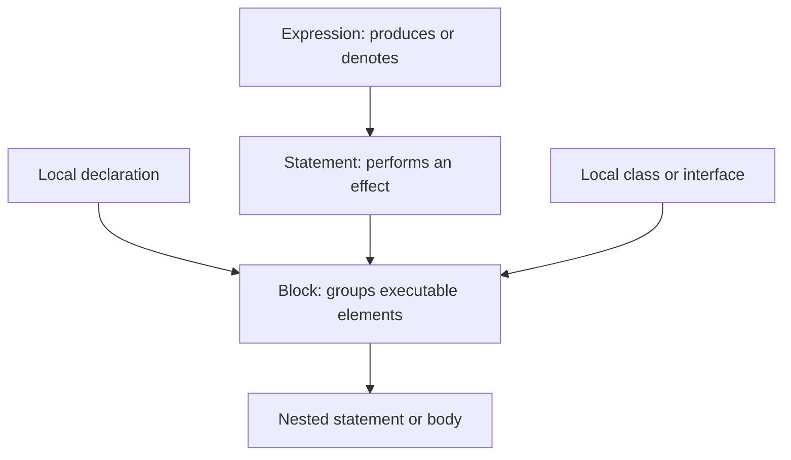

# Core Java Reference Material

> # Expressions, Statements, and Blocks in Java 21

🏚️ [Home](index.md) 🔸 ⬅️ Previous: [Operators and Expressions](operators.md) 🔸 ➡️ Next: [Control Flow Statements](control-flow.md)

## Table of Contents

1. [What Are Expressions, Statements, and Blocks?](#1-what-are-expressions-statements-and-blocks)
2. [Java 21 Scope and Version Coverage](#2-java-21-scope-and-version-coverage)
3. [How Expressions, Statements, and Blocks Fit Together](#3-how-expressions-statements-and-blocks-fit-together)
4. [Expression Results: Variables, Values, and `void`](#4-expression-results-variables-values-and-void)
5. [Forms of Expressions](#5-forms-of-expressions)
6. [Standalone and Poly Expressions](#6-standalone-and-poly-expressions)
7. [Target Types, Contexts, and Conversions](#7-target-types-contexts-and-conversions)
8. [Expression Side Effects](#8-expression-side-effects)
9. [Evaluation Order](#9-evaluation-order)
10. [Normal and Abrupt Expression Evaluation](#10-normal-and-abrupt-expression-evaluation)
11. [Expression Names and Literals](#11-expression-names-and-literals)
12. [Class Literals, `this`, `super`, and Parentheses](#12-class-literals-this-super-and-parentheses)
13. [Class-Instance Creation Expressions](#13-class-instance-creation-expressions)
14. [Array Creation and Access Expressions](#14-array-creation-and-access-expressions)
15. [Field-Access Expressions](#15-field-access-expressions)
16. [Method-Invocation Expressions](#16-method-invocation-expressions)
17. [Overloading, Varargs, and Invocation Context](#17-overloading-varargs-and-invocation-context)
18. [Method-Reference Expressions](#18-method-reference-expressions)
19. [Postfix, Unary, and Cast Expressions](#19-postfix-unary-and-cast-expressions)
20. [Arithmetic, String, and Shift Expressions](#20-arithmetic-string-and-shift-expressions)
21. [Relational, Equality, Bitwise, and Logical Expressions](#21-relational-equality-bitwise-and-logical-expressions)
22. [Conditional Expressions](#22-conditional-expressions)
23. [Assignment Expressions](#23-assignment-expressions)
24. [Lambda Expressions](#24-lambda-expressions)
25. [Lambda Bodies, Scope, and Capture](#25-lambda-bodies-scope-and-capture)
26. [`instanceof` Expressions and Type Patterns](#26-instanceof-expressions-and-type-patterns)
27. [Record Patterns in Java 21](#27-record-patterns-in-java-21)
28. [Switch Expressions and `yield`](#28-switch-expressions-and-yield)
29. [Pattern Matching for Switch in Java 21](#29-pattern-matching-for-switch-in-java-21)
30. [Constant Expressions](#30-constant-expressions)
31. [What Is a Statement?](#31-what-is-a-statement)
32. [Expression Statements](#32-expression-statements)
33. [Local-Variable Declaration Statements](#33-local-variable-declaration-statements)
34. [Empty and Labeled Statements](#34-empty-and-labeled-statements)
35. [Blocks: Syntax and Execution](#35-blocks-syntax-and-execution)
36. [Block Scope, Shadowing, and Lifetime](#36-block-scope-shadowing-and-lifetime)
37. [Local Classes and Interfaces in Blocks](#37-local-classes-and-interfaces-in-blocks)
38. [Method, Constructor, and Initializer Blocks](#38-method-constructor-and-initializer-blocks)
39. [Lambda, Switch, Synchronized, and Try Blocks](#39-lambda-switch-synchronized-and-try-blocks)
40. [Selection Statements](#40-selection-statements)
41. [Iteration Statements](#41-iteration-statements)
42. [Transfer Statements](#42-transfer-statements)
43. [`assert`, `synchronized`, and `throw` Statements](#43-assert-synchronized-and-throw-statements)
44. [`try`, `catch`, `finally`, and Resources](#44-try-catch-finally-and-resources)
45. [Normal and Abrupt Statement Completion](#45-normal-and-abrupt-statement-completion)
46. [Reachability and Unreachable Statements](#46-reachability-and-unreachable-statements)
47. [Definite Assignment and Definite Unassignment](#47-definite-assignment-and-definite-unassignment)
48. [Braces, Semicolons, and the Dangling `else`](#48-braces-semicolons-and-the-dangling-else)
49. [Java 21 Preview Features](#49-java-21-preview-features)
50. [Practical Programs](#50-practical-programs)
51. [Java Version Timeline](#51-java-version-timeline)
52. [Best Practices](#52-best-practices)
53. [Common Errors](#53-common-errors)
54. [Quick Revision Tables](#54-quick-revision-tables)
55. [Frequently Asked Interview Questions](#55-frequently-asked-interview-questions)
56. [Official Java 21 References](#56-official-java-21-references)

## 1. What Are Expressions, Statements, and Blocks?

These three ideas form the executable structure of a Java program:

- An **expression** is evaluated and normally denotes a variable, produces a value, or—only for a `void` method invocation—produces no value.
- A **statement** is executed for its effect. A statement does not itself have a value.
- A **block** is a brace-delimited sequence of statements, local-variable declarations, and local class or interface declarations.

```java
int price = 100;                 // declaration statement
int total = price + 18;          // price + 18 is an expression

if (total > 100) {               // condition expression + block
    System.out.println(total);   // expression statement
}
```

### Smallest-to-largest view

| Unit | Example | Main purpose |
| --- | --- | --- |
| Operand | `price` | Supplies data to an expression |
| Expression | `price + 18` | Computes or denotes something |
| Statement | `total = price + 18;` | Performs an action |
| Block | `{ total = price + 18; }` | Groups executable elements and creates scope |

Expressions can be nested inside larger expressions. Expressions also appear inside statements, and statements are commonly grouped inside blocks.

[↑ Go to Table of Contents](#table-of-contents)

## 2. Java 21 Scope and Version Coverage

This chapter targets **Java SE 21**. It covers the expression and statement grammar that existed from Java's earliest releases, permanent language additions through Java 21, and relevant Java 21 preview features in a separate section.

### Permanent features covered

- primary, unary, binary, conditional, assignment, object-creation, array, invocation, and cast expressions;
- every Java statement category and the rules for blocks;
- enhanced `for`, annotations, generics, boxing, varargs, and enum-related expressions from Java 5;
- strings in `switch`, try-with-resources, multi-catch, diamond syntax, binary literals, and numeric separators from Java 7;
- lambda and method-reference expressions from Java 8;
- improved try-with-resources and diamond with anonymous classes from Java 9;
- local-variable type inference with `var` from Java 10 and `var` lambda parameters from Java 11;
- switch expressions and `yield`, permanent since Java 14;
- text blocks, permanent since Java 15;
- pattern matching for `instanceof`, permanent since Java 16;
- always-strict floating-point evaluation and sealed types from Java 17; and
- record patterns and pattern matching for switch, permanent in Java 21.

### Java 21 preview features covered separately

- string-template expressions;
- unnamed patterns and variables; and
- unnamed classes and instance `main` methods.

Preview examples require a JDK 21 compiler and runtime with preview enabled:

```bash
javac --enable-preview --release 21 Example.java
java --enable-preview Example
```

Features added after Java 21 are intentionally excluded. APIs introduced in Java 21—such as virtual threads and sequenced collections—are not new expression, statement, or block syntax and belong in separate chapters.

[↑ Go to Table of Contents](#table-of-contents)

## 3. How Expressions, Statements, and Blocks Fit Together



Consider one method:

```java
static int discountedPrice(int price, boolean member) {
    int discount;                         // declaration statement

    if (member) {                         // if statement
        discount = price * 10 / 100;      // assignment expression statement
    } else {
        discount = 0;
    }

    return price - discount;              // return statement with expression
}
```

### Important distinctions

| Construct | Ends with `;`? | Produces a value? | Creates a scope? |
| --- | --- | --- | --- |
| Most expressions | No | Usually | No |
| Expression statement | Yes | Its expression's value is discarded | No |
| Local declaration statement | Yes | No | The enclosing construct controls scope |
| Empty statement | It is exactly `;` | No | No |
| Block | No trailing `;` normally | No | Yes |
| Switch expression | Followed by `;` only when its containing statement requires it | Yes | Its switch block scopes declarations |

The braces in a block are syntax, not decoration. They determine grouping, scope, reachability boundaries, and where abrupt completion propagates.

[↑ Go to Table of Contents](#table-of-contents)

## 4. Expression Results: Variables, Values, and `void`

When Java evaluates an expression, the result denotes one of three things:

1. a **variable**;
2. a **value**; or
3. nothing, called a **void expression**.

### Expression denoting a variable

```java
int[] values = {10, 20};
values[0] = 99;
```

The array-access expression `values[0]` denotes a variable, so it can appear on the left of assignment.

### Expression producing a value

```java
int result = values[0] + 1;
```

`values[0] + 1` produces the value `100`; it is not an assignable variable.

### Void expression

```java
System.out.println("Java 21");
```

This is a void expression because the selected method returns no value. It can be an expression statement, but it cannot initialize a variable; `void` is not a variable type.

```java
// Object value = System.out.println("No"); // compile-time error
```

A value-returning invocation may also be used as a statement. Its result is then discarded:

```java
"java".toUpperCase(); // legal, but the returned String is ignored
```

[↑ Go to Table of Contents](#table-of-contents)

## 5. Forms of Expressions

Java SE 21 broadly groups expressions into these syntactic forms:

| Form | Examples |
| --- | --- |
| Expression names | `count`, `order.total` |
| Primary expressions | `42`, `this`, `new Book()`, `items[0]`, `service.run()` |
| Postfix expressions | `index++`, `index--` |
| Unary expressions | `-amount`, `!ready`, `~mask`, `(long) value` |
| Binary expressions | `a + b`, `x < y`, `left && right`, `bits << 2` |
| Conditional expression | `active ? "yes" : "no"` |
| Assignment expression | `total = 10`, `total += 5` |
| Lambda expression | `x -> x * x` |
| Switch expression | `switch (day) { ... }` |

### Expressions compose recursively

```java
int result = Math.max(a + b, c * d);
```

This contains:

- expression names: `a`, `b`, `c`, `d`;
- additive and multiplicative expressions;
- a method-invocation expression; and
- an initializer expression inside a declaration statement.

### Not everything with a keyword is an expression

`if`, `while`, `return`, and `try` introduce statements. They cannot be embedded where a value is required.

```java
// int result = if (ready) 1; // invalid: if is not an expression
```

Use the conditional operator or a switch expression when the construct must produce a value.

[↑ Go to Table of Contents](#table-of-contents)

## 6. Standalone and Poly Expressions

A **standalone expression** gets its type entirely from its own form and contents. A **poly expression** is typed partly using the expected type of its surrounding context, called the target type.

### Standalone expression

```java
var number = 1 + 2L; // expression type is long
```

### Poly class-instance creation

```java
java.util.List<String> names = new java.util.ArrayList<>();
```

The target type helps infer `ArrayList<String>`.

### Poly method invocation

```java
static <T> T first(T a, T b) {
    return a;
}

String text = first("Java", "JDK");
```

### Inherently target-typed expressions

Lambda and method-reference expressions require a target functional-interface type:

```java
java.util.function.IntUnaryOperator square = x -> x * x;
java.util.function.Function<String, Integer> length = String::length;
```

The expression `x -> x * x` does not have one intrinsic class type that can be inferred by `var`:

```java
// var square = x -> x * x; // compile-time error: no target type
```

Potentially poly forms include parenthesized expressions, object creation, method invocation, method references, conditional expressions, lambdas, and switch expressions. Each form has its own conditions for being poly.

[↑ Go to Table of Contents](#table-of-contents)

## 7. Target Types, Contexts, and Conversions

An expression often appears where a particular type is expected. Java calls that expected type the **target type**.

| Context | Example | Target type |
| --- | --- | --- |
| Assignment | `long n = 10;` | `long` |
| Method invocation | `accept(10);` where parameter is `long` | `long` |
| Casting | `(String) value` | `String` |
| String context | `"Total: " + amount` | String representation |
| Numeric context | `small + 1` | Determined by numeric promotion |

### Conversion after typing

```java
long total = 25;       // widening primitive conversion
Integer boxed = 25;   // boxing conversion
Object object = "x"; // widening reference conversion
```

### Target type can affect a poly expression

```java
java.util.List<String> a = java.util.Collections.emptyList();
java.util.List<Integer> b = java.util.Collections.emptyList();
```

The same generic invocation is inferred differently in the two assignment contexts.

### Context does not permit every conversion

```java
// byte small = 200; // compile-time error: constant is outside byte range
byte small = 100;    // permitted constant-expression narrowing
```

Understanding an expression requires both its form and the context in which it appears.

[↑ Go to Table of Contents](#table-of-contents)

## 8. Expression Side Effects

An expression may compute a value, cause a side effect, or do both.

### Common side effects

- assigning a variable;
- incrementing or decrementing a variable;
- invoking a method that changes state or performs I/O;
- creating an object whose constructor has effects; and
- executing statements inside a switch expression rule block.

```java
int count = 0;
int old = count++; // produces 0 and changes count to 1
```

### Pure-looking and effectful expressions

```java
int sum = a + b;            // arithmetic itself has no mutation
orders.add(new Order());    // invocation and construction may have effects
```

Java does not mark methods as pure, so a method invocation must be understood from its contract.

### Keep effects obvious

Avoid packing several mutations into one expression:

```java
// Hard to reason about
int result = values[index++] + values[index++];

// Clearer
int first = values[index++];
int second = values[index++];
int result = first + second;
```

Although Java defines the order, simpler expressions reduce mistakes and make debugging easier.

[↑ Go to Table of Contents](#table-of-contents)

## 9. Evaluation Order

Java evaluates operands and argument expressions in a defined **left-to-right** order.

```java
int i = 2;
int result = (i = 3) * i;
System.out.println(result); // 9
```

The left operand finishes before the right operand begins.

### Method arguments are left-to-right

```java
static void show(int a, int b, int c) {
    System.out.println(a + ", " + b + ", " + c);
}

int n = 0;
show(n++, n++, n++); // 0, 1, 2
```

### Short-circuit exceptions

`&&`, `||`, and `?:` evaluate only the operand or branch required by their rules.

```java
String text = null;
boolean valid = text != null && !text.isBlank(); // safe
```

### Precedence is not evaluation order

In `a() + b() * c()`, multiplication groups more tightly, but `a()` is still evaluated before `b()` and `c()` because operands are evaluated left-to-right.

Parentheses change grouping and can therefore affect which subexpression is evaluated as an operand, but they do not reverse Java's left-to-right operand rule.

[↑ Go to Table of Contents](#table-of-contents)

## 10. Normal and Abrupt Expression Evaluation

An expression **completes normally** when evaluation finishes without throwing an exception. It **completes abruptly** when evaluation throws an exception or error.

```java
int length = text.length();
```

This may complete abruptly with `NullPointerException` if `text` is null.

### Common run-time checks during expressions

| Expression | Possible failure |
| --- | --- |
| `10 / divisor` with integral operands | `ArithmeticException` when divisor is zero |
| `array[index]` | `NullPointerException` or `ArrayIndexOutOfBoundsException` |
| `(Book) value` | `ClassCastException` |
| `wrapper + 1` | `NullPointerException` during unboxing |
| `new int[-1]` | `NegativeArraySizeException` |
| Method or constructor invocation | Any exception its execution throws |

### Later subexpressions are skipped

```java
static int fail() {
    throw new IllegalStateException("stop");
}

int marker = 0;
try {
    int result = fail() + (marker = 1);
} catch (IllegalStateException ex) {
    System.out.println(marker); // 0
}
```

Once the left subexpression completes abruptly, the expression and its containing statement complete abruptly with the same exception. The right subexpression is not evaluated.

[↑ Go to Table of Contents](#table-of-contents)

## 11. Expression Names and Literals

An **expression name** is a name used to refer to a variable in an expression.

```java
int count = 10;
int copy = count; // count is an expression name
```

Names may be simple or qualified:

```java
int local = 1;
int maximum = Integer.MAX_VALUE;
```

### Literal expressions

| Literal kind | Examples |
| --- | --- |
| Integer | `42`, `0x2A`, `0b101010`, `42L` |
| Floating point | `3.14`, `2.5F`, `6.02e23` |
| Boolean | `true`, `false` |
| Character | `'A'`, `'\n'`, `'\u20B9'` |
| String | `"Java"` |
| Text block | `"""` followed by multiline text |
| Null | `null` |

```java
String json = """
        {"language":"Java","version":21}
        """;
```

The null literal has the special null type and can convert to reference types, but not to primitive types.

```java
String value = null;
// int number = null; // compile-time error
```

[↑ Go to Table of Contents](#table-of-contents)

## 12. Class Literals, `this`, `super`, and Parentheses

### Class literals

A class literal produces a `Class` object:

```java
Class<String> stringType = String.class;
Class<Integer> intType = int.class;
Class<Void> voidType = void.class;
Class<String[]> arrayType = String[].class;
```

### `this`

`this` denotes the current object in an instance context.

```java
class Account {
    private final String id;

    Account(String id) {
        this.id = id;
    }
}
```

`this` cannot be used in a static context. In an inner class, a qualified expression such as `Outer.this` refers to an enclosing instance.

### `super`

`super` is used in qualified member access, method invocation, method references, and explicit superclass-constructor invocation. It is not a general-purpose value expression that can be assigned to a variable.

```java
super.toString();
java.util.function.Supplier<String> description = super::toString;
```

### Parenthesized expressions

```java
int total = (a + b) * c;
```

A parenthesized expression has the contained expression's type and value. If the contained expression denotes a variable, the parenthesized expression denotes the same variable:

```java
int x = 1;
(x) = 5; // legal, though unnecessary
```

Use parentheses to make grouping and intention clear, not to guess around an uncertain precedence rule.

[↑ Go to Table of Contents](#table-of-contents)

## 13. Class-Instance Creation Expressions

A class-instance creation expression uses `new` to create an object and invoke a constructor.

```java
var list = new java.util.ArrayList<String>();
```

Evaluation broadly involves:

1. determining the class and enclosing instance, if required;
2. evaluating constructor arguments left-to-right;
3. allocating the object;
4. initializing it; and
5. executing the selected constructor.

### Diamond inference

```java
java.util.Map<String, Integer> scores = new java.util.HashMap<>();
```

### Anonymous class creation

```java
Runnable task = new Runnable() {
    @Override
    public void run() {
        System.out.println("Running");
    }
};
```

The optional class body declares an anonymous class. Since Java 9, diamond syntax can be used with an anonymous class when inference satisfies the language rules.

### Non-static inner class

```java
Outer outer = new Outer();
Outer.Inner inner = outer.new Inner();
```

The qualifying expression supplies the enclosing `Outer` instance.

Abstract classes and interfaces cannot be instantiated directly unless an anonymous subclass or implementation body is supplied.

[↑ Go to Table of Contents](#table-of-contents)

## 14. Array Creation and Access Expressions

### Array creation with dimensions

```java
int[] numbers = new int[5];
String[][] grid = new String[2][3];
```

Dimension expressions are evaluated left-to-right. Every dimension must produce a value convertible to `int`; a negative size throws `NegativeArraySizeException`.

### Array creation with an initializer

```java
int[] primes = new int[] {2, 3, 5, 7};
```

Inside a declaration, the shorter array initializer is allowed:

```java
int[] primes = {2, 3, 5, 7};
```

The bare initializer `{2, 3, 5, 7}` is not an ordinary expression and cannot be used everywhere an expression is accepted.

### Array access

```java
int first = primes[0];
primes[1] = 11;
```

An array-access expression can denote a variable, so it may be read or assigned.

### Array length

```java
int size = primes.length;
```

`length` is a final field-like member supplied by every array. It has no parentheses.

[↑ Go to Table of Contents](#table-of-contents)

## 15. Field-Access Expressions

Field access reads or denotes a field selected through a primary expression or through `super`.

```java
account.balance
this.name
super.status
```

### Static fields

Prefer a type name for a static field:

```java
double pi = Math.PI;
```

Java permits some static fields to be selected through an expression, but the expression is still evaluated and the field selected is determined at compile time. This can be surprising:

```java
class Parent { static String label = "parent"; }
class Child extends Parent { static String label = "child"; }

Parent value = new Child();
System.out.println(value.label); // parent
```

Fields are hidden, not dynamically dispatched like overridden instance methods.

### Null and static access

Selecting a static field through a null-valued expression may not throw `NullPointerException` because no instance field is fetched, but writing code that relies on this is misleading. Always use the declaring type.

### Assignment target

A non-final field-access expression may denote a variable:

```java
account.balance = 500;
```

Access control, finality, static context, and definite-assignment rules can still restrict the access.

[↑ Go to Table of Contents](#table-of-contents)

## 16. Method-Invocation Expressions

A method-invocation expression calls a method selected at compile time and, for an overridable instance method, dispatched to the appropriate implementation at run time.

```java
String text = "java";
int length = text.length();
String upper = text.toUpperCase();
```

### Common forms

```java
run();                    // simple method name
service.run();            // selected through an expression
TypeName.create();        // static method through a type name
super.run();              // superclass implementation
TypeName.super.run();     // direct superinterface default method
```

### Compile-time and run-time work

At compile time Java determines:

- the type to search;
- potentially applicable methods;
- applicability by strict, loose, or variable-arity invocation;
- the most specific method; and
- the invocation type and checked exceptions.

At run time Java:

- evaluates the target reference when required;
- evaluates arguments left-to-right;
- performs dynamic lookup for applicable instance methods; and
- transfers control into the method.

```java
class Parent {
    String describe() { return "parent"; }
}

class Child extends Parent {
    @Override
    String describe() { return "child"; }
}

Parent value = new Child();
System.out.println(value.describe()); // child
```

The compile-time type controls which declarations are candidates; overriding controls the final instance implementation.

[↑ Go to Table of Contents](#table-of-contents)

## 17. Overloading, Varargs, and Invocation Context

### Overload resolution is compile-time

```java
static void show(Object value) { System.out.println("Object"); }
static void show(String value) { System.out.println("String"); }

Object value = "Java";
show(value); // Object
```

The declared type of the argument expression participates in overload resolution. The runtime class does not make Java choose a more specific overload.

### Invocation phases

Java prefers methods applicable without boxing or varargs, then allows loose invocation such as boxing/unboxing, and finally considers variable-arity invocation.

```java
static void choose(long value) { System.out.println("long"); }
static void choose(Integer value) { System.out.println("Integer"); }

choose(10); // long: widening is available in strict invocation
```

### Variable arity

```java
static int sum(int... values) {
    int total = 0;
    for (int value : values) total += value;
    return total;
}

int answer = sum(1, 2, 3);
```

The final parameter is an array inside the method. A caller may pass separate arguments or an existing compatible array.

### Ambiguous invocation

```java
static void print(String value) {}
static void print(StringBuilder value) {}

// print(null); // compile-time error: neither overload is more specific
```

A cast can supply the intended type:

```java
print((String) null);
```

[↑ Go to Table of Contents](#table-of-contents)

## 18. Method-Reference Expressions

A method reference is a compact lambda-like expression that refers to an existing method or constructor.

| Form | Example | Meaning |
| --- | --- | --- |
| Static method | `Integer::parseInt` | Invoke a static method |
| Bound instance method | `printer::print` | Invoke on this already-evaluated receiver |
| Unbound instance method | `String::length` | First functional argument becomes receiver |
| Super method | `super::toString` | Refer to superclass implementation |
| Constructor | `ArrayList::new` | Create an instance |
| Array constructor | `String[]::new` | Create an array of supplied length |

```java
java.util.function.Function<String, Integer> parser = Integer::parseInt;
java.util.function.IntFunction<String[]> factory = String[]::new;
```

Method references are poly expressions and need a target functional-interface type.

```java
// var parser = Integer::parseInt; // no target type
```

### Bound receiver timing

```java
var builder = new StringBuilder("A");
java.util.function.Supplier<String> snapshot = builder::toString;
builder.append("B");
System.out.println(snapshot.get()); // AB
```

The receiver expression is evaluated when the bound method reference is created, while the referenced method runs when the functional method is invoked.

### Exact and inexact references

Overloaded or generic method references may be **inexact** until the target type and overload context provide enough information. This is why method-reference typing is closely connected to overload resolution.

[↑ Go to Table of Contents](#table-of-contents)

## 19. Postfix, Unary, and Cast Expressions

### Prefix and postfix update

```java
int x = 5;
int before = x++; // before = 5, x = 6
int after = ++x;  // x = 7, after = 7
```

Both update the variable. Their expression values differ.

### Other unary operators

| Operator | Purpose | Example |
| --- | --- | --- |
| `+` | Unary numeric promotion | `+small` |
| `-` | Arithmetic negation | `-amount` |
| `~` | Integral bitwise complement | `~mask` |
| `!` | Boolean logical complement | `!ready` |

Unary numeric promotion converts `byte`, `short`, and `char` operands to `int`.

```java
byte small = 5;
var promoted = -small; // int
```

### Cast expressions

```java
double value = 9.8;
int whole = (int) value;       // 9

Object object = "Java";
String text = (String) object; // checked reference cast
```

Numeric casts may lose range or precision. Reference casts may throw `ClassCastException`.

### Intersection cast as a target type

```java
var task = (Runnable & java.io.Serializable) () -> System.out.println("run");
```

An intersection cast can provide a functional target type implementing multiple interfaces.

[↑ Go to Table of Contents](#table-of-contents)

## 20. Arithmetic, String, and Shift Expressions

### Arithmetic expressions

```java
int sum = a + b;
int difference = a - b;
int product = a * b;
int quotient = a / b;
int remainder = a % b;
```

Binary numeric promotion determines the operation type. `byte`, `short`, and `char` normally promote to `int`.

```java
byte left = 10;
byte right = 20;
int total = left + right;
```

Integral overflow wraps using two's-complement arithmetic; it does not normally throw. Integral division by zero throws `ArithmeticException`, while floating-point division follows IEEE 754 and may produce infinity or NaN.

### String concatenation

If either operand of binary `+` is a `String` after the relevant conversions, the operation performs string concatenation.

```java
String first = "Result: " + 10 + 20;   // Result: 1020
String second = "Result: " + (10 + 20); // Result: 30
```

Concatenation groups left-to-right.

### Shift expressions

```java
int doubled = value << 1;
int signedHalf = value >> 1;
int zeroFilled = value >>> 1;
```

The left operand undergoes unary numeric promotion. Only the low five bits of an `int` shift distance and low six bits of a `long` shift distance are used.

```java
System.out.println(1 << 32); // 1, because 32 & 0x1f is 0
```

[↑ Go to Table of Contents](#table-of-contents)

## 21. Relational, Equality, Bitwise, and Logical Expressions

### Relational expressions

```java
boolean inRange = value >= 1 && value <= 100;
```

`<`, `<=`, `>`, and `>=` compare numeric values after promotion. Java does not support chained comparisons:

```java
// boolean ok = 1 < value < 100; // invalid
```

### Equality expressions

```java
boolean sameNumber = first == second;
boolean sameReference = left == right;
boolean sameContent = java.util.Objects.equals(left, right);
```

For primitives, `==` compares values after conversions. For references, it compares whether both operands represent the same reference value, not object content.

### Bitwise and non-short-circuit logical expressions

`&`, `|`, and `^` operate on integral bits or on two boolean operands.

```java
int combined = readMask | writeMask;
boolean exactlyOne = left ^ right;
```

With booleans, both operands of `&` and `|` are evaluated.

### Conditional logical expressions

```java
boolean safe = text != null && !text.isBlank();
boolean useDefault = value == null || value.isEmpty();
```

`&&` and `||` short-circuit. Their flow-sensitive behavior also determines where pattern variables are in scope.

[↑ Go to Table of Contents](#table-of-contents)

## 22. Conditional Expressions

The conditional operator `?:` chooses one of two expressions and produces a value.

```java
String label = score >= 50 ? "Pass" : "Fail";
```

Only the selected second or third operand is evaluated.

```java
String text = null;
int length = text == null ? 0 : text.length();
```

### Boolean, numeric, and reference conditionals

Java classifies conditional expressions based on their second and third operands. This affects type inference and numeric promotion.

```java
var number = true ? 1 : 2.0; // double
```

A reference conditional expression in assignment or invocation context may be poly:

```java
java.util.List<String> list = ready
        ? java.util.Collections.emptyList()
        : java.util.List.of("waiting");
```

### Right associativity

```java
String grade = score >= 90 ? "A"
        : score >= 75 ? "B"
        : "C";
```

This groups from the right. A longer decision tree is often clearer as an `if-else` ladder or switch expression.

### Expression, not statement

The conditional expression cannot contain arbitrary statements as its branches. Use a switch expression with rule blocks when a value-producing branch needs several statements.

[↑ Go to Table of Contents](#table-of-contents)

## 23. Assignment Expressions

Assignment is an expression that stores a value and itself produces the value of the assignment after conversion.

```java
int a;
int b;
a = b = 10;
```

Assignment operators associate right-to-left, so `b = 10` occurs before `a = ...`.

### Simple assignment

```java
long total = 10; // assignment conversion permits int-to-long widening
```

### Compound assignment

```java
short count = 10;
count += 5; // roughly count = (short) (count + 5)
```

The left operand is evaluated only once, and compound assignment includes an implicit conversion back to the left-hand type.

```java
int[] values = {10};
int index = 0;
values[index++] += 5; // index is incremented once
```

### Assignable left operand

The left operand must denote a variable, such as a local variable, non-final field, or array component.

```java
// (a + b) = 10; // compile-time error: expression does not denote a variable
```

### Assignment inside a condition

```java
boolean ready;
if (ready = check()) { // legal but easy to misread
    useResult();
}
```

Prefer assigning on a separate line unless the idiom is unmistakable.

[↑ Go to Table of Contents](#table-of-contents)

## 24. Lambda Expressions

A lambda expression supplies an implementation of a functional interface's single abstract method.

```java
java.util.function.Predicate<String> nonEmpty = text -> !text.isEmpty();
```

### Parameter forms

```java
java.util.function.BinaryOperator<Integer> a = (left, right) -> left + right;
java.util.function.BinaryOperator<Integer> b = (Integer left, Integer right) -> left + right;
java.util.function.BinaryOperator<Integer> c = (var left, var right) -> left + right;
```

Within one parameter list, do not mix inferred, explicit, and `var` styles.

### Expression and block bodies

```java
java.util.function.IntUnaryOperator square = x -> x * x;

java.util.function.IntUnaryOperator absolute = x -> {
    if (x >= 0) return x;
    return -x;
};
```

An expression body has no `return` keyword. A value-producing block body uses `return` statements.

### Target typing

```java
java.util.concurrent.Callable<String> callable = () -> "done";
java.util.function.Supplier<String> supplier = () -> "done";
```

The lambda syntax alone does not determine which interface it implements. The surrounding target type does.

### Overload caution

Overloads accepting different functional interfaces can become ambiguous, especially when lambda shapes are compatible with more than one target.

[↑ Go to Table of Contents](#table-of-contents)

## 25. Lambda Bodies, Scope, and Capture

### Void-compatible and value-compatible blocks

A block lambda is **void-compatible** when every `return` is `return;`. It is **value-compatible** when it cannot complete normally and every `return` provides an expression.

```java
Runnable action = () -> {
    System.out.println("run");
};

java.util.function.IntSupplier supplier = () -> {
    if (ready()) return 1;
    return 0;
};
```

This is invalid because one path falls through without a value:

```java
// IntSupplier broken = () -> {
//     if (ready()) return 1;
// };
```

### Scope and `this`

A lambda does not introduce a new meaning for `this` or `super`; both retain their meaning from the enclosing context. Lambda parameters cannot redeclare an enclosing local variable in overlapping scope.

### Captured variables

Local variables captured from the enclosing scope must be final or effectively final.

```java
int factor = 3;
java.util.function.IntUnaryOperator scale = value -> value * factor;
```

```java
int factor = 3;
// factor++;
// IntUnaryOperator scale = value -> value * factor; // invalid capture
```

The object referenced by an effectively final variable may still be mutable:

```java
var names = new java.util.ArrayList<String>();
Runnable add = () -> names.add("Java"); // binding is unchanged
```

[↑ Go to Table of Contents](#table-of-contents)

## 26. `instanceof` Expressions and Type Patterns

Traditional `instanceof` tests whether a non-null reference is compatible with a type.

```java
if (value instanceof String) {
    String text = (String) value;
    System.out.println(text.length());
}
```

Since Java 16, a type pattern combines the test and conditional variable declaration:

```java
if (value instanceof String text) {
    System.out.println(text.length());
}
```

### Flow scoping

The pattern variable is in scope only where matching is definitely known to have succeeded.

```java
if (value instanceof String text && !text.isBlank()) {
    System.out.println(text);
}
```

```java
if (!(value instanceof String text)) {
    return;
}
System.out.println(text); // match must have succeeded here
```

This is invalid:

```java
// if (value instanceof String text || text.isBlank()) {}
```

The right operand of `||` may run when the pattern did not match.

### Null behavior

`null instanceof String` is `false`; it does not throw.

[↑ Go to Table of Contents](#table-of-contents)

## 27. Record Patterns in Java 21

Record patterns became permanent in Java 21. They test a record value and recursively deconstruct its components.

```java
record Point(int x, int y) {}

static int distanceSquared(Object value) {
    if (value instanceof Point(int x, int y)) {
        return x * x + y * y;
    }
    return -1;
}
```

### Type inference with `var`

```java
if (value instanceof Point(var x, var y)) {
    System.out.println(x + y);
}
```

### Nested record patterns

```java
record Line(Point start, Point end) {}

if (value instanceof Line(Point(var x1, var y1), Point(var x2, var y2))) {
    System.out.println((x2 - x1) + ", " + (y2 - y1));
}
```

### Null and component access

- A null value does not match a record pattern.
- A matched record is deconstructed using its component accessor methods.
- Nested component values are matched recursively.
- A generic record pattern is legal only when the required cast is reifiable enough not to need an unchecked conversion.

Record patterns may appear in `instanceof` expressions and switch labels. Earlier previews explored record patterns directly in enhanced-`for` headers, but that support was removed from the final Java 21 feature.

```java
for (Object point : points) {
    if (point instanceof Point(var x, var y)) {
        System.out.println(x + y);
    }
}
```

[↑ Go to Table of Contents](#table-of-contents)

## 28. Switch Expressions and `yield`

A switch expression selects a rule or statement group and produces one value.

```java
String kind = switch (day) {
    case SATURDAY, SUNDAY -> "weekend";
    default -> "weekday";
};
```

### Arrow rule forms

The right side of an arrow may be:

- an expression;
- a block; or
- a `throw` statement.

```java
int length = switch (day) {
    case MONDAY, FRIDAY, SUNDAY -> 6;
    case TUESDAY -> 7;
    case THURSDAY, SATURDAY -> 8;
    case WEDNESDAY -> 9;
};
```

Arrow rules do not fall through.

### Block rule and `yield`

```java
int result = switch (code) {
    case 1 -> 10;
    case 2 -> {
        int computed = calculate();
        yield computed;
    }
    default -> throw new IllegalArgumentException("code");
};
```

`yield` transfers a value to the innermost enclosing switch expression. It is a statement, not a method call.

### Exhaustiveness

Every switch expression must be exhaustive. Use a `default` label, cover every enum constant, or cover a sealed hierarchy as appropriate.

[↑ Go to Table of Contents](#table-of-contents)

## 29. Pattern Matching for Switch in Java 21

Pattern matching for switch became permanent in Java 21 for both switch expressions and switch statements.

```java
static String describe(Object value) {
    return switch (value) {
        case null -> "null";
        case String text when text.isBlank() -> "blank text";
        case String text -> "text: " + text;
        case Integer number -> "integer: " + number;
        default -> "other";
    };
}
```

### Java 21 capabilities

- type and record patterns in case labels;
- `when` guards;
- explicit `case null`;
- qualified enum constants when the selector is not itself that enum type;
- exhaustiveness checking for enhanced switch statements and all switch expressions;
- dominance checking based on label order; and
- sealed-type coverage.

### Dominance

Specific patterns must appear before broader unguarded patterns.

```java
switch (value) {
    case String text -> System.out.println(text);
    case CharSequence sequence -> System.out.println(sequence.length());
    default -> System.out.println("other");
}
```

Reversing those first two labels would make the `String` pattern unreachable and cause a compile-time error.

### Pattern variables

The scope of a case pattern variable includes its `when` guard and the associated rule expression, rule block, throw statement, or statement group as defined by the switch form.

### Exhaustive at compile time, unmatched at run time

If separate recompilation changes a sealed hierarchy after an exhaustive switch was compiled, a run-time mismatch can produce `MatchException`. Recompile dependent classes together.

[↑ Go to Table of Contents](#table-of-contents)

## 30. Constant Expressions

A constant expression is a restricted expression of primitive type or `String` that can be evaluated at compile time and cannot complete abruptly.

```java
static final int DAYS = 7;
static final String TITLE = "Java " + 21;
```

### Permitted building blocks include

- primitive, string, and text-block literals;
- casts to primitive types or `String`;
- unary `+`, `-`, `~`, and `!`;
- arithmetic, shift, relational, equality, bitwise, and logical operators;
- `&&`, `||`, and `?:`;
- parenthesized constant expressions; and
- simple or qualified names that denote constant variables.

They do not include method calls, object creation, array access, assignments, `++`, `--`, `instanceof`, lambdas, or switch expressions.

### Uses

```java
byte size = 100; // constant-expression narrowing fits byte

switch (code) {
    case DAYS -> System.out.println("week");
    default -> System.out.println("other");
}
```

Constant expressions influence:

- constant-variable initialization;
- traditional switch case labels;
- assignment narrowing for representable integral constants;
- conditional-expression typing;
- reachability rules for constant-`true` loops; and
- class and interface initialization behavior.

`final` alone is not enough. A constant variable must be a final variable of primitive type or `String` initialized with a constant expression.

```java
final Integer boxed = 10; // final, but not a constant variable
```

[↑ Go to Table of Contents](#table-of-contents)

## 31. What Is a Statement?

A **statement** is an executable construct used for its effect. Unlike an expression, a statement does not have a value.

```java
count++;                  // expression statement
return count;             // return statement
```

### Java statement categories

| Category | Statement forms |
| --- | --- |
| Simple action | Empty and expression statements |
| Selection | `if`, `if-else`, `switch` |
| Iteration | `while`, `do-while`, basic `for`, enhanced `for` |
| Transfer | `break`, `continue`, `return`, `throw`, `yield` |
| Reliability/concurrency | `assert`, `synchronized`, `try` |
| Structural | Block and labeled statements |

Java's grammar also distinguishes statements that might end in an unmatched `if` from statements that cannot. This resolves the dangling-`else` problem without changing run-time behavior.

### Statement vs declaration

A local-variable declaration followed by `;` is specifically a local-variable declaration statement:

```java
int total = 0;
```

A local class or interface declaration can be a block element, but the JLS does not classify it as an ordinary statement.

### Substatements

Some statements contain other statements:

```java
if (ready)
    run(); // substatement of if
```

A block is often used as the substatement so multiple operations act as one statement.

[↑ Go to Table of Contents](#table-of-contents)

## 32. Expression Statements

Java permits exactly seven expression forms to stand alone as statements when followed by a semicolon:

1. assignment;
2. prefix increment;
3. prefix decrement;
4. postfix increment;
5. postfix decrement;
6. method invocation; and
7. class-instance creation.

The four prefix/postfix update forms are commonly described together as one conceptual update category.

```java
total = 10;
total += 5;
++index;
--remaining;
index++;
remaining--;
service.run();
new Worker();
```

If an allowed expression produces a value, that value is discarded.

### Expressions that cannot stand alone

```java
// 1 + 2;
// value == other;
// text;
// (service.run());
// value ? first : second;
```

Even a parenthesized method invocation is not syntactically a method-invocation expression at the outermost level, so it is not an expression statement.

### Declaration is not an expression statement

```java
int total = 0; // local-variable declaration statement
```

Java has no C-style cast-to-`void` expression. Call a method directly, assign the result, or deliberately name an ignored value when the language version permits it.

[↑ Go to Table of Contents](#table-of-contents)

## 33. Local-Variable Declaration Statements

A local-variable declaration statement declares and optionally initializes one or more local variables in a block.

```java
int count;
String first = "A", second = "B";
final double taxRate = 0.18;
var names = java.util.List.of("A", "B");
```

### It is executable

Every time execution reaches the declaration, declarators and initializers are processed from left to right.

```java
int a = next(), b = next();
```

If `a`'s initializer throws, `b`'s initializer is not evaluated.

### Local declarations and blocks

A local-variable declaration **statement** must be immediately contained by a block. A declaration used in a `for` header or resource specification is a local-variable declaration, but not a local-variable declaration statement.

```java
if (ready) {
    int value = load();
}

// if (ready) int value = load(); // invalid: declaration is not a permitted substatement
```

### `var` rules

With `var`, exactly one declarator and an initializer are required.

```java
var message = "Java 21";

// var missing;
// var left = 1, right = 2;
// var values = {1, 2, 3};
// var nothing = null;
```

### Definite assignment

A declaration without an initializer is legal, but every read must occur only after all possible paths have assigned the variable.

[↑ Go to Table of Contents](#table-of-contents)

## 34. Empty and Labeled Statements

### Empty statement

An empty statement is one semicolon and does nothing.

```java
;
```

It is rarely intentional outside specialized loop forms:

```java
while (scanner.hasNext() && !scanner.next().equals("stop")) {
    // explicit empty block is clearer than a lone semicolon
}
```

A stray semicolon can detach an intended body:

```java
if (authorized); { // empty if body; block always executes
    openDoor();
}
```

### Labeled statement

```java
search: {
    if (found()) {
        break search;
    }
    continueSearching();
}
```

A label belongs to the immediately following statement. Its scope is that statement.

### Labels with loops

```java
outer:
for (int row = 0; row < matrix.length; row++) {
    for (int column = 0; column < matrix[row].length; column++) {
        if (matrix[row][column] == target) {
            break outer;
        }
    }
}
```

Labeled `break` can exit any labeled statement. Labeled `continue` must target an enclosing loop. Java reserves `goto` but has no `goto` statement.

[↑ Go to Table of Contents](#table-of-contents)

## 35. Blocks: Syntax and Execution

A block is zero or more block statements enclosed in braces.

```java
{
    int first = 10;
    int second = 20;
    System.out.println(first + second);
}
```

### Block elements

A block may contain:

- local-variable declaration statements;
- statements; and
- local class or interface declarations.

```java
{
    int base = 10;

    record Result(int value) {}

    Result result = new Result(base * 2);
    System.out.println(result);
}
```

### Execution order

Executable block elements run from first to last. If one completes abruptly, later elements are skipped and the block completes abruptly for the same reason.

```java
{
    System.out.println("before");
    throw new IllegalStateException("stop");
    // System.out.println("after"); // unreachable
}
```

### Empty block

```java
{}
```

An empty block is legal. Unlike an empty statement, its braces make the intentional body and scope boundary visible.

### Block as a statement

A block can be used where a statement is expected:

```java
if (ready) {
    prepare();
    execute();
}
```

Method bodies, constructor bodies, initializer bodies, lambda block bodies, and switch rule blocks also use block syntax, though their enclosing grammar gives them specialized roles.

[↑ Go to Table of Contents](#table-of-contents)

## 36. Block Scope, Shadowing, and Lifetime

A block introduces lexical scope for local variables and local types.

```java
int outside = 10;

{
    int inside = 20;
    System.out.println(outside + inside);
}

// System.out.println(inside); // out of scope
```

### Scope begins at the declarator

```java
{
    // System.out.println(value); // not in scope here
    int value = 10;
    System.out.println(value);
}
```

### Local-variable redeclaration

An inner block cannot redeclare a local variable or parameter whose scope already encloses it.

```java
int count = 1;
{
    // int count = 2; // compile-time error
}
```

This differs from a local variable shadowing a field:

```java
class Counter {
    int count = 1;

    void show() {
        int count = 2;
        System.out.println(count);      // 2
        System.out.println(this.count); // 1
    }
}
```

### Reusing a name in disjoint blocks

```java
{
    int value = 1;
}
{
    int value = 2; // legal: scopes do not overlap
}
```

Use a narrow block when it genuinely clarifies lifetime, synchronization, resource handling, or a complex calculation. Gratuitous blocks can make control flow harder to scan.

[↑ Go to Table of Contents](#table-of-contents)

## 37. Local Classes and Interfaces in Blocks

A block can immediately contain local class and local interface declarations.

```java
void process() {
    class Validator {
        boolean valid(String text) {
            return text != null && !text.isBlank();
        }
    }

    interface Formatter {
        String format(String text);
    }

    Validator validator = new Validator();
    Formatter upper = String::toUpperCase;
}
```

### Local class forms

A local class may be:

- a normal class;
- an enum class; or
- a record class.

A local interface may be a normal interface, but not an annotation interface.

### Modifier and hierarchy restrictions

- Local classes and interfaces cannot be `public`, `protected`, or `private`.
- They cannot be explicitly `static`, `sealed`, or `non-sealed`.
- Their direct superclass or direct superinterface cannot be sealed.
- A local normal class is an inner class.
- Local enums, records, and interfaces are implicitly static.

### Capture

A local class may capture final or effectively final local variables from an enclosing scope.

```java
int limit = 10;
class Checker {
    boolean test(int value) {
        return value < limit;
    }
}
```

Local declarations have names and differ from anonymous classes, whose declarations occur as part of class-instance creation expressions.

[↑ Go to Table of Contents](#table-of-contents)

## 38. Method, Constructor, and Initializer Blocks

### Method body

```java
int doubleValue(int value) {
    return value * 2;
}
```

A concrete method normally has a block body. Abstract and native methods use a semicolon instead.

### Constructor body

```java
class Account {
    private final String id;

    Account(String id) {
        this.id = java.util.Objects.requireNonNull(id);
    }
}
```

In Java 21, an explicit `this(...)` or `super(...)` constructor invocation, when present, must be the first statement of the constructor body.

### Instance initializer

```java
class Example {
    private final java.util.List<String> names;

    {
        names = new java.util.ArrayList<>();
    }
}
```

Instance field initializers and instance initializer blocks execute in source order for each new instance, after superclass construction and before the remainder of the constructor body.

### Static initializer

```java
class Configuration {
    static final java.util.Map<String, String> VALUES;

    static {
        VALUES = java.util.Map.of("mode", "test");
    }
}
```

A static initializer executes during class initialization, normally once for a particular class loader. It is a static context, so it cannot use `this` or `super`.

### Record constructor block

```java
record Range(int start, int end) {
    Range {
        if (start > end) {
            throw new IllegalArgumentException("start > end");
        }
    }
}
```

A compact record constructor uses a block without repeating the parameter list.

[↑ Go to Table of Contents](#table-of-contents)

## 39. Lambda, Switch, Synchronized, and Try Blocks

The same brace syntax participates in several specialized constructs.

### Lambda block body

```java
java.util.function.IntUnaryOperator normalize = value -> {
    int positive = Math.abs(value);
    return Math.min(positive, 100);
};
```

The block follows lambda-body compatibility and return rules.

### Switch rule block

```java
int result = switch (code) {
    case 1 -> {
        int loaded = load();
        yield loaded * 2;
    }
    default -> 0;
};
```

The block groups multiple statements. `yield` provides the switch expression's result.

### Synchronized block

```java
synchronized (lock) {
    sharedCount++;
}
```

The monitor is released whether the block completes normally or abruptly.

### Try, catch, and finally blocks

```java
try {
    useResource();
} catch (RuntimeException ex) {
    recover(ex);
} finally {
    cleanup();
}
```

Each clause has its own block and scope. A catch parameter is in scope only in its catch block.

### Plain nested block

```java
{
    var temporary = calculate();
    consume(temporary);
}
```

This creates scope but introduces no separate condition, monitor, handler, or lambda function.

[↑ Go to Table of Contents](#table-of-contents)

## 40. Selection Statements

### `if` and `if-else`

```java
if (temperature > 30) {
    System.out.println("Hot");
} else {
    System.out.println("Comfortable");
}
```

The condition must have type `boolean` or `Boolean`. A null `Boolean` causes `NullPointerException` during unboxing.

### Switch statement

```java
switch (status) {
    case NEW -> start();
    case RUNNING -> monitor();
    case DONE -> finish();
}
```

A switch statement performs actions; a switch expression produces a value.

```java
String label = switch (status) {
    case NEW -> "new";
    case RUNNING -> "active";
    case DONE -> "done";
};
```

### Arrow and colon labels

- Arrow rules do not fall through.
- Colon-labeled statement groups can fall through and often need `break`.
- An arrow rule expression in a **switch statement** must be a statement expression.
- An arrow rule expression in a **switch expression** supplies a result and may be any compatible expression.

Java 21 switch selectors support integral types other than `long`, plus any reference type under the pattern-switch rules. They do not support `boolean`, `float`, `double`, or `long` selectors.

[↑ Go to Table of Contents](#table-of-contents)

## 41. Iteration Statements

### `while`

```java
while (condition()) {
    work();
}
```

The condition is tested before each iteration, so the body may run zero times.

### `do-while`

```java
do {
    work();
} while (condition());
```

The body runs at least once. The terminating semicolon is required.

### Basic `for`

```java
for (int i = 0; i < 10; i++) {
    System.out.println(i);
}
```

Its three header parts are:

1. initialization—a local-variable declaration or list of statement expressions;
2. condition—a `boolean` or `Boolean` expression; and
3. update—a list of statement expressions.

Any part may be omitted. An omitted condition behaves as true.

### Enhanced `for`

```java
for (String name : names) {
    System.out.println(name);
}
```

It iterates over an array or an object compatible with `Iterable`. Java 21 does **not** permit a record pattern directly in the enhanced-`for` header; match inside the body instead:

```java
for (Object point : points) {
    if (point instanceof Point(var x, var y)) {
        System.out.println(x + y);
    }
}
```

The loop body is one statement. Braces turn several operations into one block statement.

[↑ Go to Table of Contents](#table-of-contents)

## 42. Transfer Statements

Transfer statements change the normal sequence of execution.

| Statement | Effect |
| --- | --- |
| `break;` | Exits the innermost eligible loop or switch statement |
| `break label;` | Exits the labeled statement |
| `continue;` | Starts the next iteration of the innermost loop |
| `continue label;` | Continues the labeled enclosing loop |
| `return;` | Leaves a constructor, void method, or void-compatible lambda body |
| `return expression;` | Leaves a value-returning method or lambda body with a value |
| `throw expression;` | Completes abruptly with an exception |
| `yield expression;` | Supplies a value to an enclosing switch expression |

```java
for (String value : values) {
    if (value == null) continue;
    if (value.equals("stop")) break;
    System.out.println(value);
}
```

### No non-local jumps through method or lambda boundaries

A `break`, `continue`, or `yield` cannot target a construct across an intervening method, constructor, initializer, or lambda boundary.

### `finally` is considered during transfer

```java
static int answer() {
    try {
        return 1;
    } finally {
        System.out.println("cleanup");
    }
}
```

The `finally` block executes before the return completes. If `finally` itself completes abruptly, it can replace the pending reason for completion.

[↑ Go to Table of Contents](#table-of-contents)

## 43. `assert`, `synchronized`, and `throw` Statements

### Assertion

```java
assert size >= 0 : "size must not be negative: " + size;
```

The first expression must be `boolean` or `Boolean`. When assertions are enabled and it is false, Java evaluates the optional detail expression and throws `AssertionError`. When assertions are disabled, neither expression is evaluated.

Assertions are for internal invariants, not required public-input validation.

### Synchronized statement

```java
synchronized (lock) {
    balance += amount;
}
```

The lock expression must have a reference type. Java evaluates it, throws `NullPointerException` if it is null, acquires its monitor, executes the block, and releases the monitor on normal or abrupt completion.

### Throw statement

```java
if (amount < 0) {
    throw new IllegalArgumentException("negative amount");
}
```

The expression must be compatible with `Throwable`. Throwing a null reference causes `NullPointerException`.

```java
RuntimeException failure = null;
// throw failure; // throws NullPointerException at run time
```

A `throw` statement cannot complete normally.

[↑ Go to Table of Contents](#table-of-contents)

## 44. `try`, `catch`, `finally`, and Resources

### Try-catch

```java
try {
    parse(input);
} catch (NumberFormatException ex) {
    report(ex);
}
```

Catch clauses are considered from left to right, so a broader catch cannot precede a narrower one that it would make unreachable.

### Multi-catch

```java
try {
    load();
} catch (java.io.IOException | SecurityException ex) {
    report(ex);
}
```

Multi-catch alternatives cannot be related by subtyping. Its exception parameter is implicitly final.

### Finally

```java
try {
    work();
} finally {
    cleanup();
}
```

The `finally` block runs after normal completion and most abrupt completions of the try or catch portions. Avoid `return`, `throw`, `break`, or `continue` in `finally` because a new abrupt completion can discard an earlier return value or exception.

### Try-with-resources

```java
try (var reader = java.nio.file.Files.newBufferedReader(path)) {
    return reader.readLine();
}
```

Resources must be compatible with `AutoCloseable`. They initialize left-to-right and close in reverse order.

Since Java 9, an existing final or effectively final variable can be used directly:

```java
var reader = java.nio.file.Files.newBufferedReader(path);
try (reader) {
    System.out.println(reader.readLine());
}
```

If the body throws and closing also throws, the body's exception is normally primary and close failures are recorded as suppressed exceptions.

[↑ Go to Table of Contents](#table-of-contents)

## 45. Normal and Abrupt Statement Completion

A statement **completes normally** when all required work finishes and execution can proceed normally. It **completes abruptly** when control transfers for a specific reason.

### Reasons for abrupt statement completion

| Reason | Typical source |
| --- | --- |
| Unlabeled or labeled break | `break` |
| Unlabeled or labeled continue | `continue` |
| Return without or with a value | `return` |
| Exception | explicit `throw`, JVM check, invoked code |
| Yield with a value | `yield` |

```java
{
    first();
    return;
    // second(); // unreachable
}
```

### Propagation through blocks

If a block element completes abruptly, the remaining elements are skipped and the block usually completes abruptly for the same reason.

Enclosing constructs may handle a particular reason:

- a matching catch handles a thrown exception;
- a loop handles a matching `break` or `continue`;
- a labeled statement handles its matching labeled `break`;
- a switch expression handles its matching `yield`; and
- a method or lambda invocation receives its matching `return` result.

### Expressions differ

An expression can complete abruptly only by throwing an exception or error. `break`, `continue`, `return`, and `yield` are statements, even when their effects determine the completion of a containing expression such as switch.

[↑ Go to Table of Contents](#table-of-contents)

## 46. Reachability and Unreachable Statements

Java requires every statement to be **reachable** under the JLS's structural analysis.

```java
static void example() {
    return;
    // System.out.println("never"); // compile-time error
}
```

### Structural, not general theorem proving

```java
int n = 5;
if (n > 10) {
    System.out.println("accepted by reachability analysis");
}
```

The compiler does not generally reason from arbitrary variable values to reject the branch.

### Constant conditions have special rules

```java
while (true) {
    work();
    if (done()) break;
}
```

A constant-`true` loop cannot complete normally unless a reachable break exits it.

```java
// while (false) { work(); } // body is unreachable: compile-time error
```

Java gives `if` statements special treatment so code such as the following can compile, which historically supports conditional compilation:

```java
static final boolean DEBUG = false;
if (DEBUG) {
    System.out.println("debug");
}
```

Reachability and whether a statement **can complete normally** are related but distinct technical concepts.

[↑ Go to Table of Contents](#table-of-contents)

## 47. Definite Assignment and Definite Unassignment

Java's compiler performs flow analysis to ensure local variables are assigned before reading.

```java
int result;
if (success) {
    result = 1;
} else {
    result = 0;
}
System.out.println(result); // definitely assigned
```

This is rejected:

```java
int result;
if (success) {
    result = 1;
}
// System.out.println(result); // path exists with no assignment
```

### Definite unassignment for blank finals

```java
final int code;
if (success) {
    code = 1;
} else {
    code = 0;
}
```

Before assigning a blank final variable, it must be definitely unassigned so no execution path can assign it twice.

### Expression-sensitive flow

```java
int character;
if (ready && (character = System.in.read()) >= 0) {
    System.out.println(character);
}
```

Inside the block, `character` is definitely assigned because reaching the true branch requires the assignment expression to have executed.

The analysis understands the structure of `&&`, `||`, `!`, `?:`, loops, branches, switch, and abrupt completion. It does not generally prove facts from ordinary variable values.

Pattern variables are initialized by successful matching rather than the ordinary definite-assignment rules.

[↑ Go to Table of Contents](#table-of-contents)

## 48. Braces, Semicolons, and the Dangling `else`

### Braces prevent accidental body changes

```java
if (authorized) {
    audit();
    openDoor();
}
```

Without braces, only one statement belongs to the `if`:

```java
if (authorized)
    audit();
openDoor(); // always executes
```

### Dangling `else`

An `else` belongs to the nearest unmatched `if` that the grammar permits.

```java
if (first)
    if (second)
        run();
    else
        recover(); // belongs to if (second)
```

Use braces to express the intended nesting.

### Semicolon rules

| Construct | Semicolon rule |
| --- | --- |
| Local declaration | Required |
| Expression statement | Required |
| `break`, `continue`, `return`, `throw`, `yield`, `assert` | Required |
| Empty statement | The semicolon is the whole statement |
| Block | No trailing semicolon |
| `if`, `while`, basic/enhanced `for`, `switch`, `try`, `synchronized` | No semicolon after a block body |
| `do-while` | Semicolon required after `while (condition)` |
| Class declaration | No semicolon required after class body |

An extra semicolon after a block may create an additional empty statement. It is sometimes legal but misleading.

```java
while (condition()); // likely accidental empty loop body
```

[↑ Go to Table of Contents](#table-of-contents)

## 49. Java 21 Preview Features

Java 21 contains three preview language features related to this chapter. They are **not permanent Java 21 syntax** and require preview flags.

### 49.1 String-template expressions

String templates combine literal fragments, embedded expressions, and a template processor.

```java
String name = "Keerthy";
int version = 21;
String message = STR."Hello, \{name}. You are using Java \{version}.";
```

Embedded expressions are evaluated left-to-right. `STR` produces a `String`; `FormatProcessor.FMT` supports formatter-style output; `StringTemplate.RAW` exposes a `StringTemplate` for custom processing.

```java
double amount = 1234.5;
String formatted = java.util.FormatProcessor.FMT."Amount: %,.2f\{amount}";
```

This preview syntax differs from ordinary string concatenation and from text blocks.

### 49.2 Unnamed patterns and variables

An underscore can declare a value that is intentionally not used.

```java
for (String _ : names) {
    count++;
}

try {
    parse(text);
} catch (NumberFormatException _) {
    System.out.println("invalid");
}
```

Unnamed variables are permitted in local declarations, resource specifications, basic and enhanced `for` headers, catch parameters, and lambda parameters. They cannot be read, and several `_` declarations may coexist because `_` is not a usable variable name.

Unnamed patterns can omit record components or unused case bindings:

```java
if (value instanceof Point(var x, _)) {
    System.out.println(x);
}

switch (employee) {
    case Salaried(var name, var salary) -> System.out.println(salary);
    case Intern _, Freelancer _ -> System.out.println("no fixed salary");
}
```

### 49.3 Unnamed classes and instance main methods

Java 21 preview allows a small source file to omit an explicit class declaration:

```java
String greeting() {
    return "Hello, Java 21";
}

void main() {
    System.out.println(greeting());
}
```

The top-level member declarations are treated as members of an unnamed final class. The preview also expands launchable `main` forms to non-private static or instance methods, with or without a `String[]` parameter, according to a defined selection order.

### Compile and run preview code

```bash
javac --enable-preview --release 21 PreviewExample.java
java --enable-preview PreviewExample
```

For a source-file program, the launcher can compile and run it directly:

```bash
java --enable-preview PreviewExample.java
```

Do not present Java 21 preview syntax as portable permanent Java syntax. Later Java versions may revise, re-preview, finalize, or withdraw it.

[↑ Go to Table of Contents](#table-of-contents)
## 50. Practical Programs

Each program can be saved in a file whose name matches its public class. Programs 1–8 use permanent Java 21 language features. Program 9 uses Java 21 preview features and is marked separately.

### Program 1: Expression evaluation order

```java
public class EvaluationOrderDemo {
    static int step(String label, int value) {
        System.out.println(label + " -> " + value);
        return value;
    }

    static void show(int first, int second, int third) {
        System.out.println("sum = " + (first + second + third));
    }

    public static void main(String[] args) {
        int result = step("left", 2) + step("right", 3) * 4;
        System.out.println("result = " + result);

        show(step("argument 1", 10),
             step("argument 2", 20),
             step("argument 3", 30));
    }
}
```

Output begins with `left`, then `right`. Operator precedence controls grouping, while operand evaluation remains left-to-right.

### Program 2: Standalone and target-typed expressions

```java
import java.util.ArrayList;
import java.util.List;
import java.util.function.Function;
import java.util.function.IntUnaryOperator;

public class TargetTypingDemo {
    static <T> T choose(T first, T second) {
        return first;
    }

    public static void main(String[] args) {
        long standalone = 1 + 2L;
        List<String> names = new ArrayList<>();
        String selected = choose("Java", "JDK");

        IntUnaryOperator square = value -> value * value;
        Function<String, Integer> length = String::length;

        names.add(selected);
        System.out.println(standalone);
        System.out.println(square.applyAsInt(6));
        System.out.println(length.apply(names.get(0)));
    }
}
```

### Program 3: Block scope and a local record

```java
public class BlockScopeDemo {
    public static void main(String[] args) {
        int base = 10;

        {
            record Result(int original, int doubled) {}

            int doubled = base * 2;
            Result result = new Result(base, doubled);
            System.out.println(result);
        }

        {
            int doubled = base * 3; // legal: prior scope ended
            System.out.println(doubled);
        }
    }
}
```

### Program 4: Statements, labels, and abrupt completion

```java
public class StatementFlowDemo {
    public static void main(String[] args) {
        int[][] matrix = {
                {2, 4, 6},
                {8, 10, 12}
        };
        int target = 10;
        int foundRow = -1;
        int foundColumn = -1;

        search:
        for (int row = 0; row < matrix.length; row++) {
            for (int column = 0; column < matrix[row].length; column++) {
                if (matrix[row][column] != target) {
                    continue;
                }
                foundRow = row;
                foundColumn = column;
                break search;
            }
        }

        System.out.println(foundRow + ", " + foundColumn);
    }
}
```

### Program 5: `instanceof` and record patterns

```java
public class RecordPatternDemo {
    record Point(int x, int y) {}
    record Line(Point start, Point end) {}

    static int horizontalLength(Object value) {
        if (value instanceof Line(Point(var x1, var y1),
                                  Point(var x2, var y2))
                && y1 == y2) {
            return Math.abs(x2 - x1);
        }
        return -1;
    }

    public static void main(String[] args) {
        Object line = new Line(new Point(2, 4), new Point(9, 4));
        System.out.println(horizontalLength(line)); // 7
    }
}
```

Requires Java 21 because record patterns became permanent in that release.

### Program 6: Record patterns while traversing a collection

```java
import java.util.List;

public class EnhancedForPatternDemo {
    record Item(String name, int quantity, double price) {}

    public static void main(String[] args) {
        List<Object> items = List.of(
                new Item("Book", 2, 450.0),
                new Item("Pen", 5, 20.0)
        );

        double total = 0;
        for (Object item : items) {
            if (item instanceof Item(var name, var quantity, var price)) {
                double lineTotal = quantity * price;
                total += lineTotal;
                System.out.printf("%s: %.2f%n", name, lineTotal);
            }
        }

        System.out.printf("Total: %.2f%n", total);
    }
}
```

### Program 7: Exhaustive pattern-switch expression

```java
public class PatternSwitchDemo {
    sealed interface Shape permits Circle, Rectangle {}
    record Circle(double radius) implements Shape {}
    record Rectangle(double width, double height) implements Shape {}

    static double area(Shape shape) {
        return switch (shape) {
            case Circle(var radius) -> Math.PI * radius * radius;
            case Rectangle(var width, var height) -> width * height;
        };
    }

    public static void main(String[] args) {
        Shape shape = new Rectangle(4, 5);
        System.out.println(area(shape)); // 20.0
    }
}
```

The sealed hierarchy makes the Java 21 switch expression exhaustive without `default`.

### Program 8: Try-with-resources close order

```java
public class ResourceBlockDemo {
    static final class DemoResource implements AutoCloseable {
        private final String name;

        DemoResource(String name) {
            this.name = name;
            System.out.println("open " + name);
        }

        void use() {
            System.out.println("use " + name);
        }

        @Override
        public void close() {
            System.out.println("close " + name);
        }
    }

    public static void main(String[] args) {
        try (var first = new DemoResource("first");
             var second = new DemoResource("second")) {
            first.use();
            second.use();
        }
    }
}
```

Resources open left-to-right and close right-to-left.

### Program 9: Java 21 preview expressions and declarations

```java
record Point(int x, int y) {}

void main() {
    String language = "Java";
    int version = 21;
    System.out.println(STR."\{language} \{version}");

    java.util.List<Object> points = java.util.List.of(
            new Point(1, 2), new Point(3, 4));
    for (Object point : points) {
        if (point instanceof Point(var x, _)) {
            System.out.println(STR."x = \{x}");
        }
    }
}
```

Compile and run as Java 21 preview code:

```bash
javac --enable-preview --release 21 PreviewExpressions.java
java --enable-preview PreviewExpressions
```

[↑ Go to Table of Contents](#table-of-contents)

## 51. Java Version Timeline

| Release | Expression, statement, or block milestone |
| --- | --- |
| Java 1.0 | Core expressions, blocks, conditionals, loops, jumps, synchronization, exceptions |
| Java 1.2 | `strictfp` era began; Java 17 later restored always-strict floating-point evaluation |
| Java 1.4 | `assert` statement |
| Java 5 | Enhanced `for`, generics, boxing/unboxing, varargs, enums, annotations, static imports |
| Java 7 | String switch, try-with-resources, multi-catch, diamond, binary literals, underscores in numeric literals |
| Java 8 | Lambda and method-reference expressions; effectively final capture |
| Java 9 | Effectively final resources in try-with-resources; diamond with anonymous classes; `_` became a keyword |
| Java 10 | Local-variable type inference with `var` |
| Java 11 | `var` syntax in implicitly typed lambda parameter lists |
| Java 12 | First preview of switch expressions |
| Java 13 | Second preview of switch expressions; first preview of text blocks |
| Java 14 | Switch expressions and `yield` permanent; second preview of text blocks; first previews of records and pattern `instanceof` |
| Java 15 | Text blocks permanent; second previews of records, sealed classes, and pattern `instanceof` |
| Java 16 | Records and pattern matching for `instanceof` permanent; second preview of sealed classes |
| Java 17 | Sealed classes permanent; always-strict floating-point semantics restored; first preview of pattern switch |
| Java 18 | Second preview of pattern switch |
| Java 19 | Third preview of pattern switch; first preview of record patterns |
| Java 20 | Fourth preview of pattern switch; second preview of record patterns |
| Java 21 | Record patterns and pattern switch permanent; first previews of string templates, unnamed patterns/variables, and unnamed classes/instance `main` |

### Java 21 baseline summary

Permanent Java 21 code may freely use:

- switch expressions and `yield`;
- pattern variables for `instanceof`;
- type and record patterns in switch;
- `when` guards and `case null`;
- exhaustive switches over sealed hierarchies.

The final Java 21 record-pattern feature does not allow a record pattern directly in an enhanced-`for` header; that capability appeared in an earlier preview and was removed.

String templates, underscore declarations/patterns, and unnamed classes or expanded `main` forms remain preview-only in Java 21.

[↑ Go to Table of Contents](#table-of-contents)

## 52. Best Practices

1. Keep one obvious side effect per expression when practical.
2. Use parentheses to communicate grouping when readers may hesitate.
3. Do not confuse precedence with left-to-right evaluation.
4. Use `&&` and `||` when the right operand should be conditional.
5. Use `&` and `|` with booleans only when evaluating both operands is intentional.
6. Compare object content with an appropriate equality method, not reference `==`.
7. Prefer a conditional expression for a small value choice and `if` for multi-step actions.
8. Prefer switch expressions when each case computes one result.
9. Prefer arrow switch rules unless colon-style fall-through is deliberate and documented.
10. Make switch expressions exhaustive without a meaningless fallback when a sealed hierarchy or complete enum is intentionally closed.
11. Order pattern cases from specific to general.
12. Handle `null` explicitly when it is a meaningful selector value.
13. Keep lambdas short; extract complex blocks into named methods.
14. Use method references when they are clearer than the equivalent lambda.
15. Capture only final or effectively final local bindings.
16. Use braces even for one-statement branches and loops in team code.
17. Keep local-variable scope as narrow as practical.
18. Avoid multiple declarations on one line when variables have different roles.
19. Use `var` only when the initializer makes the type clear.
20. Prefer an explicit empty block to a visually fragile empty statement.
21. Use labels mainly for escaping or continuing nested structures, not as general control flow.
22. Use try-with-resources for `AutoCloseable` resources.
23. Do not return or throw from `finally` unless replacing prior completion is explicitly intended.
24. Treat assertions as optional invariant checks, not mandatory validation.
25. Synchronize on a private, stable lock object rather than a publicly reachable or replaceable value.
26. Avoid depending on integer overflow; use `Math.addExact` and related methods when overflow must be detected.
27. Treat unboxing of nullable wrappers as a possible `NullPointerException`.
28. Use record patterns when deconstruction improves clarity; keep the record object when several accessors or its identity matter.
29. Separate preview examples from production-baseline examples.
30. Compile with warnings enabled and treat unchecked or preview warnings deliberately.

[↑ Go to Table of Contents](#table-of-contents)

## 53. Common Errors

### Error 1: Using a value expression as a statement

```java
// 10 + 20; // not a permitted expression statement
```

Use the value in a declaration, assignment, return, argument, or other value context.

```java
int total = 10 + 20;
```

### Error 2: Parenthesizing an invocation used as a statement

```java
// (System.out.println("Hello"));
```

The outer parenthesized expression is not one of the permitted statement-expression forms.

```java
System.out.println("Hello");
```

### Error 3: Treating an `if` statement as an expression

```java
// int result = if (ready) 1; else 0;
```

```java
int result = ready ? 1 : 0;
```

### Error 4: Expecting a `void` invocation to produce a value

```java
// Object result = System.out.println("Hello");
```

Call it as an expression statement.

### Error 5: Confusing precedence with evaluation order

```java
int result = first() + second() * third();
```

`first()` is evaluated first even though multiplication groups `second() * third()`.

### Error 6: Relying on several mutations in one expression

```java
int value = data[index++] + data[index++];
```

Split the reads into named steps to make state changes obvious.

### Error 7: Expecting `&&` to evaluate both operands

```java
boolean result = false && updateState(); // updateState is not called
```

Use a separate statement when the update is required.

### Error 8: Using `&` accidentally in a null guard

```java
// boolean ok = text != null & !text.isBlank(); // may throw NPE
```

```java
boolean ok = text != null && !text.isBlank();
```

### Error 9: Comparing String contents with `==`

```java
// if (input == "yes") {}
```

```java
if ("yes".equals(input)) {}
```

### Error 10: Chaining relational operators

```java
// boolean valid = 0 < value < 10;
```

```java
boolean valid = 0 < value && value < 10;
```

### Error 11: Forgetting numeric promotion

```java
byte a = 10;
byte b = 20;
// byte total = a + b;
```

```java
int total = a + b;
```

### Error 12: Assuming compound assignment is identical to simple assignment

```java
short value = 10;
value += 5;          // legal implicit conversion
// value = value + 5; // int cannot assign to short without cast
```

### Error 13: Assuming integer division keeps the fraction

```java
double result = 5 / 2; // 2.0
```

```java
double result = 5.0 / 2; // 2.5
```

### Error 14: Expecting integral division by zero to behave like floating point

```java
// int result = 10 / 0; // ArithmeticException or compile-time constant error
double result = 10.0 / 0.0; // Infinity
```

### Error 15: Dereferencing a null array before bounds checking

```java
int value = array[index];
```

The access may fail for a null array or invalid index. Validate both when inputs are uncertain.

### Error 16: Unsafe cast

```java
Object value = 10;
// String text = (String) value; // ClassCastException
```

Use a pattern test when the runtime type is uncertain.

```java
if (value instanceof String text) {
    System.out.println(text);
}
```

### Error 17: Unboxing null

```java
Integer value = null;
// int result = value + 1; // NullPointerException
```

Handle null before an operator triggers unboxing.

### Error 18: Using `var` without a target for a lambda

```java
// var action = () -> System.out.println("run");
```

```java
Runnable action = () -> System.out.println("run");
```

### Error 19: Using `var` without a target for a method reference

```java
// var parser = Integer::parseInt;
```

```java
java.util.function.Function<String, Integer> parser = Integer::parseInt;
```

### Error 20: Mixing lambda parameter styles

```java
// (var left, right) -> left + right
// (var left, Integer right) -> left + right
```

Use one consistent form for every parameter.

### Error 21: Forgetting `return` in a value-producing lambda block

```java
// IntUnaryOperator square = value -> { value * value; };
```

```java
java.util.function.IntUnaryOperator square = value -> {
    return value * value;
};
```

### Error 22: Capturing a modified local variable

```java
int factor = 2;
factor++;
// IntUnaryOperator scale = value -> value * factor;
```

Captured locals must be final or effectively final.

### Error 23: Using a pattern variable after a possibly failed match

```java
// if (value instanceof String text || text.isBlank()) {}
```

Use `&&`, or restructure control flow.

### Error 24: Putting a broad pattern before a narrow pattern

```java
// switch (value) {
//     case CharSequence sequence -> use(sequence);
//     case String text -> use(text); // dominated
//     default -> {}
// }
```

Place `String` before `CharSequence`.

### Error 25: Omitting switch-expression exhaustiveness

```java
// int size = switch (status) {
//     case NEW -> 0;
// };
```

Cover every possible value or add an appropriate `default`.

### Error 26: Using `break` to return a switch-expression value

```java
// case READY: break 1;
```

Use `yield 1;` in a block or colon-labeled statement group.

### Error 27: Forgetting `yield` in a switch rule block

```java
// case READY -> {
//     int result = calculate();
// }
```

Every normally completing value branch must supply a result.

### Error 28: Expecting arrow rules to fall through

```java
switch (code) {
    case 1 -> first();
    case 2 -> second();
    default -> other();
}
```

Only the selected arrow rule runs.

### Error 29: Local declaration directly as an `if` body

```java
// if (ready) int value = load();
```

Wrap the declaration in a block.

### Error 30: Reading a local before definite assignment

```java
int value;
// System.out.println(value);
```

Initialize it or assign it on every path before use.

### Error 31: Redeclaring a local in an overlapping block

```java
int value = 1;
{
    // int value = 2;
}
```

Choose a different name or wait until the first scope ends.

### Error 32: Stray semicolon after `if`

```java
if (authorized); {
    openDoor(); // always runs
}
```

Remove the semicolon and use braces.

### Error 33: Missing semicolon after `do-while`

```java
// do { work(); } while (ready)
```

```java
do { work(); } while (ready);
```

### Error 34: Assuming indentation controls the dangling `else`

Indentation has no grammatical force. Braces determine the intended association clearly.

### Error 35: Continuing a non-loop label

```java
// block: {
//     continue block;
// }
```

Labeled `continue` must target an enclosing iteration statement.

### Error 36: Writing code after an unconditional transfer

```java
return;
// work(); // unreachable
```

Reorganize the branches or remove the dead statement.

### Error 37: Catching a broad exception before a subtype

```java
// catch (Exception ex) {}
// catch (java.io.IOException ex) {} // unreachable
```

Order catch clauses from specific to general.

### Error 38: Related types in multi-catch

```java
// catch (java.io.IOException | java.io.FileNotFoundException ex) {}
```

One alternative cannot be a subtype of another. Catch `IOException` alone here.

### Error 39: Returning from `finally`

```java
try {
    return 1;
} finally {
    return 2; // discards pending return of 1
}
```

Let `finally` complete normally whenever possible.

### Error 40: Synchronizing on a nullable or changing reference

```java
// synchronized (possiblyNull) { ... }
```

Use a private final lock object.

```java
private final Object lock = new Object();
```

### Error 41: Assuming assertions always execute

```java
assert validateAndUpdate();
```

The method is not called when assertions are disabled. Never put required side effects in assertion expressions.

### Error 42: Using preview syntax without preview flags

```java
// String message = STR."Hello, \{name}";
```

On JDK 21, compile and run it with `--enable-preview`, or replace it with permanent syntax.

### Error 43: Reading an unnamed variable

```java
// for (String _ : names) {
//     System.out.println(_); // invalid
// }
```

An unnamed variable deliberately has no usable name.

### Error 44: Treating Java 21 preview syntax as permanent Java 21

Preview features require explicit opt-in and may change. Label them and isolate them from the permanent baseline.

[↑ Go to Table of Contents](#table-of-contents)

## 54. Quick Revision Tables

### Expression essentials

| Topic | Rule |
| --- | --- |
| Result | An expression denotes a variable, produces a value, or is a `void` invocation |
| Type | Known at compile time; target type may influence a poly expression |
| Evaluation | Operands and arguments are evaluated left-to-right |
| Short circuit | `&&`, `||`, and `?:` skip unnecessary parts |
| Abrupt completion | An expression completes abruptly only by throwing |
| Side effects | Possible through assignment, updates, calls, construction, and switch blocks |
| Constant expression | Restricted primitive or String expression evaluable at compile time |

### Poly-expression candidates

| Form | Typical target-typed example |
| --- | --- |
| Parenthesized expression | `(lambdaOrConditional)` in a target context |
| Class creation | `List<String> x = new ArrayList<>();` |
| Method invocation | `List<String> x = emptyList();` |
| Method reference | `Function<String,Integer> f = String::length;` |
| Conditional | `List<String> x = flag ? a : b;` |
| Lambda | `Predicate<String> p = s -> s.isEmpty();` |
| Switch expression | `Number n = switch (code) { ... };` |

### Permitted expression statements

| Form | Example |
| --- | --- |
| Assignment | `value = 10;`, `value += 2;` |
| Prefix increment/decrement | `++value;`, `--value;` |
| Postfix increment/decrement | `value++;`, `value--;` |
| Method invocation | `service.run();` |
| Class-instance creation | `new Worker();` |

### Statement families

| Family | Members |
| --- | --- |
| Basic | Empty, expression, local-variable declaration |
| Structural | Block, labeled statement |
| Selection | `if`, `switch` |
| Iteration | `while`, `do`, basic `for`, enhanced `for` |
| Transfer | `break`, `continue`, `return`, `throw`, `yield` |
| Other | `assert`, `synchronized`, `try` |

### Block contexts

| Block context | Special rule |
| --- | --- |
| Method body | Return statements must match method result |
| Constructor body | Java 21 explicit constructor invocation must be first |
| Static initializer | Static context; runs at class initialization |
| Instance initializer | Runs for each instance in initialization order |
| Lambda body | Must be void-compatible or value-compatible for target |
| Switch rule | `yield` supplies a switch-expression value |
| Synchronized statement | Monitor is released on normal or abrupt completion |
| Try/catch/finally | Defines protected, handler, and cleanup scopes |

### Java 21 feature status

| Feature | Java 21 status |
| --- | --- |
| Switch expressions and `yield` | Permanent |
| Pattern `instanceof` | Permanent |
| Record patterns | Permanent in Java 21 |
| Pattern matching for switch | Permanent in Java 21 |
| String templates | Preview in Java 21 |
| Unnamed patterns and variables | Preview in Java 21 |
| Unnamed classes and instance `main` | Preview in Java 21 |

[↑ Go to Table of Contents](#table-of-contents)

## 55. Frequently Asked Interview Questions

> ### Foundations

### 1. What is an expression in Java?

An expression is a construct that, when evaluated, denotes a variable, produces a value, or—in the special case of a `void` method invocation—produces no value.

### 2. What is a statement?

A statement is an executable construct used for its effect. Statements do not themselves have values.

### 3. What is a block?

A block is a possibly empty sequence of statements, local-variable declaration statements, and local class or interface declarations enclosed in braces.

### 4. Does every expression produce a value?

No. An expression may denote a variable, produce a value, or be a `void` method invocation that produces nothing.

### 5. What is the difference between an expression and an expression statement?

An expression is evaluated. An expression statement is one of Java's permitted statement-expression forms followed by `;`; any produced value is discarded.

### 6. Does a statement have a value?

No. A switch can be written either as a statement with effects or as an expression that produces a value, but those are distinct grammatical forms.

### 7. Does a normal Java block produce a value?

No. A block may contain `return` or `yield` statements that transfer values to an enclosing construct, but the block itself is not a value expression.

### 8. Is an empty block legal?

Yes. `{}` is a valid block and, when reachable, completes normally.

### 9. Can expressions contain other expressions?

Yes. Expressions compose recursively; operands, arguments, selectors, array indexes, and branches are themselves expressions.

### 10. What is an operand?

An operand is an expression on which an operator acts.

### 11. What is Java's equivalent of an lvalue?

The JLS describes an expression that denotes a variable. Such an expression may be assignable if the variable is not final and other access rules permit assignment.

### 12. What is a void expression?

It is a method-invocation expression whose selected method returns `void`.

### 13. Can a value-returning method invocation be used as a statement?

Yes. The invocation runs and its returned value is discarded.

### 14. Is a local-variable declaration an expression?

No. In a block, the complete declaration ending in `;` is a local-variable declaration statement.

### 15. Is `if` an expression in Java 21?

No. `if` is a statement. Use `?:` or a switch expression when a construct must produce a value.

> ### Types, Targets, and Conversions

### 16. Does every value-producing expression have a compile-time type?

Yes. Its type is known at compile time, although a poly expression's type may be influenced by its target type.

### 17. Is an expression's compile-time type the same as an object's runtime class?

Not necessarily. An expression of type `Number` may evaluate to a reference to an `Integer` object.

### 18. What is a target type?

It is the type expected by the context surrounding an expression.

### 19. What is a poly expression?

A poly expression is an expression whose typing or compatibility may depend on its target type.

### 20. What is a standalone expression?

It is an expression whose type is determined without using a target type from the surrounding context.

### 21. Which forms can be poly expressions?

Parenthesized expressions, class creation, method invocation, method references, conditional expressions, lambda expressions, and switch expressions can be poly under their form-specific rules.

### 22. Why does a lambda require a target type?

The target functional interface supplies the lambda's parameter types, result expectations, and interface identity.

### 23. Why does `var operation = x -> x + 1` fail?

The `var` initializer is treated as a standalone expression, but a lambda needs a target functional-interface type.

### 24. Why does `var parser = Integer::parseInt` fail?

A method reference also needs a target functional-interface type and cannot supply one to `var` by itself.

### 25. How does diamond syntax use target typing?

In a poly class-instance creation expression, the assignment or invocation target can help infer omitted generic type arguments.

### 26. Can Java convert an expression after determining its type?

Yes. The surrounding context may allow identity, widening, boxing, unboxing, unchecked, string, casting, or other defined conversions.

### 27. What is an assignment context?

It is a context such as variable initialization or assignment where an expression must be compatible with the destination variable's type.

### 28. What is an invocation context?

It is the context used to match an argument expression to a method or constructor parameter, with strict, loose, and variable-arity phases.

### 29. What is a casting context?

It is the explicit context introduced by a cast, permitting a broader set of conversions than implicit assignment in exchange for programmer intent and possible runtime checking.

### 30. What is a string context?

It is the context created by string concatenation in which an operand is converted to a string representation.

### 31. What is numeric promotion?

It is the conversion Java applies to numeric operands before many unary or binary operations to determine a common operation type.

### 32. Why does adding two `byte` variables produce `int`?

Binary numeric promotion promotes both `byte` operands to `int` before addition.

### 33. What is a constant expression?

It is a restricted primitive or `String` expression built only from permitted compile-time constructs and guaranteed not to complete abruptly.

### 34. Is every final variable a constant variable?

No. A constant variable must be final, have primitive or `String` type, and be initialized with a constant expression.

### 35. Can a method call be part of a constant expression?

No, even when the method appears deterministic.

> ### Evaluation and Side Effects

### 36. In what order does Java evaluate operands?

Java evaluates operator operands from left to right, subject to the special conditional behavior of `&&`, `||`, and `?:`.

### 37. In what order are method arguments evaluated?

Left to right, and each argument completes before evaluation of the argument to its right begins.

### 38. Is operator precedence the same as evaluation order?

No. Precedence determines grouping; Java's evaluation rules determine when grouped operands run.

### 39. What does short-circuit evaluation mean?

`&&` skips its right operand when the left is false, and `||` skips its right operand when the left is true.

### 40. Do boolean `&` and `|` short-circuit?

No. Both boolean operands are evaluated.

### 41. Does the conditional operator evaluate both result operands?

No. It evaluates only the selected second or third operand.

### 42. How can an expression complete abruptly?

Only by throwing an exception or error, whether directly from a runtime check or from invoked code.

### 43. What happens to later subexpressions after one throws?

They are not evaluated; abrupt completion propagates through the containing expression and statement unless handled.

### 44. What is an expression side effect?

It is an observable change or action such as assignment, mutation, I/O, locking, object construction effects, or an invoked method's behavior.

### 45. Does an assignment expression have a value?

Yes. It produces the assigned value after the required conversion, which permits chained assignment.

### 46. How do assignment operators associate?

Right-to-left, so `a = b = 10` assigns `b` and then assigns the resulting value to `a`.

### 47. Is the left operand of compound assignment evaluated more than once?

No. Java evaluates it once, remembers the variable and its value, evaluates the right operand, performs the operation, converts, and stores.

### 48. Can a parenthesized expression still denote a variable?

Yes. If the contained expression denotes a variable, the parenthesized expression denotes the same variable.

### 49. Can any expression be followed by `;` to become a statement?

No. Only the statement-expression forms defined by the grammar are permitted.

### 50. Which expression forms can be expression statements?

Assignment; prefix and postfix increment/decrement; method invocation; and class-instance creation. Counting each update form separately, the grammar lists seven forms.

> ### Lambdas, Patterns, and Switch Expressions

### 51. Is a lambda expression body always an expression?

No. A lambda body can be one expression or a block.

### 52. How does a value-producing lambda block return a result?

With `return expression;` on every normally relevant result path.

### 53. What is a void-compatible lambda block?

It is a block in which every return statement, if any, has the form `return;`.

### 54. What is a value-compatible lambda block?

It cannot complete normally, and every return statement provides an expression.

### 55. What does `this` mean inside a lambda?

It has the same meaning as in the lexically enclosing context; a lambda does not introduce its own `this`.

### 56. Which local variables may a lambda capture?

Only local variables and parameters that are final or effectively final and definitely assigned where required.

### 57. What is a method-reference expression?

It is a target-typed expression that supplies a functional-interface implementation by referring to an existing method or constructor.

### 58. When is a bound method-reference receiver evaluated?

The expression before `::` is evaluated when the method reference is created; the referenced method runs later when the functional method is invoked.

### 59. What is the result of `null instanceof String`?

`false`; it does not throw.

### 60. Where is an `instanceof` pattern variable in scope?

Only where flow analysis proves that the match succeeded.

### 61. Why is a pattern variable usually unavailable on the right of `||`?

That operand may execute when the left-side pattern match failed, so the variable would not be initialized.

### 62. What pattern feature became permanent in Java 21?

Record patterns became permanent, along with pattern matching for switch.

### 63. Can record patterns be nested?

Yes. A component pattern can itself be another record pattern.

### 64. What does `var` mean in a record pattern?

The compiler infers the component pattern variable's type from the record component and surrounding type information.

### 65. Can a record pattern appear directly in an enhanced-`for` header in Java 21?

No. That capability appeared in an earlier preview but was removed from the permanent Java 21 feature. Declare a normal loop variable and pattern-match it inside the body.

### 66. What is a switch expression?

It is a switch form that selects a result expression or executes a rule/group that yields a single value.

### 67. Does a switch expression always need a semicolon after its closing brace?

The surrounding construct decides. A declaration such as `int x = switch (...) { ... };` needs the declaration's semicolon; a switch expression used as a method argument does not gain an extra standalone semicolon inside the argument list.

### 68. What does `yield` do?

It transfers a value to the innermost enclosing switch expression.

### 69. Must a switch expression be exhaustive?

Yes. Every possible selector value must be covered or result in an applicable throwing rule.

### 70. When can pattern switch throw `MatchException`?

It can occur when a switch was exhaustive at compile time but separate binary evolution changes a sealed hierarchy so no compiled label matches at run time.

> ### Statements and Blocks

### 71. What are Java's main statement families?

Empty, expression, block, labeled, selection, iteration, transfer, assertion, synchronization, and try statements, plus local-variable declaration statements in blocks.

### 72. Why must a local declaration used as an `if` body be placed in braces?

A local-variable declaration statement must be immediately contained by a block; it is not a permitted bare substatement of `if`.

### 73. Is a local declaration in a `for` header a local-variable declaration statement?

No. It is a local-variable declaration in the specialized `for` grammar and executes as specified there.

### 74. What may a block contain?

Statements, local-variable declaration statements, and local class or interface declarations.

### 75. In what order are block elements executed?

Executable elements run in source order from first to last until the block completes normally or one element completes abruptly.

### 76. Where does the scope of a block local begin?

For an ordinary local declaration in a block, it begins at the declarator and extends through the rest of the declaration and enclosing block, subject to detailed scope rules.

### 77. Can an inner block redeclare an enclosing local variable?

No, not while the enclosing local's scope overlaps the inner block.

### 78. Can a local variable shadow a field?

Yes. Use `this.field` or a type-qualified name as appropriate to access the hidden field.

### 79. What is a local class?

It is a named nested class whose declaration is immediately contained by a block.

### 80. Can Java 21 declare a local interface?

Yes, a normal local interface can appear in a block; it is implicitly static and cannot be an annotation interface.

### 81. Is a local record an inner class?

No. A local record is implicitly static.

### 82. What is an empty statement?

It is a single semicolon that performs no action.

### 83. Which `if` owns a dangling `else`?

The nearest preceding unmatched `if` that the grammar permits.

### 84. What is the scope of a statement label?

The immediately labeled statement.

### 85. What may a labeled `continue` target?

Only an enclosing labeled iteration statement.

### 86. Is `return;` allowed in a constructor?

Yes. It exits the constructor early, but a constructor cannot return an expression value.

### 87. What happens when Java executes `throw null;`?

It throws `NullPointerException`.

### 88. What happens to an assertion when assertions are disabled?

The assertion has no effect, and its condition and detail expressions are not evaluated.

### 89. What happens if the synchronized lock expression is null?

The synchronized statement throws `NullPointerException` before entering the block.

### 90. In what order do try-with-resources resources close?

Reverse order of successful initialization.

> ### Java 21 Status and Preview Features

### 91. Which expression-related features became permanent in Java 21?

Record patterns and pattern matching for switch expressions and statements.

### 92. Which Java 21 language features in this chapter are preview-only?

String templates, unnamed patterns and variables, and unnamed classes with instance `main` methods.

### 93. How do you compile and run Java 21 preview code?

Compile with `javac --enable-preview --release 21` and run with `java --enable-preview` on JDK 21.

### 94. Are string templates permanent in Java 21?

No. They are a first-preview feature in Java 21.

### 95. Is `_` a normal identifier in Java 21?

No. It has been a keyword since Java 9; Java 21 preview gives it special unnamed-variable and unnamed-pattern declaration roles.

### 96. Can an unnamed variable be read?

No. It represents an intentionally unused binding and has no usable name.

### 97. What is an unnamed class in Java 21 preview?

It is an implicitly declared final top-level class created for a source file containing unenclosed members and a launchable `main` method.

### 98. Which instance `main` forms can Java 21 preview launch?

Non-private instance `void main(String[] args)` or `void main()` methods may be selected when higher-priority static launch forms are absent and a usable zero-argument constructor exists.

### 99. Does “through Java 21” include later finalized forms of preview features?

No. This chapter describes their Java 21 forms and status; changes introduced after Java 21 are outside its baseline.

### 100. What ten rules should a fresher remember?

- Expressions compute or denote; statements act; blocks group and scope.
- Expression types are known at compile time.
- Target typing influences poly expressions.
- Operands and arguments evaluate left-to-right.
- Only defined statement-expression forms may stand alone.
- Use braces and keep local scopes narrow.
- A local must be definitely assigned before use.
- Lambdas require target types and capture only final or effectively final locals.
- Java 21 makes record patterns and pattern switch permanent.
- Java 21 string templates, underscore bindings, and unnamed classes are preview-only.

[↑ Go to Table of Contents](#table-of-contents)

## 56. Official Java 21 References

- [Java Language Specification, Java SE 21 — Chapter 3: Lexical Structure](https://docs.oracle.com/javase/specs/jls/se21/html/jls-3.html)
- [Java Language Specification, Java SE 21 — Chapter 4: Types, Values, and Variables](https://docs.oracle.com/javase/specs/jls/se21/html/jls-4.html)
- [Java Language Specification, Java SE 21 — Chapter 5: Conversions and Contexts](https://docs.oracle.com/javase/specs/jls/se21/html/jls-5.html)
- [Java Language Specification, Java SE 21 — Chapter 6: Names](https://docs.oracle.com/javase/specs/jls/se21/html/jls-6.html)
- [Java Language Specification, Java SE 21 — Chapter 8: Classes](https://docs.oracle.com/javase/specs/jls/se21/html/jls-8.html)
- [Java Language Specification, Java SE 21 — Chapter 9: Interfaces](https://docs.oracle.com/javase/specs/jls/se21/html/jls-9.html)
- [Java Language Specification, Java SE 21 — Chapter 10: Arrays](https://docs.oracle.com/javase/specs/jls/se21/html/jls-10.html)
- [Java Language Specification, Java SE 21 — Chapter 11: Exceptions](https://docs.oracle.com/javase/specs/jls/se21/html/jls-11.html)
- [Java Language Specification, Java SE 21 — Chapter 14: Blocks, Statements, and Patterns](https://docs.oracle.com/javase/specs/jls/se21/html/jls-14.html)
- [Java Language Specification, Java SE 21 — Chapter 15: Expressions](https://docs.oracle.com/javase/specs/jls/se21/html/jls-15.html)
- [Java Language Specification, Java SE 21 — Chapter 16: Definite Assignment](https://docs.oracle.com/javase/specs/jls/se21/html/jls-16.html)
- [Java Language Specification, Java SE 21 — Chapter 17: Threads and Locks](https://docs.oracle.com/javase/specs/jls/se21/html/jls-17.html)
- [Oracle Java 21 — Language Changes Summary](https://docs.oracle.com/en/java/javase/21/language/java-language-changes-summary.html)
- [Oracle Java 21 — Switch Expressions and Statements](https://docs.oracle.com/en/java/javase/21/language/switch-expressions-and-statements.html)
- [Oracle Java 21 — Pattern Matching for `instanceof`](https://docs.oracle.com/en/java/javase/21/language/pattern-matching-instanceof.html)
- [Oracle Java 21 — Pattern Matching for Switch](https://docs.oracle.com/en/java/javase/21/language/pattern-matching-switch.html)
- [Oracle Java 21 — Record Patterns](https://docs.oracle.com/en/java/javase/21/language/record-patterns.html)
- [Oracle Java 21 — Local-Variable Type Inference](https://docs.oracle.com/en/java/javase/21/language/local-variable-type-inference.html)
- [Oracle Java 21 — String Templates](https://docs.oracle.com/en/java/javase/21/language/string-templates.html)
- [Oracle Java 21 — Unnamed Patterns and Variables](https://docs.oracle.com/en/java/javase/21/language/unnamed-variables-and-patterns.html)
- [Oracle Java 21 — Unnamed Classes and Instance Main Methods](https://docs.oracle.com/en/java/javase/21/language/implicitly-declared-classes-and-instance-main-methods.html)
- [JEP 306: Restore Always-Strict Floating-Point Semantics](https://openjdk.org/jeps/306)
- [JEP 361: Switch Expressions](https://openjdk.org/jeps/361)
- [JEP 394: Pattern Matching for `instanceof`](https://openjdk.org/jeps/394)
- [JEP 440: Record Patterns](https://openjdk.org/jeps/440)
- [JEP 441: Pattern Matching for Switch](https://openjdk.org/jeps/441)
- [JEP 430: String Templates (Preview)](https://openjdk.org/jeps/430)
- [JEP 443: Unnamed Patterns and Variables (Preview)](https://openjdk.org/jeps/443)
- [JEP 445: Unnamed Classes and Instance Main Methods (Preview)](https://openjdk.org/jeps/445)
- [Java 21 String Templates Preview Specification](https://docs.oracle.com/javase/specs/jls/se21/preview/specs/string-templates-jls.html)
- [Java 21 Unnamed Patterns and Variables Preview Specification](https://docs.oracle.com/javase/specs/jls/se21/preview/specs/unnamed-jls.html)
- [Java 21 Unnamed Classes and Instance Main Methods Preview Specification](https://docs.oracle.com/javase/specs/jls/se21/preview/specs/unnamed-classes-instance-main-methods-jls.html)

[↑ Go to Table of Contents](#table-of-contents)

---

🏚️ [Home](index.md) 🔸 ⬅️ Previous: [Operators and Expressions](operators.md) 🔸 ➡️ Next: [Control Flow Statements](control-flow.md)

<!-- Mermaid rendering support for GitHub Pages/Jekyll. -->
<script type="module">
  import mermaid from "https://cdn.jsdelivr.net/npm/mermaid@11/dist/mermaid.esm.min.mjs";

  document.querySelectorAll("pre > code.language-mermaid").forEach((code) => {
    const diagram = document.createElement("pre");
    diagram.className = "mermaid";
    diagram.textContent = code.textContent;
    code.parentElement.replaceWith(diagram);
  });

  mermaid.initialize({
    startOnLoad: false,
    securityLevel: "strict"
  });

  await mermaid.run({ querySelector: ".mermaid" });
</script>
