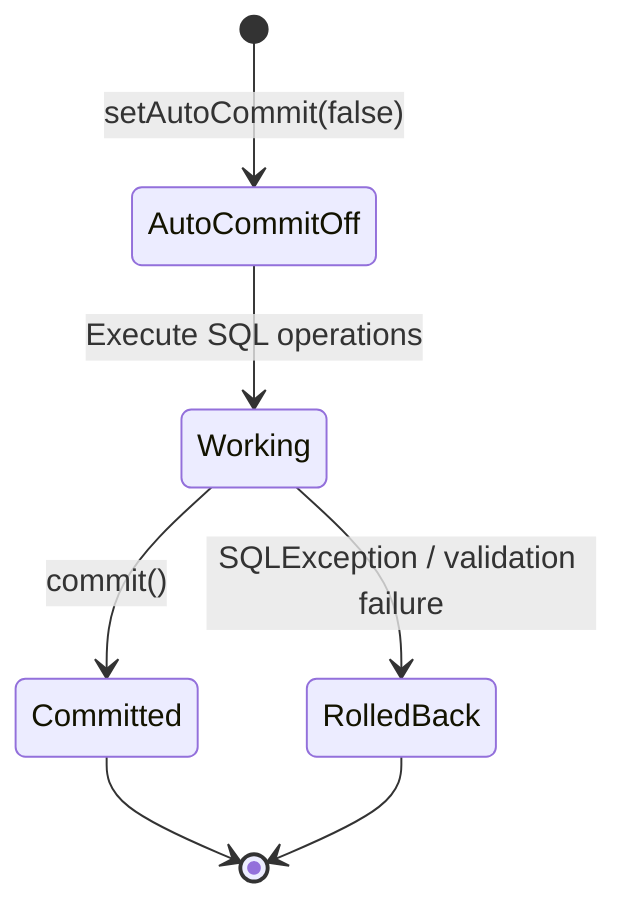
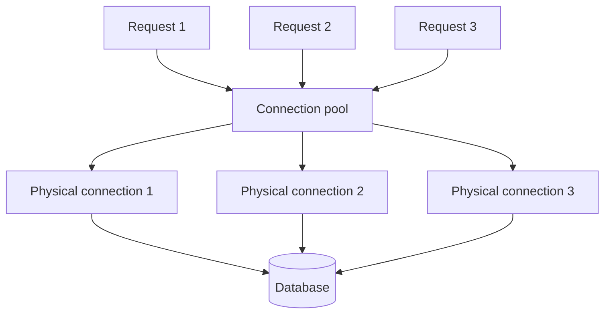

# Core Java Reference Material

> # JDBC

🏚️ [Home](index.md) 🔸 ⬅️ Previous: [Collections](collections.md)

## Table of Contents

- [1. What Is JDBC?](#1-what-is-jdbc)
- [2. Why Is JDBC Used?](#2-why-is-jdbc-used)
- [3. JDBC Architecture](#3-jdbc-architecture)
- [4. JDBC Driver Types](#4-jdbc-driver-types)
- [5. Important Interfaces and Classes](#5-important-interfaces-and-classes)
- [6. Database Connectivity Steps](#6-database-connectivity-steps)
- [7. Database Connection Example](#7-database-connection-example)
- [8. Statement](#8-statement)
- [9. PreparedStatement](#9-preparedstatement)
- [10. Common PreparedStatement Methods](#10-common-preparedstatement-methods)
- [11. Statement Execution Methods](#11-statement-execution-methods)
- [12. ResultSet](#12-resultset)
- [13. CRUD Operations](#13-crud-operations)
- [14. Generated Keys](#14-generated-keys)
- [15. Transaction Management](#15-transaction-management)
- [16. Batch Processing](#16-batch-processing)
- [17. CallableStatement](#17-callablestatement)
- [18. Exception Handling](#18-exception-handling)
- [19. Try-With-Resources](#19-try-with-resources)
- [20. DriverManager vs DataSource](#20-drivermanager-vs-datasource)
- [21. JDBC Best Practices](#21-jdbc-best-practices)
- [22. Common JDBC Errors](#22-common-jdbc-errors)
- [23. Frequently Asked Interview Questions](#23-frequently-asked-interview-questions)

## 1. What Is JDBC?

**JDBC** stands for **Java Database Connectivity**.

It is a standard Java API used to connect Java applications with relational databases such as:

- MySQL
- Oracle
- PostgreSQL
- Microsoft SQL Server
- MariaDB

JDBC APIs are mainly available in the `java.sql` and `javax.sql` packages.

[↑ Go to Table of Contents](#table-of-contents)

## 2. Why Is JDBC Used?

JDBC allows a Java application to:

- Establish a database connection
- Execute SQL statements
- Insert, update, delete, and retrieve records
- Execute stored procedures
- Manage transactions
- Process database errors

[↑ Go to Table of Contents](#table-of-contents)

## 3. JDBC Architecture

```text
Java Application
       |
       v
    JDBC API
       |
       v
  JDBC Driver
       |
       v
    Database
```

The JDBC API provides standard interfaces, while the database-specific JDBC driver translates JDBC calls into commands understood by the database.

[↑ Go to Table of Contents](#table-of-contents)

## 4. JDBC Driver Types

### Type 1: JDBC–ODBC Bridge Driver

Converts JDBC calls into ODBC calls.

- Requires an ODBC driver
- Platform-dependent
- Removed from Java 8

### Type 2: Native API Driver

Uses database-specific native libraries.

- Faster than Type 1
- Platform-dependent
- Requires native installation

### Type 3: Network Protocol Driver

Sends JDBC requests to middleware, which communicates with the database.

- Does not require native libraries
- Requires a middleware server

### Type 4: Thin Driver

Directly converts JDBC calls into the database protocol.

- Pure Java implementation
- Platform-independent
- Commonly used in modern applications

[↑ Go to Table of Contents](#table-of-contents)

## 5. Important Interfaces and Classes

| Component | Purpose |
| --- | --- |
| `DriverManager` | Establishes database connections |
| `DataSource` | Provides connections, usually through a connection pool |
| `Connection` | Represents an active database connection |
| `Statement` | Executes simple static SQL statements |
| `PreparedStatement` | Executes parameterized SQL statements |
| `CallableStatement` | Executes stored procedures |
| `ResultSet` | Stores data returned by a query |
| `SQLException` | Represents database-related errors |
| `DatabaseMetaData` | Provides database information |
| `ResultSetMetaData` | Provides information about query-result columns |

[↑ Go to Table of Contents](#table-of-contents)

## 6. Database Connectivity Steps

A typical JDBC program performs the following operations:

1. Add the JDBC driver dependency.
2. Establish a connection.
3. Create a statement.
4. Execute an SQL command.
5. Process the result.
6. Close JDBC resources.

[↑ Go to Table of Contents](#table-of-contents)

## 7. Database Connection Example

```java
import java.sql.Connection;
import java.sql.DriverManager;
import java.sql.SQLException;

public class DatabaseConnectionExample {

    private static final String URL =
            "jdbc:mysql://localhost:3306/training_db";

    private static final String USERNAME = "root";
    private static final String PASSWORD = "root";

    public static void main(String[] args) {

        try (Connection connection =
                     DriverManager.getConnection(
                             URL, USERNAME, PASSWORD)) {

            System.out.println("Database connected successfully.");

        } catch (SQLException exception) {
            exception.printStackTrace();
        }
    }
}
```

### Connection URL Format

```text
jdbc:mysql://hostname:port/database_name
```

Example:

```text
jdbc:mysql://localhost:3306/training_db
```

### Driver Loading

Older JDBC programs explicitly loaded the driver:

```java
Class.forName("com.mysql.cj.jdbc.Driver");
```

This is normally unnecessary with JDBC 4.0 and later because suitable drivers are automatically discovered.

[↑ Go to Table of Contents](#table-of-contents)

## 8. Statement

A `Statement` executes ordinary SQL commands.

```java
String sql = "SELECT employee_id, employee_name FROM employee";

try (Statement statement = connection.createStatement();
     ResultSet resultSet = statement.executeQuery(sql)) {

    while (resultSet.next()) {
        int id = resultSet.getInt("employee_id");
        String name = resultSet.getString("employee_name");

        System.out.println(id + " - " + name);
    }
}
```

Avoid using `Statement` to combine untrusted input with SQL.

```java
// Unsafe
String sql = "SELECT * FROM users WHERE username = '"
        + username + "'";
```

This can introduce an SQL injection vulnerability.

[↑ Go to Table of Contents](#table-of-contents)

## 9. PreparedStatement

A `PreparedStatement` represents a precompiled, parameterized SQL statement.

```java
String sql = """
        INSERT INTO employee
        (employee_name, salary)
        VALUES (?, ?)
        """;

try (PreparedStatement statement =
             connection.prepareStatement(sql)) {

    statement.setString(1, "Anita Sharma");
    statement.setBigDecimal(
            2, new BigDecimal("45000.00"));

    int rowsAffected = statement.executeUpdate();

    System.out.println(rowsAffected + " record inserted.");
}
```

The first placeholder has index `1`, not `0`.

### Advantages

- Helps prevent SQL injection
- Supports parameterized queries
- Improves readability
- Handles Java-to-SQL value conversion
- May improve performance when executed repeatedly

[↑ Go to Table of Contents](#table-of-contents)

## 10. Common PreparedStatement Methods

| Method | SQL type |
| --- | --- |
| `setInt()` | Integer value |
| `setLong()` | Long value |
| `setString()` | Character value |
| `setDouble()` | General value |
| `setBigDecimal()` | Decimal value |
| `setBoolean()` | Boolean value |
| `setDate()` | SQL date |
| `setTimestamp()` | SQL date and time |

With modern JDBC drivers, Java time objects can often be passed using `setObject()`:

```java
statement.setObject(1, LocalDate.now());
statement.setObject(2, LocalDateTime.now());
```

[↑ Go to Table of Contents](#table-of-contents)

## 11. Statement Execution Methods

| Method | Purpose | Return type |
| --- | --- | --- |
| `executeQuery()` | Executes `SELECT` | `ResultSet` |
| `executeUpdate()` | Executes `INSERT`, `UPDATE`, or `DELETE` | `int` |
| `execute()` | Executes an unknown or mixed SQL command | `boolean` |
| `executeBatch()` | Executes a collection of commands | `int[]` |

Example:

```java
int affectedRows = statement.executeUpdate();
```

The returned integer normally indicates the number of affected rows.

[↑ Go to Table of Contents](#table-of-contents)

## 12. ResultSet

A `ResultSet` stores records returned by a `SELECT` query.

Initially, its cursor is positioned before the first record.

```java
while (resultSet.next()) {
    int id = resultSet.getInt("employee_id");
    String name = resultSet.getString("employee_name");
}
```

The `next()` method:

- Moves the cursor to the next row
- Returns `true` when a row exists
- Returns `false` after the final row

Values can be accessed by column name:

```java
resultSet.getString("employee_name");
```

They can also be accessed by column position:

```java
resultSet.getString(2);
```

Column names are generally easier to understand and maintain.

[↑ Go to Table of Contents](#table-of-contents)

## 13. CRUD Operations

CRUD stands for:

| Operation | SQL command |
| --- | --- |
| Create | `INSERT` |
| Read | `SELECT` |
| Update | `UPDATE` |
| Delete | `DELETE` |

[↑ Go to Table of Contents](#table-of-contents)

## 14. Generated Keys

Generated primary-key values can be retrieved after an insertion.

```java
String sql = """
        INSERT INTO employee
        (employee_name, salary)
        VALUES (?, ?)
        """;

try (PreparedStatement statement =
             connection.prepareStatement(
                     sql, Statement.RETURN_GENERATED_KEYS)) {

    statement.setString(1, "Rahul Verma");
    statement.setBigDecimal(
            2, new BigDecimal("50000.00"));

    statement.executeUpdate();

    try (ResultSet keys = statement.getGeneratedKeys()) {
        if (keys.next()) {
            long employeeId = keys.getLong(1);
            System.out.println("Generated ID: " + employeeId);
        }
    }
}
```

[↑ Go to Table of Contents](#table-of-contents)

## 15. Transaction Management

A transaction is a group of database operations treated as one logical unit.

A transaction should either:

- Complete all operations successfully, or
- Undo all operations when any operation fails

JDBC connections normally use auto-commit mode by default.

```java
connection.setAutoCommit(false);
```

### Transaction Example

```java
try {
    connection.setAutoCommit(false);

    debitStatement.executeUpdate();
    creditStatement.executeUpdate();

    connection.commit();

} catch (SQLException exception) {

    connection.rollback();
    throw exception;

} finally {
    connection.setAutoCommit(true);
}
```

### Important Methods

| Method | Purpose |
| --- | --- |
| `setAutoCommit(false)` | Begins manual transaction management |
| `commit()` | Permanently saves changes |
| `rollback()` | Cancels changes made in the transaction |

[↑ Go to Table of Contents](#table-of-contents)

## 16. Batch Processing

Batch processing sends multiple SQL operations together.

```java
String sql = """
        INSERT INTO employee
        (employee_name, salary)
        VALUES (?, ?)
        """;

try (PreparedStatement statement =
             connection.prepareStatement(sql)) {

    statement.setString(1, "Amit");
    statement.setBigDecimal(
            2, new BigDecimal("40000.00"));
    statement.addBatch();

    statement.setString(1, "Neha");
    statement.setBigDecimal(
            2, new BigDecimal("42000.00"));
    statement.addBatch();

    int[] results = statement.executeBatch();

    System.out.println(results.length + " operations executed.");
}
```

Batch processing is useful for bulk insert, update, and delete operations.

[↑ Go to Table of Contents](#table-of-contents)

## 17. CallableStatement

A `CallableStatement` executes stored procedures.

```java
String sql = "{call find_employee_by_id(?)}";

try (CallableStatement statement =
             connection.prepareCall(sql)) {

    statement.setInt(1, 101);

    try (ResultSet resultSet = statement.executeQuery()) {
        while (resultSet.next()) {
            System.out.println(
                    resultSet.getString("employee_name"));
        }
    }
}
```

[↑ Go to Table of Contents](#table-of-contents)

## 18. Exception Handling

JDBC operations can throw `SQLException`.

```java
catch (SQLException exception) {
    System.out.println("Message: "
            + exception.getMessage());

    System.out.println("SQL state: "
            + exception.getSQLState());

    System.out.println("Error code: "
            + exception.getErrorCode());
}
```

| Method | Information |
| --- | --- |
| `getMessage()` | Human-readable error description |
| `getSQLState()` | Standard SQL state code |
| `getErrorCode()` | Vendor-specific error code |
| `getNextException()` | Next exception in the exception chain |

[↑ Go to Table of Contents](#table-of-contents)

## 19. Try-With-Resources

Try-with-resources automatically closes JDBC resources.

```java
try (Connection connection =
             DriverManager.getConnection(url, username, password);

     PreparedStatement statement =
             connection.prepareStatement(sql);

     ResultSet resultSet =
             statement.executeQuery()) {

    while (resultSet.next()) {
        System.out.println(resultSet.getString(1));
    }
}
```

Resources are normally closed in reverse order:

1. `ResultSet`
2. `Statement`
3. `Connection`

[↑ Go to Table of Contents](#table-of-contents)

## 20. DriverManager vs DataSource

| `DriverManager` | `DataSource` |
| --- | --- |
| Suitable for basic learning | Preferred in enterprise applications |
| Creates connections directly | Can support connection pooling |
| Configuration is usually written in code | Configuration can be externalized |
| Limited enterprise features | Can support transactions and managed environments |

Spring Boot applications usually obtain connections through a configured `DataSource`.

[↑ Go to Table of Contents](#table-of-contents)

## 21. JDBC Best Practices

- Use `PreparedStatement` instead of concatenating input into SQL.
- Use try-with-resources.
- Use transactions for related write operations.
- Roll back the transaction when an operation fails.
- Use batch processing for bulk operations.
- Avoid storing database credentials directly in source code.
- Use a connection pool in production applications.
- Retrieve only required columns.
- Use pagination for large result sets.
- Match Java data types with appropriate SQL types.
- Log errors without exposing passwords or sensitive information.
- Keep SQL and database code separate from presentation logic.

[↑ Go to Table of Contents](#table-of-contents)

## 22. Common JDBC Errors

| Problem | Possible reason |
| --- | --- |
| `No suitable driver` | Driver dependency is missing or URL is incorrect |
| `Access denied` | Invalid username, password, or permissions |
| `Unknown database` | Database name is incorrect |
| `Communications link failure` | Server is stopped, unreachable, or using another port |
| Parameter index out of range | Incorrect `?` placeholder index |
| ResultSet is closed | Statement or connection was closed too early |
| Data truncation | Java value is larger than the SQL column permits |

[↑ Go to Table of Contents](#table-of-contents)

## 23. Frequently Asked Interview Questions

> ### Fundamental Questions

### What is JDBC?

JDBC is a standard Java API for interacting with relational databases. It allows a Java program to:

- establish a database connection;
- send SQL statements;
- read query results;
- perform insert, update, and delete operations;
- call stored procedures; and
- control database transactions.

JDBC is an API, not a database and not a driver. The database vendor normally supplies the JDBC driver implementation.

### Why is JDBC required?

Java applications should not need completely different programming APIs for MySQL, PostgreSQL, Oracle, or another relational database. JDBC defines common interfaces such as `Connection`, `PreparedStatement`, and `ResultSet`. A vendor-specific driver implements those interfaces for its database.

The SQL dialect and database behavior can still differ between vendors, so JDBC improves portability but does not make every SQL statement vendor-neutral.

### Which packages are important in JDBC?

| Package | Main purpose |
| --- | --- |
| `java.sql` | Core JDBC types such as `Connection`, `Statement`, `ResultSet`, and `SQLException` |
| `javax.sql` | `DataSource`, connection pooling support, distributed transaction support, and `RowSet` |

### What is a JDBC driver?

A JDBC driver is a software component that implements JDBC interfaces and translates JDBC operations into the protocol understood by a particular database.

For example, the Java application calls `PreparedStatement.executeQuery()`. The database driver converts that request to the database's wire protocol, sends it to the server, and converts the response into a JDBC `ResultSet`.

### What are the four types of JDBC drivers?

| Type | Name | Description | Current relevance |
| --- | --- | --- | --- |
| Type 1 | JDBC–ODBC bridge | Converts JDBC calls to ODBC calls | Obsolete; removed from the JDK |
| Type 2 | Native API driver | Uses database-specific native libraries | Platform-dependent |
| Type 3 | Network protocol driver | Sends calls through middleware | Rare in modern applications |
| Type 4 | Thin/pure Java driver | Communicates directly with the database protocol | Most commonly used |

### What are the basic steps in a JDBC program?

1. Add the appropriate JDBC driver dependency.
2. Obtain a `Connection` using a `DataSource` or `DriverManager`.
3. Create a `PreparedStatement`, `Statement`, or `CallableStatement`.
4. Execute the SQL operation.
5. Process the `ResultSet` or update count.
6. Commit or roll back the transaction when necessary.
7. Close JDBC resources, preferably with try-with-resources.

### Is `Class.forName()` required to load a JDBC driver?

Usually, no. JDBC 4.0 and later support automatic driver discovery when a compliant driver JAR is on the classpath or module path. Older programs often contain code such as:

```java
Class.forName("com.example.jdbc.Driver");
```

This explicit loading may still appear in legacy code or unusual environments, but it is normally unnecessary in a modern Java application.

### What is a JDBC URL?

A JDBC URL tells the driver how to reach a database. Its general form is:

```text
jdbc:<subprotocol>:<database-specific-details>
```

Example pattern:

```text
jdbc:vendor://host:port/database
```

The exact URL syntax and supported options are driver-specific.

### What is `DriverManager`?

`DriverManager` is a JDBC class that asks registered drivers to create a database connection for a JDBC URL.

```java
try (Connection connection = DriverManager.getConnection(url, username, password)) {
    // Use the connection.
}
```

It is convenient for learning, command-line programs, and small utilities. Enterprise applications generally prefer `DataSource` because it supports configuration and connection pooling more cleanly.

### What is a `DataSource`?

`DataSource` is an interface representing a source of database connections. It is generally preferred over `DriverManager` because it can:

- separate connection configuration from application code;
- work with connection pools;
- be managed by a framework or application server; and
- support advanced transaction environments.

Calling `dataSource.getConnection()` may return a pooled logical connection rather than creating a new physical database connection every time.

> ### Connection and Statement Questions

### What is the `Connection` interface?

`Connection` represents an active session with a database. It is used to create statements, control transactions, inspect metadata, and configure session-related properties.

Common methods include:

```java
prepareStatement(sql)
prepareCall(sql)
setAutoCommit(false)
commit()
rollback()
getMetaData()
close()
```

### What is the difference between `Statement`, `PreparedStatement`, and `CallableStatement`?

| Interface | Main use | Parameters | Typical example |
| --- | --- | --- | --- |
| `Statement` | Static SQL with no input values | Values are embedded in SQL | DDL or a fixed administrative query |
| `PreparedStatement` | Parameterized SQL executed one or more times | Uses `?` placeholders | CRUD operations |
| `CallableStatement` | Stored procedures and functions | Supports IN, OUT, and INOUT parameters | Calling database routines |

For normal application SQL, `PreparedStatement` is usually the safest default.

### Why is `PreparedStatement` preferred over `Statement`?

`PreparedStatement` offers three important benefits:

- **Security:** Values are bound separately from SQL syntax, helping prevent SQL injection.
- **Clarity:** The SQL structure is easier to read than manually concatenated values.
- **Potential performance:** A database or driver may reuse the parsed or compiled execution plan, especially when a statement is executed repeatedly.

### How does `PreparedStatement` help prevent SQL injection?

The SQL structure and parameter values are sent separately. A value supplied to a placeholder is treated as data rather than executable SQL syntax.

```java
String sql = "SELECT user_id, username FROM users WHERE username = ?";

try (PreparedStatement ps = connection.prepareStatement(sql)) {
    ps.setString(1, suppliedUsername);

    try (ResultSet rs = ps.executeQuery()) {
        // Process results.
    }
}
```

Placeholders can represent values, not arbitrary table names, column names, or SQL keywords. Dynamic identifiers must be selected from a trusted allowlist.

### Does `PreparedStatement` always improve performance?

No. It may improve performance when the same SQL structure is executed repeatedly, but the actual benefit depends on the driver, database, server-side statement cache, and connection configuration. Its security and maintainability benefits remain important even if execution-plan reuse does not occur.

### Can a `PreparedStatement` be reused?

Yes, while its connection and the statement remain open. Parameter values can be changed and the statement executed again.

```java
String sql = "UPDATE employee SET salary = ? WHERE employee_id = ?";

try (PreparedStatement ps = connection.prepareStatement(sql)) {
    for (SalaryChange change : changes) {
        ps.setBigDecimal(1, change.salary());
        ps.setLong(2, change.employeeId());
        ps.addBatch();
    }
    ps.executeBatch();
}
```

### What do parameter indexes start with in JDBC?

JDBC parameter indexes start at **1**, not 0.

```java
ps.setString(1, name);
ps.setInt(2, departmentId);
```

The same one-based rule is used by methods such as `ResultSet.getString(int)`.

### What is the difference between `executeQuery()`, `executeUpdate()`, and `execute()`?

| Method | Use | Return value |
| --- | --- | --- |
| `executeQuery()` | SQL expected to return one `ResultSet`, normally `SELECT` | `ResultSet` |
| `executeUpdate()` | `INSERT`, `UPDATE`, `DELETE`, and commonly DDL | Affected-row count; DDL often returns 0 |
| `execute()` | SQL whose first result type is not known or may produce multiple results | `true` if the first result is a `ResultSet`; otherwise `false` |

### What is `CallableStatement`?

`CallableStatement` is used to call database stored procedures or functions. It extends `PreparedStatement` and supports input and output parameters.

```java
try (CallableStatement cs = connection.prepareCall("{call calculate_bonus(?, ?)}")) {
    cs.setLong(1, employeeId);
    cs.registerOutParameter(2, Types.DECIMAL);
    cs.execute();
    BigDecimal bonus = cs.getBigDecimal(2);
}
```

Stored procedure syntax and behavior can vary by database.

### Are JDBC objects thread-safe?

An application should not assume that `Connection`, `Statement`, or `ResultSet` is safe for concurrent use. A common design is to give each request or unit of work its own connection and keep the statement and result set confined to that thread. A connection pool manages physical connections; it does not make one borrowed connection suitable for simultaneous use by multiple threads.

> ### ResultSet and Metadata Questions

### What is a `ResultSet`?

`ResultSet` represents tabular data returned by a query. It maintains a cursor that initially points before the first row. Calling `next()` moves the cursor to the next row and returns `true` if that row exists.

```java
while (resultSet.next()) {
    long id = resultSet.getLong("employee_id");
    String name = resultSet.getString("employee_name");
}
```

### Why must `next()` be called before reading a `ResultSet` row?

The cursor initially sits before the first row. Getter methods cannot read a row until `next()` moves the cursor to a valid record. An empty result causes the first `next()` call to return `false`.

### What are the main `ResultSet` types?

| Type | Cursor behavior |
| --- | --- |
| `TYPE_FORWARD_ONLY` | Moves forward only; usually the most efficient |
| `TYPE_SCROLL_INSENSITIVE` | Can move in both directions; generally does not reflect later database changes |
| `TYPE_SCROLL_SENSITIVE` | Can move in both directions and may reflect later changes |

Actual support depends on the JDBC driver and database. Use `DatabaseMetaData` to check capabilities.

### What are the `ResultSet` concurrency modes?

- `CONCUR_READ_ONLY` — rows can be read but not updated through the `ResultSet`.
- `CONCUR_UPDATABLE` — rows may be updated through the `ResultSet` when the driver and query support it.

Explicit SQL `UPDATE` statements are generally clearer and more portable than updatable result sets.

### What is `ResultSet` holdability?

Holdability controls whether a result-set cursor remains open after a transaction is committed:

- `HOLD_CURSORS_OVER_COMMIT`
- `CLOSE_CURSORS_AT_COMMIT`

Driver support and default behavior can be inspected through JDBC metadata.

### Should columns be read by index or label?

Both are valid:

```java
String nameByIndex = rs.getString(2);
String nameByLabel = rs.getString("employee_name");
```

Indexes can be slightly more compact, but labels are usually easier to understand and safer when a query changes column order. SQL aliases can provide stable, meaningful labels.

### How is SQL `NULL` handled in a `ResultSet`?

Object-based getters normally return `null`. Primitive getters such as `getInt()` return the primitive default value, such as 0, for SQL `NULL`. Call `wasNull()` immediately after the getter to distinguish a real zero from `NULL`.

```java
int managerId = rs.getInt("manager_id");
Integer manager = rs.wasNull() ? null : managerId;
```

Alternatively, a driver supporting the required mapping may allow an object type through `getObject()`.

### What is `ResultSetMetaData`?

`ResultSetMetaData` describes the columns in a query result. It can provide the number of columns, labels, database types, precision, scale, and nullability. It is useful for generic reporting, database tools, and dynamic table rendering.

### What is `DatabaseMetaData`?

`DatabaseMetaData` describes the database and driver capabilities. It can provide information about tables, columns, primary keys, supported SQL features, supported result-set types, and database product information.

### How do you retrieve an auto-generated key?

Ask JDBC to return generated keys when preparing the statement:

```java
String sql = "INSERT INTO employee(employee_name) VALUES (?)";

try (PreparedStatement ps = connection.prepareStatement(
        sql, Statement.RETURN_GENERATED_KEYS)) {
    ps.setString(1, "Anita");
    ps.executeUpdate();

    try (ResultSet keys = ps.getGeneratedKeys()) {
        if (keys.next()) {
            long employeeId = keys.getLong(1);
        }
    }
}
```

Exact support varies by database and driver.

> ### Transaction Interview Questions

### Transaction Flow



### What is a database transaction?

A transaction is a logical unit of work containing one or more database operations. The operations should either all succeed or be undone together. Transactions help provide the ACID properties: atomicity, consistency, isolation, and durability.

### What is auto-commit mode?

New JDBC connections are normally in auto-commit mode. Each individual SQL statement is committed automatically after successful completion. To group several statements in one transaction, call:

```java
connection.setAutoCommit(false);
```

Then explicitly call `commit()` or `rollback()`.

### What is the difference between `commit()` and `rollback()`?

- `commit()` permanently completes the current transaction.
- `rollback()` undoes uncommitted changes made in the current transaction.

They are used when auto-commit has been disabled.

### What is a `Savepoint`?

A savepoint marks a position inside a transaction. Rolling back to it undoes changes made after the savepoint without necessarily discarding all earlier work in the transaction.

```java
Savepoint afterOrder = connection.setSavepoint("after_order");

try {
    // Insert optional audit or reward data.
} catch (SQLException exception) {
    connection.rollback(afterOrder);
}
```

Use savepoints carefully; business requirements usually determine whether partial recovery is valid.

### What transaction isolation levels does JDBC define?

| JDBC constant | Dirty reads | Non-repeatable reads | Phantom reads |
| --- | ---: | ---: | ---: |
| `TRANSACTION_READ_UNCOMMITTED` | Possible | Possible | Possible |
| `TRANSACTION_READ_COMMITTED` | Prevented | Possible | Possible |
| `TRANSACTION_REPEATABLE_READ` | Prevented | Prevented | Possible |
| `TRANSACTION_SERIALIZABLE` | Prevented | Prevented | Prevented |

JDBC also defines `TRANSACTION_NONE` for a driver that does not support transactions. Database implementations may use locking or multiversion concurrency control, so exact behavior must be checked for the selected database.

### What are dirty reads, non-repeatable reads, and phantom reads?

- **Dirty read:** A transaction reads another transaction's uncommitted data.
- **Non-repeatable read:** Reading the same row twice produces different committed values because another transaction updated or deleted it.
- **Phantom read:** Repeating a range query returns a different set of rows because another transaction inserted or removed matching rows.

### Show the correct JDBC transaction pattern.

```java
boolean previousAutoCommit = connection.getAutoCommit();

try {
    connection.setAutoCommit(false);

    debitAccount(connection, fromAccount, amount);
    creditAccount(connection, toAccount, amount);

    connection.commit();
} catch (SQLException exception) {
    try {
        connection.rollback();
    } catch (SQLException rollbackFailure) {
        exception.addSuppressed(rollbackFailure);
    }
    throw exception;
} finally {
    connection.setAutoCommit(previousAutoCommit);
}
```

With a connection pool, resetting the connection state before returning the connection is important. Mature pools usually perform defensive cleanup, but application code should still use clear transaction boundaries.

### Why should a transaction be kept short?

Long transactions retain database resources, may hold locks or old row versions, increase contention, and make rollback more expensive. Do required validation before opening the transaction where safe, avoid user interaction while a transaction is open, and commit or roll back promptly.

### Can DDL statements be rolled back?

It depends on the database. Some databases support transactional DDL, while others implicitly commit around certain DDL statements. This is database-specific behavior rather than a guarantee provided uniformly by JDBC.

### How should deadlocks be handled?

The database detects a deadlock and aborts one transaction. The application should:

1. roll back the failed transaction;
2. inspect the database-specific SQL state or error classification;
3. retry the entire transaction only when the failure is classified as transient;
4. limit retries and add a small backoff; and
5. keep updates in a consistent order to reduce deadlock probability.

Never retry only the last statement when the entire transaction has been rolled back.

> ### Resource Management, Performance, and Error Handling

### What is try-with-resources, and why is it important in JDBC?

Try-with-resources automatically closes objects implementing `AutoCloseable`, including JDBC connections, statements, and result sets. Resources are closed in reverse declaration order, even when an exception occurs.

```java
String sql = "SELECT employee_id, employee_name FROM employee WHERE department_id = ?";

try (Connection connection = dataSource.getConnection();
     PreparedStatement ps = connection.prepareStatement(sql)) {

    ps.setInt(1, departmentId);

    try (ResultSet rs = ps.executeQuery()) {
        while (rs.next()) {
            // Map the current row.
        }
    }
}
```

### In what order should JDBC resources be closed?

Close them in the reverse order in which they were created:

1. `ResultSet`
2. `Statement` or `PreparedStatement`
3. `Connection`

Try-with-resources handles this order naturally. Closing a connection may close its statements and result sets, but explicitly scoped resource management is clearer and more reliable.

### What information does `SQLException` provide?

`SQLException` can provide:

- a human-readable message through `getMessage()`;
- a standard or vendor-defined SQL state through `getSQLState()`;
- a vendor-specific error code through `getErrorCode()`; and
- chained database exceptions through `getNextException()`.

Do not expose sensitive SQL, credentials, or personal data in user-facing error messages or logs.

### What is batch processing in JDBC?

Batch processing sends a group of similar SQL operations together, which can reduce network round trips.

```java
String sql = "INSERT INTO attendance(employee_id, attendance_date, status) VALUES (?, ?, ?)";

try (PreparedStatement ps = connection.prepareStatement(sql)) {
    for (Attendance item : attendanceItems) {
        ps.setLong(1, item.employeeId());
        ps.setObject(2, item.date());
        ps.setString(3, item.status());
        ps.addBatch();
    }

    int[] counts = ps.executeBatch();
}
```

For large inputs, execute manageable chunks rather than accumulating an unlimited batch in memory.

### What happens when part of a batch fails?

The driver may throw `BatchUpdateException`. Its `getUpdateCounts()` method reports results for commands processed before or around the failure, depending on driver behavior. If atomicity is required, run the batch inside a transaction and roll back the whole transaction when any item fails.

### What is connection pooling?

Connection pooling maintains reusable physical database connections. Borrowing a connection is normally cheaper than opening a new network connection and authenticating for every operation.



Calling `close()` on a pooled logical connection normally returns it to the pool rather than closing the underlying physical connection.

### What is fetch size?

Fetch size is a hint about how many rows the driver should retrieve from the database at a time.

```java
preparedStatement.setFetchSize(500);
```

It can help when processing large result sets, but exact behavior is driver-specific. Fetch size does not limit the total number of rows returned. Use SQL pagination or a row limit when the result itself must be restricted.

### How can JDBC handle large data efficiently?

Good practices include:

- select only required columns and rows;
- use appropriate indexes and efficient SQL;
- use a suitable fetch size where the driver supports streaming or incremental fetching;
- process rows one at a time instead of storing the entire result;
- use batch operations for repeated writes;
- bind large binary or character data as streams; and
- keep transactions short.

### What are BLOB and CLOB?

- **BLOB** stores large binary data such as documents or images.
- **CLOB** stores large character data.

JDBC provides types and streaming methods such as `Blob`, `Clob`, `getBinaryStream()`, `getCharacterStream()`, `setBinaryStream()`, and `setCharacterStream()`. Streaming can avoid loading the entire value into memory.

### How should Java date and time values be used with JDBC?

JDBC 4.2 supports modern `java.time` types through `setObject()` and `getObject()` when the driver supports the mapping.

```java
LocalDate joiningDate = LocalDate.of(2026, 8, 11);
ps.setObject(1, joiningDate);

LocalDate storedDate = rs.getObject("joining_date", LocalDate.class);
```

Typical conceptual mappings are:

| SQL type | Common Java type |
| --- | --- |
| `DATE` | `LocalDate` |
| `TIME` | `LocalTime` |
| `TIMESTAMP` | `LocalDateTime` |
| Time-zone-aware timestamp | `OffsetDateTime`, subject to database/driver support |

Define a clear application time-zone policy. Do not assume that a time-zone-free SQL timestamp represents UTC unless the application explicitly establishes that convention.

> ### Scenario-Based Interview Questions

### A money transfer debits one account but fails before crediting the other. How would you prevent inconsistent data?

Disable auto-commit, execute both updates on the same connection, verify the affected-row counts, and commit only when both operations succeed. Roll back the entire transaction for any SQL or business validation failure.

### A login query is built using string concatenation. What is the risk and solution?

The risk is SQL injection. Replace concatenation with a `PreparedStatement` and bind the username and other values as parameters. Passwords should be verified using a secure password-hashing design, not by storing or comparing plaintext passwords.

### A report contains millions of rows and causes an out-of-memory error. What would you change?

Do not collect every row into a list. Restrict the query when possible, configure driver-appropriate incremental fetching, process each row as it arrives, write output progressively, and close resources promptly. For an interactive UI, use pagination rather than returning millions of records.

### An update reports 0 affected rows. Does it always mean an error?

No. It may mean that no row matched the `WHERE` condition. Some database and driver configurations may also report update counts based on changed rows rather than matched rows. The application must define what count is expected—for example, a transfer update should normally affect exactly one account row.

### Should a DAO open a new connection inside every small helper method?

Not when several DAO operations belong to one transaction. The transaction owner should obtain one connection and allow all participating operations to use it, or use framework-managed transaction context. Otherwise, each helper could run in a separate transaction and break atomicity.

### How would you insert 100,000 rows?

Use a parameterized `PreparedStatement`, add rows to reasonably sized batches, execute and clear batches periodically, and manage the operation in transactions sized appropriately for the database. Monitor memory, transaction-log growth, lock duration, and driver-specific bulk-loading options.

### Why is `SELECT *` discouraged in application queries?

It transfers columns the application may not need, makes mapping dependent on schema changes, can prevent some covering-index optimizations, and makes the query contract less clear. List required columns explicitly.

### Can one `Connection` be shared by all requests to improve performance?

No. A single shared connection becomes a concurrency bottleneck and mixes transaction state between requests. Use a bounded connection pool and borrow one connection per unit of work.

### Why should credentials not be hard-coded in Java source?

Source code may be committed, copied, logged, or distributed. Credentials should come from protected runtime configuration or a secrets-management facility, with least-privilege database accounts and regular rotation.

[↑ Go to Table of Contents](#table-of-contents)

---

🏚️ [Home](index.md) 🔸 ⬅️ Previous: [Collections](collections.md)
