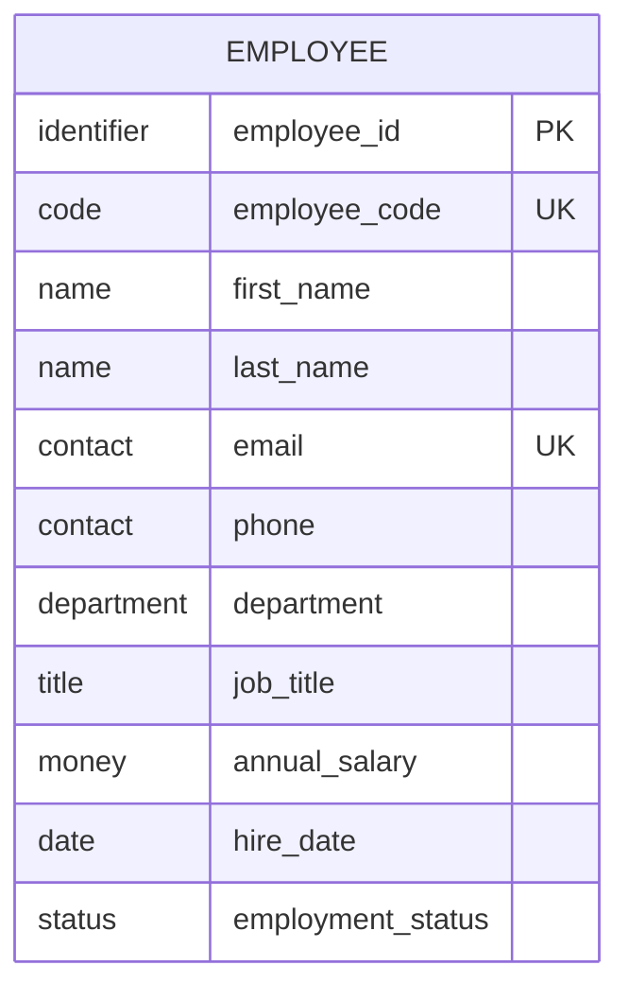
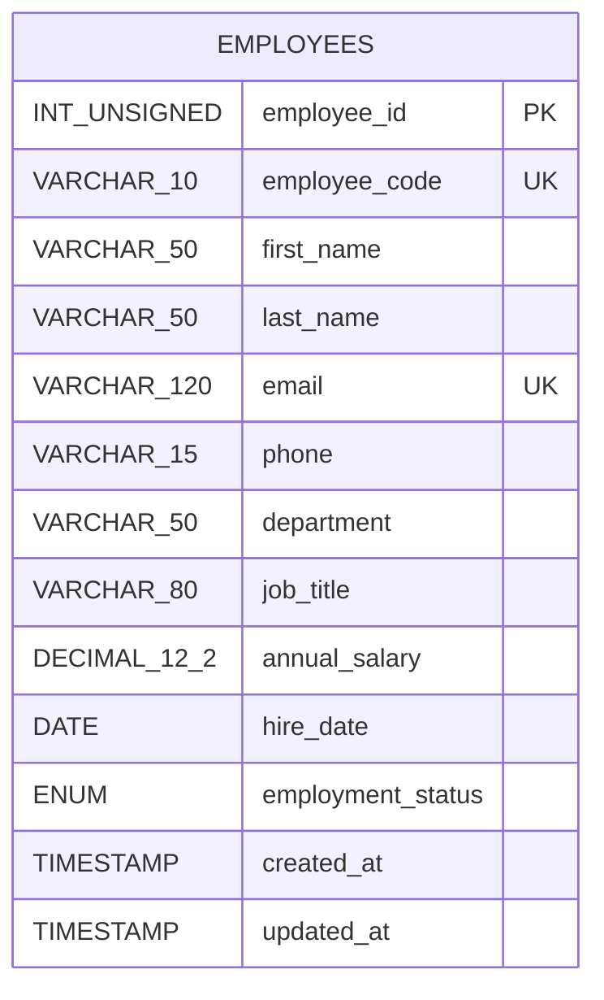

# MySQL Employee Data: ER Diagrams and SQL Practice Workbook

This workbook provides a single-table employee dataset for practising:

- `CREATE DATABASE` and `CREATE TABLE`
- `INSERT`
- `SELECT`
- `UPDATE`
- `DELETE`

The examples use MySQL syntax. Run them in a dedicated practice database, not against production data.

---

## 1. Logical ER Diagram

The logical model describes the business entity and its attributes without committing to MySQL-specific data types.



### Logical business rules

1. Every employee has one system-generated identifier.
2. Every employee has a unique employee code.
3. Every employee has a unique email address.
4. First name, last name, department, job title, salary, and hire date are required.
5. Phone number is optional.
6. Annual salary cannot be negative.
7. Employment status must be `ACTIVE`, `ON_LEAVE`, `RESIGNED`, or `TERMINATED`.

> This is intentionally a single-table model for SQL practice. In a larger production system, departments and job titles would commonly be modelled as separate tables.

---

## 2. Physical ER Diagram

The physical model shows the actual MySQL table, column names, types, keys, and constraints.



### Physical rules

| Column | MySQL definition | Rule |
|---|---|---|
| `employee_id` | `INT UNSIGNED` | Primary key and auto-incremented |
| `employee_code` | `VARCHAR(10)` | Required and unique |
| `first_name` | `VARCHAR(50)` | Required |
| `last_name` | `VARCHAR(50)` | Required |
| `email` | `VARCHAR(120)` | Required and unique |
| `phone` | `VARCHAR(15)` | Optional |
| `department` | `VARCHAR(50)` | Required |
| `job_title` | `VARCHAR(80)` | Required |
| `annual_salary` | `DECIMAL(12,2)` | Required and non-negative |
| `hire_date` | `DATE` | Required |
| `employment_status` | `ENUM` | Required; defaults to `ACTIVE` |
| `created_at` | `TIMESTAMP` | Automatically set during insertion |
| `updated_at` | `TIMESTAMP` | Automatically changed during updates |

---

## 3. Initial Schema

### Create the practice database

```sql
CREATE DATABASE IF NOT EXISTS employee_practice
    CHARACTER SET utf8mb4
    COLLATE utf8mb4_unicode_ci;

USE employee_practice;
```

### Create the employees table

```sql
CREATE TABLE employees (
    employee_id INT UNSIGNED AUTO_INCREMENT,
    employee_code VARCHAR(10) NOT NULL,
    first_name VARCHAR(50) NOT NULL,
    last_name VARCHAR(50) NOT NULL,
    email VARCHAR(120) NOT NULL,
    phone VARCHAR(15) NULL,
    department VARCHAR(50) NOT NULL,
    job_title VARCHAR(80) NOT NULL,
    annual_salary DECIMAL(12, 2) NOT NULL,
    hire_date DATE NOT NULL,
    employment_status ENUM(
        'ACTIVE',
        'ON_LEAVE',
        'RESIGNED',
        'TERMINATED'
    ) NOT NULL DEFAULT 'ACTIVE',
    created_at TIMESTAMP NOT NULL DEFAULT CURRENT_TIMESTAMP,
    updated_at TIMESTAMP NOT NULL
        DEFAULT CURRENT_TIMESTAMP
        ON UPDATE CURRENT_TIMESTAMP,

    CONSTRAINT pk_employees
        PRIMARY KEY (employee_id),

    CONSTRAINT uq_employees_employee_code
        UNIQUE (employee_code),

    CONSTRAINT uq_employees_email
        UNIQUE (email),

    CONSTRAINT chk_employees_annual_salary
        CHECK (annual_salary >= 0)
);
```

### Load the starter data

```sql
INSERT INTO employees (
    employee_code,
    first_name,
    last_name,
    email,
    phone,
    department,
    job_title,
    annual_salary,
    hire_date,
    employment_status
)
VALUES
    ('E1001', 'Arjun',   'Mehta',  'arjun.mehta@example.com',   '+919876543201', 'Engineering', 'Senior Software Engineer', 1200000.00, '2020-01-15', 'ACTIVE'),
    ('E1002', 'Priya',   'Nair',   'priya.nair@example.com',     '+919876543202', 'HR',          'HR Manager',                 950000.00, '2019-06-10', 'ACTIVE'),
    ('E1003', 'Rohan',   'Das',    'rohan.das@example.com',      '+919876543203', 'Finance',     'Accountant',                 650000.00, '2022-03-21', 'ACTIVE'),
    ('E1004', 'Sneha',   'Iyer',   'sneha.iyer@example.com',     '+919876543204', 'Sales',       'Sales Executive',            550000.00, '2023-07-01', 'ACTIVE'),
    ('E1005', 'Vikram',  'Singh',  'vikram.singh@example.com',   '+919876543205', 'Engineering', 'DevOps Engineer',            1050000.00, '2021-11-12', 'ON_LEAVE'),
    ('E1006', 'Aisha',   'Khan',   'aisha.khan@example.com',     NULL,            'Support',     'Support Engineer',            600000.00, '2024-01-08', 'ACTIVE'),
    ('E1007', 'Karthik', 'Rao',    'karthik.rao@example.com',    '+919876543207', 'Engineering', 'QA Engineer',                 750000.00, '2022-09-19', 'ACTIVE'),
    ('E1008', 'Neha',    'Patel',  'neha.patel@example.com',     '+919876543208', 'Finance',     'Financial Analyst',           880000.00, '2020-05-25', 'RESIGNED'),
    ('E1009', 'Rahul',   'Verma',  'rahul.verma@example.com',    '+919876543209', 'Sales',       'Sales Manager',              1100000.00, '2018-04-16', 'ACTIVE'),
    ('E1010', 'Meera',   'Joshi',  'meera.joshi@example.com',    '+919876543210', 'HR',          'Recruiter',                   520000.00, '2023-02-06', 'ACTIVE'),
    ('E1011', 'Sanjay',  'Kumar',  'sanjay.kumar@example.com',   '+919876543211', 'Support',     'Support Manager',             900000.00, '2019-12-02', 'ACTIVE'),
    ('E1012', 'Divya',   'Menon',  'divya.menon@example.com',    '+919876543212', 'Engineering', 'Backend Developer',           980000.00, '2021-08-30', 'ACTIVE');
```

Verify the starter data:

```sql
SELECT *
FROM employees
ORDER BY employee_id;
```

---

# Part A: CREATE TABLE Exercises

## A1. Create a basic training table

**Problem:** Create a table named `employee_training` with an auto-incrementing ID, employee name, course name, start date, and completion status. The completion status must default to `NOT_STARTED`.

<details>
<summary>Solution</summary>

```sql
CREATE TABLE employee_training (
    training_id INT UNSIGNED AUTO_INCREMENT,
    employee_name VARCHAR(100) NOT NULL,
    course_name VARCHAR(150) NOT NULL,
    start_date DATE NOT NULL,
    completion_status ENUM(
        'NOT_STARTED',
        'IN_PROGRESS',
        'COMPLETED'
    ) NOT NULL DEFAULT 'NOT_STARTED',
    PRIMARY KEY (training_id)
);
```

</details>

## A2. Create an exact empty copy of the employees table

**Problem:** Create an empty table named `employees_backup` with the same columns, indexes, and constraints as `employees`.

<details>
<summary>Solution</summary>

```sql
CREATE TABLE employees_backup LIKE employees;
```

</details>

## A3. Create a reporting table from selected columns

**Problem:** Create `engineering_employee_report` from the current Engineering employees. Store only employee code, full name, job title, and annual salary.

<details>
<summary>Solution</summary>

```sql
CREATE TABLE engineering_employee_report AS
SELECT
    employee_code,
    CONCAT(first_name, ' ', last_name) AS full_name,
    job_title,
    annual_salary
FROM employees
WHERE department = 'Engineering';
```

`CREATE TABLE ... AS SELECT` copies the selected data and derived column definitions, but it does not copy all original indexes and constraints.

</details>

## A4. Create an archive table with an additional archive timestamp

**Problem:** Create `employee_archive` with the important employee columns plus an `archived_at` timestamp that defaults to the current time.

<details>
<summary>Solution</summary>

```sql
CREATE TABLE employee_archive (
    archive_id BIGINT UNSIGNED AUTO_INCREMENT,
    employee_id INT UNSIGNED NOT NULL,
    employee_code VARCHAR(10) NOT NULL,
    first_name VARCHAR(50) NOT NULL,
    last_name VARCHAR(50) NOT NULL,
    email VARCHAR(120) NOT NULL,
    department VARCHAR(50) NOT NULL,
    employment_status VARCHAR(20) NOT NULL,
    archived_at TIMESTAMP NOT NULL DEFAULT CURRENT_TIMESTAMP,
    PRIMARY KEY (archive_id)
);
```

</details>

---

# Part B: INSERT Exercises

## B1. Insert one complete employee record

**Problem:** Insert Aditi Kapoor with employee code `E1013`, email `aditi.kapoor@example.com`, phone `+919876543213`, department `Marketing`, job title `Marketing Executive`, salary `580000`, hire date `2024-06-17`, and status `ACTIVE`.

<details>
<summary>Solution</summary>

```sql
INSERT INTO employees (
    employee_code,
    first_name,
    last_name,
    email,
    phone,
    department,
    job_title,
    annual_salary,
    hire_date,
    employment_status
)
VALUES (
    'E1013',
    'Aditi',
    'Kapoor',
    'aditi.kapoor@example.com',
    '+919876543213',
    'Marketing',
    'Marketing Executive',
    580000.00,
    '2024-06-17',
    'ACTIVE'
);
```

</details>

## B2. Insert multiple employees in one statement

**Problem:** Insert two employees, `E1014` and `E1015`, in one query.

<details>
<summary>Solution</summary>

```sql
INSERT INTO employees (
    employee_code,
    first_name,
    last_name,
    email,
    phone,
    department,
    job_title,
    annual_salary,
    hire_date,
    employment_status
)
VALUES
    (
        'E1014', 'Nitin', 'Shah',
        'nitin.shah@example.com', '+919876543214',
        'Engineering', 'Frontend Developer',
        820000.00, '2024-08-12', 'ACTIVE'
    ),
    (
        'E1015', 'Pooja', 'Reddy',
        'pooja.reddy@example.com', '+919876543215',
        'Finance', 'Junior Accountant',
        480000.00, '2025-01-06', 'ACTIVE'
    );
```

</details>

## B3. Use column defaults

**Problem:** Insert `E1016`, omitting `employment_status`, `created_at`, and `updated_at` so MySQL supplies their defaults.

<details>
<summary>Solution</summary>

```sql
INSERT INTO employees (
    employee_code,
    first_name,
    last_name,
    email,
    phone,
    department,
    job_title,
    annual_salary,
    hire_date
)
VALUES (
    'E1016',
    'Farhan',
    'Ali',
    'farhan.ali@example.com',
    NULL,
    'Support',
    'Support Associate',
    450000.00,
    '2025-03-10'
);
```

</details>

## B4. Copy selected rows with INSERT ... SELECT

**Problem:** Copy all current employees into `employees_backup`.

<details>
<summary>Solution</summary>

```sql
INSERT INTO employees_backup
SELECT *
FROM employees;
```

</details>

## B5. Test a unique constraint

**Problem:** Try inserting another employee with the already-used email `arjun.mehta@example.com`. What should happen?

<details>
<summary>Solution</summary>

```sql
INSERT INTO employees (
    employee_code,
    first_name,
    last_name,
    email,
    department,
    job_title,
    annual_salary,
    hire_date
)
VALUES (
    'E1017',
    'Test',
    'Employee',
    'arjun.mehta@example.com',
    'Testing',
    'Tester',
    500000.00,
    '2025-04-01'
);
```

MySQL should reject the row with a duplicate-key error because `email` has a unique constraint.

</details>

---

# Part C: SELECT Exercises

## C1. Select every employee and every column

**Problem:** Display all employee records.

<details>
<summary>Solution</summary>

```sql
SELECT *
FROM employees;
```

</details>

## C2. Select specific columns with aliases

**Problem:** Display employee code, full name, department, and salary. Use readable result-column names.

<details>
<summary>Solution</summary>

```sql
SELECT
    employee_code AS `Employee Code`,
    CONCAT(first_name, ' ', last_name) AS `Employee Name`,
    department AS `Department`,
    annual_salary AS `Annual Salary`
FROM employees;
```

</details>

## C3. Filter by one department

**Problem:** Find every employee in Engineering.

<details>
<summary>Solution</summary>

```sql
SELECT *
FROM employees
WHERE department = 'Engineering';
```

</details>

## C4. Combine conditions with AND

**Problem:** Find active employees whose annual salary is greater than `900000`.

<details>
<summary>Solution</summary>

```sql
SELECT *
FROM employees
WHERE employment_status = 'ACTIVE'
  AND annual_salary > 900000.00;
```

</details>

## C5. Search a numeric range

**Problem:** Find employees earning from `600000` through `900000`, including both limits.

<details>
<summary>Solution</summary>

```sql
SELECT
    employee_code,
    first_name,
    last_name,
    annual_salary
FROM employees
WHERE annual_salary BETWEEN 600000.00 AND 900000.00
ORDER BY annual_salary;
```

</details>

## C6. Match multiple departments

**Problem:** Find employees in HR, Finance, or Sales.

<details>
<summary>Solution</summary>

```sql
SELECT *
FROM employees
WHERE department IN ('HR', 'Finance', 'Sales');
```

</details>

## C7. Use pattern matching

**Problem:** Find employees whose last name begins with `M`.

<details>
<summary>Solution</summary>

```sql
SELECT
    employee_code,
    first_name,
    last_name
FROM employees
WHERE last_name LIKE 'M%';
```

</details>

## C8. Search inside a name

**Problem:** Find employees whose first name contains the letter sequence `ha`.

<details>
<summary>Solution</summary>

```sql
SELECT
    employee_code,
    first_name,
    last_name
FROM employees
WHERE first_name LIKE '%ha%';
```

</details>

## C9. Filter by hire-date range

**Problem:** Find employees hired during 2022.

<details>
<summary>Solution</summary>

```sql
SELECT
    employee_code,
    first_name,
    last_name,
    hire_date
FROM employees
WHERE hire_date >= '2022-01-01'
  AND hire_date < '2023-01-01'
ORDER BY hire_date;
```

</details>

## C10. Sort by multiple columns

**Problem:** Sort employees alphabetically by department and then from highest to lowest salary inside each department.

<details>
<summary>Solution</summary>

```sql
SELECT
    employee_code,
    first_name,
    last_name,
    department,
    annual_salary
FROM employees
ORDER BY department ASC, annual_salary DESC;
```

</details>

## C11. Return the three highest-paid employees

**Problem:** Display only the three employees with the highest annual salaries.

<details>
<summary>Solution</summary>

```sql
SELECT
    employee_code,
    CONCAT(first_name, ' ', last_name) AS employee_name,
    annual_salary
FROM employees
ORDER BY annual_salary DESC
LIMIT 3;
```

</details>

## C12. List unique departments

**Problem:** Display every department once.

<details>
<summary>Solution</summary>

```sql
SELECT DISTINCT department
FROM employees
ORDER BY department;
```

</details>

## C13. Calculate overall salary statistics

**Problem:** Display employee count and the minimum, maximum, average, and total annual salary.

<details>
<summary>Solution</summary>

```sql
SELECT
    COUNT(*) AS employee_count,
    MIN(annual_salary) AS minimum_salary,
    MAX(annual_salary) AS maximum_salary,
    ROUND(AVG(annual_salary), 2) AS average_salary,
    SUM(annual_salary) AS total_salary
FROM employees;
```

</details>

## C14. Calculate statistics per department

**Problem:** Show the number of employees and average annual salary in each department.

<details>
<summary>Solution</summary>

```sql
SELECT
    department,
    COUNT(*) AS employee_count,
    ROUND(AVG(annual_salary), 2) AS average_salary
FROM employees
GROUP BY department
ORDER BY department;
```

</details>

## C15. Filter grouped results with HAVING

**Problem:** Find departments whose average annual salary is greater than `800000`.

<details>
<summary>Solution</summary>

```sql
SELECT
    department,
    ROUND(AVG(annual_salary), 2) AS average_salary
FROM employees
GROUP BY department
HAVING AVG(annual_salary) > 800000.00
ORDER BY average_salary DESC;
```

</details>

## C16. Count employees by status

**Problem:** Display the number of employees in each employment status.

<details>
<summary>Solution</summary>

```sql
SELECT
    employment_status,
    COUNT(*) AS employee_count
FROM employees
GROUP BY employment_status
ORDER BY employee_count DESC;
```

</details>

## C17. Find missing phone numbers

**Problem:** Find employees whose phone number has not been stored.

<details>
<summary>Solution</summary>

```sql
SELECT
    employee_code,
    first_name,
    last_name,
    phone
FROM employees
WHERE phone IS NULL;
```

</details>

## C18. Calculate a derived monthly salary

**Problem:** Display each employee's annual salary and calculated monthly salary, rounded to two decimal places.

<details>
<summary>Solution</summary>

```sql
SELECT
    employee_code,
    CONCAT(first_name, ' ', last_name) AS employee_name,
    annual_salary,
    ROUND(annual_salary / 12, 2) AS monthly_salary
FROM employees
ORDER BY annual_salary DESC;
```

</details>

## C19. Categorise salaries with CASE

**Problem:** Categorise employees as `HIGH`, `MEDIUM`, or `ENTRY` salary:

- `HIGH`: salary at least `1000000`
- `MEDIUM`: salary at least `700000` but below `1000000`
- `ENTRY`: salary below `700000`

<details>
<summary>Solution</summary>

```sql
SELECT
    employee_code,
    CONCAT(first_name, ' ', last_name) AS employee_name,
    annual_salary,
    CASE
        WHEN annual_salary >= 1000000 THEN 'HIGH'
        WHEN annual_salary >= 700000 THEN 'MEDIUM'
        ELSE 'ENTRY'
    END AS salary_category
FROM employees
ORDER BY annual_salary DESC;
```

</details>

## C20. Use a subquery

**Problem:** Find employees earning more than the overall average salary.

<details>
<summary>Solution</summary>

```sql
SELECT
    employee_code,
    first_name,
    last_name,
    annual_salary
FROM employees
WHERE annual_salary > (
    SELECT AVG(annual_salary)
    FROM employees
)
ORDER BY annual_salary DESC;
```

</details>

---

# Part D: UPDATE Exercises

## Safe UPDATE practice

Before every update, run a `SELECT` with the same `WHERE` condition:

```sql
SELECT *
FROM employees
WHERE employee_code = 'E1004';
```

For temporary practice, use a transaction:

```sql
START TRANSACTION;

-- Run the UPDATE and verify it here.

ROLLBACK;
-- Use COMMIT instead of ROLLBACK when you want to keep the change.
```

## D1. Update one employee's job title

**Problem:** Change `E1004` from `Sales Executive` to `Senior Sales Executive`.

<details>
<summary>Solution</summary>

```sql
UPDATE employees
SET job_title = 'Senior Sales Executive'
WHERE employee_code = 'E1004';
```

</details>

## D2. Update multiple columns

**Problem:** Change `E1004`'s job title to `Senior Sales Executive` and salary to `650000` in one query.

<details>
<summary>Solution</summary>

```sql
UPDATE employees
SET
    job_title = 'Senior Sales Executive',
    annual_salary = 650000.00
WHERE employee_code = 'E1004';
```

</details>

## D3. Apply a percentage raise

**Problem:** Increase the salary of every Support employee by 10%.

<details>
<summary>Solution</summary>

```sql
UPDATE employees
SET annual_salary = ROUND(annual_salary * 1.10, 2)
WHERE department = 'Support';
```

</details>

## D4. Change an employment status

**Problem:** Change every employee currently on leave back to active status.

<details>
<summary>Solution</summary>

```sql
UPDATE employees
SET employment_status = 'ACTIVE'
WHERE employment_status = 'ON_LEAVE';
```

</details>

## D5. Fill a missing value

**Problem:** Add the phone number `+919876543206` for employee `E1006`, but only if the current phone is `NULL`.

<details>
<summary>Solution</summary>

```sql
UPDATE employees
SET phone = '+919876543206'
WHERE employee_code = 'E1006'
  AND phone IS NULL;
```

</details>

## D6. Update using a date condition

**Problem:** Give a 5% raise to active employees hired before 1 January 2020.

<details>
<summary>Solution</summary>

```sql
UPDATE employees
SET annual_salary = ROUND(annual_salary * 1.05, 2)
WHERE employment_status = 'ACTIVE'
  AND hire_date < '2020-01-01';
```

</details>

## D7. Apply different raises with CASE

**Problem:** Apply these department-specific raises in one query:

- Engineering: 8%
- Sales: 6%
- Support: 5%
- Other departments: unchanged

<details>
<summary>Solution</summary>

```sql
UPDATE employees
SET annual_salary = ROUND(
    CASE
        WHEN department = 'Engineering' THEN annual_salary * 1.08
        WHEN department = 'Sales' THEN annual_salary * 1.06
        WHEN department = 'Support' THEN annual_salary * 1.05
        ELSE annual_salary
    END,
    2
)
WHERE department IN ('Engineering', 'Sales', 'Support');
```

</details>

---

# Part E: DELETE Exercises

## Safe DELETE practice

Always preview the affected rows first:

```sql
SELECT *
FROM employees
WHERE employee_code = 'E1013';
```

Use a transaction while practising:

```sql
START TRANSACTION;

-- Run DELETE and check the remaining rows.

ROLLBACK;
-- Use COMMIT only when you intend to keep the deletion.
```

## E1. Delete one employee by unique code

**Problem:** Delete employee `E1013`.

<details>
<summary>Solution</summary>

```sql
DELETE FROM employees
WHERE employee_code = 'E1013';
```

</details>

## E2. Delete employees by status

**Problem:** Delete every employee whose status is `RESIGNED`.

<details>
<summary>Solution</summary>

```sql
DELETE FROM employees
WHERE employment_status = 'RESIGNED';
```

</details>

## E3. Delete using multiple conditions

**Problem:** Delete Support employees whose annual salary is below `650000`.

<details>
<summary>Solution</summary>

```sql
DELETE FROM employees
WHERE department = 'Support'
  AND annual_salary < 650000.00;
```

</details>

## E4. Delete using a date condition

**Problem:** Delete employees hired on or after 1 January 2024 whose status is `TERMINATED`.

<details>
<summary>Solution</summary>

```sql
DELETE FROM employees
WHERE hire_date >= '2024-01-01'
  AND employment_status = 'TERMINATED';
```

</details>

## E5. Delete rows found by a subquery

**Problem:** Delete resigned employees whose salary is below the overall average salary. Use a derived table so the MySQL target table is not read directly by the modifying statement.

<details>
<summary>Solution</summary>

```sql
DELETE FROM employees
WHERE employment_status = 'RESIGNED'
  AND employee_id IN (
      SELECT employee_id
      FROM (
          SELECT employee_id
          FROM employees
          WHERE annual_salary < (
              SELECT average_salary
              FROM (
                  SELECT AVG(annual_salary) AS average_salary
                  FROM employees
              ) AS salary_summary
          )
      ) AS employees_to_delete
  );
```

</details>

## E6. Remove every row from the backup table

**Problem:** Remove all records from `employees_backup` while keeping the table itself.

<details>
<summary>Solution</summary>

```sql
DELETE FROM employees_backup;
```

For a fast complete reset, MySQL also supports:

```sql
TRUNCATE TABLE employees_backup;
```

`DELETE` is DML and can be filtered with `WHERE`. `TRUNCATE` removes all rows, resets the auto-increment counter, performs an implicit commit, and cannot use `WHERE`.

</details>

---

# Part F: Mixed Challenge Exercises

## F1. Department payroll report

**Problem:** Display each department, its employee count, total annual payroll, and average annual salary. Show departments with at least two employees, ordered by total payroll from highest to lowest.

<details>
<summary>Solution</summary>

```sql
SELECT
    department,
    COUNT(*) AS employee_count,
    SUM(annual_salary) AS total_annual_payroll,
    ROUND(AVG(annual_salary), 2) AS average_annual_salary
FROM employees
GROUP BY department
HAVING COUNT(*) >= 2
ORDER BY total_annual_payroll DESC;
```

</details>

## F2. Most recently hired employee

**Problem:** Find the most recently hired employee or employees.

<details>
<summary>Solution</summary>

```sql
SELECT *
FROM employees
WHERE hire_date = (
    SELECT MAX(hire_date)
    FROM employees
);
```

</details>

## F3. Highest-paid employee in each department

**Problem:** Display the employee or employees with the highest salary in each department.

<details>
<summary>Solution</summary>

```sql
SELECT
    e.employee_code,
    e.first_name,
    e.last_name,
    e.department,
    e.annual_salary
FROM employees AS e
WHERE e.annual_salary = (
    SELECT MAX(e2.annual_salary)
    FROM employees AS e2
    WHERE e2.department = e.department
)
ORDER BY e.department;
```

</details>

## F4. Employees with more than five years of service

**Problem:** Find employees who have completed more than five years of service as of the current date.

<details>
<summary>Solution</summary>

```sql
SELECT
    employee_code,
    CONCAT(first_name, ' ', last_name) AS employee_name,
    hire_date,
    TIMESTAMPDIFF(YEAR, hire_date, CURRENT_DATE) AS completed_years
FROM employees
WHERE TIMESTAMPDIFF(YEAR, hire_date, CURRENT_DATE) > 5
ORDER BY completed_years DESC;
```

</details>

## F5. Create an active-employee archive snapshot

**Problem:** Insert a snapshot of all active employees into `employee_archive`.

<details>
<summary>Solution</summary>

```sql
INSERT INTO employee_archive (
    employee_id,
    employee_code,
    first_name,
    last_name,
    email,
    department,
    employment_status
)
SELECT
    employee_id,
    employee_code,
    first_name,
    last_name,
    email,
    department,
    employment_status
FROM employees
WHERE employment_status = 'ACTIVE';
```

</details>

---

## 4. Recommended Practice Order

1. Create the database and `employees` table.
2. Insert the 12 starter rows.
3. Complete all `SELECT` exercises first.
4. Practise each `UPDATE` inside a transaction and finish with `ROLLBACK`.
5. Practise each `DELETE` inside a transaction and finish with `ROLLBACK`.
6. Replace `ROLLBACK` with `COMMIT` only when you intentionally want to retain a change.
7. Drop and recreate the practice database whenever you want a clean restart.

Clean restart:

```sql
DROP DATABASE employee_practice;
```

After dropping it, rerun the Initial Schema section.

---

## 5. Important Safety Rules

- Never run `UPDATE` or `DELETE` without checking the `WHERE` clause.
- First run a `SELECT` with the same condition to confirm the affected rows.
- Use transactions while learning destructive statements.
- Do not use real employee personal data in a practice database.
- Do not store phone numbers in numeric columns; symbols and leading zeroes must be preserved.
- Use `DECIMAL`, not floating-point types, for salary and other exact financial values.
- Use ISO date literals in `YYYY-MM-DD` format.

<!-- Mermaid rendering support for GitHub Pages/Jekyll. -->
<script type="module">
  import mermaid from "https://cdn.jsdelivr.net/npm/mermaid@11/dist/mermaid.esm.min.mjs";

  document.querySelectorAll("pre > code.language-mermaid").forEach((code) => {
    const diagram = document.createElement("pre");
    diagram.className = "mermaid";
    diagram.textContent = code.textContent;
    code.parentElement.replaceWith(diagram);
  });

  mermaid.initialize({
    startOnLoad: false,
    securityLevel: "strict"
  });

  await mermaid.run({ querySelector: ".mermaid" });
</script>
