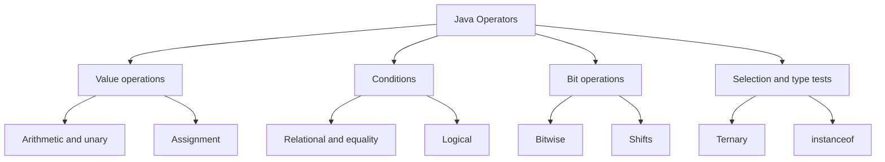

# Core Java Reference Material

> # Operators in Java

🏚️ [Home](index.md) 🔸 ⬅️ Previous: [Variables and Data Types](variables.md) 🔸 ➡️ Next: [Control Flow Statements](control-flow.md)

## Table of Contents

1. [What Is an Operator?](#1-what-is-an-operator)
2. [Operands, Expressions, and Statements](#2-operands-expressions-and-statements)
3. [Categories of Java Operators](#3-categories-of-java-operators)
4. [Operator Precedence, Associativity, and Evaluation Order](#4-operator-precedence-associativity-and-evaluation-order)
5. [Arithmetic Operators](#5-arithmetic-operators)
6. [Integer Division and Remainder](#6-integer-division-and-remainder)
7. [Floating-Point Arithmetic](#7-floating-point-arithmetic)
8. [Numeric Promotion](#8-numeric-promotion)
9. [Unary Operators](#9-unary-operators)
10. [Increment and Decrement Operators](#10-increment-and-decrement-operators)
11. [Assignment Operators](#11-assignment-operators)
12. [Compound Assignment and Implicit Casting](#12-compound-assignment-and-implicit-casting)
13. [Relational Operators](#13-relational-operators)
14. [Equality Operators](#14-equality-operators)
15. [Logical Operators](#15-logical-operators)
16. [Short-Circuit Evaluation](#16-short-circuit-evaluation)
17. [Bitwise Operators](#17-bitwise-operators)
18. [Shift Operators](#18-shift-operators)
19. [Conditional Ternary Operator](#19-conditional-ternary-operator)
20. [`instanceof` Operator and Pattern Matching](#20-instanceof-operator-and-pattern-matching)
21. [String Concatenation Operator](#21-string-concatenation-operator)
22. [Character Arithmetic](#22-character-arithmetic)
23. [Primitive and Reference Comparisons](#23-primitive-and-reference-comparisons)
24. [Operators with Wrapper Classes and Unboxing](#24-operators-with-wrapper-classes-and-unboxing)
25. [Overflow, Underflow, and Exact Arithmetic](#25-overflow-underflow-and-exact-arithmetic)
26. [Operator Examples in Conditions](#26-operator-examples-in-conditions)
27. [Practical Operator Programs](#27-practical-operator-programs)
28. [Operators That Java Does Not Support](#28-operators-that-java-does-not-support)
29. [Operators Best Practices](#29-operators-best-practices)
30. [Common Operator Errors](#30-common-operator-errors)
31. [Quick Revision Tables](#31-quick-revision-tables)
32. [Frequently Asked Interview Questions](#32-frequently-asked-interview-questions)

## 1. What Is an Operator?

An **operator** is a symbol that tells Java to perform an operation on one, two, or three values. The values on which an operator acts are called **operands**.

```java
int total = price + tax;
```

In this expression:

- `+` is the operator;
- `price` and `tax` are operands; and
- `price + tax` is an expression that produces a value.

Operators are used to:

- perform calculations;
- compare values;
- combine conditions;
- assign and update variables;
- manipulate individual bits;
- test an object's type; and
- choose between two results.

[↑ Go to Table of Contents](#table-of-contents)

## 2. Operands, Expressions, and Statements

These terms are related but have different meanings.

| Term | Meaning | Example |
| --- | --- | --- |
| Operand | A value on which an operator acts | `a` and `b` in `a + b` |
| Operator | A symbol that performs an operation | `+` |
| Expression | Code that evaluates to a value | `a + b` |
| Statement | A complete instruction | `int sum = a + b;` |

### Operators by number of operands

| Type | Operands | Example |
| --- | ---: | --- |
| Unary | One | `-number`, `!ready`, `count++` |
| Binary | Two | `a + b`, `x > y`, `p && q` |
| Ternary | Three | `condition ? first : second` |

The conditional operator `?:` is Java's only ternary operator.

```java
int larger = a > b ? a : b;
```

[↑ Go to Table of Contents](#table-of-contents)

## 3. Categories of Java Operators



### Main categories

| Category | Operators |
| --- | --- |
| Arithmetic | `+`, `-`, `*`, `/`, `%` |
| Unary | `+`, `-`, `++`, `--`, `!`, `~` |
| Assignment | `=`, `+=`, `-=`, `*=`, `/=`, `%=`, `&=`, `|=`, `^=`, `<<=`, `>>=`, `>>>=` |
| Relational | `<`, `>`, `<=`, `>=` |
| Equality | `==`, `!=` |
| Logical | `&&`, `||`, `!` |
| Bitwise | `&`, `|`, `^`, `~` |
| Shift | `<<`, `>>`, `>>>` |
| Conditional | `?:` |
| Type comparison | `instanceof` |
| String concatenation | `+` |

The same symbol can have different meanings based on its operands. For example, `+` can add numbers, apply unary plus, or concatenate strings.

```java
int sum = 10 + 5;                    // numeric addition
int positive = +sum;                 // unary plus
String message = "Total: " + sum;    // string concatenation
```

[↑ Go to Table of Contents](#table-of-contents)

## 4. Operator Precedence, Associativity, and Evaluation Order

**Precedence** determines which operator binds more tightly when parentheses are absent. **Associativity** determines how operators at the same precedence level are grouped.

### Precedence table

The following table is ordered from highest to lowest precedence.

| Level | Operators | Description | Associativity |
| ---: | --- | --- | --- |
| 1 | `expr++`, `expr--` | Postfix increment and decrement | Left to right |
| 2 | `++expr`, `--expr`, `+expr`, `-expr`, `!`, `~` | Unary operators | Right to left |
| 3 | `*`, `/`, `%` | Multiplication, division, remainder | Left to right |
| 4 | `+`, `-` | Addition, subtraction, concatenation | Left to right |
| 5 | `<<`, `>>`, `>>>` | Shift | Left to right |
| 6 | `<`, `<=`, `>`, `>=`, `instanceof` | Relational and type comparison | Left to right |
| 7 | `==`, `!=` | Equality | Left to right |
| 8 | `&` | Bitwise or non-short-circuit AND | Left to right |
| 9 | `^` | Bitwise or boolean XOR | Left to right |
| 10 | `|` | Bitwise or non-short-circuit OR | Left to right |
| 11 | `&&` | Short-circuit AND | Left to right |
| 12 | `||` | Short-circuit OR | Left to right |
| 13 | `?:` | Conditional operator | Right to left |
| 14 | `=`, `+=`, `-=`, `*=`, `/=`, `%=`, `&=`, `^=`, `|=`, `<<=`, `>>=`, `>>>=` | Assignment | Right to left |

### Precedence example

```java
int result = 10 + 2 * 3;
System.out.println(result); // 16
```

Multiplication has higher precedence, so Java groups the expression as:

```java
int result = 10 + (2 * 3);
```

Parentheses can make a different grouping explicit:

```java
int result = (10 + 2) * 3;
System.out.println(result); // 36
```

### Associativity example

Subtraction is left-associative:

```java
int value = 20 - 5 - 3;
// Grouped as: (20 - 5) - 3
System.out.println(value); // 12
```

Assignment is right-associative:

```java
int a;
int b;
a = b = 10;
// Grouped as: a = (b = 10)
```

### Evaluation order

Java evaluates operand expressions from left to right. Precedence controls grouping; it does not permit Java to ignore the language's evaluation order.

```java
static int show(String name, int value) {
    System.out.println(name);
    return value;
}

int answer = show("left", 2) + show("middle", 3) * show("right", 4);
```

The method calls print `left`, `middle`, and `right` in that order. The multiplication result is still used before the addition result is produced.

Use parentheses when an expression's meaning is not immediately obvious, even if precedence already gives the intended result.

[↑ Go to Table of Contents](#table-of-contents)

## 5. Arithmetic Operators

Arithmetic operators perform mathematical operations.

| Operator | Operation | Example | Result |
| --- | --- | --- | ---: |
| `+` | Addition | `10 + 3` | `13` |
| `-` | Subtraction | `10 - 3` | `7` |
| `*` | Multiplication | `10 * 3` | `30` |
| `/` | Division | `10 / 3` | `3` |
| `%` | Remainder | `10 % 3` | `1` |

```java
int a = 17;
int b = 5;

System.out.println(a + b); // 22
System.out.println(a - b); // 12
System.out.println(a * b); // 85
System.out.println(a / b); // 3
System.out.println(a % b); // 2
```

Arithmetic operators can be used with numeric primitive types. Their exact result type depends on numeric promotion.

[↑ Go to Table of Contents](#table-of-contents)

## 6. Integer Division and Remainder

When both operands are integer types, `/` performs **integer division**. Any fractional part is discarded; the result is truncated toward zero.

```java
System.out.println(7 / 2);   // 3
System.out.println(-7 / 2);  // -3
System.out.println(7 / -2);  // -3
```

To retain a fractional result, make at least one operand floating-point:

```java
System.out.println(7.0 / 2);          // 3.5
System.out.println((double) 7 / 2);   // 3.5
```

### Remainder operator

The `%` operator returns the remainder after division. In Java, a nonzero remainder has the same sign as the dividend, which is the left operand.

```java
System.out.println(7 % 3);    // 1
System.out.println(-7 % 3);   // -1
System.out.println(7 % -3);   // 1
```

For a mathematical non-negative modulus, `Math.floorMod()` is often clearer:

```java
System.out.println(-7 % 3);             // -1
System.out.println(Math.floorMod(-7, 3)); // 2
```

### Division by zero

Integer division or remainder by zero throws `ArithmeticException` at runtime.

```java
int value = 10;
int divisor = 0;

// int result = value / divisor; // ArithmeticException: / by zero
```

A constant integer expression such as `10 / 0` is rejected at compile time.

[↑ Go to Table of Contents](#table-of-contents)

## 7. Floating-Point Arithmetic

Floating-point operations use `float` or `double` values.

```java
double price = 99.50;
double taxRate = 0.18;
double total = price + price * taxRate;

System.out.println(total); // 117.41 approximately
```

### Special floating-point values

Unlike integer division, floating-point division by zero does not throw `ArithmeticException`.

```java
System.out.println(10.0 / 0.0); // Infinity
System.out.println(-10.0 / 0.0); // -Infinity
System.out.println(0.0 / 0.0);  // NaN
```

`NaN` means **Not a Number**. It has unusual comparison behavior:

```java
double value = Double.NaN;

System.out.println(value == value);       // false
System.out.println(Double.isNaN(value));  // true
```

### Decimal precision

Binary floating-point cannot represent every decimal fraction exactly.

```java
System.out.println(0.1 + 0.2); // typically 0.30000000000000004
```

Use `BigDecimal` for calculations that require controlled decimal precision, such as many financial calculations.

```java
import java.math.BigDecimal;

BigDecimal first = new BigDecimal("0.1");
BigDecimal second = new BigDecimal("0.2");

System.out.println(first.add(second)); // 0.3
```

`BigDecimal` uses methods such as `add()`, `subtract()`, `multiply()`, and `divide()` rather than arithmetic operators.

[↑ Go to Table of Contents](#table-of-contents)

## 8. Numeric Promotion

Java promotes smaller numeric operands before many arithmetic, comparison, bitwise, and shift operations.

### Unary numeric promotion

Unary `+`, unary `-`, and `~` promote `byte`, `short`, and `char` to `int`.

```java
byte value = 10;

// byte negative = -value; // compile-time error: result is int
int negative = -value;
```

### Binary numeric promotion

For most binary numeric operators, Java generally promotes operands according to this order:

1. if either operand is `double`, both become `double`;
2. otherwise, if either is `float`, both become `float`;
3. otherwise, if either is `long`, both become `long`; and
4. otherwise, both become `int`.

```java
int count = 5;
double rate = 2.5;

double result = count * rate; // int is promoted to double
```

### The calculation occurs before assignment

The destination variable does not change the type used by the operation.

```java
int large = 1_000_000;
long wrong = large * large;        // multiplication occurs as int first
long correct = (long) large * large;
long alsoCorrect = 1_000_000L * 1_000_000;
```

`wrong` receives an already-overflowed `int` result. Convert at least one operand to `long` before the operation.

[↑ Go to Table of Contents](#table-of-contents)

## 9. Unary Operators

Unary operators act on one operand.

| Operator | Meaning | Example |
| --- | --- | --- |
| `+` | Unary plus | `+number` |
| `-` | Numeric negation | `-number` |
| `++` | Increment by one | `count++` |
| `--` | Decrement by one | `--count` |
| `!` | Boolean logical complement | `!available` |
| `~` | Bitwise complement | `~mask` |

```java
int number = 8;
boolean active = true;

System.out.println(+number);  // 8
System.out.println(-number);  // -8
System.out.println(!active);  // false
System.out.println(~number);  // -9
```

For an integer `x`, `~x` is equivalent to `-x - 1` under two's-complement representation.

[↑ Go to Table of Contents](#table-of-contents)

## 10. Increment and Decrement Operators

`++` adds one and `--` subtracts one. Each has prefix and postfix forms.

### Prefix form

The variable is updated first, and the updated value becomes the expression's value.

```java
int count = 5;
int result = ++count;

System.out.println(count);  // 6
System.out.println(result); // 6
```

### Postfix form

The original value becomes the expression's value, and then the variable is updated.

```java
int count = 5;
int result = count++;

System.out.println(count);  // 6
System.out.println(result); // 5
```

### Comparison

| Expression | Value used in expression | Variable afterward |
| --- | ---: | ---: |
| `++x` when `x` is `5` | `6` | `6` |
| `x++` when `x` is `5` | `5` | `6` |
| `--x` when `x` is `5` | `4` | `4` |
| `x--` when `x` is `5` | `5` | `4` |

Do not place several increments or decrements in one expression. Although Java defines the result, the code becomes difficult to understand.

```java
int x = 5;
int confusing = x++ + ++x;
```

Prefer separate statements:

```java
int x = 5;
int first = x;
x++;
x++;
int second = x;
int clear = first + second;
```

[↑ Go to Table of Contents](#table-of-contents)

## 11. Assignment Operators

The simple assignment operator `=` stores a value in a variable.

```java
int score = 90;
score = 95;
```

Compound assignment operators combine an operation with assignment.

| Operator | Similar expanded form |
| --- | --- |
| `x += y` | `x = x + y` |
| `x -= y` | `x = x - y` |
| `x *= y` | `x = x * y` |
| `x /= y` | `x = x / y` |
| `x %= y` | `x = x % y` |
| `x &= y` | `x = x & y` |
| `x |= y` | `x = x | y` |
| `x ^= y` | `x = x ^ y` |
| `x <<= y` | `x = x << y` |
| `x >>= y` | `x = x >> y` |
| `x >>>= y` | `x = x >>> y` |

```java
int balance = 100;

balance += 50; // 150
balance -= 20; // 130
balance *= 2;  // 260
balance /= 4;  // 65
balance %= 10; // 5
```

An assignment is itself an expression and produces the assigned value. Chained assignment is therefore legal:

```java
int a;
int b;
int c;

a = b = c = 25;
```

Use chained assignment only when it remains clear.

[↑ Go to Table of Contents](#table-of-contents)

## 12. Compound Assignment and Implicit Casting

A compound assignment is not always identical to its expanded form. It includes an implicit conversion back to the left operand's type.

```java
byte value = 10;
value += 5; // compiles; result is converted back to byte
```

The expanded version requires an explicit cast:

```java
byte value = 10;

// value = value + 5;       // compile-time error: value + 5 is int
value = (byte) (value + 5); // compiles
```

Conceptually:

```java
E1 op= E2
```

behaves like:

```java
E1 = (typeOfE1) (E1 op E2)
```

However, the left-hand expression is evaluated only once in the compound form.

### Possible narrowing data loss

The implicit conversion can discard information.

```java
byte value = 120;
value += 10;

System.out.println(value); // -126 because the byte range was exceeded
```

### String compound assignment

`+=` also performs string concatenation when the left side is a `String`.

```java
String message = "Java";
message += " Operators";

System.out.println(message); // Java Operators
```

[↑ Go to Table of Contents](#table-of-contents)

## 13. Relational Operators

Relational operators compare numeric values and produce a `boolean` result.

| Operator | Meaning |
| --- | --- |
| `<` | Less than |
| `>` | Greater than |
| `<=` | Less than or equal to |
| `>=` | Greater than or equal to |

```java
int age = 20;

System.out.println(age < 18);  // false
System.out.println(age > 18);  // true
System.out.println(age <= 20); // true
System.out.println(age >= 21); // false
```

Java does not support chained mathematical comparisons.

```java
int age = 20;

// boolean valid = 18 <= age <= 60; // compile-time error
boolean valid = age >= 18 && age <= 60;
```

Relational operators do not compare `boolean` values or arbitrary objects.

[↑ Go to Table of Contents](#table-of-contents)

## 14. Equality Operators

`==` tests equality and `!=` tests inequality.

### Primitive equality

For primitive numeric values, Java applies numeric promotion and compares the values.

```java
int whole = 10;
double decimal = 10.0;

System.out.println(whole == decimal); // true
System.out.println(whole != decimal); // false
```

Boolean values can be compared only with boolean values:

```java
boolean ready = true;
System.out.println(ready == true); // true, but simply using ready is clearer
```

### Reference equality

For references, `==` checks whether both operands refer to the same object, not whether separate objects contain equal data.

```java
String first = new String("Java");
String second = new String("Java");

System.out.println(first == second);      // false
System.out.println(first.equals(second)); // true
```

### Comparing with `null`

Use `==` or `!=` to compare a reference with `null`.

```java
if (name != null) {
    System.out.println(name.length());
}
```

Do not call `equals()` on a reference that may be `null`.

### Floating-point equality

Floating-point calculations may contain rounding error, so exact `==` is often unsuitable for calculated values.

```java
double actual = 0.1 + 0.2;
double expected = 0.3;
double tolerance = 1e-9;

boolean closeEnough = Math.abs(actual - expected) < tolerance;
```

Choose a tolerance appropriate for the application's scale and requirements.

[↑ Go to Table of Contents](#table-of-contents)

## 15. Logical Operators

Logical operators combine or reverse boolean values.

| Operator | Name | Result |
| --- | --- | --- |
| `&&` | Conditional AND | `true` only when both operands are `true` |
| `||` | Conditional OR | `true` when at least one operand is `true` |
| `!` | Logical NOT | Reverses a boolean value |
| `&` | Boolean logical AND | Evaluates both operands |
| `|` | Boolean logical OR | Evaluates both operands |
| `^` | Boolean XOR | `true` when operands differ |

```java
boolean hasTicket = true;
boolean hasId = true;

boolean canEnter = hasTicket && hasId;
boolean needsHelp = !hasTicket || !hasId;

System.out.println(canEnter);  // true
System.out.println(needsHelp); // false
```

### Boolean truth table

| `a` | `b` | `a && b` | `a || b` | `a ^ b` |
| --- | --- | --- | --- | --- |
| `false` | `false` | `false` | `false` | `false` |
| `false` | `true` | `false` | `true` | `true` |
| `true` | `false` | `false` | `true` | `true` |
| `true` | `true` | `true` | `true` | `false` |

[↑ Go to Table of Contents](#table-of-contents)

## 16. Short-Circuit Evaluation

`&&` and `||` use **short-circuit evaluation**.

- With `a && b`, Java skips `b` when `a` is `false`.
- With `a || b`, Java skips `b` when `a` is `true`.

### Safe null check

```java
String name = null;

if (name != null && !name.isEmpty()) {
    System.out.println(name);
}
```

When `name` is `null`, the second operand is skipped, preventing `NullPointerException`.

Reversing the operands is unsafe:

```java
// Unsafe: isEmpty() runs before the null check
// if (!name.isEmpty() && name != null) { }
```

### Preventing invalid arithmetic

```java
int divisor = 0;
int value = 20;

if (divisor != 0 && value / divisor > 2) {
    System.out.println("Condition met");
}
```

### `&&` vs `&` and `||` vs `|`

```java
static boolean check() {
    System.out.println("check called");
    return true;
}

boolean first = false && check(); // check() is not called
boolean second = false & check(); // check() is called
```

Use `&&` and `||` for normal conditions. Use boolean `&`, `|`, or `^` only when evaluating both sides is intentionally required.

[↑ Go to Table of Contents](#table-of-contents)

## 17. Bitwise Operators

Bitwise operators work on the individual bits of integral values: `byte`, `short`, `char`, `int`, and `long`. Smaller operands are promoted to `int`.

| Operator | Name | Bit rule |
| --- | --- | --- |
| `&` | Bitwise AND | `1` only when both bits are `1` |
| `|` | Bitwise OR | `1` when either bit is `1` |
| `^` | Bitwise XOR | `1` when the bits differ |
| `~` | Bitwise complement | Changes every `0` to `1` and every `1` to `0` |

```java
int a = 12; // binary: 1100
int b = 10; // binary: 1010

System.out.println(a & b); // 8  -> 1000
System.out.println(a | b); // 14 -> 1110
System.out.println(a ^ b); // 6  -> 0110
```

### Bit masks

Bit masks are commonly used for compact flags.

```java
int READ = 1;    // 0001
int WRITE = 2;   // 0010
int EXECUTE = 4; // 0100

int permissions = READ | WRITE;

boolean canRead = (permissions & READ) != 0;
boolean canExecute = (permissions & EXECUTE) != 0;

permissions |= EXECUTE; // add permission
permissions &= ~WRITE;  // remove permission
permissions ^= READ;    // toggle permission
```

Use named constants or an `enum` rather than unexplained numeric masks.

[↑ Go to Table of Contents](#table-of-contents)

## 18. Shift Operators

Shift operators move the bit pattern of an integral value.

| Operator | Name | Behavior |
| --- | --- | --- |
| `<<` | Left shift | Shifts left and fills low-order positions with zeros |
| `>>` | Signed right shift | Shifts right and copies the sign bit |
| `>>>` | Unsigned right shift | Shifts right and fills high-order positions with zeros |

```java
int value = 8; // 0000...1000

System.out.println(value << 1); // 16
System.out.println(value >> 1); // 4
```

For non-negative values that do not overflow:

- shifting left by `n` positions often corresponds to multiplying by `2^n`; and
- shifting right by `n` positions often corresponds to dividing by `2^n`.

These are not universal replacements for arithmetic because overflow, negative values, and rounding can change the result.

### Signed vs unsigned right shift

```java
int negative = -8;

System.out.println(negative >> 1);  // -4
System.out.println(negative >>> 1); // 2147483644
```

`>>` preserves the negative sign. `>>>` inserts zeros and therefore produces a large positive `int` in this example.

### Shift-distance masking

For an `int`, Java uses only the lowest five bits of the shift distance. For a `long`, it uses only the lowest six bits.

```java
System.out.println(1 << 32);  // 1, equivalent to 1 << 0
System.out.println(1L << 64); // 1, equivalent to 1L << 0
```

### Smaller integral types

Shift operations promote `byte`, `short`, and `char` to `int`.

```java
byte value = 4;
int shifted = value << 1;
```

[↑ Go to Table of Contents](#table-of-contents)

## 19. Conditional Ternary Operator

The conditional operator selects one of two expressions.

```java
condition ? valueWhenTrue : valueWhenFalse
```

Example:

```java
int age = 20;
String category = age >= 18 ? "Adult" : "Minor";
```

Only the selected branch is evaluated.

```java
String text = null;
int length = text != null ? text.length() : 0;
```

### Nested conditional expressions

The operator is right-associative:

```java
int score = 82;
String grade = score >= 90 ? "A"
             : score >= 75 ? "B"
             : score >= 60 ? "C"
             : "D";
```

Short nested expressions can be readable when formatted carefully. Use `if-else` when branches contain actions or the nesting becomes difficult to scan.

### Result type

The types of the second and third operands influence the type of the complete expression.

```java
boolean condition = true;
double value = condition ? 10 : 2.5;

System.out.println(value); // 10.0
```

Here the integer branch is promoted so the conditional expression can produce a `double`.

[↑ Go to Table of Contents](#table-of-contents)

## 20. `instanceof` Operator and Pattern Matching

`instanceof` checks whether an object is compatible with a specified reference type.

```java
Object value = "Java";

System.out.println(value instanceof String); // true
System.out.println(value instanceof Integer); // false
```

If the left operand is `null`, the result is always `false`.

```java
Object value = null;
System.out.println(value instanceof String); // false
```

### Traditional type check and cast

```java
if (value instanceof String) {
    String text = (String) value;
    System.out.println(text.length());
}
```

### Pattern matching for `instanceof`

Modern Java can combine the test and cast:

```java
if (value instanceof String text) {
    System.out.println(text.length());
}
```

The pattern variable is available only where the match is known to have succeeded.

```java
if (value instanceof String text && !text.isBlank()) {
    System.out.println(text.toUpperCase());
}
```

The short-circuit `&&` makes `text` safely available in the right operand.

### Generics restriction

Because of type erasure, a parameterized type such as `List<String>` generally cannot be the target of an `instanceof` test. Use a reifiable type such as `List<?>`.

```java
if (value instanceof java.util.List<?>) {
    System.out.println("The value is a list");
}
```

[↑ Go to Table of Contents](#table-of-contents)

## 21. String Concatenation Operator

When either operand of binary `+` is a `String`, Java performs string concatenation.

```java
String language = "Java";
int version = 21;

String message = language + " " + version;
System.out.println(message); // Java 21
```

### Evaluation is left to right

```java
System.out.println("Result: " + 2 + 3);   // Result: 23
System.out.println("Result: " + (2 + 3)); // Result: 5
System.out.println(2 + 3 + " is the result"); // 5 is the result
```

Once a string participates, later `+` operations concatenate unless parentheses cause a numeric expression to be evaluated first.

### Concatenating `null`

```java
String name = null;
System.out.println("Name: " + name); // Name: null
```

### Repeated concatenation

Simple concatenation is readable and appropriate for ordinary expressions. For repeated updates in a loop, use `StringBuilder`.

```java
StringBuilder builder = new StringBuilder();

for (int i = 1; i <= 3; i++) {
    builder.append(i).append(' ');
}

String result = builder.toString();
```

Java does not allow user-defined operator overloading. String concatenation with `+` is built into the language.

[↑ Go to Table of Contents](#table-of-contents)

## 22. Character Arithmetic

A `char` stores an unsigned UTF-16 code unit. Arithmetic normally promotes it to `int`.

```java
char letter = 'A';
int code = letter;
int nextCode = letter + 1;

System.out.println(code);     // 65
System.out.println(nextCode); // 66
```

An explicit cast is required to convert the arithmetic result back to `char`.

```java
char nextLetter = (char) (letter + 1);
System.out.println(nextLetter); // B
```

Constant expressions that fit the target type can sometimes be assigned without a cast:

```java
char letter = 'A' + 1;
System.out.println(letter); // B
```

This works because `'A' + 1` is a compile-time constant whose value fits in `char`. The same assignment with variables would require a cast.

[↑ Go to Table of Contents](#table-of-contents)

## 23. Primitive and Reference Comparisons

Choosing the correct comparison depends on the operand type.

| Values being compared | Normal approach |
| --- | --- |
| Numeric primitives | `==`, `!=`, `<`, `>`, `<=`, `>=` as appropriate |
| `boolean` primitives | Direct condition, `==`, or `!=` |
| Object identity | `==` or `!=` |
| Object content | `equals()` or a type-specific comparison method |
| Possibly null objects | `java.util.Objects.equals(a, b)` |
| Arrays by content | `Arrays.equals()` or `Arrays.deepEquals()` |

### Null-safe object equality

```java
import java.util.Objects;

String first = null;
String second = null;

System.out.println(Objects.equals(first, second)); // true
```

### Array comparison

```java
import java.util.Arrays;

int[] first = {1, 2, 3};
int[] second = {1, 2, 3};

System.out.println(first == second);            // false
System.out.println(Arrays.equals(first, second)); // true
```

### String pool trap

```java
String first = "Java";
String second = "Java";
String third = new String("Java");

System.out.println(first == second); // often true because literals are interned
System.out.println(first == third);  // false
```

This does not make `==` a valid content comparison. Always use `equals()` when string contents matter.

[↑ Go to Table of Contents](#table-of-contents)

## 24. Operators with Wrapper Classes and Unboxing

Wrapper objects such as `Integer`, `Long`, and `Boolean` can be automatically unboxed when an operator requires a primitive.

```java
Integer first = 10;
Integer second = 20;

int sum = first + second; // both Integer objects are unboxed
```

### Null-unboxing danger

Unboxing a `null` wrapper throws `NullPointerException`.

```java
Integer count = null;

// int next = count + 1; // NullPointerException
```

The same risk exists in conditions:

```java
Boolean enabled = null;

// if (enabled) { } // NullPointerException during unboxing
if (Boolean.TRUE.equals(enabled)) {
    System.out.println("Enabled");
}
```

### Wrapper identity trap

Do not use `==` to compare wrapper values. It compares references unless unboxing is forced, and caching can make results appear inconsistent.

```java
Integer a = 100;
Integer b = 100;
Integer c = 1000;
Integer d = 1000;

System.out.println(a == b); // true for these constant values because of required caching
System.out.println(c == d); // identity is not a value-comparison guarantee
System.out.println(c.equals(d)); // true
```

Use `equals()` for wrapper value equality or explicitly compare primitive values when `null` has been handled.

[↑ Go to Table of Contents](#table-of-contents)

## 25. Overflow, Underflow, and Exact Arithmetic

Integer arithmetic does not automatically report overflow. Results wrap around within the fixed-width two's-complement range.

```java
int maximum = Integer.MAX_VALUE;
int wrapped = maximum + 1;

System.out.println(wrapped); // -2147483648
```

### Exact arithmetic methods

Use `Math` methods when overflow must be detected.

```java
try {
    int result = Math.addExact(Integer.MAX_VALUE, 1);
} catch (ArithmeticException exception) {
    System.out.println("Overflow detected");
}
```

Useful methods include:

| Method | Purpose |
| --- | --- |
| `Math.addExact(a, b)` | Addition with overflow checking |
| `Math.subtractExact(a, b)` | Subtraction with overflow checking |
| `Math.multiplyExact(a, b)` | Multiplication with overflow checking |
| `Math.incrementExact(a)` | Increment with overflow checking |
| `Math.decrementExact(a)` | Decrement with overflow checking |
| `Math.negateExact(a)` | Negation with overflow checking |
| `Math.toIntExact(value)` | Converts `long` to `int` with range checking |

### Floating-point overflow and underflow

Floating-point overflow can produce infinity. Underflow can produce a subnormal value or signed zero.

```java
double overflow = Double.MAX_VALUE * 2;
double underflow = Double.MIN_VALUE / 2;

System.out.println(overflow);  // Infinity
System.out.println(underflow); // 0.0
```

[↑ Go to Table of Contents](#table-of-contents)

## 26. Operator Examples in Conditions

Operators are frequently combined in selection and loop conditions.

### Range validation

```java
int mark = 78;

if (mark >= 0 && mark <= 100) {
    System.out.println("Valid mark");
}
```

### Leap-year check

```java
int year = 2028;

boolean leapYear = year % 400 == 0
        || (year % 4 == 0 && year % 100 != 0);
```

### Even or odd

```java
int number = 27;
String kind = number % 2 == 0 ? "Even" : "Odd";
```

### Access rule

```java
boolean isAdmin = false;
boolean ownsRecord = true;
boolean isLocked = false;

boolean canEdit = (isAdmin || ownsRecord) && !isLocked;
```

Parentheses make the access rule easier to verify, even though precedence would evaluate `&&` before `||`.

[↑ Go to Table of Contents](#table-of-contents)

## 27. Practical Operator Programs

### Program 1: Arithmetic calculator

```java
public class ArithmeticDemo {
    public static void main(String[] args) {
        int first = 20;
        int second = 6;

        System.out.println("Addition: " + (first + second));
        System.out.println("Subtraction: " + (first - second));
        System.out.println("Multiplication: " + (first * second));
        System.out.println("Division: " + (first / second));
        System.out.println("Remainder: " + (first % second));
    }
}
```

Output:

```text
Addition: 26
Subtraction: 14
Multiplication: 120
Division: 3
Remainder: 2
```

### Program 2: Largest of three numbers

```java
public class LargestNumber {
    public static void main(String[] args) {
        int a = 14;
        int b = 25;
        int c = 19;

        int largest = a >= b
                ? (a >= c ? a : c)
                : (b >= c ? b : c);

        System.out.println("Largest: " + largest);
    }
}
```

Output:

```text
Largest: 25
```

### Program 3: Eligibility check

```java
public class EligibilityCheck {
    public static void main(String[] args) {
        int age = 22;
        boolean hasId = true;
        boolean suspended = false;

        boolean eligible = age >= 18 && hasId && !suspended;

        System.out.println("Eligible: " + eligible);
    }
}
```

Output:

```text
Eligible: true
```

### Program 4: Permission flags

```java
public class PermissionFlags {
    private static final int READ = 1;
    private static final int WRITE = 1 << 1;
    private static final int DELETE = 1 << 2;

    public static void main(String[] args) {
        int permissions = READ | WRITE;

        System.out.println("Can read: " + hasPermission(permissions, READ));
        System.out.println("Can delete: " + hasPermission(permissions, DELETE));

        permissions |= DELETE;
        System.out.println("Can delete now: " + hasPermission(permissions, DELETE));
    }

    private static boolean hasPermission(int permissions, int required) {
        return (permissions & required) == required;
    }
}
```

Output:

```text
Can read: true
Can delete: false
Can delete now: true
```

[↑ Go to Table of Contents](#table-of-contents)

## 28. Operators That Java Does Not Support

Java deliberately omits some operators found in other languages.

| Feature | Java status | Alternative |
| --- | --- | --- |
| Exponentiation operator such as `**` | Not supported | `Math.pow(base, exponent)` |
| Unsigned left-shift operator `<<<` | Not supported | `<<` already fills with zeros on the right |
| General user-defined operator overloading | Not supported | Use clearly named methods |
| Comma operator | Not supported as a general expression operator | Use separate statements |
| Pointer dereference operators | Not exposed | Java uses managed references |

The caret `^` means XOR, not exponentiation.

```java
System.out.println(2 ^ 3);           // 1, bitwise XOR
System.out.println(Math.pow(2, 3));  // 8.0
```

Symbols such as `->` in a lambda expression and `::` in a method reference are language syntax, but they are normally taught separately from Java's expression-operator categories.

[↑ Go to Table of Contents](#table-of-contents)

## 29. Operators Best Practices

- Use parentheses to communicate intent in mixed expressions.
- Use `&&` and `||` for normal boolean conditions so unnecessary work is skipped.
- Put null or validity checks before dependent operations in a short-circuit expression.
- Use `equals()` or `Objects.equals()` for object content comparison.
- Compare strings by content rather than by reference identity.
- Convert an operand before arithmetic when a wider result type is required.
- Use `BigDecimal` when controlled decimal precision is required.
- Use `Math.addExact()`, `Math.multiplyExact()`, and related methods when overflow must be detected.
- Keep increment, decrement, and assignment side effects out of complicated expressions.
- Use the ternary operator for short value selection, not for multi-step logic.
- Use named constants for bit masks.
- Add parentheses around bit-mask tests, such as `(flags & READ) != 0`.
- Remember that compound assignment can perform an implicit narrowing conversion.
- Do not replace clear multiplication or division blindly with shifts.
- Prefer readable expressions over clever expressions.

[↑ Go to Table of Contents](#table-of-contents)

## 30. Common Operator Errors

### Error 1: Expecting decimal integer division

```java
double average = 5 / 2; // 2.0, not 2.5
```

Fix:

```java
double average = 5.0 / 2;
```

### Error 2: Comparing strings with `==`

```java
String first = new String("Java");
String second = new String("Java");

if (first == second) { // compares identity
    System.out.println("Equal");
}
```

Fix:

```java
if (first.equals(second)) {
    System.out.println("Equal");
}
```

### Error 3: Checking for null too late

```java
// if (name.length() > 0 && name != null) { }
```

Fix:

```java
if (name != null && !name.isEmpty()) {
    System.out.println(name);
}
```

### Error 4: Overflow before assigning to `long`

```java
int value = 1_000_000;
long result = value * value; // int multiplication overflows
```

Fix:

```java
long result = (long) value * value;
```

### Error 5: Forgetting binary numeric promotion

```java
byte a = 10;
byte b = 20;

// byte sum = a + b; // result is int
int sum = a + b;
```

### Error 6: Assuming `+=` is exactly textual shorthand

```java
short value = 10;
value += 5; // implicit conversion to short

// value = value + 5; // compile-time error without a cast
```

### Error 7: Confusing `&` with `&&`

```java
if (object != null & object.isReady()) {
    // The right operand still runs when object is null.
}
```

Fix:

```java
if (object != null && object.isReady()) {
    // The right operand runs only when object is non-null.
}
```

### Error 8: Treating `%` as always non-negative

```java
System.out.println(-5 % 3); // -2
```

Use `Math.floorMod(-5, 3)` when the required result is within `0` to `divisor - 1` for a positive divisor.

### Error 9: Using `^` for powers

```java
int wrong = 2 ^ 3; // XOR, result is 1
double correct = Math.pow(2, 3);
```

### Error 10: Unboxing `null`

```java
Integer value = null;
// int result = value + 1; // NullPointerException
```

Validate the wrapper or supply an intentional default before arithmetic.

### Error 11: Relying on precedence in a complex rule

```java
boolean permitted = admin || owner && active;
```

This is grouped as `admin || (owner && active)`. Add parentheses that match the business rule:

```java
boolean permitted = admin || (owner && active);
```

or:

```java
boolean permitted = (admin || owner) && active;
```

### Error 12: Assuming a shift distance is unrestricted

```java
int result = 1 << 32; // result is 1, not 0
```

For `int`, only the lowest five bits of the distance are used.

### Error 13: Using a complicated increment expression

```java
int i = 3;
int result = i++ + ++i;
```

Java defines the evaluation, but a reader must mentally track several state changes. Split the work into named steps.

[↑ Go to Table of Contents](#table-of-contents)

## 31. Quick Revision Tables

### Arithmetic and assignment

| Purpose | Operators |
| --- | --- |
| Basic arithmetic | `+`, `-`, `*`, `/`, `%` |
| Change by one | `++`, `--` |
| Assign | `=` |
| Calculate and assign | `+=`, `-=`, `*=`, `/=`, `%=` |

### Comparison and logic

| Purpose | Operators |
| --- | --- |
| Numeric ordering | `<`, `>`, `<=`, `>=` |
| Equality or inequality | `==`, `!=` |
| Short-circuit logic | `&&`, `||` |
| Boolean negation | `!` |
| Boolean non-short-circuit logic | `&`, `|`, `^` |

### Bits, selection, and types

| Purpose | Operators |
| --- | --- |
| Bitwise operations | `&`, `|`, `^`, `~` |
| Bit shifts | `<<`, `>>`, `>>>` |
| Select one of two values | `?:` |
| Test reference-type compatibility | `instanceof` |
| Join strings | `+` |

### Key rules to remember

| Situation | Rule |
| --- | --- |
| `int / int` | Produces an `int`; fractional part is discarded |
| `byte + byte` | Produces an `int` |
| `int * int` assigned to `long` | Multiplication still occurs as `int` |
| `object1 == object2` | Compares reference identity |
| `object1.equals(object2)` | Normally compares logical content when implemented |
| `false && expression` | Skips `expression` |
| `true || expression` | Skips `expression` |
| `x += y` | Includes conversion back to the type of `x` |
| `null instanceof Type` | Always `false` |
| Integer overflow | Wraps unless an exact method is used |

[↑ Go to Table of Contents](#table-of-contents)

## 32. Frequently Asked Interview Questions

> ### Fundamentals

### 1. What is an operator in Java?

An operator is a symbol that performs an operation on one, two, or three operands and produces a value or side effect.

### 2. What is an operand?

An operand is a value or expression on which an operator acts. In `a + b`, `a` and `b` are operands.

### 3. What is the difference between an expression and a statement?

An expression evaluates to a value. A statement is a complete instruction, such as a declaration, assignment, method call, or control-flow statement.

### 4. What are unary, binary, and ternary operators?

A unary operator takes one operand, a binary operator takes two, and a ternary operator takes three. Java's only ternary operator is `?:`.

### 5. Can the same operator have multiple meanings?

Yes. For example, `+` performs numeric addition, unary plus, or string concatenation depending on its position and operands.

### 6. What is operator precedence?

Precedence determines how operators of different levels are grouped when parentheses are absent. For example, multiplication binds more tightly than addition.

### 7. What is associativity?

Associativity determines grouping when adjacent operators have the same precedence. Most binary arithmetic operators associate left to right, while assignment and the conditional operator associate right to left.

### 8. Does Java specify expression evaluation order?

Yes. Java evaluates operand expressions from left to right, including method arguments. Precedence controls grouping, not an arbitrary reordering of operand evaluation.

> ### Arithmetic and Promotion

### 9. What does `10 / 3` produce?

It produces the integer value `3` because both operands are integers.

### 10. How can integer operands produce a decimal division result?

Convert at least one operand to `float` or `double`, such as `(double) total / count`.

### 11. What is the difference between remainder and mathematical modulus?

Java's `%` follows truncated division, so a nonzero result has the dividend's sign. `Math.floorMod()` is useful when a non-negative modulus is required with a positive divisor.

### 12. What happens during integer division by zero?

It throws `ArithmeticException` at runtime. A constant expression that divides an integer by zero is a compile-time error.

### 13. What happens during floating-point division by zero?

It produces infinity, negative infinity, or `NaN`, depending on the operands; it does not throw `ArithmeticException`.

### 14. Why does `byte + byte` produce `int`?

Binary numeric promotion converts `byte`, `short`, and `char` operands to `int` for arithmetic.

### 15. Why can `long result = intValue * intValue` overflow?

Both multiplication operands are `int`, so multiplication occurs as `int`. Assignment to `long` happens only afterward. Cast an operand to `long` first.

### 16. Does Java detect integer overflow automatically?

Ordinary integer operators do not. The result wraps within the type's range. Use methods such as `Math.addExact()` when overflow must be detected.

### 17. Why is `0.1 + 0.2` not exactly `0.3` as a `double`?

Most decimal fractions cannot be represented exactly in binary floating-point, so calculations may include a small rounding error.

### 18. When should `BigDecimal` be used?

Use it when controlled decimal precision and rounding are required, particularly for many monetary calculations.

> ### Increment and Assignment

### 19. What is the difference between `++x` and `x++`?

Both increment `x`. `++x` produces the updated value, while `x++` produces the old value before updating the variable.

### 20. Is `x += y` always exactly the same as `x = x + y`?

No. Compound assignment evaluates its left side once and implicitly converts the result back to the left side's type.

### 21. Why does `byteValue += 1` compile but `byteValue = byteValue + 1` fail?

The compound form includes an implicit conversion back to `byte`. The expanded arithmetic expression produces `int` and therefore needs an explicit cast.

### 22. Can an assignment be used as an expression?

Yes. Assignment produces the assigned value, which makes chained assignments possible. Embedding assignments in conditions is usually best avoided because it is easy to misread.

### 23. In which direction are chained assignments grouped?

They group from right to left. `a = b = 5` is grouped as `a = (b = 5)`.

> ### Comparison and Logic

### 24. What is the difference between `==` and `equals()` for objects?

`==` tests reference identity. `equals()` normally tests logical equality according to the class's implementation.

### 25. How should strings be compared?

Use `equals()` for case-sensitive content comparison or `equalsIgnoreCase()` when that behavior is specifically required. Use `Objects.equals()` for null-safe equality.

### 26. How should a reference be compared with `null`?

Use `== null` or `!= null`.

### 27. What is short-circuit evaluation?

It means `&&` skips its right operand when the left operand is false, while `||` skips its right operand when the left operand is true.

### 28. What is the difference between `&&` and `&` with booleans?

Both perform AND, but `&&` short-circuits. Boolean `&` always evaluates both operands.

### 29. What is the difference between `||` and `|` with booleans?

Both perform OR, but `||` short-circuits. Boolean `|` always evaluates both operands.

### 30. What does boolean XOR do?

`a ^ b` is true when exactly one operand is true and false when the operands are equal.

### 31. Why is `name != null && !name.isEmpty()` safe?

If `name` is null, `&&` skips the second operand, so `isEmpty()` is not invoked.

### 32. Can Java use `18 <= age <= 60`?

No. Write `age >= 18 && age <= 60`.

> ### Bits, Shifts, and Selection

### 33. What is the difference between bitwise and logical operators?

Bitwise operators manipulate bits of integral values. Several of the same symbols—`&`, `|`, and `^`—can also combine booleans without short-circuiting.

### 34. What does the `~` operator do?

It flips every bit of an integral value. After numeric promotion, `~x` is equivalent to `-x - 1` in two's-complement arithmetic.

### 35. What is the difference between `>>` and `>>>`?

`>>` copies the sign bit into vacated positions. `>>>` fills vacated high-order positions with zeros.

### 36. Is there a `<<<` operator in Java?

No. Left shift `<<` always fills vacated low-order positions with zeros.

### 37. What happens when an `int` is shifted by 32 positions?

Only the lowest five bits of the distance are used, so shifting an `int` by 32 is equivalent to shifting it by zero.

### 38. What is the conditional operator?

`condition ? first : second` evaluates the condition and then evaluates only one of the two result expressions.

### 39. When is the ternary operator preferable to `if-else`?

It is useful for a short expression that selects one of two values. `if-else` is clearer for multi-step behavior or complex branches.

### 40. Is `^` an exponentiation operator?

No. It is XOR. Use `Math.pow()` for exponentiation.

> ### Types, Strings, and Common Traps

### 41. What does `instanceof` do?

It tests whether a non-null object is compatible with a specified reference type.

### 42. What is the result of `null instanceof String`?

It is `false`.

### 43. What advantage does pattern matching for `instanceof` provide?

It combines the type test with a safely scoped variable, avoiding a separate explicit cast.

### 44. What does `"Result: " + 2 + 3` produce?

It produces `"Result: 23"` because operations proceed left to right and string concatenation has already begun.

### 45. How can the previous expression produce `"Result: 5"`?

Use parentheses around the numeric addition: `"Result: " + (2 + 3)`.

### 46. Does Java support user-defined operator overloading?

No. Classes define methods instead. String concatenation with `+` is language-defined behavior, not user-defined overloading.

### 47. Why can arithmetic with a wrapper object throw `NullPointerException`?

The operator requires Java to unbox the wrapper. Unboxing a `null` reference throws `NullPointerException`.

### 48. Why should `Integer` values not be compared with `==`?

`==` can compare wrapper references, and caching may make some values appear equal by identity. Use `equals()` for value equality after handling `null`.

### 49. How should floating-point calculated values be compared?

Use a tolerance appropriate to the domain, or use a decimal or exact representation when exact equality is a requirement.

### 50. What operator rules should a fresher remember?

- Integer division discards the fractional part.
- Smaller integral values are commonly promoted to `int`.
- Arithmetic happens before conversion to the assignment target.
- `==` compares object identity; `equals()` compares content when defined that way.
- `&&` and `||` short-circuit.
- Compound assignment includes an implicit conversion.
- `%` can produce a negative result.
- `^` means XOR, not power.
- Integer overflow wraps unless checked explicitly.
- Parentheses make mixed expressions easier to verify.

[↑ Go to Table of Contents](#table-of-contents)

---

🏚️ [Home](index.md) 🔸 ⬅️ Previous: [Variables and Data Types](variables.md) 🔸 ➡️ Next: [Control Flow Statements](control-flow.md)

<!-- Mermaid rendering support for GitHub Pages/Jekyll. -->
<script type="module">
  import mermaid from "https://cdn.jsdelivr.net/npm/mermaid@11/dist/mermaid.esm.min.mjs";

  document.querySelectorAll("pre > code.language-mermaid").forEach((code) => {
    const diagram = document.createElement("pre");
    diagram.className = "mermaid";
    diagram.textContent = code.textContent;
    code.parentElement.replaceWith(diagram);
  });

  mermaid.initialize({
    startOnLoad: false,
    securityLevel: "strict"
  });

  await mermaid.run({ querySelector: ".mermaid" });
</script>
