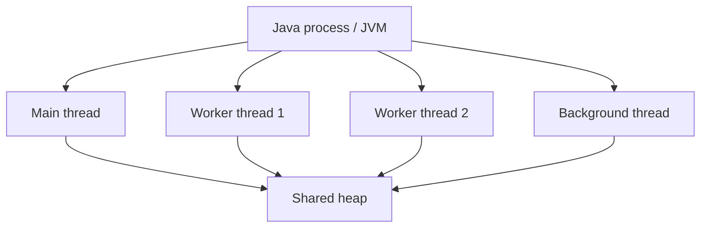
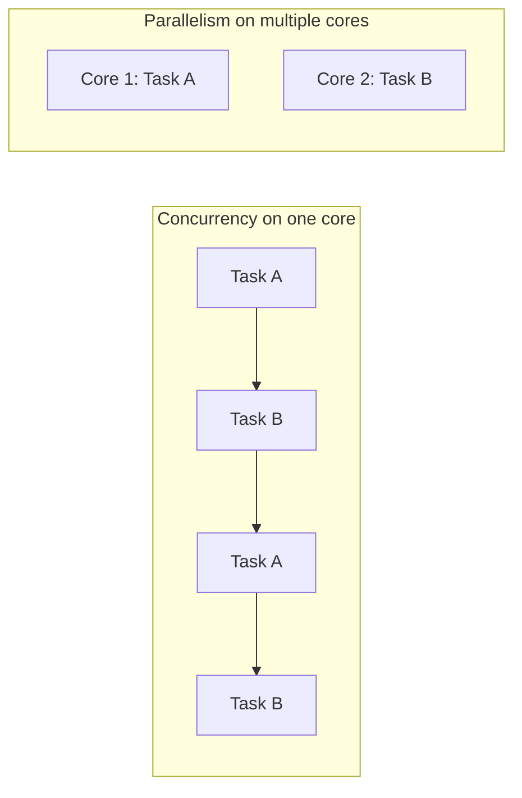
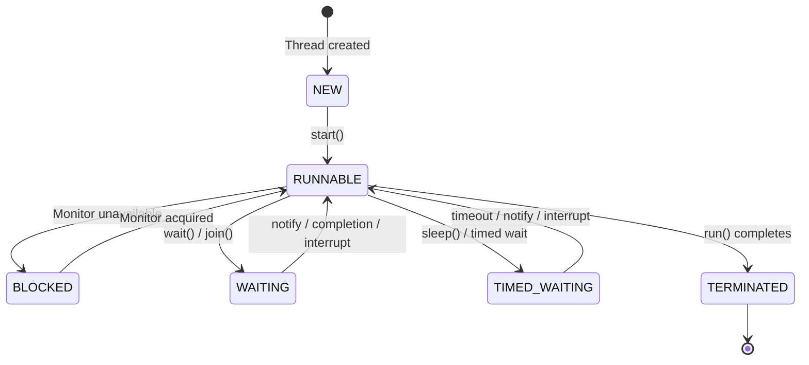
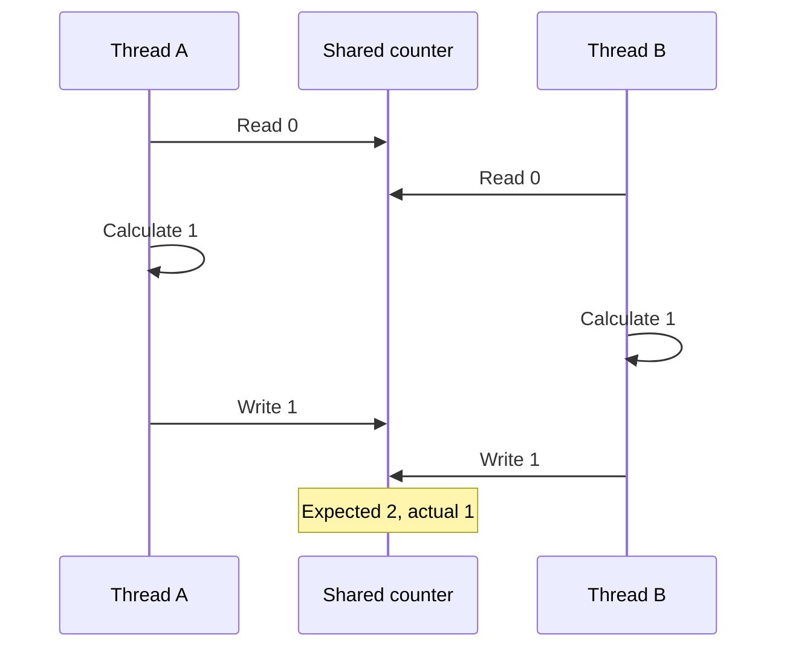
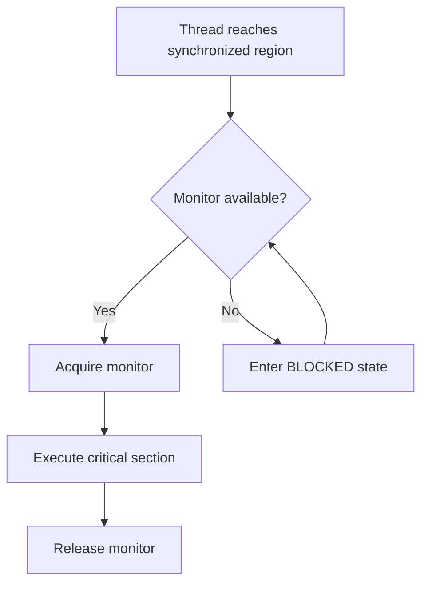
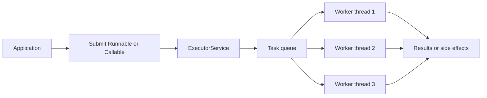
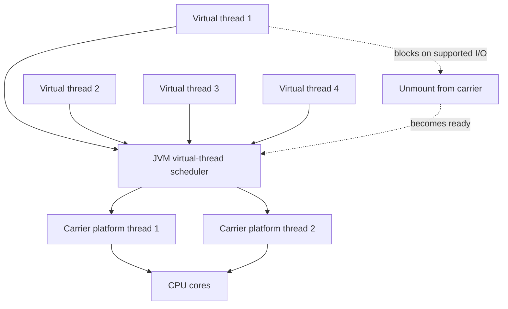
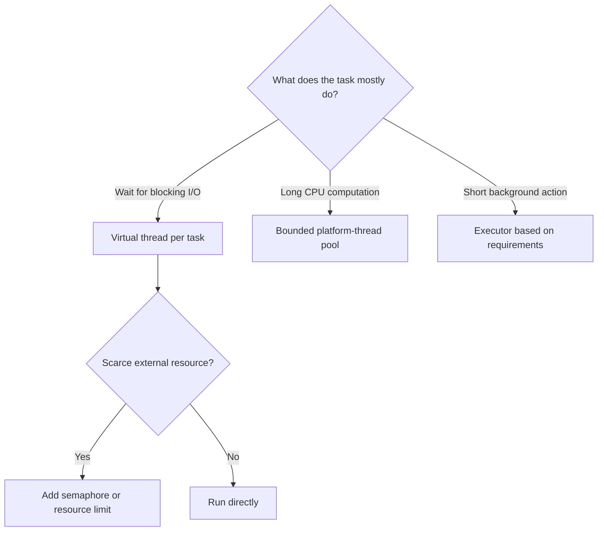
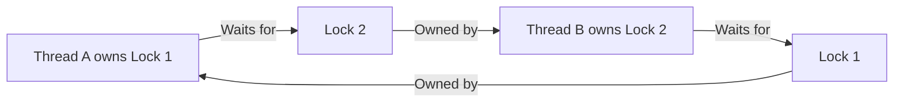

# Core Java Reference Material

> # Threads

🏚️ [Home](index.md) 🔸 ⬅️ Previous: [Previous](previous.md) 🔸 ➡️ Next: [Collections](collections.md)

## Table of Contents

1. [What Is a Thread?](#1-what-is-a-thread)
2. [Process vs Thread](#2-process-vs-thread)
3. [Concurrency vs Parallelism](#3-concurrency-vs-parallelism)
4. [Why Is Multithreading Used?](#4-why-is-multithreading-used)
5. [The Main Thread](#5-the-main-thread)
6. [Creating a Platform Thread](#6-creating-a-platform-thread)
7. [Runnable and Lambda Expressions](#7-runnable-and-lambda-expressions)
8. [Thread Builder API in Java 21](#8-thread-builder-api-in-java-21)
9. [start() vs run()](#9-start-vs-run)
10. [Thread Life Cycle and States](#10-thread-life-cycle-and-states)
11. [Important Thread Methods](#11-important-thread-methods)
12. [sleep() and yield()](#12-sleep-and-yield)
13. [Waiting for Completion with join()](#13-waiting-for-completion-with-join)
14. [Thread Interruption and Cooperative Cancellation](#14-thread-interruption-and-cooperative-cancellation)
15. [Thread Names, Priorities, and Daemon Threads](#15-thread-names-priorities-and-daemon-threads)
16. [Shared Data and Race Conditions](#16-shared-data-and-race-conditions)
17. [Synchronization](#17-synchronization)
18. [Object Monitors and Lock Scope](#18-object-monitors-and-lock-scope)
19. [Inter-Thread Communication](#19-inter-thread-communication)
20. [Producer–Consumer with BlockingQueue](#20-producerconsumer-with-blockingqueue)
21. [The volatile Keyword](#21-the-volatile-keyword)
22. [Atomic Variables](#22-atomic-variables)
23. [Lock and Condition](#23-lock-and-condition)
24. [Thread-Safe Collections](#24-thread-safe-collections)
25. [Executor Framework](#25-executor-framework)
26. [Thread Pools and Executor Shutdown](#26-thread-pools-and-executor-shutdown)
27. [Callable and Future](#27-callable-and-future)
28. [CompletableFuture](#28-completablefuture)
29. [Scheduled Tasks](#29-scheduled-tasks)
30. [Virtual Threads in Java 21](#30-virtual-threads-in-java-21)
31. [Platform Threads vs Virtual Threads](#31-platform-threads-vs-virtual-threads)
32. [Deadlock, Starvation, and Livelock](#32-deadlock-starvation-and-livelock)
33. [Uncaught Exceptions and Debugging](#33-uncaught-exceptions-and-debugging)
34. [Threading Best Practices](#34-threading-best-practices)
35. [Common Threading Errors](#35-common-threading-errors)
36. [Frequently Asked Interview Questions](#36-frequently-asked-interview-questions)

## 1. What Is a Thread?

A **thread** is an independent path of execution inside a running program.

Every Java application has at least one thread. In a normal console application, the JVM starts the **main thread**, which executes the `main()` method.

A single process may contain several threads performing different tasks:



Each thread has its own:

- program counter;
- call stack;
- local variables; and
- current execution state.

Threads inside the same process share objects stored in the heap. This sharing makes communication efficient, but it also creates concurrency risks.

[↑ Go to Table of Contents](#table-of-contents)

## 2. Process vs Thread

| Process | Thread |
| --- | --- |
| A running program with its own memory space | A path of execution inside a process |
| Usually isolated from other processes | Shares process resources with sibling threads |
| More expensive to create and switch | Generally lighter than a process |
| Communicates through inter-process mechanisms | Can communicate through shared objects |
| A process may contain many threads | A thread belongs to one process |

If one Java program starts four threads, it is still normally one JVM process with four execution paths.

[↑ Go to Table of Contents](#table-of-contents)

## 3. Concurrency vs Parallelism

**Concurrency** means multiple tasks make progress during overlapping periods. They may take turns on one CPU core.

**Parallelism** means multiple tasks execute at the same physical instant, normally on different CPU cores.



A concurrent program is not automatically parallel. The operating system and JVM scheduler decide when runnable platform threads receive CPU time.

[↑ Go to Table of Contents](#table-of-contents)

## 4. Why Is Multithreading Used?

Multithreading can help an application:

- remain responsive while background work continues;
- process independent tasks concurrently;
- serve multiple client requests;
- overlap computation with file, network, or database waiting;
- use multiple CPU cores for suitable CPU-bound work; and
- model independent activities clearly.

### Common examples

| Application | Possible threads or tasks |
| --- | --- |
| Web server | One task per incoming request |
| Text editor | User interface, auto-save, spell-check |
| Banking system | Independent transactions |
| File downloader | Download, progress reporting, checksum |
| Game | Rendering, input, sound, networking |

### Challenges

Multithreading also introduces:

- race conditions;
- visibility problems;
- deadlocks;
- difficult testing;
- non-deterministic output; and
- resource-management concerns.

Use threads when tasks can make useful independent progress. Do not add concurrency when sequential code is already sufficient.

[↑ Go to Table of Contents](#table-of-contents)

## 5. The Main Thread

The JVM invokes `main()` on a thread normally named `main`.

```java
public class MainThreadExample {

    public static void main(String[] args) {
        Thread current = Thread.currentThread();

        System.out.println("Name: " + current.getName());
        System.out.println("ID: " + current.threadId());
        System.out.println("State: " + current.getState());
        System.out.println("Virtual: " + current.isVirtual());
    }
}
```

`Thread.currentThread()` returns the `Thread` object representing the currently executing thread. In Java 21, `threadId()` is preferred to the deprecated `getId()` method.

[↑ Go to Table of Contents](#table-of-contents)

## 6. Creating a Platform Thread

A **platform thread** is normally mapped to an operating-system thread.

### Approach 1: Extend `Thread`

```java
class GreetingThread extends Thread {

    @Override
    public void run() {
        System.out.println(
                "Running on " + Thread.currentThread().getName());
    }
}

public class ExtendingThreadExample {

    public static void main(String[] args) throws InterruptedException {
        Thread thread = new GreetingThread();
        thread.setName("greeting-worker");
        thread.start();
        thread.join();
    }
}
```

### Approach 2: Pass a `Runnable`

```java
class GreetingTask implements Runnable {

    @Override
    public void run() {
        System.out.println(
                "Running on " + Thread.currentThread().getName());
    }
}

public class RunnableExample {

    public static void main(String[] args) throws InterruptedException {
        Runnable task = new GreetingTask();
        Thread thread = new Thread(task, "greeting-worker");

        thread.start();
        thread.join();
    }
}
```

Implementing `Runnable` is usually preferred because it separates the task from the mechanism used to run the task. The task class also remains free to extend another class.

[↑ Go to Table of Contents](#table-of-contents)

## 7. Runnable and Lambda Expressions

`Runnable` is a functional interface containing one abstract method:

```java
void run();
```

It does not return a value and cannot declare a checked exception.

```java
public class LambdaThreadExample {

    public static void main(String[] args) throws InterruptedException {
        Runnable task = () -> {
            String name = Thread.currentThread().getName();
            System.out.println("Task executed by " + name);
        };

        Thread thread = new Thread(task, "lambda-worker");
        thread.start();
        thread.join();
    }
}
```

The lambda describes the work. A `Thread` or executor decides where and when that work runs.

[↑ Go to Table of Contents](#table-of-contents)

## 8. Thread Builder API in Java 21

Java 21 provides builder APIs for creating named platform and virtual threads.

```java
public class ThreadBuilderExample {

    public static void main(String[] args) throws InterruptedException {
        Runnable task = () -> System.out.println(
                Thread.currentThread());

        Thread platformThread = Thread.ofPlatform()
                .name("platform-worker")
                .start(task);

        Thread virtualThread = Thread.ofVirtual()
                .name("virtual-worker")
                .start(task);

        platformThread.join();
        virtualThread.join();
    }
}
```

Useful builder methods include:

| Method | Purpose |
| --- | --- |
| `Thread.ofPlatform()` | Begins creation of a platform thread |
| `Thread.ofVirtual()` | Begins creation of a virtual thread |
| `name(...)` | Assigns a name or naming sequence |
| `daemon(...)` | Configures a platform daemon thread |
| `start(task)` | Creates and immediately starts a thread |
| `unstarted(task)` | Creates a thread that must be started later |
| `factory()` | Creates a reusable `ThreadFactory` |

[↑ Go to Table of Contents](#table-of-contents)

## 9. start() vs run()

| `start()` | `run()` |
| --- | --- |
| Schedules a new thread | Executes like an ordinary method call |
| The JVM later invokes `run()` on the new thread | No new thread is created |
| Can be called only once on a `Thread` object | Can be called repeatedly as a method |
| Returns quickly after scheduling | Completes the task on the calling thread |

```java
Runnable task = () -> System.out.println(
        Thread.currentThread().getName());

Thread thread = new Thread(task, "worker");

thread.run();   // runs on main
thread.start(); // runs on worker
```

Calling `start()` a second time on the same `Thread` object throws `IllegalThreadStateException`.

[↑ Go to Table of Contents](#table-of-contents)

## 10. Thread Life Cycle and States

Java defines six thread states in `Thread.State`:

| State | Meaning |
| --- | --- |
| `NEW` | Created but not started |
| `RUNNABLE` | Executing or ready to execute |
| `BLOCKED` | Waiting to enter a synchronized region |
| `WAITING` | Waiting indefinitely for another action |
| `TIMED_WAITING` | Waiting for a limited time |
| `TERMINATED` | Execution has completed |



Java's `RUNNABLE` state covers both actively running and ready-to-run threads. State observations are snapshots and may change immediately.

[↑ Go to Table of Contents](#table-of-contents)

## 11. Important Thread Methods

| Method | Purpose |
| --- | --- |
| `start()` | Schedules the thread for execution |
| `run()` | Contains or delegates the task logic |
| `currentThread()` | Returns the current thread |
| `sleep(...)` | Pauses the current thread for at least a requested duration |
| `join()` | Waits for another thread to terminate |
| `interrupt()` | Requests interruption |
| `isInterrupted()` | Checks a thread's interrupt status without clearing it |
| `interrupted()` | Checks and clears the current thread's interrupt status |
| `isAlive()` | Checks whether a started thread has not terminated |
| `getState()` | Returns the current Java thread state |
| `getName()` / `setName()` | Reads or changes a thread name |
| `threadId()` | Returns the thread identifier |
| `isVirtual()` | Checks whether the thread is virtual |

Avoid deprecated control methods such as `stop()`, `suspend()`, and `resume()`. They can leave shared state inconsistent or cause deadlocks.

[↑ Go to Table of Contents](#table-of-contents)

## 12. sleep() and yield()

### `Thread.sleep()`

`sleep()` pauses the **current** thread for approximately the requested time.

```java
try {
    Thread.sleep(500);
    System.out.println("Half a second has passed.");
} catch (InterruptedException exception) {
    Thread.currentThread().interrupt();
}
```

Important points:

- `sleep()` is static; it always affects the current thread.
- The exact wake-up time depends on the scheduler and system timer.
- `sleep()` throws `InterruptedException` when interrupted.
- Sleeping does **not** release intrinsic locks already held by the thread.

### `Thread.yield()`

`yield()` is only a hint that the current thread is willing to let another runnable thread execute. The scheduler may ignore it. Do not use it for correctness or coordination.

[↑ Go to Table of Contents](#table-of-contents)

## 13. Waiting for Completion with join()

`join()` makes the current thread wait until another thread terminates.

```java
public class JoinExample {

    public static void main(String[] args) throws InterruptedException {
        Thread worker = new Thread(() -> {
            System.out.println("Worker started");

            try {
                Thread.sleep(300);
            } catch (InterruptedException exception) {
                Thread.currentThread().interrupt();
                return;
            }

            System.out.println("Worker finished");
        });

        worker.start();
        worker.join();

        System.out.println("Main continues after worker completion");
    }
}
```

Java 21 also provides `join(Duration)`, which returns `true` when the thread terminated within the duration.

```java
boolean completed = worker.join(Duration.ofSeconds(2));
```

`join()` establishes a useful completion relationship: actions performed by a thread happen-before another thread successfully returns from joining it.

[↑ Go to Table of Contents](#table-of-contents)

## 14. Thread Interruption and Cooperative Cancellation

Java does not safely force a thread to stop. **Interruption** is a cooperative cancellation mechanism.

One thread sets another thread's interrupt status:

```java
worker.interrupt();
```

The worker must respond:

```java
public class InterruptionExample {

    public static void main(String[] args) throws InterruptedException {
        Thread worker = Thread.ofPlatform().start(() -> {
            while (!Thread.currentThread().isInterrupted()) {
                System.out.println("Working...");

                try {
                    Thread.sleep(200);
                } catch (InterruptedException exception) {
                    Thread.currentThread().interrupt();
                }
            }

            System.out.println("Worker stopped cooperatively");
        });

        Thread.sleep(600);
        worker.interrupt();
        worker.join();
    }
}
```

### Interrupt methods

| Method | Behavior |
| --- | --- |
| `thread.interrupt()` | Sets interrupt status or wakes certain blocking operations |
| `thread.isInterrupted()` | Reads that thread's status without clearing it |
| `Thread.interrupted()` | Reads and clears the current thread's status |

Methods such as `sleep()`, `wait()`, and `join()` throw `InterruptedException` and clear the interrupt status. If a method cannot propagate the exception, it should usually restore the status with `Thread.currentThread().interrupt()` and finish or return.

[↑ Go to Table of Contents](#table-of-contents)

## 15. Thread Names, Priorities, and Daemon Threads

### Thread names

Names make logs and thread dumps easier to understand.

```java
Thread worker = Thread.ofPlatform()
        .name("order-worker")
        .unstarted(task);
```

### Thread priorities

Platform-thread priorities range from `Thread.MIN_PRIORITY` (`1`) to `Thread.MAX_PRIORITY` (`10`). The normal priority is `5`.

Priority is only a scheduling hint and varies by operating system. Never use priority to guarantee execution order or correctness.

Virtual threads have a fixed priority that cannot be changed.

### Daemon threads

The JVM shutdown sequence begins when all started non-daemon platform threads have terminated. Daemon threads are intended for supporting background work.

```java
Thread cleaner = Thread.ofPlatform()
        .name("cache-cleaner")
        .daemon(true)
        .start(task);
```

Do not rely on a daemon thread to complete critical saving or transaction work. Virtual threads are always daemon threads.

[↑ Go to Table of Contents](#table-of-contents)

## 16. Shared Data and Race Conditions

A **race condition** occurs when the result depends on the unpredictable timing of threads accessing shared mutable state.

Consider `counter++`. It is not one indivisible operation:

1. Read the current value.
2. Add one.
3. Write the new value.



### Unsafe example

```java
class UnsafeCounter {
    private int value;

    void increment() {
        value++;
    }

    int getValue() {
        return value;
    }
}
```

Possible solutions include:

- `synchronized`;
- `Lock` implementations;
- atomic variables;
- thread confinement;
- immutable data; and
- message passing or concurrent data structures.

[↑ Go to Table of Contents](#table-of-contents)

## 17. Synchronization

The `synchronized` keyword provides:

- **mutual exclusion** — one thread at a time executes code protected by the same monitor; and
- **memory visibility** — changes made before releasing the monitor become visible to a later thread acquiring the same monitor.

### Synchronized method

```java
class SynchronizedCounter {
    private int value;

    synchronized void increment() {
        value++;
    }

    synchronized int getValue() {
        return value;
    }
}
```

An instance synchronized method locks `this`.

### Synchronized block

```java
class BankAccount {
    private final Object balanceLock = new Object();
    private long balance;

    void deposit(long amount) {
        if (amount <= 0) {
            throw new IllegalArgumentException("amount must be positive");
        }

        synchronized (balanceLock) {
            balance += amount;
        }
    }

    long getBalance() {
        synchronized (balanceLock) {
            return balance;
        }
    }
}
```

A private lock object prevents unrelated external code from accidentally using the same monitor.

[↑ Go to Table of Contents](#table-of-contents)

## 18. Object Monitors and Lock Scope

Every Java object can act as an intrinsic lock or **monitor**.



| Construct | Monitor used |
| --- | --- |
| Instance synchronized method | Current object, `this` |
| Static synchronized method | The class's `Class` object |
| `synchronized(lock)` block | The referenced `lock` object |

Synchronization is **reentrant**. A thread that already owns a monitor can enter another synchronized region guarded by the same monitor.

Keep critical sections small, but protect the complete invariant. Locking only the read while leaving the related write outside the lock does not make a compound operation safe.

[↑ Go to Table of Contents](#table-of-contents)

## 19. Inter-Thread Communication

`wait()`, `notify()`, and `notifyAll()` are methods of `Object`. They coordinate threads using the same object's monitor.

| Method | Behavior |
| --- | --- |
| `wait()` | Releases the current object's monitor and waits |
| `notify()` | Wakes one arbitrarily selected waiter |
| `notifyAll()` | Wakes all waiters on the object's monitor |

The caller must own the monitor, normally by being inside a synchronized method or block. Otherwise, `IllegalMonitorStateException` is thrown.

```mermaid
sequenceDiagram
    participant C as Consumer
    participant M as Shared monitor
    participant P as Producer
    C->>M: Acquire monitor
    C->>M: Condition false; wait()
    Note over C,M: Consumer releases monitor
    P->>M: Acquire monitor
    P->>M: Change shared state
    P->>M: notifyAll()
    P->>M: Release monitor
    C->>M: Reacquire monitor
    C->>C: Recheck condition and continue
```

Always test the condition in a `while` loop because a thread may wake without the expected condition becoming true.

```java
synchronized (lock) {
    while (!conditionIsTrue()) {
        lock.wait();
    }

    performAction();
}
```

Prefer higher-level tools such as `BlockingQueue`, `CountDownLatch`, `Semaphore`, or `Condition` for normal application code.

[↑ Go to Table of Contents](#table-of-contents)

## 20. Producer–Consumer with BlockingQueue

A `BlockingQueue` safely coordinates producers and consumers. `put()` waits when a bounded queue is full, and `take()` waits when it is empty.

```java
import java.util.concurrent.ArrayBlockingQueue;
import java.util.concurrent.BlockingQueue;

public class ProducerConsumerExample {

    public static void main(String[] args) throws InterruptedException {
        BlockingQueue<String> queue = new ArrayBlockingQueue<>(3);

        Thread producer = Thread.ofPlatform().name("producer").start(() -> {
            try {
                for (int number = 1; number <= 5; number++) {
                    String item = "item-" + number;
                    queue.put(item);
                    System.out.println("Produced " + item);
                }

                queue.put("STOP");
            } catch (InterruptedException exception) {
                Thread.currentThread().interrupt();
            }
        });

        Thread consumer = Thread.ofPlatform().name("consumer").start(() -> {
            try {
                String item;

                while (!(item = queue.take()).equals("STOP")) {
                    System.out.println("Consumed " + item);
                }
            } catch (InterruptedException exception) {
                Thread.currentThread().interrupt();
            }
        });

        producer.join();
        consumer.join();
    }
}
```

The queue owns the coordination logic, so application code does not directly call `wait()` or `notifyAll()`.

[↑ Go to Table of Contents](#table-of-contents)


## 21. The volatile Keyword

`volatile` tells the JVM that reads and writes of a field must follow special visibility and ordering rules.

```java
class StoppableTask implements Runnable {
    private volatile boolean running = true;

    void stop() {
        running = false;
    }

    @Override
    public void run() {
        while (running) {
            performOneUnitOfWork();
        }
    }

    private void performOneUnitOfWork() {
        // Perform a short operation.
    }
}
```

When one thread writes `false`, another thread reading `running` can observe the change without acquiring the same monitor.

### What `volatile` does not provide

`volatile` does not make a multi-step update atomic:

```java
private volatile int count;

void increment() {
    count++; // still read, modify, and write
}
```

Use `AtomicInteger`, a lock, or `synchronized` when several operations must act as one indivisible update.

[↑ Go to Table of Contents](#table-of-contents)

## 22. Atomic Variables

Classes in `java.util.concurrent.atomic` support thread-safe atomic operations on individual variables.

```java
import java.util.concurrent.atomic.AtomicInteger;

class AtomicCounter {
    private final AtomicInteger value = new AtomicInteger();

    int increment() {
        return value.incrementAndGet();
    }

    int getValue() {
        return value.get();
    }
}
```

Common classes include:

| Class | Purpose |
| --- | --- |
| `AtomicInteger` | Atomic integer operations |
| `AtomicLong` | Atomic long operations |
| `AtomicBoolean` | Atomic boolean operations |
| `AtomicReference<T>` | Atomic object-reference operations |
| `LongAdder` | High-throughput counter under contention |

Typical atomic methods include:

- `get()`;
- `set(value)`;
- `incrementAndGet()`;
- `getAndIncrement()`;
- `addAndGet(delta)`; and
- `compareAndSet(expected, update)`.

Atomic variables are excellent for independent counters and state transitions. They do not automatically protect invariants spanning several fields.

[↑ Go to Table of Contents](#table-of-contents)

## 23. Lock and Condition

`Lock` provides explicit locking operations. `ReentrantLock` is its most common implementation.

```java
import java.util.concurrent.locks.Lock;
import java.util.concurrent.locks.ReentrantLock;

class LockedCounter {
    private final Lock lock = new ReentrantLock();
    private int value;

    void increment() {
        lock.lock();

        try {
            value++;
        } finally {
            lock.unlock();
        }
    }

    int getValue() {
        lock.lock();

        try {
            return value;
        } finally {
            lock.unlock();
        }
    }
}
```

Always release an explicitly acquired lock in a `finally` block.

### `synchronized` vs `ReentrantLock`

| `synchronized` | `ReentrantLock` |
| --- | --- |
| Language keyword | Library class |
| Lock release is automatic | Must call `unlock()` |
| Simple and suitable for many cases | Supports advanced locking features |
| One monitor wait set | Can create several `Condition` objects |
| No timed lock attempt | Supports `tryLock()` and timed attempts |
| Entry is not interruptible | Supports `lockInterruptibly()` |

A `Condition` provides `await()`, `signal()`, and `signalAll()` operations associated with a `Lock`. As with `wait()`, check the condition in a loop.

[↑ Go to Table of Contents](#table-of-contents)

## 24. Thread-Safe Collections

Normal `ArrayList`, `HashSet`, and `HashMap` instances are not designed for unsynchronized concurrent mutation.

The `java.util.concurrent` package provides purpose-built alternatives:

| Type | Suitable use |
| --- | --- |
| `ConcurrentHashMap` | Concurrent key-value access and updates |
| `CopyOnWriteArrayList` | Many reads and very few writes |
| `ConcurrentLinkedQueue` | Non-blocking concurrent FIFO queue |
| `ArrayBlockingQueue` | Bounded producer–consumer queue |
| `LinkedBlockingQueue` | Optionally bounded blocking queue |
| `ConcurrentSkipListMap` | Concurrent sorted map |

### Atomic map update

```java
ConcurrentHashMap<String, Integer> counts = new ConcurrentHashMap<>();

counts.merge("Java", 1, Integer::sum);
```

Do not replace the atomic operation with an unsafe compound sequence:

```java
// Not an atomic increment, even when the map is concurrent.
Integer oldValue = counts.get("Java");
counts.put("Java", oldValue + 1);
```

Synchronized wrappers such as `Collections.synchronizedList(...)` are also available, but iteration normally requires explicit synchronization on the wrapper.

[↑ Go to Table of Contents](#table-of-contents)

## 25. Executor Framework

Creating threads directly mixes task submission with thread management. The **Executor Framework** separates these responsibilities.



Important interfaces and classes:

| Component | Purpose |
| --- | --- |
| `Executor` | Executes submitted `Runnable` tasks |
| `ExecutorService` | Adds submission, lifecycle, and result operations |
| `ScheduledExecutorService` | Schedules delayed or periodic tasks |
| `Executors` | Factory methods for common executors |
| `ThreadPoolExecutor` | Configurable platform-thread pool |
| `Future<V>` | Represents a pending result |

### Basic executor example

```java
import java.util.concurrent.ExecutorService;
import java.util.concurrent.Executors;

public class ExecutorExample {

    public static void main(String[] args) {
        try (ExecutorService executor =
                     Executors.newFixedThreadPool(3)) {

            for (int taskNumber = 1; taskNumber <= 5; taskNumber++) {
                int number = taskNumber;

                executor.submit(() -> System.out.println(
                        "Task " + number + " on "
                                + Thread.currentThread().getName()));
            }
        }
    }
}
```

In Java 21, `ExecutorService` is `AutoCloseable`. Closing it performs an orderly shutdown and waits for tasks to finish.

[↑ Go to Table of Contents](#table-of-contents)

## 26. Thread Pools and Executor Shutdown

A platform-thread pool reuses a limited number of worker threads for multiple tasks.

### Common executor factories

| Factory | Behavior | Caution |
| --- | --- | --- |
| `newFixedThreadPool(n)` | Reuses `n` workers | Uses an unbounded task queue |
| `newSingleThreadExecutor()` | Runs tasks sequentially | One long task delays everything |
| `newCachedThreadPool()` | Creates workers as needed and reuses idle workers | Thread count may grow significantly |
| `newWorkStealingPool()` | Uses work-stealing workers | Execution order is not guaranteed |
| `newVirtualThreadPerTaskExecutor()` | Creates one virtual thread per task | Number of submitted tasks is unbounded |

Factory methods are convenient, but server applications often create a configured `ThreadPoolExecutor` with explicit limits and a rejection policy.

### Manual shutdown pattern

```java
ExecutorService executor = Executors.newFixedThreadPool(4);

try {
    executor.submit(task1);
    executor.submit(task2);
} finally {
    executor.shutdown();

    try {
        if (!executor.awaitTermination(10, TimeUnit.SECONDS)) {
            executor.shutdownNow();

            if (!executor.awaitTermination(10, TimeUnit.SECONDS)) {
                System.err.println("Executor did not terminate");
            }
        }
    } catch (InterruptedException exception) {
        executor.shutdownNow();
        Thread.currentThread().interrupt();
    }
}
```

| Method | Purpose |
| --- | --- |
| `shutdown()` | Stops accepting new tasks and finishes accepted tasks |
| `shutdownNow()` | Attempts to interrupt running tasks and returns queued tasks |
| `awaitTermination(...)` | Waits for termination up to a time limit |
| `isShutdown()` | Reports whether shutdown was requested |
| `isTerminated()` | Reports whether all tasks have completed after shutdown |

[↑ Go to Table of Contents](#table-of-contents)

## 27. Callable and Future

`Callable<V>` represents a task that returns a value and may throw a checked exception.

```java
V call() throws Exception;
```

`Future<V>` represents its pending result.

```java
import java.util.concurrent.Callable;
import java.util.concurrent.ExecutionException;
import java.util.concurrent.ExecutorService;
import java.util.concurrent.Executors;
import java.util.concurrent.Future;

public class CallableExample {

    public static void main(String[] args)
            throws ExecutionException, InterruptedException {

        Callable<Integer> task = () -> {
            int total = 0;

            for (int number = 1; number <= 100; number++) {
                total += number;
            }

            return total;
        };

        try (ExecutorService executor =
                     Executors.newSingleThreadExecutor()) {

            Future<Integer> future = executor.submit(task);
            Integer result = future.get();

            System.out.println("Result: " + result);
        }
    }
}
```

### Important `Future` methods

| Method | Purpose |
| --- | --- |
| `get()` | Waits and returns the result |
| `get(timeout, unit)` | Waits only up to a time limit |
| `cancel(mayInterrupt)` | Attempts cancellation |
| `isDone()` | Reports completion, failure, or cancellation |
| `isCancelled()` | Reports successful cancellation |

`get()` throws `ExecutionException` when the task fails. The original failure is available through `getCause()`.

[↑ Go to Table of Contents](#table-of-contents)

## 28. CompletableFuture

`CompletableFuture<T>` represents a future result that can be transformed, combined, and handled without manually blocking at every step.

```java
import java.util.concurrent.CompletableFuture;

public class CompletableFutureExample {

    public static void main(String[] args) {
        CompletableFuture<String> future = CompletableFuture
                .supplyAsync(() -> "java")
                .thenApply(String::toUpperCase)
                .thenApply(value -> "Result: " + value)
                .exceptionally(exception ->
                        "Failed: " + exception.getMessage());

        System.out.println(future.join());
    }
}
```

### Common methods

| Method | Purpose |
| --- | --- |
| `runAsync(...)` | Starts a task with no result |
| `supplyAsync(...)` | Starts a task that produces a result |
| `thenApply(...)` | Transforms a result |
| `thenAccept(...)` | Consumes a result |
| `thenCompose(...)` | Chains a dependent asynchronous operation |
| `thenCombine(...)` | Combines two independent results |
| `exceptionally(...)` | Provides failure recovery |
| `allOf(...)` | Represents completion of several futures |

Async methods without an explicit executor generally use the common `ForkJoinPool`. Supply an executor when the application needs control over resource use or task isolation.

[↑ Go to Table of Contents](#table-of-contents)

## 29. Scheduled Tasks

`ScheduledExecutorService` schedules delayed or recurring tasks.

```java
import java.util.concurrent.Executors;
import java.util.concurrent.ScheduledExecutorService;
import java.util.concurrent.TimeUnit;

public class ScheduledTaskExample {

    public static void main(String[] args) throws InterruptedException {
        ScheduledExecutorService scheduler =
                Executors.newSingleThreadScheduledExecutor();

        scheduler.schedule(
                () -> System.out.println("Runs once after one second"),
                1,
                TimeUnit.SECONDS
        );

        scheduler.scheduleAtFixedRate(
                () -> System.out.println("Periodic task"),
                0,
                500,
                TimeUnit.MILLISECONDS
        );

        Thread.sleep(1_600);
        scheduler.shutdownNow();
    }
}
```

### Fixed rate vs fixed delay

| Method | Next execution is measured from |
| --- | --- |
| `scheduleAtFixedRate(...)` | Planned start time of the previous execution |
| `scheduleWithFixedDelay(...)` | Completion of the previous execution |

Executions of one periodic task do not overlap with themselves. If a periodic execution throws an exception, later executions of that task are suppressed unless the task handles the failure.

[↑ Go to Table of Contents](#table-of-contents)

## 30. Virtual Threads in Java 21

Virtual threads became a standard Java feature in Java 21. They are lightweight threads scheduled primarily by the Java runtime rather than being permanently tied one-to-one to operating-system threads.

They are designed for tasks that spend much of their time waiting for:

- network responses;
- database operations;
- file operations;
- message queues; or
- other blocking I/O.

### Create one virtual thread

```java
public class VirtualThreadExample {

    public static void main(String[] args) throws InterruptedException {
        Thread thread = Thread.startVirtualThread(() -> {
            System.out.println("Virtual: "
                    + Thread.currentThread().isVirtual());
        });

        thread.join();
    }
}
```

### Use the builder API

```java
Thread thread = Thread.ofVirtual()
        .name("request-42")
        .start(task);
```

### Use a virtual-thread-per-task executor

```java
import java.util.concurrent.ExecutorService;
import java.util.concurrent.Executors;

public class VirtualExecutorExample {

    public static void main(String[] args) {
        try (ExecutorService executor =
                     Executors.newVirtualThreadPerTaskExecutor()) {

            for (int taskNumber = 1; taskNumber <= 10_000; taskNumber++) {
                int number = taskNumber;

                executor.submit(() -> handleRequest(number));
            }
        }
    }

    private static void handleRequest(int number) {
        try {
            Thread.sleep(100);
            System.out.println("Completed " + number);
        } catch (InterruptedException exception) {
            Thread.currentThread().interrupt();
        }
    }
}
```

### How virtual-thread scheduling works



When a virtual thread blocks in a supported operation, the JVM can usually unmount it from its carrier. The carrier can then run another virtual thread.

### Important virtual-thread guidance

- Do not pool virtual threads; create one per task.
- Virtual threads improve scalability and throughput for blocking workloads, not the speed of an individual operation.
- They do not create additional CPU cores.
- Use semaphores or resource pools to limit access to scarce downstream resources.
- Avoid using `ThreadLocal` as an expensive object pool because a program may create very many virtual threads.
- In Java 21, long blocking operations while holding an intrinsic monitor may pin a virtual thread to its carrier; keep synchronized regions short.

[↑ Go to Table of Contents](#table-of-contents)

## 31. Platform Threads vs Virtual Threads

| Platform thread | Virtual thread |
| --- | --- |
| Usually mapped one-to-one to an OS thread | Scheduled by the JVM over carrier platform threads |
| Relatively expensive and limited | Lightweight and suitable in very large numbers |
| Appropriate for CPU-bound and general tasks | Best for many blocking, I/O-bound tasks |
| Often reused through a bounded pool | Normally one new virtual thread per task |
| May be daemon or non-daemon | Always daemon |
| Has configurable priority | Has fixed priority |
| Normally has an automatically generated name | Has no name unless one is assigned |

### Task-type decision guide



A virtual-thread application still needs correct synchronization. Lightweight threads do not remove race conditions, deadlocks, or resource limits.

[↑ Go to Table of Contents](#table-of-contents)

## 32. Deadlock, Starvation, and Livelock

### Deadlock

A deadlock occurs when threads wait permanently for one another's resources.



Deadlock example:

```java
synchronized (firstLock) {
    synchronized (secondLock) {
        performWork();
    }
}
```

If another thread acquires `secondLock` and then waits for `firstLock`, neither can proceed.

Ways to reduce deadlock risk:

- acquire multiple locks in one documented global order;
- avoid holding a lock while calling unknown external code;
- keep critical sections short;
- use `tryLock()` with a timeout when appropriate; and
- use higher-level concurrent structures.

### Starvation

Starvation occurs when a thread repeatedly fails to obtain CPU time or a required resource because other threads dominate it.

### Livelock

Livelock occurs when threads keep responding to each other but make no useful progress. For example, two workers repeatedly release resources for each other and immediately retry in the same pattern.

[↑ Go to Table of Contents](#table-of-contents)

## 33. Uncaught Exceptions and Debugging

An exception that escapes `run()` terminates that thread. It does not automatically terminate every other thread.

### Uncaught exception handler

```java
Thread worker = Thread.ofPlatform()
        .name("payment-worker")
        .uncaughtExceptionHandler((thread, exception) ->
                System.err.println(
                        thread.getName() + " failed: "
                                + exception.getMessage()))
        .unstarted(() -> {
            throw new IllegalStateException("Payment unavailable");
        });

worker.start();
```

For executor tasks submitted with `submit()`, failures are normally captured by the returned `Future`. Inspect the future or add application-level error handling.

### Useful diagnostic tools

| Tool or technique | Purpose |
| --- | --- |
| Thread names | Identify work in logs and dumps |
| `jcmd <pid> Thread.print` | Prints platform and relevant thread information |
| `jstack <pid>` | Captures a thread dump |
| Java Flight Recorder | Records thread, lock, and performance events |
| `ThreadMXBean` | Programmatic thread and deadlock information |
| Timeouts | Prevent unbounded waiting and expose stalled operations |

Thread dumps are especially useful for diagnosing deadlocks, lock contention, and threads stuck in blocking calls.

[↑ Go to Table of Contents](#table-of-contents)

## 34. Threading Best Practices

- Prefer immutable data and thread confinement.
- Separate tasks (`Runnable` or `Callable`) from execution policy.
- Prefer executors to manually managing many platform threads.
- Use virtual threads for large numbers of blocking I/O tasks in Java 21.
- Do not pool virtual threads.
- Give important threads meaningful names.
- Keep shared mutable state small and clearly guarded.
- Document which lock protects each field or invariant.
- Keep synchronized regions short.
- Acquire multiple locks in a consistent order.
- Use concurrent collections and coordination utilities instead of writing custom low-level protocols.
- Respond to interruption and restore the status when interruption cannot be propagated.
- Place `unlock()` and resource cleanup in `finally` blocks.
- Shut down executors deterministically.
- Use bounded queues or back-pressure where task submission can exceed processing capacity.
- Use timeouts for external calls and potentially unbounded waits.
- Never use `sleep()` to guess when another task has completed; use `join()`, `Future`, latches, or structured coordination.
- Test concurrency repeatedly and inspect behavior under realistic load.

[↑ Go to Table of Contents](#table-of-contents)

## 35. Common Threading Errors

| Problem | Likely cause or correction |
| --- | --- |
| Task runs on `main` instead of a worker | `run()` was called directly instead of `start()` |
| `IllegalThreadStateException` | The same `Thread` object was started more than once |
| Lost increments | Shared read-modify-write operation is not atomic |
| Stale field value | Missing synchronization, `volatile`, or another visibility guarantee |
| `IllegalMonitorStateException` | `wait`, `notify`, or `notifyAll` called without owning the monitor |
| Program does not exit | Non-daemon thread or executor remains active |
| Executor stops accepting tasks | It was already shut down |
| `RejectedExecutionException` | Executor is shut down or its bounded capacity is exhausted |
| Thread ignores cancellation | Task does not check or correctly handle interruption |
| Application hangs | Deadlock, lost notification, unbounded wait, or blocked external operation |
| CPU usage stays high while no work completes | Busy-wait loop or livelock |
| Virtual-thread throughput unexpectedly drops | Blocking while pinned or contention on a scarce resource |

[↑ Go to Table of Contents](#table-of-contents)

## 36. Frequently Asked Interview Questions

> ### Fundamental Questions

### 1. What is a thread?

A thread is an independent path of execution within a process. Threads in the same Java process have separate stacks but share heap objects and process resources.

### 2. What is multithreading?

Multithreading is the execution of multiple threads within one process so that several tasks can make progress concurrently.

### 3. What is the difference between a process and a thread?

A process has its own memory space and resources. A thread is an execution path inside a process and shares the process's heap and resources with other threads.

### 4. What is the difference between concurrency and parallelism?

Concurrency means tasks make progress during overlapping time periods. Parallelism means tasks execute simultaneously on different processing units.

### 5. What is the main thread?

It is the thread on which the JVM normally invokes the application's `main()` method. Other threads can be created from it or from any running thread.

### 6. What are the ways to create or execute a task concurrently?

Common approaches are:

- extend `Thread`;
- implement `Runnable`;
- pass a lambda as a `Runnable`;
- submit `Runnable` or `Callable` tasks to an executor; or
- create platform or virtual threads through the Java 21 builder API.

For application code, `Runnable`, `Callable`, and executors usually provide better separation than extending `Thread`.

### 7. Why is implementing `Runnable` usually preferred to extending `Thread`?

It separates the task from thread management and allows the task class to extend another class. The same task can also be executed by a platform thread, virtual thread, or executor.

### 8. What is the difference between `start()` and `run()`?

`start()` schedules a new thread and the JVM later invokes `run()` on it. Calling `run()` directly is an ordinary method call on the current thread.

### 9. Can a thread be started twice?

No. Calling `start()` more than once on the same `Thread` object throws `IllegalThreadStateException`. Create a new `Thread` object for another execution.

### 10. Can the execution order of threads be predicted?

Normally, no. Scheduling depends on the JVM, operating system, processor availability, blocking operations, and timing. Correct code must not depend on an assumed order unless it establishes coordination.

> ### Life-Cycle and Coordination Questions

### 11. What are the Java thread states?

They are `NEW`, `RUNNABLE`, `BLOCKED`, `WAITING`, `TIMED_WAITING`, and `TERMINATED`.

### 12. What is the difference between `BLOCKED` and `WAITING`?

`BLOCKED` specifically means a thread is waiting to acquire an intrinsic monitor for a synchronized region. `WAITING` means it is waiting indefinitely for another action, such as notification or another thread's termination.

### 13. What does `sleep()` do?

It pauses the current thread for approximately the requested duration. It does not release intrinsic locks and may return later than requested.

### 14. What does `join()` do?

It makes the current thread wait until the target thread terminates, or until a supplied timeout expires.

### 15. What does `yield()` do?

It gives the scheduler a hint that the current thread is willing to yield processor use. The scheduler may ignore it, so it must not be used for synchronization.

### 16. What is thread interruption?

Interruption is a cooperative request for a thread to stop or change what it is doing. The target task must observe the interrupt status or handle `InterruptedException` correctly.

### 17. What is the difference between `isInterrupted()` and `interrupted()`?

`isInterrupted()` checks a thread's status without clearing it. Static `Thread.interrupted()` checks and clears the current thread's interrupt status.

### 18. Why should interrupt status sometimes be restored?

Blocking methods clear the status when they throw `InterruptedException`. If code catches the exception but cannot propagate it, calling `Thread.currentThread().interrupt()` preserves the cancellation signal for higher-level code.

### 19. What is a daemon thread?

A daemon platform thread performs supporting background work and does not by itself keep the JVM alive. Critical work should not rely on daemon completion. Virtual threads are always daemon threads.

### 20. Does a higher thread priority guarantee earlier execution?

No. Priority is only a scheduler hint and its effect is platform-dependent.

> ### Thread-Safety Questions

### 21. What is a race condition?

A race condition occurs when multiple threads access shared mutable state and the result depends on their unpredictable interleaving.

### 22. What is thread safety?

Code is thread-safe when it behaves correctly under permitted concurrent access without corrupting state, violating invariants, or exposing unsafe visibility.

### 23. What does `synchronized` provide?

It provides mutual exclusion for code guarded by the same monitor and establishes memory-visibility ordering between monitor release and later monitor acquisition.

### 24. What lock is used by an instance synchronized method?

It locks the current object, `this`.

### 25. What lock is used by a static synchronized method?

It locks the `Class` object representing the declaring class.

### 26. Is synchronization reentrant?

Yes. A thread that already owns a monitor can enter another synchronized region guarded by that same monitor.

### 27. Does `sleep()` release a lock?

No. A sleeping thread continues to own any monitors it acquired.

### 28. Does `wait()` release a lock?

It releases the monitor of the object on which `wait()` is called. It does not release other locks held by the thread.

### 29. Why should `wait()` be called inside a `while` loop?

The condition may no longer hold when the thread reacquires the monitor, and spurious wakeups are permitted. The thread must recheck the condition before proceeding.

### 30. What is the difference between `notify()` and `notifyAll()`?

`notify()` wakes one arbitrarily selected waiter. `notifyAll()` wakes all waiters on that monitor, after which they compete to reacquire it. `notifyAll()` is often safer when different conditions share a wait set.

### 31. What does `volatile` provide?

It provides visibility and ordering guarantees for reads and writes of one field. It does not make compound updates such as `count++` atomic.

### 32. What is an atomic variable?

It is a class such as `AtomicInteger` that supports indivisible operations like increment and compare-and-set without using an intrinsic monitor for each operation.

### 33. What is the difference between `synchronized` and `ReentrantLock`?

Both can provide mutual exclusion and visibility. `synchronized` is simpler and releases automatically. `ReentrantLock` adds timed, interruptible, and conditional locking but must be explicitly unlocked in `finally`.

### 34. Is `ConcurrentHashMap` enough to make every multi-step operation atomic?

No. Use its atomic methods such as `compute`, `merge`, `putIfAbsent`, or `replace`. A separate `get()` followed by `put()` is still a compound action.

> ### Executor and Utility Questions

### 35. What is an executor?

An executor accepts tasks and controls how they are run. It separates task definition from thread creation, scheduling, queuing, and lifecycle management.

### 36. What is a thread pool?

A thread pool maintains reusable platform worker threads. Submitted tasks wait in a queue or are assigned to available workers according to the executor configuration.

### 37. What is the difference between `execute()` and `submit()`?

`execute()` accepts a `Runnable` and returns no result. `submit()` accepts a `Runnable` or `Callable` and returns a `Future` representing completion, result, cancellation, or failure.

### 38. What is the difference between `Runnable` and `Callable`?

`Runnable.run()` returns no value and cannot declare a checked exception. `Callable.call()` returns a value and may throw a checked exception.

### 39. What is a `Future`?

It represents the pending outcome of an asynchronous task. It can be queried, awaited, cancelled, or used to retrieve the task result.

### 40. What is the difference between `shutdown()` and `shutdownNow()`?

`shutdown()` stops new submissions but completes accepted tasks. `shutdownNow()` attempts to interrupt running tasks and returns tasks that never began; it cannot guarantee that a task will stop.

### 41. What is `BlockingQueue` used for?

It safely coordinates producer and consumer threads. Blocking insertion and removal operations provide back-pressure and waiting without application code calling `wait()` and `notify()` directly.

### 42. What is `CompletableFuture`?

It represents an asynchronous computation whose result can be transformed, composed, combined, consumed, or recovered from failure through a fluent API.

> ### Java 21 Virtual-Thread Questions

### 43. What is a virtual thread?

A virtual thread is a lightweight Java thread scheduled by the JVM over a smaller number of carrier platform threads. It uses the familiar `Thread` API.

### 44. Why were virtual threads introduced?

They allow thread-per-task programming to scale to very large numbers of tasks that spend significant time blocked on I/O.

### 45. How do you create a virtual thread in Java 21?

```java
Thread thread = Thread.startVirtualThread(task);
```

or:

```java
Thread thread = Thread.ofVirtual().start(task);
```

For many independent tasks, use `Executors.newVirtualThreadPerTaskExecutor()`.

### 46. Are virtual threads faster than platform threads?

Not inherently. They reduce the cost of blocking and support much higher concurrency. They do not make CPU calculations faster or add processor cores.

### 47. Should virtual threads be pooled?

No. Virtual threads are intended to be cheap enough to create one per task. Limit access to scarce resources directly with a semaphore, connection pool, or another resource-specific mechanism.

### 48. Are virtual threads suitable for CPU-bound work?

They provide little benefit for long-running CPU-bound tasks. A platform-thread pool sized around available processors is normally more appropriate.

### 49. Do virtual threads remove the need for synchronization?

No. They execute ordinary Java code and can access shared mutable objects. Race conditions, deadlocks, and visibility rules still apply.

### 50. What is virtual-thread pinning in Java 21?

Pinning occurs when a virtual thread cannot unmount from its carrier during certain blocking operations, notably when it blocks while holding an intrinsic monitor in Java 21. Frequent or long pinning can reduce scalability, so keep such regions short and diagnose unexpected carrier contention.

> ### Scenario-Based Questions

### 51. Two threads increment a shared counter, but the final value is too small. Why?

The increment is a non-atomic read-modify-write operation, so updates can be lost. Protect it with synchronization or use an atomic counter.

### 52. A program finishes `main()` but does not exit. What should be checked?

Check for active non-daemon platform threads, executors that were not shut down, scheduled services, and blocking tasks that never complete.

### 53. A worker ignores `shutdownNow()`. Why?

`shutdownNow()` normally signals running tasks through interruption. The worker may be ignoring interrupt status, swallowing `InterruptedException`, or executing an operation that does not respond promptly to interruption.

### 54. A producer is faster than its consumer and memory usage keeps growing. What should change?

Use a bounded queue and define a back-pressure or rejection policy. An unbounded queue allows pending work to accumulate without limit.

### 55. A web service performs many independent blocking calls. Which Java 21 approach is suitable?

A virtual-thread-per-task executor is a strong candidate. The application must still limit scarce resources such as database connections and downstream service capacity.

### 56. A CPU-intensive calculation must use all cores. Which approach is suitable?

Use a bounded platform-thread executor or an appropriate fork/join design with parallelism related to available processors. Creating thousands of virtual threads will not create additional CPU capacity.

### 57. Why should `Thread.sleep()` not be used to coordinate tests?

It guesses how long another action will take and creates slow, unreliable tests. Use `join()`, `Future.get()`, latches, barriers, or another explicit completion signal with a timeout.

### 58. How can deadlocks be reduced?

Acquire locks in a consistent global order, keep lock scope small, avoid calling external code while locked, use time-bounded acquisition where appropriate, and prefer higher-level concurrency utilities.

### 59. Why might a `CopyOnWriteArrayList` perform poorly?

Every structural write copies its internal array. It is appropriate for read-heavy, write-light workloads, not frequent mutations or very large lists.

### 60. What threading best practices should a fresher mention in an interview?

- Minimize shared mutable state.
- Use immutable objects and thread confinement where possible.
- Prefer executors and high-level concurrency utilities.
- Handle interruption correctly.
- Shut down executors.
- Use bounded resources and timeouts.
- Keep critical sections short.
- Use virtual threads for suitable blocking workloads in Java 21.
- Do not pool virtual threads.
- Never assume thread execution order.

[↑ Go to Table of Contents](#table-of-contents)

---

🏚️ [Home](index.md) 🔸 ⬅️ Previous: [Previous](previous.md) 🔸 ➡️ Next: [Collections](collections.md)

<!-- Mermaid rendering support for GitHub Pages/Jekyll. -->
<script type="module">
  import mermaid from "https://cdn.jsdelivr.net/npm/mermaid@11/dist/mermaid.esm.min.mjs";

  document.querySelectorAll("pre > code.language-mermaid").forEach((code) => {
    const diagram = document.createElement("pre");
    diagram.className = "mermaid";
    diagram.textContent = code.textContent;
    code.parentElement.replaceWith(diagram);
  });

  mermaid.initialize({
    startOnLoad: false,
    securityLevel: "strict"
  });

  await mermaid.run({ querySelector: ".mermaid" });
</script>
