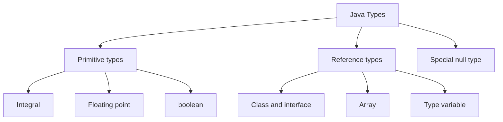

# Core Java Reference Material

> # Variables and Data Types in Java 21

🏚️ [Home](index.md) 🔸 ⬅️ Previous: [Java Basics](java-basics.md) 🔸 ➡️ Next: [Operators and Expressions](operators.md)

## Table of Contents

1. [What Is a Variable?](#1-what-is-a-variable)
2. [Java 21 Scope and Type-System Overview](#2-java-21-scope-and-type-system-overview)
3. [Static Types, Runtime Classes, and Values](#3-static-types-runtime-classes-and-values)
4. [Declaration, Initialization, and Assignment](#4-declaration-initialization-and-assignment)
5. [Identifiers and Naming Conventions](#5-identifiers-and-naming-conventions)
6. [Java's Eight Kinds of Variables](#6-javas-eight-kinds-of-variables)
7. [Class and Instance Variables](#7-class-and-instance-variables)
8. [Parameters and Local Variables](#8-parameters-and-local-variables)
9. [Array Components, Resource Variables, and Pattern Variables](#9-array-components-resource-variables-and-pattern-variables)
10. [Scope, Lifetime, and Visibility](#10-scope-lifetime-and-visibility)
11. [Shadowing, Hiding, and `this`](#11-shadowing-hiding-and-this)
12. [Default Values](#12-default-values)
13. [Definite Assignment and Definite Unassignment](#13-definite-assignment-and-definite-unassignment)
14. [The Eight Primitive Types](#14-the-eight-primitive-types)
15. [Integral Types: `byte`, `short`, `int`, and `long`](#15-integral-types-byte-short-int-and-long)
16. [Floating-Point Types: `float` and `double`](#16-floating-point-types-float-and-double)
17. [`char`, UTF-16, and Unicode](#17-char-utf-16-and-unicode)
18. [`boolean` Type](#18-boolean-type)
19. [Numeric Literals](#19-numeric-literals)
20. [Character, String, Text Block, and Null Literals](#20-character-string-text-block-and-null-literals)
21. [Reference Types and Objects](#21-reference-types-and-objects)
22. [`Object`, `String`, Class Types, and Interface Types](#22-object-string-class-types-and-interface-types)
23. [Arrays as Reference Types](#23-arrays-as-reference-types)
24. [Enums, Records, and Sealed Types](#24-enums-records-and-sealed-types)
25. [Null References and Null Safety](#25-null-references-and-null-safety)
26. [Primitive and Reference Assignment Behavior](#26-primitive-and-reference-assignment-behavior)
27. [Java Is Pass-by-Value](#27-java-is-pass-by-value)
28. [Wrapper Classes](#28-wrapper-classes)
29. [Autoboxing, Unboxing, and Wrapper Caching](#29-autoboxing-unboxing-and-wrapper-caching)
30. [Type-Conversion Overview](#30-type-conversion-overview)
31. [Widening Primitive Conversions](#31-widening-primitive-conversions)
32. [Narrowing Primitive Conversions and Casts](#32-narrowing-primitive-conversions-and-casts)
33. [Constant-Expression Narrowing and Compound Assignment](#33-constant-expression-narrowing-and-compound-assignment)
34. [Reference Conversions and Casting](#34-reference-conversions-and-casting)
35. [Boxing, Unboxing, Invocation, and String Conversions](#35-boxing-unboxing-invocation-and-string-conversions)
36. [`final` Variables](#36-final-variables)
37. [Blank `final` and Constant Variables](#37-blank-final-and-constant-variables)
38. [Effectively Final and Captured Variables](#38-effectively-final-and-captured-variables)
39. [`static`, Instance, and Local Variables Compared](#39-static-instance-and-local-variables-compared)
40. [`volatile`, `transient`, and Interface Fields](#40-volatile-transient-and-interface-fields)
41. [Local Variable Type Inference with `var`](#41-local-variable-type-inference-with-var)
42. [`var` Restrictions and Style](#42-var-restrictions-and-style)
43. [`var` in Loops, Try-with-Resources, and Lambdas](#43-var-in-loops-try-with-resources-and-lambdas)
44. [Parameterized Types, Type Variables, and Wildcards](#44-parameterized-types-type-variables-and-wildcards)
45. [Raw Types, Erasure, Reifiable Types, and Heap Pollution](#45-raw-types-erasure-reifiable-types-and-heap-pollution)
46. [Pattern Variables and Flow Scoping](#46-pattern-variables-and-flow-scoping)
47. [Record Patterns in Java 21](#47-record-patterns-in-java-21)
48. [Java 21 Preview Features Related to Variables and Values](#48-java-21-preview-features-related-to-variables-and-values)
49. [Variable Initialization Order](#49-variable-initialization-order)
50. [Practical Variables and Data-Type Programs](#50-practical-variables-and-data-type-programs)
51. [Java Version Timeline](#51-java-version-timeline)
52. [Variables and Data-Type Best Practices](#52-variables-and-data-type-best-practices)
53. [Common Variables and Data-Type Errors](#53-common-variables-and-data-type-errors)
54. [Quick Revision Tables](#54-quick-revision-tables)
55. [Frequently Asked Interview Questions](#55-frequently-asked-interview-questions)
56. [Official Java 21 References](#56-official-java-21-references)

## 1. What Is a Variable?

A **variable** is a typed storage location whose current value can be read and, unless restricted, changed. Every Java variable has:

- a compile-time type;
- a value compatible with that type;
- a declaration;
- a scope in which its name can be used; and
- a lifetime determined by the kind of variable.

```java
int age = 25;
String name = "Keerthy";
```

In these declarations:

- `int` and `String` are types;
- `age` and `name` are variable names; and
- `25` and `"Keerthy"` are initializer values.

### Variable vs value vs object

| Term | Meaning |
| --- | --- |
| Variable | A typed storage location |
| Value | What is currently stored in a variable or produced by an expression |
| Object | A class instance or array reached through a reference |
| Reference | A value that identifies an object, or the null reference |

```java
String first = new String("Java");
String second = first;
```

`first` and `second` are two variables. They contain reference values that refer to the same `String` object.

[↑ Go to Table of Contents](#table-of-contents)

## 2. Java 21 Scope and Type-System Overview

This chapter targets **Java SE 21**. It covers the complete language foundation needed to understand variables and data types, including permanent features through Java 21 and relevant preview syntax in a separate section.

### Version coverage

- Java's eight primitive types and all categories of reference type.
- The eight variable kinds recognized by the Java Language Specification.
- Declarations, initialization, assignment, defaults, scope, shadowing, and definite assignment.
- Primitive, reference, boxing, unboxing, string, invocation, and casting conversions.
- Generics, type variables, wildcards, erasure, reifiable types, and heap pollution.
- Enhanced-for variables and autoboxing from Java 5.
- Binary integer literals and underscores in numeric literals from Java 7.
- Effectively final variables and lambda capture from Java 8.
- Improved try-with-resources variables from Java 9.
- Local-variable type inference with `var` from Java 10 and `var` lambda parameters from Java 11.
- Records and pattern variables from Java 16.
- Always-strict floating-point semantics and sealed types from Java 17.
- Record patterns and final pattern-switch rules from Java 21.
- String templates, unnamed classes with instance main methods, and unnamed variables and patterns as Java 21 preview features.

Preview features require `--enable-preview` and are not ordinary permanent Java 21 syntax.

### Type families



Java is statically and strongly typed: a variable's type is known at compile time, and that type restricts its possible values and operations.

`void` is used in method declarations to mean that no value is returned. It is not one of Java's eight primitive types and cannot be used to declare an ordinary variable.

[↑ Go to Table of Contents](#table-of-contents)

## 3. Static Types, Runtime Classes, and Values

The **compile-time type** of a variable is fixed by its declaration or inferred once by the compiler. A referenced object's runtime class can be more specific.

```java
Number amount = Integer.valueOf(42);
```

| Item | Result |
| --- | --- |
| Variable's compile-time type | `Number` |
| Stored value's runtime class | `Integer` |
| Methods directly available through `amount` | Members permitted by `Number`'s compile-time type |

The variable does not change type when a new compatible value is assigned.

```java
Number value = Integer.valueOf(10);
value = Double.valueOf(2.5); // still a Number variable
```

### Static typing does not mean one runtime class

```java
CharSequence text = "Java";
text = new StringBuilder("Java 21");
```

Both objects implement `CharSequence`, so both references are assignment-compatible with the variable.

### Expressions also have types

```java
var result = 10 + 2.5;
```

The expression `10 + 2.5` has type `double`, so `result` is inferred as `double`.

### Primitive values have no runtime class

```java
int count = 5;
```

`count` directly contains an `int` value. It does not refer to an `Integer` object unless boxing occurs.

[↑ Go to Table of Contents](#table-of-contents)

## 4. Declaration, Initialization, and Assignment

### Declaration

A declaration introduces a variable and its type.

```java
int score;
String message;
```

### Initialization

Initialization supplies the first value as part of creation or declaration.

```java
int score = 90;
String message = "Passed";
```

### Assignment

Assignment replaces the current value of an existing non-final variable.

```java
score = 95;
message = "Excellent";
```

### Declaration and assignment are different

```java
int total; // declaration
total = 100; // first assignment
total = 120; // reassignment
```

### Multiple declarators

Java permits several variables of one declared type in a declaration.

```java
int width = 10, height = 20;
```

Separate declarations are often easier to read, especially when initializers are complex.

```java
int width = 10;
int height = 20;
```

### Assignment compatibility

The assigned value must be compatible with the variable's type, possibly after a permitted conversion.

```java
long population = 1_000_000; // int value widens to long
// int population = 1_000_000L; // error without an explicit narrowing cast
```

[↑ Go to Table of Contents](#table-of-contents)

## 5. Identifiers and Naming Conventions

An **identifier** names a variable, method, class, package, or another declared entity.

### Identifier rules

- The first character must be a Java identifier-start character.
- Later characters must be Java identifier-part characters.
- Keywords and the literals `true`, `false`, and `null` cannot be identifiers.
- Identifiers are case-sensitive.
- A single underscore `_` is a reserved keyword and is not an ordinary identifier.
- Unicode letters are legal, although portable project conventions often prefer a consistent alphabet.

```java
int count = 1;
int count2 = 2;
int $generated = 3; // legal, but $ is usually reserved for generated code
int _temporary = 4; // legal; a single _ is not
```

Invalid examples:

```java
// int 2count = 2;
// int class = 3;
// int _ = 4;
```

### Conventional names

| Entity | Convention | Example |
| --- | --- | --- |
| Local variable, field, parameter | lower camel case | `accountBalance` |
| Constant variable | upper snake case | `MAX_RETRIES` |
| Class, record, enum, interface | upper camel case | `CustomerAccount` |
| Package | lowercase | `com.example.billing` |
| Boolean variable | Positive predicate | `active`, `hasAccess`, `canRetry` |

Use names that reveal meaning and units.

```java
long timeoutMillis = 5_000;
double distanceKilometers = 12.5;
```

[↑ Go to Table of Contents](#table-of-contents)

## 6. Java's Eight Kinds of Variables

The Java Language Specification identifies eight kinds of variables.

| Kind | Created or initialized when | Example |
| --- | --- | --- |
| Class variable | The declaring class or interface is prepared | `static int count;` |
| Instance variable | An object is created | `String name;` |
| Array component | An array object is created | `values[0]` |
| Method parameter | A method is invoked | `void set(int value)` |
| Constructor parameter | A constructor is invoked | `User(String name)` |
| Lambda parameter | The lambda's function is invoked | `value -> value * 2` |
| Exception parameter | A matching exception is caught | `catch (IOException ex)` |
| Local variable | Control reaches its declaration context, or a pattern matches | `int total = 0;` |

Local variables include variables declared in:

- blocks;
- basic and enhanced `for` headers;
- try-with-resources specifications; and
- patterns.

Record components are not a ninth JLS variable kind. A record declaration generates private final instance fields, accessor methods, and related members from its components.

[↑ Go to Table of Contents](#table-of-contents)

## 7. Class and Instance Variables

Variables declared as class members are called **fields**.

### Class variable

A field declared `static` belongs to the class as a whole. One variable is shared by all instances for a given class loader.

```java
class Account {
    static int accountCount;
}
```

Prefer access through the class name:

```java
Account.accountCount++;
```

### Instance variable

A non-static field belongs to an object. Each object receives its own variable.

```java
class Account {
    String owner;
    double balance;
}

Account first = new Account();
Account second = new Account();

first.owner = "Asha";
second.owner = "Bala";
```

Changing `first.owner` does not change `second.owner`.

### Field access and encapsulation

Fields can use access modifiers such as `private`, package access, `protected`, and `public`.

```java
class Account {
    private double balance;

    double balance() {
        return balance;
    }
}
```

Keep mutable fields private unless a broader access level is intentionally part of the design.

[↑ Go to Table of Contents](#table-of-contents)

## 8. Parameters and Local Variables

### Method parameter

A method parameter receives a copy of an argument value for each invocation.

```java
static int doubleValue(int value) {
    return value * 2;
}
```

### Constructor parameter

```java
class Customer {
    private final String name;

    Customer(String name) {
        this.name = name;
    }
}
```

### Lambda parameter

```java
java.util.function.IntUnaryOperator square = number -> number * number;
```

### Exception parameter

```java
try {
    Integer.parseInt(text);
} catch (NumberFormatException exception) {
    System.out.println(exception.getMessage());
}
```

An exception parameter in a multi-catch clause is implicitly final.

```java
try {
    process(text);
} catch (IllegalArgumentException | IllegalStateException exception) {
    // exception = new RuntimeException(); // compile-time error
    report(exception);
}
```

### Variable-arity parameter

A varargs parameter is an array parameter. It must be the final parameter in the list.

```java
static void printAll(String... values) {
    for (String value : values) {
        System.out.println(value);
    }
}
```

### Block local variable

```java
static int sum(int[] values) {
    int total = 0;

    for (int value : values) {
        total += value;
    }

    return total;
}
```

Local variables do not receive automatic default values. The compiler must be able to prove that a local variable is assigned before it is read.

[↑ Go to Table of Contents](#table-of-contents)

## 9. Array Components, Resource Variables, and Pattern Variables

### Array component

Each element of an array is an unnamed variable of the array's component type.

```java
int[] scores = new int[3];
scores[0] = 90;
```

All array components receive default values when the array is created.

### Resource variable

A resource declared in try-with-resources is a local variable and is implicitly final.

```java
try (var reader = java.nio.file.Files.newBufferedReader(path)) {
    System.out.println(reader.readLine());
}
```

An existing final or effectively final variable can be used directly as a resource in Java 9 and later.

```java
var reader = java.nio.file.Files.newBufferedReader(path);

try (reader) {
    System.out.println(reader.readLine());
}
```

### Pattern variable

A pattern variable is created and initialized only when its pattern matches.

```java
if (value instanceof String text) {
    System.out.println(text.length());
}
```

`text` is a local variable whose scope is controlled by successful pattern matching.

[↑ Go to Table of Contents](#table-of-contents)

## 10. Scope, Lifetime, and Visibility

These concepts are related but distinct.

| Concept | Meaning |
| --- | --- |
| Scope | Source-code region where a simple name can denote a declaration |
| Lifetime | Period during execution when the variable exists |
| Accessibility | Whether code is permitted to access a member by Java access rules |
| Visibility | Informal term often used for name lookup or concurrency observations |

### Block scope

```java
if (ready) {
    int attempts = 3;
    System.out.println(attempts);
}

// System.out.println(attempts); // out of scope
```

### Loop-variable scope

```java
for (int index = 0; index < 3; index++) {
    System.out.println(index);
}

// System.out.println(index); // out of scope
```

### Field lifetime

- A static field exists with the loaded class's runtime representation.
- An instance field exists as part of its object.
- An array component exists as part of its array object.

### Local lifetime is not a storage-location promise

The Java language does not guarantee that every local variable is stored on a machine stack or that every object is stored in one particular memory region. Compilers and runtimes may optimize storage while preserving observable behavior.

[↑ Go to Table of Contents](#table-of-contents)

## 11. Shadowing, Hiding, and `this`

A declaration can prevent a simple name from referring to another declaration with the same name.

### Parameter shadows a field

```java
class Product {
    private String name;

    Product(String name) {
        this.name = name;
    }
}
```

- `name` refers to the constructor parameter.
- `this.name` refers to the current object's field.

### Local variable shadows a field

```java
class Example {
    int value = 10;

    void print() {
        int value = 20;
        System.out.println(value);      // 20
        System.out.println(this.value); // 10
    }
}
```

### Local redeclaration restriction

A local variable or parameter normally cannot be redeclared inside its own scope, even in a nested block.

```java
void process(int count) {
    // int count = 1; // compile-time error

    if (count > 0) {
        // int count = 2; // also an error
    }
}
```

### Field hiding

A subclass may declare a field with the same name as an accessible inherited field. Fields are hidden, not overridden; selection depends on the compile-time qualifying type rather than runtime polymorphism.

```java
class Parent {
    int value = 1;
}

class Child extends Parent {
    int value = 2;
}

Parent example = new Child();
System.out.println(example.value); // 1
```

Avoid duplicate field names across a hierarchy. Also remember that `this` cannot be used in a static context.

[↑ Go to Table of Contents](#table-of-contents)

## 12. Default Values

Class variables, instance variables, and array components are automatically initialized.

| Type | Default value |
| --- | --- |
| `byte`, `short`, `int` | `0` |
| `long` | `0L` |
| `float` | positive zero, `0.0f` |
| `double` | positive zero, `0.0d` |
| `char` | `\u0000` |
| `boolean` | `false` |
| Every reference type | `null` |

```java
class Defaults {
    static int total;
    boolean active;
    String name;
    int[] values = new int[2];

    public static void main(String[] args) {
        Defaults example = new Defaults();

        System.out.println(total);             // 0
        System.out.println(example.active);    // false
        System.out.println(example.name);      // null
        System.out.println(example.values[0]); // 0
    }
}
```

### Local variables are different

```java
int count;
// System.out.println(count); // compile-time error
```

A local variable must be initialized or definitely assigned before it is read.

[↑ Go to Table of Contents](#table-of-contents)

## 13. Definite Assignment and Definite Unassignment

Java uses compile-time flow analysis to ensure that every local variable has a value before use.

### Assigned on every path

```java
int result;

if (success) {
    result = 1;
} else {
    result = -1;
}

System.out.println(result); // legal
```

### Missing path

```java
int result;

if (success) {
    result = 1;
}

// System.out.println(result); // error: not definitely assigned
```

### Blank final variable

A blank `final` variable must be definitely unassigned before its one permitted assignment and definitely assigned before it is read.

```java
final int sign;

if (number >= 0) {
    sign = 1;
} else {
    sign = -1;
}

System.out.println(sign);
```

### Compiler analysis, not runtime checking

Definite assignment follows precise language rules. The compiler does not insert a runtime "was this local initialized?" test.

[↑ Go to Table of Contents](#table-of-contents)

## 14. The Eight Primitive Types

Java has exactly eight primitive types.

| Category | Type | Value model | Wrapper |
| --- | --- | --- | --- |
| Integral | `byte` | 8-bit signed two's-complement integer | `Byte` |
| Integral | `short` | 16-bit signed two's-complement integer | `Short` |
| Integral | `int` | 32-bit signed two's-complement integer | `Integer` |
| Integral | `long` | 64-bit signed two's-complement integer | `Long` |
| Integral | `char` | 16-bit unsigned UTF-16 code unit | `Character` |
| Floating point | `float` | IEEE 754 binary32 | `Float` |
| Floating point | `double` | IEEE 754 binary64 | `Double` |
| Logical | `boolean` | `true` or `false` | `Boolean` |

```java
byte small = 100;
short year = 2026;
int population = 1_400_000_000;
long stars = 100_000_000_000L;
float temperature = 36.5F;
double distance = 384_400.0;
char grade = 'A';
boolean passed = true;
```

### Important properties

- Primitive values are not objects.
- A primitive variable always holds a value of its exact primitive type.
- Primitive types cannot hold `null`.
- Numeric primitive ranges are defined consistently across Java platforms.
- `boolean` has no numeric conversion.
- The language-defined bit width describes the value model; it does not promise a particular object-layout or local-storage footprint in a JVM implementation.

[↑ Go to Table of Contents](#table-of-contents)

## 15. Integral Types: `byte`, `short`, `int`, and `long`

### Ranges

| Type | Bits | Minimum | Maximum |
| --- | ---: | ---: | ---: |
| `byte` | 8 | -128 | 127 |
| `short` | 16 | -32,768 | 32,767 |
| `int` | 32 | -2,147,483,648 | 2,147,483,647 |
| `long` | 64 | -9,223,372,036,854,775,808 | 9,223,372,036,854,775,807 |

`int` is the ordinary choice for whole-number arithmetic when its range is sufficient.

```java
int quantity = 250;
long worldPopulation = 8_000_000_000L;
```

Use uppercase `L` for a long literal because lowercase `l` resembles the digit `1`.

### Arithmetic promotion

Arithmetic on `byte` and `short` operands normally promotes them to `int`.

```java
byte first = 10;
byte second = 20;

int sum = first + second;
// byte smallSum = first + second; // error: result is int
```

### Overflow

Integral arithmetic wraps according to two's-complement rules; ordinary operators do not report overflow.

```java
int maximum = Integer.MAX_VALUE;
System.out.println(maximum + 1); // -2147483648
```

Use `Math.addExact`, `Math.subtractExact`, or `Math.multiplyExact` when overflow must be detected.

Use `java.math.BigInteger` when the domain requires integers beyond `long` rather than attempting to extend primitive range with casts.

### Unsigned operations

Java has no general unsigned `byte`, `short`, `int`, or `long` primitive type. `Integer` and `Long` provide methods such as `compareUnsigned`, `divideUnsigned`, and unsigned string conversion for treating stored bit patterns as unsigned values.

[↑ Go to Table of Contents](#table-of-contents)

## 16. Floating-Point Types: `float` and `double`

| Type | Format | Significant precision, approximately | Literal suffix |
| --- | --- | --- | --- |
| `float` | IEEE 754 binary32 | 6–7 decimal digits | `F` or `f` |
| `double` | IEEE 754 binary64 | 15–16 decimal digits | Optional `D` or `d` |

```java
float rate = 4.5F;
double pi = 3.141592653589793;
```

A floating-point literal is `double` by default, so a non-constant narrowing assignment to `float` needs `F` or a cast.

```java
// float value = 1.25; // compile-time error
float value = 1.25F;
```

### Finite magnitude limits

| Type | Smallest positive nonzero value | Largest finite positive value |
| --- | ---: | ---: |
| `float` | approximately `1.4E-45` | approximately `3.4028235E38` |
| `double` | approximately `4.9E-324` | approximately `1.7976931348623157E308` |

`Float.MIN_VALUE` and `Double.MIN_VALUE` are the smallest positive nonzero values, not the most negative values. The most negative finite value is the negation of `MAX_VALUE`.

### Special values

Floating-point types include:

- positive and negative zero;
- positive and negative infinity; and
- NaN, meaning Not-a-Number.

```java
double positiveInfinity = 1.0 / 0.0;
double notANumber = 0.0 / 0.0;

System.out.println(Double.isInfinite(positiveInfinity)); // true
System.out.println(Double.isNaN(notANumber));             // true
```

`NaN` and infinity are values and predefined constants, not Java literal tokens.

### Precision

Binary floating point cannot exactly represent many decimal fractions.

```java
System.out.println(0.1 + 0.2); // 0.30000000000000004
```

Use `BigDecimal` with deliberate construction and rounding rules for exact decimal domains such as money.

### Java 17 and later

All floating-point expressions are evaluated strictly in Java 17 and later. The `strictfp` modifier is therefore unnecessary for controlling floating-point evaluation in Java 21.

[↑ Go to Table of Contents](#table-of-contents)

## 17. `char`, UTF-16, and Unicode

`char` is a 16-bit unsigned integral type whose values range from `0` through `65,535`. It represents one UTF-16 **code unit**, not necessarily one complete Unicode character.

```java
char letter = 'A';
char tamilLetter = 'க';
char newline = '\n';
char unicodeA = '\u0041';
```

Because `char` is integral, it can participate in numeric operations.

```java
char letter = 'A';
int codeUnit = letter;       // 65
char next = (char) (letter + 1); // 'B'
```

### Supplementary Unicode characters

Some Unicode code points require a surrogate pair of two `char` values.

```java
String emoji = "😀";

System.out.println(emoji.length());            // 2 UTF-16 code units
System.out.println(emoji.codePointCount(0, emoji.length())); // 1 code point
```

Use `String.codePoints()`, `codePointAt`, and related APIs when processing Unicode code points rather than individual UTF-16 units.

### `char` is not the same as `String`

```java
char letter = 'J';
String text = "J";
```

Single quotes create a character literal; double quotes create a `String` literal.

[↑ Go to Table of Contents](#table-of-contents)

## 18. `boolean` Type

`boolean` has exactly two values: `true` and `false`.

```java
boolean authenticated = true;
boolean hasAccess = role.equals("ADMIN");
```

Only `boolean` or unboxed `Boolean` expressions can control `if`, loops, assertions, and the condition of `?:`.

```java
int count = 1;

// if (count) { } // invalid in Java
if (count != 0) {
    System.out.println("Nonzero");
}
```

There is no cast between `boolean` and a numeric type.

```java
// int value = (int) true; // compile-time error
```

The Java language specifies the values of `boolean`, not a required storage size for every context.

[↑ Go to Table of Contents](#table-of-contents)

## 19. Numeric Literals

The minus sign is an operator, not part of an integer or floating-point literal. For example, `-10` applies unary minus to the literal `10`.

### Integer bases

```java
int decimal = 42;
int hexadecimal = 0x2A;
int binary = 0b101010;
int octal = 052;
```

All four values are decimal `42`. A leading zero denotes octal, so avoid it unless octal notation is intentional.

### Digit separators

Java 7 added underscores inside numeric literals.

```java
int million = 1_000_000;
long cardNumber = 1234_5678_9012_3456L;
int mask = 0b1111_0000;
```

An underscore cannot appear at the beginning or end of a literal, adjacent to a decimal point, or between a base prefix and the first digit.

```java
// int bad = _100;
// double badDecimal = 1_.5;
// int badHex = 0x_FF;
```

### Long literals

```java
long value = 3_000_000_000L;
```

The suffix is part of the literal. Adding `L` after an overflowing `int` computation is too late:

```java
long wrong = 1_000_000 * 1_000_000;  // int overflow occurs first
long right = 1_000_000L * 1_000_000; // long arithmetic
```

### Floating-point literals

```java
double ordinary = 12.5;
double scientific = 1.25e3; // 1250.0
float single = 12.5F;
double hexadecimalFloat = 0x1.0p3; // 8.0
```

Hexadecimal floating-point literals use a binary exponent introduced by `p` or `P`.

[↑ Go to Table of Contents](#table-of-contents)

## 20. Character, String, Text Block, and Null Literals

### Character literals

A character literal uses single quotes and represents one `char` value.

```java
char tab = '\t';
char quote = '\'';
char backslash = '\\';
```

An emoji that requires two UTF-16 code units cannot fit in one `char` literal.

### String literals

```java
String language = "Java";
String path = "C:\\temp\\file.txt";
```

String literals denote `String` objects and are interned. `String` is a reference type, not a primitive type.

### Text blocks

Text blocks became permanent in Java 15 and are still `String` values.

```java
String json = """
        {
          "name": "Java",
          "version": 21
        }
        """;
```

Incidental indentation is processed according to text-block rules.

### Null literal

```java
String missing = null;
int[] noValues = null;
```

`null` has a special unnamed null type and can be assigned to reference types. It cannot be assigned directly to a primitive variable.

```java
// int number = null; // compile-time error
```

[↑ Go to Table of Contents](#table-of-contents)

## 21. Reference Types and Objects

Java has four kinds of reference types:

1. class types;
2. interface types;
3. array types; and
4. type variables.

```java
String text = "Java";                   // class type
Runnable task = () -> System.out.println("Run"); // interface type
int[] values = {1, 2, 3};               // array type
```

A reference variable holds either:

- the null reference; or
- a reference to a compatible object or array.

It does not contain the object itself in the language's conceptual model.

### Objects

An object is a class instance or an array.

```java
StringBuilder builder = new StringBuilder("Java");
int[] numbers = new int[3];
```

Both `new` expressions create objects.

### Reference equality vs object equality

```java
String first = new String("Java");
String second = new String("Java");

System.out.println(first == second);      // false: different references
System.out.println(first.equals(second)); // true: equal content
```

[↑ Go to Table of Contents](#table-of-contents)

## 22. `Object`, `String`, Class Types, and Interface Types

### `Object`

`Object` is the superclass of every class. A variable of type `Object` can refer to any class instance or array.

```java
Object first = "Java";
Object second = new int[] {1, 2, 3};
```

Primitive values require boxing before they can be stored through an `Object` variable.

```java
Object number = 42; // boxes int to Integer
```

### Class type

```java
java.time.LocalDate date = java.time.LocalDate.now();
```

The variable can refer to a `LocalDate` object or `null`.

### Interface type

Programming to an interface lets one variable accept different implementations.

```java
java.util.List<String> names = new java.util.ArrayList<>();
names = new java.util.LinkedList<>();
```

The variable's type remains `List<String>`.

### `String`

`String` is a final, immutable class. Reassigning a `String` variable changes the stored reference; it does not modify an existing string object.

```java
String greeting = "Hello";
greeting = greeting + " Java";
```

[↑ Go to Table of Contents](#table-of-contents)

## 23. Arrays as Reference Types

An array is a fixed-length object whose components are variables of one component type.

```java
int[] scores = new int[3];
String[] names = {"Asha", "Bala"};
```

Java also accepts brackets after the variable name, but placing them with the type is clearer.

```java
int[] preferred;
int allowedButLessClear[];
```

A multidimensional array is an array whose components are themselves arrays.

```java
int[][] matrix = new int[3][4];
```

### Key properties

- The array variable is a reference variable.
- The array object has a fixed `length` after creation.
- Components receive default values.
- Arrays know their component type at runtime.
- Every array type is a subtype of `Object`, `Cloneable`, and `java.io.Serializable`.

### Array covariance

Reference arrays are covariant.

```java
String[] words = {"Java"};
Object[] objects = words;

// objects[0] = Integer.valueOf(10); // throws ArrayStoreException
```

The assignment is legal because `String[]` is a subtype of `Object[]`, but the runtime store check protects the actual array's component type.

Primitive arrays are not covariant with other primitive arrays.

```java
int[] integers = new int[2];
// long[] longs = integers; // compile-time error
```

[↑ Go to Table of Contents](#table-of-contents)

## 24. Enums, Records, and Sealed Types

These are reference-type declarations, not new primitive types.

### Enum type

An enum defines a fixed set of named instances.

```java
enum Status {
    NEW, ACTIVE, CLOSED
}

Status status = Status.ACTIVE;
```

Each enum constant is a public static final field referring to an instance of the enum class.

### Record class

Records became permanent in Java 16. They provide a compact declaration for data-oriented classes.

```java
record Point(int x, int y) {}

Point point = new Point(10, 20);
System.out.println(point.x());
```

A record class is implicitly final. Each record component leads to a private final field and a public accessor. This is shallow immutability: a component can still refer to a mutable object.

### Sealed type

Sealed classes and interfaces became permanent in Java 17.

```java
sealed interface Shape permits Circle, Rectangle {}

record Circle(double radius) implements Shape {}
record Rectangle(double width, double height) implements Shape {}
```

A permitted direct subtype must be declared `final`, `sealed`, or `non-sealed` unless it is an implicitly final record. Sealed hierarchies support controlled type modeling and exhaustive pattern switches.

[↑ Go to Table of Contents](#table-of-contents)

## 25. Null References and Null Safety

The null reference refers to no object.

```java
String name = null;
```

`null` is neither an object nor a primitive value, and it has no runtime class to inspect.

Dereferencing `null` causes `NullPointerException`.

```java
// System.out.println(name.length()); // NullPointerException
```

### Safe checks

```java
if (name != null && !name.isBlank()) {
    System.out.println(name);
}
```

```java
String required = java.util.Objects.requireNonNull(name, "name");
```

### Null-safe equality

```java
boolean same = java.util.Objects.equals(first, second);
boolean active = "ACTIVE".equals(statusText);
```

### Prefer meaningful absence models

- Validate required references at API boundaries.
- Return an empty collection instead of `null` when "no elements" is the intended result.
- Use `Optional<T>` mainly for an optional return value when it improves the API; it is not a universal replacement for every nullable field or parameter.

Java 21 has no built-in non-null reference type. Nullness annotations can help tools, but their semantics depend on the chosen annotation system and analyzer.

[↑ Go to Table of Contents](#table-of-contents)

## 26. Primitive and Reference Assignment Behavior

### Primitive assignment copies a primitive value

```java
int first = 10;
int second = first;
second = 20;

System.out.println(first);  // 10
System.out.println(second); // 20
```

### Reference assignment copies a reference value

```java
StringBuilder first = new StringBuilder("Java");
StringBuilder second = first;

second.append(" 21");

System.out.println(first); // Java 21
```

Both variables refer to the same mutable object.

### Reassignment does not modify the previous object

```java
second = new StringBuilder("New");
```

Now `second` refers to a different object; `first` still refers to the original builder.

### Object copying is explicit

Copying a reference is not cloning. To create an independent object, use a copy constructor, factory, immutable value, or another deliberate copying strategy.

[↑ Go to Table of Contents](#table-of-contents)

## 27. Java Is Pass-by-Value

Java always passes argument values by value.

### Primitive argument

```java
static void change(int value) {
    value = 99;
}

int number = 10;
change(number);
System.out.println(number); // 10
```

The parameter receives a copy of the primitive value.

### Reference argument

```java
static void append(StringBuilder builder) {
    builder.append(" 21");
}

StringBuilder text = new StringBuilder("Java");
append(text);
System.out.println(text); // Java 21
```

The parameter receives a copy of the reference. Both references reach the same object, so mutation is observable by the caller.

### Reassigning a parameter

```java
static void replace(StringBuilder builder) {
    builder = new StringBuilder("Replaced");
}

replace(text);
System.out.println(text); // still Java 21
```

Reassigning the copied parameter does not replace the caller's variable.

[↑ Go to Table of Contents](#table-of-contents)

## 28. Wrapper Classes

Every primitive type has a corresponding wrapper class in `java.lang`.

| Primitive | Wrapper | Useful members |
| --- | --- | --- |
| `byte` | `Byte` | `parseByte`, `MIN_VALUE`, `MAX_VALUE` |
| `short` | `Short` | `parseShort`, `MIN_VALUE`, `MAX_VALUE` |
| `int` | `Integer` | `parseInt`, `valueOf`, unsigned helpers |
| `long` | `Long` | `parseLong`, `valueOf`, unsigned helpers |
| `float` | `Float` | `parseFloat`, `isNaN`, `isInfinite` |
| `double` | `Double` | `parseDouble`, `isNaN`, `isInfinite` |
| `char` | `Character` | classification and Unicode helpers |
| `boolean` | `Boolean` | `parseBoolean`, `TRUE`, `FALSE` |

Wrappers are immutable reference types.

```java
Integer count = Integer.valueOf(42);
int parsed = Integer.parseInt("42");
```

Prefer `valueOf`, parsing methods, or autoboxing. Wrapper constructors such as `new Integer(...)` are deprecated in modern Java.

`parseInt` returns a primitive `int`; `valueOf` returns an `Integer` reference.

### Why wrappers are needed

- Generic type arguments must be reference types: `List<Integer>`, not `List<int>`.
- A wrapper can represent `null` when absence is intentionally modeled.
- Wrapper classes provide parsing, comparison, conversion, and constants.

`Void` is a special utility class associated with the `void` keyword. It is not a wrapper for a value-bearing primitive because there is no `void` value.

[↑ Go to Table of Contents](#table-of-contents)

## 29. Autoboxing, Unboxing, and Wrapper Caching

### Boxing

Boxing converts a primitive value to the corresponding wrapper reference.

```java
Integer boxed = 42; // Integer.valueOf(42)
```

### Unboxing

Unboxing extracts a primitive value from a wrapper reference.

```java
int primitive = boxed; // boxed.intValue()
```

### Null-unboxing danger

```java
Integer missing = null;
// int value = missing; // NullPointerException
```

Unboxing can occur in arithmetic, comparisons, assignments, method calls, and boolean conditions.

### Wrapper identity trap

Some boxing conversions reuse cached objects, so `==` may appear to work for certain values.

```java
Integer first = 100;
Integer second = 100;
System.out.println(first == second); // true in this mandated boxing-identity range

Integer third = 1000;
Integer fourth = 1000;
System.out.println(third == fourth); // do not rely on the result
```

Compare wrapper values with `equals`, `Objects.equals`, or an appropriate primitive comparison after deliberate unboxing.

```java
System.out.println(third.equals(fourth)); // true
```

[↑ Go to Table of Contents](#table-of-contents)

## 30. Type-Conversion Overview

A conversion changes how a value is treated so that it can be used in another type context.

### Main conversion categories

| Conversion | Example |
| --- | --- |
| Identity | `int` to `int` |
| Widening primitive | `int` to `long` |
| Narrowing primitive | `double` to `int` |
| Widening reference | `ArrayList<String>` to `List<String>` |
| Narrowing reference | `Object` to `String` |
| Boxing | `int` to `Integer` |
| Unboxing | `Integer` to `int` |
| Unchecked | Raw or partially unchecked generic conversion |
| Capture | Compiler-created type for a wildcard |
| String | A value to text in string concatenation |

### Conversion contexts

Java permits different conversions in different contexts.

| Context | Example |
| --- | --- |
| Assignment | `long value = 10;` |
| Method or constructor invocation | `acceptLong(10);` |
| String concatenation | `"Value: " + 10` |
| Casting | `int value = (int) 10.8;` |
| Numeric promotion | `byte + byte` produces `int` |

Java does not freely convert every value simply because a programmer can imagine a representation. For example, `boolean` has no conversion to or from numeric types.

[↑ Go to Table of Contents](#table-of-contents)

## 31. Widening Primitive Conversions

A widening primitive conversion moves a value to a type with a broader permitted conversion path and requires no explicit cast.

### Conversion paths

| From | Can widen to |
| --- | --- |
| `byte` | `short`, `int`, `long`, `float`, `double` |
| `short` | `int`, `long`, `float`, `double` |
| `char` | `int`, `long`, `float`, `double` |
| `int` | `long`, `float`, `double` |
| `long` | `float`, `double` |
| `float` | `double` |

```java
int count = 100;
long largeCount = count;
double measurement = largeCount;
```

There is no widening path between `char` and `short`, and no numeric widening conversion involving `boolean`.

### Widening can lose precision

Widening does not necessarily mean exact preservation of precision.

```java
int original = 16_777_217;
float converted = original;

System.out.println(converted);        // 1.6777216E7
System.out.println((int) converted); // 16777216
```

The conversion is permitted without a cast because the `float` range is broad enough, although its precision cannot distinguish every large `int` value.

[↑ Go to Table of Contents](#table-of-contents)

## 32. Narrowing Primitive Conversions and Casts

A narrowing primitive conversion may lose magnitude, precision, or range information and normally requires an explicit cast.

```java
double price = 19.99;
int whole = (int) price;

System.out.println(whole); // 19
```

Floating-to-integer conversion rounds toward zero before applying the target range rules.

```java
System.out.println((int) Double.NaN);               // 0
System.out.println((int) Double.POSITIVE_INFINITY); // 2147483647
System.out.println((int) Double.NEGATIVE_INFINITY); // -2147483648
```

### Integral narrowing

```java
int value = 130;
byte narrowed = (byte) value;

System.out.println(narrowed); // -126
```

Only the low-order bits needed by the target type remain, so the result can wrap.

### Common numeric narrowing directions

- `double` to `float`;
- floating point to any integral type;
- `long` to `int`, `short`, `byte`, or `char`;
- `int` to `short`, `byte`, or `char`;
- `short` to `byte` or `char`; and
- `char` to `byte` or `short`.

### Casts do not validate business ranges

```java
long input = 5_000_000_000L;
int unsafe = (int) input;
```

Check the range or use exact-conversion helpers when truncation is not intended.

```java
int safe = Math.toIntExact(input); // throws ArithmeticException if out of range
```

[↑ Go to Table of Contents](#table-of-contents)

## 33. Constant-Expression Narrowing and Compound Assignment

### Representable constant assignment

An `int` constant expression can be assigned to `byte`, `short`, or `char` without a cast when its value is representable.

```java
byte small = 100;
short medium = 30_000;
char letter = 65;

final int constant = 10;
byte fromConstant = constant;
```

Assignment context can also narrow a representable constant and then box it to `Byte`, `Short`, or `Character`.

```java
Byte boxedByte = 100;
Short boxedShort = 30_000;
Character boxedCharacter = 65;
```

A non-constant variable does not receive this special narrowing.

```java
int value = 10;
// byte result = value; // compile-time error
```

An out-of-range constant is rejected.

```java
// byte invalid = 128;
```

### Compound assignment

Compound assignment includes an implicit conversion back to the left-hand type.

```java
byte count = 10;
count += 5; // behaves like count = (byte) (count + 5), with one evaluation of count
```

The ordinary form fails because `count + 5` has type `int`.

```java
// count = count + 5; // compile-time error
```

The implicit narrowing can overflow silently.

```java
byte maximum = 127;
maximum += 1;
System.out.println(maximum); // -128
```

Prefix and postfix increment/decrement similarly convert the result back to the variable's type.

[↑ Go to Table of Contents](#table-of-contents)

## 34. Reference Conversions and Casting

### Widening reference conversion

Upcasting to a superclass or implemented interface is implicit.

```java
java.util.ArrayList<String> concrete = new java.util.ArrayList<>();
java.util.List<String> list = concrete;
Object object = list;
```

The object is not changed. Only the type through which the reference is viewed becomes broader.

### Narrowing reference conversion

Downcasting requires an explicit cast and may be checked at runtime.

```java
Object value = "Java";
String text = (String) value;
```

An incompatible runtime object causes `ClassCastException`.

```java
Object value = Integer.valueOf(42);
// String text = (String) value; // ClassCastException
```

### Test before a cast

```java
if (value instanceof String text) {
    System.out.println(text.toUpperCase());
}
```

Pattern matching both checks the runtime type and initializes a safely cast pattern variable.

### Null and casts

Casting a null reference to another reference type produces `null`; it does not itself throw `NullPointerException`.

```java
Object missing = null;
String text = (String) missing; // null
```

[↑ Go to Table of Contents](#table-of-contents)

## 35. Boxing, Unboxing, Invocation, and String Conversions

Java can combine selected conversions in assignment and invocation contexts.

### Unboxing followed by widening

```java
Integer boxed = 10;
long value = boxed; // Integer -> int -> long
```

### Boxing followed by widening reference conversion

```java
Object value = 10; // int -> Integer -> Object
```

### Widening then boxing is not a general assignment chain

```java
// Long value = 10; // invalid: Java does not widen int to long and then box to Long
Long value = 10L;
```

### Overload selection

Method invocation first considers overloads applicable without boxing. Therefore primitive widening can be selected before boxing.

```java
static void choose(long value) {
    System.out.println("long");
}

static void choose(Integer value) {
    System.out.println("Integer");
}

choose(10); // long
```

The special constant-narrowing rule for assignments does not generally apply to method invocation.

```java
static void acceptByte(Byte value) { }

// acceptByte(10); // compile-time error
acceptByte((byte) 10);
```

### String conversion

When either operand of binary `+` is a `String`, the other operand is converted to text.

```java
int count = 5;
String message = "Count: " + count;
```

For robust explicit conversion, use wrapper parsing methods, `String.valueOf`, formatters, or domain-specific APIs rather than relying on incidental concatenation.

[↑ Go to Table of Contents](#table-of-contents)

## 36. `final` Variables

A `final` variable can be assigned only once. An assignment is legal only when the variable is definitely unassigned immediately beforehand.

```java
final int maximum = 100;
// maximum = 200; // compile-time error
```

### Final reference

`final` fixes the reference value, not the state of the referenced object.

```java
final java.util.List<String> names = new java.util.ArrayList<>();
names.add("Asha"); // legal mutation

// names = new java.util.ArrayList<>(); // illegal reassignment
```

### Final array

```java
final int[] values = {1, 2, 3};
values[0] = 99; // legal
// values = new int[] {4, 5}; // illegal
```

Use immutable objects or defensive copies when object state itself must not change.

### Final parameters

```java
static int square(final int value) {
    // value++; // compile-time error
    return value * value;
}
```

`final` on a parameter prevents reassignment inside the body; it does not affect the caller's variable.

Three variable forms are implicitly final: interface fields, resources declared in try-with-resources, and exception parameters declared by multi-catch.

[↑ Go to Table of Contents](#table-of-contents)

## 37. Blank `final` and Constant Variables

### Blank final

A blank final variable has no initializer at its declaration.

```java
class Account {
    private final String id;

    Account(String id) {
        this.id = java.util.Objects.requireNonNull(id);
    }
}
```

Every constructor path must assign a blank final instance field exactly once. A blank static final field must be assigned by a static initializer.

```java
class Configuration {
    static final int BUFFER_SIZE;

    static {
        BUFFER_SIZE = 8_192;
    }
}
```

### Constant variable

A **constant variable** has all three properties:

1. it is `final`;
2. its type is primitive or `String`; and
3. it is initialized with a constant expression.

```java
static final int MAX_RETRIES = 3;
static final String APPLICATION_NAME = "Billing";
```

Not every `static final` field is a compile-time constant variable.

```java
static final Integer BOXED = Integer.valueOf(3);
static final java.time.LocalDate TODAY = java.time.LocalDate.now();
```

Public compile-time constants can be copied into client class files. Changing their value may require recompiling clients, so avoid exposing changeable configuration as a public constant.

[↑ Go to Table of Contents](#table-of-contents)

## 38. Effectively Final and Captured Variables

A local variable or parameter is **effectively final** when it is not declared `final` but could be made final without creating a compile-time error.

```java
String prefix = "ID-";

java.util.function.Function<Integer, String> formatter =
        number -> prefix + number;
```

The lambda can capture `prefix` because it is effectively final.

### Reassignment prevents capture

```java
int total = 0;
// values.forEach(value -> total += value); // compile-time error
```

The captured local would be reassigned.

### Mutable object state

Effective finality concerns the variable, not all reachable object state.

```java
var names = new java.util.ArrayList<String>();
Runnable task = () -> names.add("Java"); // legal
```

The `names` variable is not reassigned, although the list is mutated. In concurrent code, legality does not imply thread safety.

### Where capture rules apply

Local and anonymous classes, as well as lambda expressions, may capture only final or effectively final local variables and parameters.

[↑ Go to Table of Contents](#table-of-contents)

## 39. `static`, Instance, and Local Variables Compared

| Property | Static field | Instance field | Local variable |
| --- | --- | --- | --- |
| Belongs to | Class or interface | One object | One execution context or matching pattern |
| Automatic default | Yes | Yes | No |
| Access modifiers | Allowed | Allowed | Not allowed |
| `static` modifier | Defines it | Not applicable | Not allowed |
| Typical access | `TypeName.field` | `object.field` or `this.field` | Simple name |
| Lifetime | Associated with loaded class | Associated with object | Limited by execution and scope |
| Stored per object | No | Yes | No |

```java
class Counter {
    static int totalCreated;
    int currentValue;

    void increment(int amount) {
        int previous = currentValue;
        currentValue += amount;
        System.out.println(previous + " -> " + currentValue);
    }
}
```

- `totalCreated` is a class variable.
- `currentValue` is an instance variable.
- `amount` is a method parameter.
- `previous` is a local variable.

[↑ Go to Table of Contents](#table-of-contents)

## 40. `volatile`, `transient`, and Interface Fields

Field declarations may combine an access level with applicable modifiers such as `static`, `final`, `transient`, and `volatile`. Local variables cannot use access modifiers, `static`, `volatile`, or `transient`.

### `volatile`

A volatile field provides specified cross-thread visibility and ordering guarantees for reads and writes of that variable.

```java
class Worker {
    private volatile boolean stopRequested;

    void requestStop() {
        stopRequested = true;
    }
}
```

`volatile` does not make a multi-step operation atomic.

```java
volatile int count;

// count++ is still a read-modify-write sequence, not an atomic increment.
```

Use synchronization, locks, or atomic classes for compound atomic operations.

### `transient`

A transient instance field is omitted by Java's default serialization mechanism.

```java
class Session implements java.io.Serializable {
    private String userName;
    private transient String accessToken;
}
```

`transient` is not encryption, access control, or a universal serialization rule. Other serialization libraries may interpret it differently.

### Interface fields

Every field declared in an interface is implicitly `public static final` and must have an initializer.

```java
interface Limits {
    int MAX_ATTEMPTS = 3;
}
```

The initializer need not make the field a constant variable; only a primitive or `String` field initialized by a constant expression has that special status.

### Declaration and type-use annotations

Java 8 added annotations that may target uses of a type, depending on the annotation's `@Target` declaration.

```java
// With a project-supplied @NonNull annotation that targets TYPE_USE:
// java.util.List<@NonNull String> names;
```

Java itself does not assign built-in null-safety meaning to an arbitrary `@NonNull` annotation. Its effect comes from the annotation definition, tools, frameworks, or libraries that interpret it.

[↑ Go to Table of Contents](#table-of-contents)

## 41. Local Variable Type Inference with `var`

Java 10 introduced local-variable type inference.

```java
var name = "Java";                  // String
var count = 21;                     // int
var values = java.util.List.of(1, 2, 3); // List<Integer>
```

The compiler infers a real static type from the initializer. `var` does not create a dynamic variable and does not allow the variable's type to change.

```java
var value = 10; // int
// value = "ten"; // compile-time error
```

### `var` is not a keyword everywhere

`var` is a reserved type name. Existing variables and methods may still be named `var`, but a class or interface cannot be declared with that name.

### Inferred implementation type

```java
var names = new java.util.ArrayList<String>();
```

The variable's type is `ArrayList<String>`, not merely `List<String>`. Use an explicit interface type when the abstraction is important.

```java
java.util.List<String> names = new java.util.ArrayList<>();
```

[↑ Go to Table of Contents](#table-of-contents)

## 42. `var` Restrictions and Style

### Invalid declarations

```java
// var missing;
// var nothing = null;
// var first = 1, second = 2;
// var values = {1, 2, 3};
// var self = self;
// var action = () -> System.out.println("run");
// var parser = Integer::parseInt;
```

`var` requires one declarator with an initializer whose type can be inferred. A standalone array initializer, the null type, a lambda expression, and a method reference do not provide a usable type without a separate target type.

### Invalid declaration locations

`var` cannot declare:

- a field;
- a method return type;
- an ordinary method or constructor parameter;
- a record component;
- an exception parameter; or
- a type argument.

```java
class InvalidExamples {
    // var field = 10;
    // var method() { return 10; }
    // void accept(var value) { }
}
```

### Diamond and `var`

```java
var items = new java.util.ArrayList<>();
```

With no target type or constructor arguments providing more information, this commonly infers `ArrayList<Object>`. Write a type argument when element type matters.

```java
var items = new java.util.ArrayList<String>();
```

### Style guidance

Use `var` when the initializer makes the type clear and the variable name communicates its role. Prefer an explicit type when inference would hide important precision, units, abstraction, or numeric behavior.

[↑ Go to Table of Contents](#table-of-contents)

## 43. `var` in Loops, Try-with-Resources, and Lambdas

### Basic `for`

```java
for (var index = 0; index < values.length; index++) {
    System.out.println(values[index]);
}
```

### Enhanced `for`

```java
for (var name : names) {
    System.out.println(name);
}
```

### Try-with-resources

```java
try (var reader = java.nio.file.Files.newBufferedReader(path)) {
    System.out.println(reader.readLine());
}
```

### Lambda parameters — Java 11+

Java 11 permits `var` in an implicitly typed lambda parameter list, primarily so annotations or modifiers can be written consistently.

```java
java.util.function.BinaryOperator<Integer> add =
        (final var first, final var second) -> first + second;
```

All parameters in that lambda list must use the same style.

```java
// (var first, second) -> first + second;       // invalid
// (var first, int second) -> first + second;   // invalid
```

The lambda's target functional-interface type still determines the parameter types.

[↑ Go to Table of Contents](#table-of-contents)

## 44. Parameterized Types, Type Variables, and Wildcards

Generics let reference types express type relationships checked by the compiler.

### Parameterized type

```java
java.util.List<String> names = new java.util.ArrayList<>();
```

`List<String>` is a parameterized interface type. Primitive types cannot be type arguments.

```java
// List<int> numbers; // invalid
java.util.List<Integer> numbers = new java.util.ArrayList<>();
```

### Type variable

```java
static <T> T first(java.util.List<T> values) {
    return values.get(0);
}
```

`T` is a type variable. Its bound is `Object` when no explicit bound is written.

### Bounded type variable

```java
static <T extends Number & Comparable<T>> T maximum(T first, T second) {
    return first.compareTo(second) >= 0 ? first : second;
}
```

When an intersection bound includes a class, the class must appear first and at most one class is permitted.

### Wildcards

```java
java.util.List<? extends Number> producer = java.util.List.of(1, 2.5);
java.util.List<? super Integer> consumer = new java.util.ArrayList<Number>();
```

- `? extends Number` is useful for reading values as `Number`.
- `? super Integer` is useful for adding `Integer` values.
- `?` is an unbounded wildcard.

Remember **PECS**: producer extends, consumer super.

### Capture conversion

When a wildcard-parameterized expression is used, the compiler may replace each wildcard with a fresh internal type variable whose bounds come from that wildcard. This **capture conversion** lets type-safe operations proceed without pretending that an unknown type is `Object` in every position. A generic helper method can sometimes capture a wildcard when direct code cannot express the relationship.

### Generic invariance

`List<Integer>` is not a subtype of `List<Number>`.

```java
// List<Number> values = new ArrayList<Integer>(); // invalid
java.util.List<? extends Number> values = new java.util.ArrayList<Integer>();
```

[↑ Go to Table of Contents](#table-of-contents)

## 45. Raw Types, Erasure, Reifiable Types, and Heap Pollution

### Raw type

A raw type omits generic type arguments.

```java
java.util.List raw = new java.util.ArrayList();
raw.add(42);
raw.add("Java");
```

Raw types exist mainly for compatibility with code written before generics. Avoid them in new code because they weaken type safety and produce unchecked warnings.

### Type erasure

Most generic type arguments are erased from runtime class representations.

```java
var strings = new java.util.ArrayList<String>();
var integers = new java.util.ArrayList<Integer>();

System.out.println(strings.getClass() == integers.getClass()); // true
```

### Reifiable type

A reifiable type has enough runtime representation for relevant type checks. Examples include:

- primitive types;
- non-generic class and interface types;
- raw types;
- parameterized types whose arguments are all unbounded wildcards; and
- arrays whose component type is reifiable.

`List<String>` is non-reifiable; `List<?>` is reifiable.

```java
if (value instanceof java.util.List<?> list) {
    System.out.println(list.size());
}

// if (value instanceof List<String>) { } // invalid
```

### Generic arrays

```java
// List<String>[] lists = new List<String>[10]; // invalid
java.util.List<?>[] lists = new java.util.List<?>[10];
```

### Generic varargs

A variable-arity parameter is represented by an array, so a non-reifiable element type can create heap-pollution risk and a compiler warning.

```java
@SafeVarargs
static <T> void printAll(T... values) {
    for (T value : values) {
        System.out.println(value);
    }
}
```

Use `@SafeVarargs` only when the implementation is genuinely safe and the declaration is eligible for the annotation; do not use it merely to hide a warning.

### Heap pollution

Heap pollution occurs when a variable of a parameterized type refers to an object that is not compatible with that parameterized type, usually through raw or unchecked operations.

```java
java.util.List rawList = new java.util.ArrayList<Integer>();
java.util.List<String> strings = rawList; // unchecked warning
```

Treat unchecked warnings as problems to investigate, not routine noise to suppress.

[↑ Go to Table of Contents](#table-of-contents)

## 46. Pattern Variables and Flow Scoping

Pattern matching for `instanceof` became permanent in Java 16.

```java
if (value instanceof String text) {
    System.out.println(text.length());
}
```

The pattern both tests the value and initializes `text` after a successful match.

### Flow scope with `&&`

```java
if (value instanceof String text && !text.isBlank()) {
    System.out.println(text.toUpperCase());
}
```

The right operand and body can use `text` because they are reached only if matching succeeded.

### Invalid use with `||`

```java
// if (value instanceof String text || text.isBlank()) { }
```

The right operand could run after a failed match, so `text` would not be initialized.

### Negated guard

```java
static int length(Object value) {
    if (!(value instanceof String text)) {
        return 0;
    }

    return text.length();
}
```

The unmatched path returns, so `text` is definitely matched on the remaining path.

### Java 21 switch pattern variable

```java
String description = switch (value) {
    case String text -> "text: " + text;
    case Integer number when number >= 0 -> "non-negative: " + number;
    case Integer number -> "negative: " + number;
    case null -> "missing";
    default -> "other";
};
```

Each pattern variable is scoped to its guard and associated rule expression or block.

Permanent Java 21 does not provide general primitive type patterns such as `value instanceof int number`. A record pattern may still declare primitive component variables after the enclosing record has matched.

[↑ Go to Table of Contents](#table-of-contents)

## 47. Record Patterns in Java 21

Record patterns became permanent in Java 21. They test and deconstruct record values.

```java
record Point(int x, int y) {}

static String describe(Object value) {
    return switch (value) {
        case Point(int x, int y) -> "(" + x + ", " + y + ")";
        case null -> "missing";
        default -> "not a point";
    };
}
```

`x` and `y` are pattern variables initialized from the record components.

### Nested record pattern

```java
record Line(Point start, Point end) {}

if (value instanceof Line(Point(var x1, var y1), Point(var x2, var y2))) {
    System.out.println(x1 + "," + y1 + " -> " + x2 + "," + y2);
}
```

`var` in a nested record pattern asks the compiler to infer the component pattern's type.

### Generic record-pattern inference

```java
record Pair<T, U>(T first, U second) {}

static void print(Pair<String, Integer> pair) {
    if (pair instanceof Pair(var text, var number)) {
        System.out.println(text + ": " + number);
    }
}
```

The compiler infers the component types from `Pair<String, Integer>`.

### Java 21 enhanced-for restriction

Support for a record pattern directly in an enhanced-for header was removed from the final Java 21 feature.

```java
// Not valid permanent Java 21 syntax:
// for (Point(int x, int y) : points) { }
```

Use an ordinary loop variable and deconstruct inside the body when needed.

[↑ Go to Table of Contents](#table-of-contents)

## 48. Java 21 Preview Features Related to Variables and Values

Java 21 included preview language features related to declarations and values. They require preview flags and may differ in later Java versions.

### Enable the preview feature

```bash
javac --enable-preview --release 21 Example.java
java --enable-preview Example
```

### Unnamed local variable

```java
var _ = queue.remove();
```

### Unnamed enhanced-for variable

```java
for (Order _ : orders) {
    processedCount++;
}
```

### Unnamed exception parameter

```java
try {
    Integer.parseInt(text);
} catch (NumberFormatException _) {
    System.out.println("Invalid number");
}
```

### Unnamed resource variable

```java
try (var _ = acquireLock()) {
    performWork();
}
```

### Unnamed lambda parameter

```java
java.util.function.BiFunction<String, String, String> keepSecond =
        (var _, var second) -> second;
```

### Unnamed pattern variable and unnamed pattern

```java
if (value instanceof String _) {
    System.out.println("It is a string");
}

record Point(int x, int y) {}

if (value instanceof Point(int x, _)) {
    System.out.println(x);
}
```

Every `_` declares a distinct unnamed entity. It cannot be read by name, and multiple underscores may appear in the same scope. Outside the permitted preview contexts, a single underscore remains a reserved keyword rather than an ordinary identifier.

### String templates

Java 21 previewed template expressions that combine literal fragments, embedded expressions, and a processor.

```java
int version = 21;
String message = STR."Java \{version}";
```

The predefined `STR` processor produces a `String`; another processor may produce a different declared result type. This syntax is not permanent Java 21 syntax and does not work without preview mode.

### Unnamed classes and instance main methods

Java 21 also previewed small source files whose unenclosed fields and methods are treated as members of an unnamed class, together with instance `main` methods.

```java
String language = "Java";

void main() {
    var version = 21;
    System.out.println(language + " " + version);
}
```

In permanent Java 21 source without preview mode, place these declarations in a named class and use the traditional launchable `main` form.

[↑ Go to Table of Contents](#table-of-contents)

## 49. Variable Initialization Order

Understanding initialization order prevents reads of surprising default or partially initialized state.

### Class initialization

When a class is initialized:

1. its superclass is initialized first, when required;
2. static fields first hold default values;
3. static field initializers and static initializer blocks run once in textual order.

```java
class Configuration {
    static int first = initialize("first");

    static {
        System.out.println("static block");
    }

    static int second = initialize("second");

    static int initialize(String name) {
        System.out.println(name);
        return 1;
    }
}
```

### Object initialization

For a newly allocated object:

1. instance fields first receive default values;
2. the selected constructor begins with another constructor invocation, explicitly or implicitly;
3. superclass construction completes before the subclass's instance initializers;
4. instance field initializers and instance initializer blocks run in textual order; and
5. the remaining constructor body runs.

```java
class Example {
    int first = initialize("first field");

    {
        System.out.println("instance block");
    }

    int second = initialize("second field");

    Example() {
        System.out.println("constructor body");
    }

    private int initialize(String label) {
        System.out.println(label);
        return 1;
    }
}
```

Avoid calling overridable methods from constructors: subclass state may not yet be initialized.

[↑ Go to Table of Contents](#table-of-contents)

## 50. Practical Variables and Data-Type Programs

### Program 1: Primitive type summary

```java
public class PrimitiveSummary {
    public static void main(String[] args) {
        System.out.println("byte: "
                + Byte.MIN_VALUE + " to " + Byte.MAX_VALUE);
        System.out.println("short: "
                + Short.MIN_VALUE + " to " + Short.MAX_VALUE);
        System.out.println("int: "
                + Integer.MIN_VALUE + " to " + Integer.MAX_VALUE);
        System.out.println("long: "
                + Long.MIN_VALUE + " to " + Long.MAX_VALUE);
        System.out.println("char numeric range: "
                + (int) Character.MIN_VALUE + " to "
                + (int) Character.MAX_VALUE);
        System.out.println("float bits: " + Float.SIZE);
        System.out.println("double bits: " + Double.SIZE);
        System.out.println("boolean values: true, false");
    }
}
```

### Program 2: Safe numeric conversion

```java
public class SafeConversion {
    static int toInt(long value) {
        return Math.toIntExact(value);
    }

    public static void main(String[] args) {
        long safeValue = 2_000_000_000L;
        System.out.println(toInt(safeValue));

        try {
            System.out.println(toInt(5_000_000_000L));
        } catch (ArithmeticException exception) {
            System.out.println("Out of int range");
        }
    }
}
```

Output:

```text
2000000000
Out of int range
```

### Program 3: Java pass-by-value demonstration

```java
public class PassByValueDemo {
    static void changeNumber(int number) {
        number = 99;
    }

    static void mutateText(StringBuilder text) {
        text.append(" 21");
    }

    static void replaceText(StringBuilder text) {
        text = new StringBuilder("Replacement");
    }

    public static void main(String[] args) {
        int number = 10;
        StringBuilder text = new StringBuilder("Java");

        changeNumber(number);
        mutateText(text);
        replaceText(text);

        System.out.println(number);
        System.out.println(text);
    }
}
```

Output:

```text
10
Java 21
```

### Program 4: Immutable record value

```java
import java.math.BigDecimal;
import java.util.Objects;

record Product(String name, BigDecimal price) {
    Product {
        Objects.requireNonNull(name, "name");
        Objects.requireNonNull(price, "price");

        if (price.signum() < 0) {
            throw new IllegalArgumentException("price must be non-negative");
        }
    }
}

public class ProductDemo {
    public static void main(String[] args) {
        var product = new Product("Keyboard", new BigDecimal("2499.00"));
        System.out.println(product.name());
        System.out.println(product.price());
    }
}
```

Output:

```text
Keyboard
2499.00
```

### Program 5: Java 21 record patterns

```java
sealed interface Measurement permits Distance, Temperature {}

record Distance(double kilometers) implements Measurement {}
record Temperature(double celsius) implements Measurement {}

public class MeasurementDemo {
    static String describe(Measurement measurement) {
        return switch (measurement) {
            case Distance(double kilometers) -> kilometers + " km";
            case Temperature(double celsius) -> celsius + " °C";
            case null -> "missing";
        };
    }

    public static void main(String[] args) {
        System.out.println(describe(new Distance(12.5)));
        System.out.println(describe(new Temperature(36.5)));
    }
}
```

Output:

```text
12.5 km
36.5 °C
```

### Program 6: Generic container

```java
final class Box<T> {
    private T value;

    Box(T value) {
        this.value = value;
    }

    T get() {
        return value;
    }

    void set(T value) {
        this.value = value;
    }
}

public class GenericBoxDemo {
    public static void main(String[] args) {
        var textBox = new Box<String>("Java");
        var numberBox = new Box<Integer>(21);

        System.out.println(textBox.get());
        System.out.println(numberBox.get());
    }
}
```

Output:

```text
Java
21
```

### Program 7: Unicode code-point inspection

```java
public class UnicodeInspector {
    public static void main(String[] args) {
        String text = "A😀";

        System.out.println("UTF-16 units: " + text.length());
        System.out.println("Code points: "
                + text.codePointCount(0, text.length()));

        text.codePoints()
                .forEach(codePoint -> System.out.printf(
                        "U+%X%n", codePoint));
    }
}
```

Output:

```text
UTF-16 units: 3
Code points: 2
U+41
U+1F600
```

### Program 8: Variables, wrappers, and null safety

```java
import java.util.Map;
import java.util.Objects;

public class ScoreLookup {
    static int scoreFor(Map<String, Integer> scores, String name) {
        Objects.requireNonNull(scores, "scores");
        Objects.requireNonNull(name, "name");

        Integer score = scores.get(name);
        return score == null ? 0 : score;
    }

    public static void main(String[] args) {
        var scores = Map.of("Asha", 95, "Bala", 88);

        System.out.println(scoreFor(scores, "Asha"));
        System.out.println(scoreFor(scores, "Unknown"));
    }
}
```

Output:

```text
95
0
```

[↑ Go to Table of Contents](#table-of-contents)

## 51. Java Version Timeline

| Java release | Variable or data-type feature relevant to this chapter |
| ---: | --- |
| Original Java | Eight primitive types, reference types, arrays, classes, interfaces, fields, parameters, locals, casts, and defined numeric ranges |
| Java 5 | Generics, type variables, wildcards, autoboxing/unboxing, enums, enhanced `for`, and varargs |
| Java 7 | Binary integer literals, underscores in numeric literals, diamond inference, try-with-resources resource variables, and multi-catch |
| Java 8 | Lambda parameters, effectively final capture, type-use annotations, and unsigned helper methods in wrapper classes |
| Java 9 | Existing final or effectively final variables became directly usable in try-with-resources; diamond gained anonymous-class support |
| Java 10 | Local-variable type inference with `var` |
| Java 11 | `var` syntax for implicitly typed lambda parameters |
| Java 14 | Switch expressions became permanent and participate in value typing |
| Java 15 | Text blocks became permanent `String` literals |
| Java 16 | Records and pattern matching for `instanceof` became permanent |
| Java 17 | Sealed classes became permanent; floating-point evaluation became always strict |
| Java 21 | Record patterns and pattern matching for switch became permanent |
| Java 21 preview | String templates, unnamed classes with instance main methods, and unnamed variables and patterns |

### Java 21 baseline

- Java 21 still has exactly eight primitive types.
- Records, enums, arrays, and sealed classes are reference types.
- `var` performs compile-time local inference; it is not dynamic typing.
- Java 21 record patterns may create multiple component pattern variables.
- Section 48's string templates, unnamed classes, and unnamed variables/patterns require preview mode in Java 21.

[↑ Go to Table of Contents](#table-of-contents)

## 52. Variables and Data-Type Best Practices

- Choose the smallest conceptually suitable type, but prefer `int` for ordinary integer arithmetic.
- Use `long` when the domain can exceed the `int` range, and place `L` on a literal before arithmetic occurs.
- Use `double` for ordinary scientific floating-point work and `BigDecimal` for exact decimal rules such as money.
- Never assume binary floating point exactly represents decimal fractions.
- Process Unicode code points rather than individual `char` values when supplementary characters matter.
- Use primitive types when absence is impossible and object behavior is unnecessary.
- Use wrappers when a reference type or deliberate nullable value is required.
- Compare wrapper and `String` content with `equals`, not reference identity.
- Validate nullable references at clear API boundaries.
- Prefer empty collections over `null` collection results.
- Keep mutable fields private and preserve class invariants through methods or constructors.
- Access static fields through the declaring type, not an instance.
- Use `final` to communicate stable bindings, while remembering that referenced objects may remain mutable.
- Name constants in upper snake case and distinguish compile-time constants from merely static final objects.
- Treat unchecked generic warnings as type-safety defects to understand.
- Avoid raw types in new code.
- Prefer interface types for variables when callers need only the interface contract.
- Use `? extends T` for producers and `? super T` for consumers.
- Test with `instanceof` patterns instead of performing speculative downcasts.
- Keep local scopes small and avoid confusing shadowing.
- Initialize variables close to first use when practical.
- Use `var` only when the initializer and name make the inferred type clear.
- Do not use `var` to hide important numeric or abstraction choices.
- Remember that Java passes both primitive and reference values by value.
- Use `volatile` only when its precise memory semantics are sufficient; it does not make compound actions atomic.
- Use immutable records for data carriers when their shallow-immutability model fits.
- Isolate Java 21 preview syntax and compile it with explicit matching preview flags.

[↑ Go to Table of Contents](#table-of-contents)

## 53. Common Variables and Data-Type Errors

### Error 1: Reading an uninitialized local variable

```java
int count;
// System.out.println(count); // compile-time error
```

Initialize it or assign it on every path before use.

### Error 2: Assuming local variables receive field defaults

Fields and array components receive default values; ordinary local variables do not.

### Error 3: Treating a reference variable as the object itself

Two variables can hold copies of the same reference and therefore reach the same mutable object.

### Error 4: Comparing string content with `==`

```java
if (first == second) {
    // compares references
}
```

Fix:

```java
if (java.util.Objects.equals(first, second)) {
    // compares content null-safely
}
```

### Error 5: Unboxing `null`

```java
Integer count = null;
// int value = count; // NullPointerException
```

### Error 6: Overflow before assignment to `long`

```java
long wrong = 1_000_000 * 1_000_000;
long right = 1_000_000L * 1_000_000;
```

### Error 7: Omitting `F` from a float literal

```java
// float rate = 4.5;
float rate = 4.5F;
```

### Error 8: Using `double` for exact monetary arithmetic

Use `BigDecimal` constructed from a string or an exact integer representation when exact decimal behavior is required.

### Error 9: Assuming a numeric cast checks the range

```java
long large = 5_000_000_000L;
int narrowed = (int) large; // truncates; does not validate
```

Use `Math.toIntExact` when an exception is preferable to truncation.

### Error 10: Expecting `byte + byte` to produce `byte`

```java
byte first = 10;
byte second = 20;
// byte sum = first + second; // result is int
int sum = first + second;
```

### Error 11: Assuming one `char` always means one visible character

Supplementary Unicode characters require two UTF-16 code units. Use code-point APIs when needed.

### Error 12: Treating `boolean` as numeric

Java has no implicit or explicit numeric conversion for `boolean`.

### Error 13: Treating a final reference as an immutable object

```java
final var list = new java.util.ArrayList<String>();
list.add("allowed");
```

`final` prevents reference reassignment, not object mutation.

### Error 14: Accidental field shadowing

```java
class User {
    private String name;

    User(String name) {
        name = name; // assigns the parameter to itself
    }
}
```

Fix:

```java
this.name = name;
```

### Error 15: Accessing a static field through an instance

Although Java may permit it, `object.count` misleadingly suggests instance dispatch. Use `TypeName.count`.

### Error 16: Initializing `var` with null

```java
// var value = null; // no usable inferred type
String value = null;
```

### Error 17: Declaring `var` without an initializer

```java
// var value;
```

### Error 18: Using multiple declarators with `var`

```java
// var first = 1, second = 2;
```

Declare them separately.

### Error 19: Believing `var` allows a later type change

```java
var value = 10; // int
// value = "ten";
```

### Error 20: Inferring `ArrayList<Object>` unintentionally

```java
var values = new java.util.ArrayList<>();
```

Supply the type argument when it matters.

```java
var values = new java.util.ArrayList<String>();
```

### Error 21: Using a raw generic type

```java
java.util.List values = new java.util.ArrayList();
```

Use a parameterized type such as `List<String>`.

### Error 22: Assuming generic covariance

```java
// List<Number> numbers = new ArrayList<Integer>();
```

Use a suitable wildcard when variance is required.

### Error 23: Creating a non-reifiable generic array

```java
// List<String>[] values = new List<String>[10];
```

Prefer a collection of collections or a reifiable array type.

### Error 24: Suppressing unchecked warnings without analysis

Unchecked conversions can create heap pollution and delayed `ClassCastException`. Remove the raw boundary or contain and justify it narrowly.

### Error 25: Array covariance failure

```java
Object[] values = new String[1];
// values[0] = 42; // ArrayStoreException
```

### Error 26: Blind downcasting

```java
// String text = (String) value;
```

Use a pattern test unless an invariant already guarantees the runtime type.

### Error 27: Saying Java passes objects by reference

Java passes a copy of a reference value. Object mutation may be visible, but parameter reassignment does not replace the caller's variable.

### Error 28: Expecting parameter reassignment to update the caller

```java
static void reset(int value) {
    value = 0;
}
```

The caller's primitive variable is unchanged.

### Error 29: Reassigning a captured local variable

```java
int total = 0;
// Runnable task = () -> total++;
```

Captured locals must be final or effectively final.

### Error 30: Treating `volatile++` as atomic

`volatile` supplies visibility and ordering for the variable's reads and writes; increment remains a compound action.

### Error 31: Exposing a mutable public constant

```java
public static final java.util.List<String> NAMES =
        new java.util.ArrayList<>();
```

The reference is final, but callers can mutate the list. Expose an immutable value or a defensive view/copy.

### Error 32: Accidental octal literal

```java
int value = 010; // decimal 8, not 10
```

Avoid leading zeros on decimal integers.

### Error 33: Invalid underscore placement

```java
// int value = 1_;
// double amount = 1_.5;
// int mask = 0x_FF;
```

### Error 34: Widening then boxing in one assignment

```java
// Long value = 10;
Long value = 10L;
```

### Error 35: Assuming a record is deeply immutable

```java
record Group(java.util.List<String> names) {}
```

The generated field is final, but the referenced list may be mutable. Validate and defensively copy mutable components when required.

### Error 36: Using Java 21 preview syntax without flags

```java
// Preview-only in Java 21:
// catch (Exception _) { }
```

Compile and run with Java 21 preview enabled, or use an ordinary variable name.

[↑ Go to Table of Contents](#table-of-contents)

## 54. Quick Revision Tables

### Primitive types

| Type | Bits or value set | Default for fields/components | Common literal |
| --- | --- | --- | --- |
| `byte` | Signed 8-bit | `0` | Integer literal plus representability rule/cast |
| `short` | Signed 16-bit | `0` | Integer literal plus representability rule/cast |
| `int` | Signed 32-bit | `0` | `42` |
| `long` | Signed 64-bit | `0L` | `42L` |
| `char` | Unsigned 16-bit UTF-16 unit | `\u0000` | `'A'` |
| `float` | IEEE 754 binary32 | `0.0f` | `1.5F` |
| `double` | IEEE 754 binary64 | `0.0d` | `1.5` |
| `boolean` | `true` or `false` | `false` | `true` |

### Variable kinds

| Kind | Automatic initial value? | Main scope |
| --- | --- | --- |
| Class field | Yes | According to member declaration and access |
| Instance field | Yes | According to member declaration and access |
| Array component | Yes | Accessed through array and index |
| Method parameter | Argument value | Method body |
| Constructor parameter | Argument value | Constructor body |
| Lambda parameter | Invocation argument | Lambda body |
| Exception parameter | Thrown object | Catch block |
| Local variable | No general default | Declaration's block/statement or flow scope |

### Primitive/reference comparison

| Property | Primitive | Reference |
| --- | --- | --- |
| Stores | Primitive value | Reference value or `null` |
| Number of built-in types | 8 | Open-ended declarations and array/type-variable forms |
| Can be `null` | No | Yes |
| Has methods directly | No | Members through referenced type |
| Generic type argument | No | Yes |
| Assignment copies | Primitive value | Reference value |

### Common conversion directions

| Conversion | Cast normally required? | Possible runtime failure or loss |
| --- | --- | --- |
| Widening primitive | No | Precision can still be lost |
| Narrowing primitive | Yes | Range or precision loss |
| Widening reference | No | No cast failure |
| Narrowing reference | Yes | `ClassCastException` |
| Boxing | No | Allocation may occur |
| Unboxing | No | `NullPointerException` for null |

### `var` locations

| Location | Java 21 status |
| --- | --- |
| Initialized block local | Allowed |
| Basic-for initializer | Allowed |
| Enhanced-for variable | Allowed |
| Try-with-resources declaration | Allowed |
| Implicitly typed lambda parameter list | Allowed since Java 11 |
| Field | Not allowed |
| Method return type | Not allowed |
| Ordinary method/constructor parameter | Not allowed |
| Catch parameter | Not allowed |
| Record component | Not allowed |

### Modern language features

| Feature | Permanent version |
| --- | ---: |
| Generics and autoboxing | Java 5 |
| Effectively final lambda capture | Java 8 |
| `var` locals | Java 10 |
| `var` lambda parameters | Java 11 |
| Text blocks | Java 15 |
| Records and `instanceof` patterns | Java 16 |
| Sealed types and always-strict floating point | Java 17 |
| Record patterns and pattern switch | Java 21 |
| Unnamed variables and patterns | Java 21 preview |
| String templates and unnamed classes | Java 21 preview |

[↑ Go to Table of Contents](#table-of-contents)

## 55. Frequently Asked Interview Questions

> ### Fundamentals

### 1. What is a variable in Java?

A variable is a typed storage location that contains a primitive value or a reference value compatible with its compile-time type.

### 2. What is a data type?

A data type defines a set of values, the operations permitted on those values, and the conversions and relationships that apply to them.

### 3. Why is Java called statically typed?

Every variable and expression has a type known at compile time, even when the type is inferred with `var`.

### 4. Why is Java strongly typed?

Types restrict which values a variable can hold and which operations may be performed, allowing many invalid combinations to be rejected by the compiler.

### 5. What is the difference between a variable, value, reference, and object?

A variable is a storage location, a value is stored or computed data, a reference is a value that identifies an object or is null, and an object is a class instance or array.

### 6. What are Java's two main type families?

Primitive types and reference types. Java also defines a special unnamed null type for the `null` literal.

### 7. Is `void` a primitive type?

No. It indicates that a method returns no value and cannot be used as an ordinary variable type.

### 8. What is the difference between a compile-time type and runtime class?

The compile-time type controls legal source operations; a non-null referenced value may have a more specific runtime class compatible with that type.

### 9. How many kinds of variables does the JLS identify?

Eight: class variables, instance variables, array components, method parameters, constructor parameters, lambda parameters, exception parameters, and local variables.

### 10. What is a class variable?

A class variable is a field declared `static` in a class, or a field declared in an interface. It is associated with the declaring type rather than each object.

### 11. What is an instance variable?

It is a non-static class field. Every object contains its own instance of that field.

### 12. Is an array element a variable?

Yes. Each array component is an unnamed variable created with the array and initialized to its type's default value.

### 13. What is a local variable?

It is a variable declared by a local declaration, loop, resource specification, or pattern within an executable context.

### 14. Which parameter kinds exist?

The JLS distinguishes method parameters, constructor parameters, lambda parameters, and exception parameters.

### 15. What is the difference among declaration, initialization, and assignment?

Declaration introduces a variable, initialization supplies its first value as it is created or declared, and assignment stores a value in an existing variable.

> ### Primitive Types and Literals

### 16. What are Java's eight primitive types?

`byte`, `short`, `int`, `long`, `float`, `double`, `char`, and `boolean`.

### 17. What are the widths of the integral primitive types?

`byte` is 8-bit, `short` is 16-bit, `int` is 32-bit, `long` is 64-bit, and `char` is an unsigned 16-bit UTF-16 code unit.

### 18. What is the size of `boolean`?

The Java language defines exactly two boolean values but does not specify one universal storage size for every context.

### 19. Is `char` signed?

No. It is an unsigned integral type with values from `0` through `65,535`.

### 20. Does one `char` always represent one Unicode character?

No. A `char` represents one UTF-16 code unit; a supplementary Unicode code point requires a surrogate pair of two `char` values.

### 21. What is the default value of an `int` field?

Zero.

### 22. What is the default value of an uninitialized local `int`?

There is none available for use. A local variable must be definitely assigned before it is read.

### 23. What are the default values of integral fields?

Numeric zero of the relevant type; a `char` field receives `\u0000`.

### 24. What are the default values of floating-point fields?

Positive zero: `0.0f` for `float` and `0.0d` for `double`.

### 25. What is the range of `byte`?

From `-128` through `127`, inclusive.

### 26. Why does adding two `byte` variables produce `int`?

Binary numeric promotion normally promotes `byte`, `short`, and `char` operands to `int` before arithmetic.

### 27. Why should uppercase `L` be used for a long literal?

It is visually distinct from the digit `1`, unlike lowercase `l`.

### 28. What happens on ordinary integer overflow?

The result wraps using the defined two's-complement value model; ordinary arithmetic operators do not throw an overflow exception.

### 29. Why does a `float` literal usually need `F`?

A floating-point literal is `double` by default, and assigning it to `float` would require narrowing.

### 30. Why is `double` often unsuitable for money?

Many decimal fractions are not represented exactly in binary floating point. Exact decimal domains generally need `BigDecimal` and explicit rounding rules.

### 31. Are `NaN` and infinity Java literals?

No. They are floating-point values obtainable through predefined constants or operations.

### 32. Is NaN equal to itself with `==`?

No. Every equality comparison involving NaN with `==` is false; use `Double.isNaN` or `Float.isNaN` to test it.

### 33. Does floating-point division by zero throw `ArithmeticException`?

No. It produces an infinity or NaN according to IEEE 754 rules. Integer division by zero throws `ArithmeticException`.

### 34. Is `strictfp` needed in Java 21?

No. Floating-point expressions are always strict from Java 17 onward, so `strictfp` no longer changes their evaluation.

### 35. Which integer literal bases does Java support?

Decimal, hexadecimal with `0x`, binary with `0b`, and octal with a leading zero. Underscores can separate digits in legal positions.

> ### Reference Types, Arrays, and Null

### 36. What are the four kinds of reference types?

Class types, interface types, array types, and type variables.

### 37. What can an `Object` variable refer to?

It can hold `null` or a reference to any class instance or array. A primitive must first be boxed.

### 38. Are arrays objects in Java?

Yes. Every array is an object with a runtime class and a fixed `length`.

### 39. Which common supertypes does every array have?

Every array type is a subtype of `Object`, `Cloneable`, and `java.io.Serializable`.

### 40. What is array covariance?

If `S` is a reference subtype of `T`, then `S[]` is a subtype of `T[]`. Runtime store checks may consequently throw `ArrayStoreException`.

### 41. Is `String` a primitive type?

No. `String` is a final reference type in `java.lang`.

### 42. What does String immutability mean for a variable?

String operations do not alter an existing `String` object. A variable may be reassigned to a reference to a different string unless the variable is final.

### 43. Why should string content not be compared with `==`?

`==` compares reference values. Use `equals` or `Objects.equals` for content comparison.

### 44. What happens when `null` is dereferenced?

Java throws `NullPointerException`.

### 45. Can `null` be assigned to a primitive variable?

No. It can be assigned only where a reference type is accepted.

### 46. Does Java 21 have built-in non-null reference types?

No. Validation, API design, `Objects.requireNonNull`, and optional tool-supported annotations are commonly used.

### 47. Is an enum a primitive type?

No. An enum declaration defines a specialized class type with a fixed set of named instances.

### 48. What does a record declaration create?

It creates an implicitly final class with component-derived private final fields, public accessors, and standard value-oriented members.

### 49. Is a record deeply immutable?

No. Its generated component fields are final, but a component may refer to a mutable object unless the record makes a defensive copy.

### 50. What is a sealed type?

A sealed class or interface restricts which types may directly extend or implement it through its permitted-subtype model.

> ### Scope, Initialization, and Modifiers

### 51. What is variable scope?

It is the source-code region where a declaration can be referred to by a simple name, subject to shadowing rules.

### 52. Is scope the same as lifetime?

No. Scope is a compile-time source region; lifetime concerns when a variable exists during execution.

### 53. What is variable shadowing?

It occurs when a declaration prevents a simple name from denoting another declaration with the same name in the relevant region.

### 54. Why is `this.field = field` common in constructors?

The parameter shadows the field. `this.field` selects the object's field, while `field` selects the parameter.

### 55. Can a parameter be redeclared as a local variable in the same method?

No. A local variable cannot normally redeclare a parameter within that parameter's scope.

### 56. Which variables receive automatic default values?

Class variables, instance variables, and array components. Parameters receive argument or exception values; ordinary locals require definite assignment.

### 57. What is definite assignment?

It is compile-time analysis proving that a local variable has been assigned on every relevant path before a read.

### 58. What is definite unassignment?

It is compile-time analysis used especially for blank final variables to prove that no previous assignment occurred before their one allowed assignment.

### 59. What does `final` mean for a variable?

After its permitted assignment, the variable cannot be assigned another value.

### 60. Does a final reference make its object immutable?

No. It prevents the variable from referring to a different object; the referenced object's state may remain mutable.

### 61. What is a constant variable?

A final primitive or `String` variable initialized with a constant expression.

### 62. Is every `static final` field a compile-time constant?

No. Its type and initializer must satisfy constant-variable rules. A static final object created with `new` is not a constant variable.

### 63. What is an effectively final variable?

It is a non-final local variable or parameter that could be declared final without causing a compile-time error.

### 64. Why must a captured local variable be final or effectively final?

Captured locals are represented as stable captured values rather than shared, reassignable local-variable bindings. Mutable shared state must be modeled explicitly through an object or another suitable mechanism.

### 65. Can a captured final reference reach a mutable object?

Yes. The binding remains stable even if operations mutate the referenced object; thread-safety remains a separate concern.

### 66. What modifiers are implicit on interface fields?

`public`, `static`, and `final`.

### 67. What does `volatile` do?

It gives reads and writes of a field specified visibility and ordering behavior between threads.

### 68. Is incrementing a volatile integer atomic?

No. `count++` is a compound read-modify-write operation.

### 69. What does `transient` do?

It marks an instance field to be omitted by Java's default serialization mechanism; it is not encryption or access control.

### 70. In which order do field initializers run?

Static initializers run once in textual order during class initialization after required superclass initialization. Instance initializers run in textual order after superclass construction and before the rest of the constructor body.

> ### Passing, Wrappers, and Conversions

### 71. Is Java pass-by-value or pass-by-reference?

Always pass-by-value.

### 72. What is copied when an object argument is passed?

The reference value is copied into the parameter. Both references may reach the same object.

### 73. How does primitive assignment differ from reference assignment?

Primitive assignment copies the primitive value; reference assignment copies the reference value, which can create aliases to one object.

### 74. What are wrapper classes?

They are immutable reference classes corresponding to primitive types, such as `Integer` for `int` and `Boolean` for `boolean`.

### 75. What is boxing?

Conversion of a primitive value to a corresponding wrapper reference.

### 76. What is the main danger of unboxing?

Unboxing a null wrapper reference throws `NullPointerException`.

### 77. Why should wrappers not be compared with `==` for value equality?

`==` compares references and caching can make results vary by value or implementation choice. Use `equals` or primitive comparison.

### 78. How do `Integer.parseInt` and `Integer.valueOf` differ?

`parseInt` returns primitive `int`; `valueOf` returns an `Integer` reference.

### 79. What is widening primitive conversion?

An implicit conversion along a permitted path such as `int` to `long` or `float` to `double`.

### 80. Can widening lose precision?

Yes. For example, some large `int` or `long` values cannot be represented exactly as `float`, and some long values cannot be represented exactly as `double`.

### 81. What is narrowing primitive conversion?

A conversion to a type that may lose range or precision, normally requiring an explicit cast.

### 82. When can an integer constant narrow without a cast?

An `int` constant expression can be assigned to `byte`, `short`, or `char` when representable. Assignment context can also narrow and box such a constant to `Byte`, `Short`, or `Character`.

### 83. Why does `byteValue += 1` compile while `byteValue = byteValue + 1` does not?

Compound assignment includes an implicit conversion back to the left-hand type; ordinary addition produces `int`.

### 84. What is the difference between widening and narrowing reference conversion?

Widening moves to a supertype without a cast. Narrowing moves toward a more specific type, requires a cast, and may fail with `ClassCastException`.

### 85. Does casting a null reference throw `ClassCastException`?

No. A cast of null to a reference type produces null; a later dereference may throw `NullPointerException`.

### 86. Why does `Long value = 10` fail?

It would require widening `int` to `long` and then boxing to `Long`, a conversion chain not generally provided by assignment context. Use `10L`.

> ### `var`, Generics, Patterns, and Java 21

### 87. When was `var` introduced?

Java 10 for initialized local-variable declarations.

### 88. Does `var` mean dynamic typing?

No. The compiler infers one static type, which remains fixed.

### 89. Where can `var` be used in Java 21?

Initialized local declarations, basic and enhanced `for` variables, try-with-resources declarations, and consistently styled implicitly typed lambda parameters.

### 90. What are key `var` restrictions?

It cannot declare a field, return type, ordinary method/constructor parameter, catch parameter, or record component; it also cannot infer from bare `null`, have no initializer, or declare multiple variables at once.

### 91. What did Java 11 add for `var`?

It allowed `var` syntax in implicitly typed lambda parameter lists, enabling modifiers and annotations while target typing still supplies the parameter types.

### 92. Can a primitive type be a generic type argument?

No. Use its wrapper type, such as `List<Integer>` instead of `List<int>`.

### 93. Is `List<Integer>` a subtype of `List<Number>`?

No. Java generic parameterized types are invariant unless a suitable wildcard expresses variance.

### 94. What does PECS mean?

Producer extends, consumer super: use `? extends T` mainly to read produced `T` values and `? super T` mainly to supply `T` values.

### 95. What is a raw type?

A use of a generic type without type arguments. It exists for compatibility and weakens compile-time type safety.

### 96. What are erasure, reifiable types, and heap pollution?

Erasure removes most generic arguments from runtime representation; reifiable types retain enough runtime type information for relevant checks; heap pollution is a parameterized variable referring to an incompatible object through unsafe generic operations.

### 97. What is a pattern variable?

A local variable declared and initialized by successful pattern matching. `instanceof` patterns became permanent in Java 16, and switch patterns became permanent in Java 21.

### 98. What did record patterns add in Java 21?

They allow a record value to be type-tested and deconstructed into component pattern variables, including nested patterns and inferred component types.

### 99. Which Java 21 preview features are relevant to variables and values?

Unnamed variables and patterns using `_`, string templates, and unnamed classes with instance main methods. They require `--enable-preview` when compiling and running on JDK 21.

### 100. What rules should a fresher remember about variables and data types?

- Java has eight primitive types; everything else value-bearing is modeled through reference types.
- Local variables need definite assignment; fields and array components receive defaults.
- `String` and wrappers are objects, not primitives.
- Java always passes values by value, including reference values.
- Widening may still lose precision; narrowing may lose range and usually needs a cast.
- `final` fixes a binding, not necessarily object state.
- `var` infers one static local type and has restricted declaration contexts.
- Raw types and unchecked warnings can defeat generic type safety.
- Pattern variables exist only where matching is known to have succeeded.
- Java 21 string templates, unnamed classes, and underscore variables/patterns are preview-only.

[↑ Go to Table of Contents](#table-of-contents)

## 56. Official Java 21 References

- [Java Language Specification, Java SE 21 — Chapter 3: Lexical Structure](https://docs.oracle.com/javase/specs/jls/se21/html/jls-3.html)
- [Java Language Specification, Java SE 21 — Chapter 4: Types, Values, and Variables](https://docs.oracle.com/javase/specs/jls/se21/html/jls-4.html)
- [Java Language Specification, Java SE 21 — Chapter 5: Conversions and Contexts](https://docs.oracle.com/javase/specs/jls/se21/html/jls-5.html)
- [Java Language Specification, Java SE 21 — Chapter 6: Names](https://docs.oracle.com/javase/specs/jls/se21/html/jls-6.html)
- [Java Language Specification, Java SE 21 — Chapter 8: Classes](https://docs.oracle.com/javase/specs/jls/se21/html/jls-8.html)
- [Java Language Specification, Java SE 21 — Chapter 10: Arrays](https://docs.oracle.com/javase/specs/jls/se21/html/jls-10.html)
- [Java Language Specification, Java SE 21 — Chapter 14: Blocks, Statements, and Patterns](https://docs.oracle.com/javase/specs/jls/se21/html/jls-14.html)
- [Java Language Specification, Java SE 21 — Chapter 16: Definite Assignment](https://docs.oracle.com/javase/specs/jls/se21/html/jls-16.html)
- [Java Language Specification, Java SE 21 — Chapter 17: Threads and Locks](https://docs.oracle.com/javase/specs/jls/se21/html/jls-17.html)
- [Oracle Java 21 — Local Variable Type Inference](https://docs.oracle.com/en/java/javase/21/language/local-variable-type-inference.html)
- [Oracle Java 21 — Pattern Matching for `instanceof`](https://docs.oracle.com/en/java/javase/21/language/pattern-matching-instanceof.html)
- [Oracle Java 21 — Pattern Matching for `switch`](https://docs.oracle.com/en/java/javase/21/language/pattern-matching-switch.html)
- [Oracle Java 21 — Record Patterns](https://docs.oracle.com/en/java/javase/21/language/record-patterns.html)
- [Oracle Java 21 — Unnamed Variables and Patterns](https://docs.oracle.com/en/java/javase/21/language/unnamed-variables-and-patterns.html)
- [Oracle Java 21 — String Templates](https://docs.oracle.com/en/java/javase/21/language/string-templates.html)
- [Oracle Java 21 — Unnamed Classes and Instance Main Methods](https://docs.oracle.com/en/java/javase/21/language/implicitly-declared-classes-and-instance-main-methods.html)
- [Oracle Java 21 — Language Changes by Release](https://docs.oracle.com/en/java/javase/21/language/java-language-changes-release.html)
- [JEP 286: Local-Variable Type Inference](https://openjdk.org/jeps/286)
- [JEP 323: Local-Variable Syntax for Lambda Parameters](https://openjdk.org/jeps/323)
- [JEP 306: Restore Always-Strict Floating-Point Semantics](https://openjdk.org/jeps/306)
- [JEP 378: Text Blocks](https://openjdk.org/jeps/378)
- [JEP 394: Pattern Matching for `instanceof`](https://openjdk.org/jeps/394)
- [JEP 395: Records](https://openjdk.org/jeps/395)
- [JEP 409: Sealed Classes](https://openjdk.org/jeps/409)
- [JEP 440: Record Patterns](https://openjdk.org/jeps/440)
- [JEP 441: Pattern Matching for `switch`](https://openjdk.org/jeps/441)
- [JEP 443: Unnamed Patterns and Variables (Preview)](https://openjdk.org/jeps/443)
- [JEP 430: String Templates (Preview)](https://openjdk.org/jeps/430)
- [JEP 445: Unnamed Classes and Instance Main Methods (Preview)](https://openjdk.org/jeps/445)
- [Java 21 Unnamed Patterns and Variables Preview Specification](https://docs.oracle.com/javase/specs/jls/se21/preview/specs/unnamed-jls.html)

[↑ Go to Table of Contents](#table-of-contents)

---

🏚️ [Home](index.md) 🔸 ⬅️ Previous: [Java Basics](java-basics.md) 🔸 ➡️ Next: [Operators and Expressions](operators.md)

<!-- Mermaid rendering support for GitHub Pages/Jekyll. -->
<script type="module">
  import mermaid from "https://cdn.jsdelivr.net/npm/mermaid@11/dist/mermaid.esm.min.mjs";

  document.querySelectorAll("pre > code.language-mermaid").forEach((code) => {
    const diagram = document.createElement("pre");
    diagram.className = "mermaid";
    diagram.textContent = code.textContent;
    code.parentElement.replaceWith(diagram);
  });

  mermaid.initialize({
    startOnLoad: false,
    securityLevel: "strict"
  });

  await mermaid.run({ querySelector: ".mermaid" });
</script>
